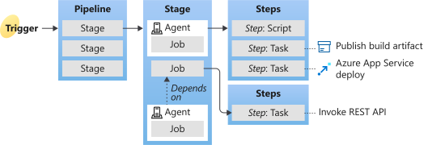

# Pipeline

- <https://learn.microsoft.com/en-us/azure/devops/pipelines/build/variables?view=azure-devops&tabs=yaml#agent-variables-devops-services>

## Pipeline Types

### 1. YAML pipeline

- Your pipeline configuration resides in a YAML file named azure-pipelines.yml, alongside your application.
  - The YAML file is versioned alongside your application code, adhering to the same branching structure.
  - Each branch can customize the pipeline by editing the azure-pipelines.yml file.
  - Keeping the pipeline configuration in version control ensures that any changes that cause issues or unexpected outcomes can be easily identified within your codebase.

### 2. Classic pipeline

- Classic pipelines are created in the Azure DevOps web portal with the Classic user interface editor. You can define a pipeline to build, test your code, and then publish your artifact (binary).

<!-- ### YAML vs Classic -->

## Key concepts overview



1. A trigger tells a pipeline to run.
2. A pipeline is made up of one or more stages. A pipeline can deploy to one or more environments.
3. A stage is a way of organizing jobs in a pipeline and each stage can have one or more jobs.
4. Each job runs on one agent. A job can also be agentless.
5. Each agent runs a job that contains one or more steps.
6. A step can be a task or script and is the smallest building block of a pipeline.
7. A task is a prepackaged script that performs an action, such as invoking a REST API or publishing a build artifact.
8. An artifact is a collection of files or packages published by a run.

## Library

- A library is a collection of build and release assets for an Azure DevOps project.

## Trigger

- Use triggers to run a pipeline automatically.
- Pipeline triggrs in YAML pipelines allow you to trigger one pipeline upon the completion of another.

### Trigger Types

- Types:
   1. CI triggers: The version of the pipeline in the pushed branch is used.
   2. PR triggers: The version of the pipeline in the source branch for the pull request is used.
   3. GitHub pull request comment triggers: The version of the pipeline in the source branch for the pull request is used.
   4. Scheduled triggers: Scheduled triggers start your pipeline based on a schedule, such as a nightly build.
   5. Pipeline completion triggers ( Event-based triggers ): <https://learn.microsoft.com/en-us/azure/devops/pipelines/process/pipeline-triggers?view=azure-devops&tabs=yaml#branch-considerations>

### Default triggers ( In YAML pipelines in a GitHub repository )
- Default:
  - CI triggers
  - PR triggers
- Disable:
  - Disable default CI triggers: `trigger: none` // Only run pipeline on the schedule, not when someone pushes to a branch or merges to the main branch.
  - Disable default PR triggers: `pr: none`  // PR request won't start a trigger.

### Scheduled Triggers

- syntax: cron syntax
  - cron: cron syntax defining a schedule
    - Rules:
      - Minutes: 0~59
      - Hours: 0~23
      - Days: 1~31
      - Months: 1~12, full English names, first three letters of English names
      - Days of Week: 0~6. Start with Sunday, full English names, first three letters of English names

      ```code
        mm HH DD MM DW
        \  \  \  \  \__ Days of week
          \  \  \  \____ Months
          \  \  \______ Days
            \  \________ Hours
            \__________ Minutes

        // Examples: 
        " 0 18 * * Mon,Wed,Fri " === " 0 18 * * 1,3,5 " // trigger every Monday, Wednesday, and Friday at 6:00 PM
        " 0 0,6,12,18 * * * " === " 0 */6 * * * "  // trigger every 6 hours
      ```

  - displayName: friendly name given to a specific schedule
  - branches/include: which branches the schedule applies to
  - branches/exclude: which branches to exclude from the schedule
  - always: If always run the pipeline.
    - true: Always run.
    - false: Only if there have been source code changes since the last successful scheduled run
    - The default is false.
  - batch: Whether to run the pipeline if the previously scheduled run is in-progress. The default is false.
    - When always is true, the pipeline runs according to the cron schedule, even when batch is true.

  ``` code
    schedules:
    - cron: string
      displayName: string
      branches:
        include: string
        exclude: string
      always: boolean
      batch: boolean
  ```

- Frequency limitation:
  - around 1000 runs per pipeline per week
  - 10 runs per pipeline per 15 minutes

- Examples:

  ``` code
    schedules:
    - cron: "0 0 16 * *"
      displayName: At 00:00 a.m. on the 16th day of every month
      branches:
        include:
          - master
          - releases/*
        exclude:
          - releases/temp/*
      always: true
  ```

- constraints:
  - The time zone for cron schedules is UTC.
  - If you specify an exclude clause without an include clause for branches, it's equivalent to specifying * in the include clause.
  - You can't use pipeline variables when specifying schedules.
  - If you use templates in your YAML file, then the schedules must be specified in the main YAML file and not in the template files.

## Stages

- A stage is a logical boundary in an Azure DevOps pipeline. 
- Stages can be used to group actions in your software development process (for example, build the app, run tests, deploy to preproduction). 
- Each stage contains one or more jobs.

## Agent & Pool

## Jobs

### Job Definition

- A job is a series of steps that run sequentially as a unit.
- You can organize your pipeline into jobs.
- A job is the smallest unit of work that can be scheduled to run.

### Job Types

- Agent pool jobs: run on an agent in an agent pool.
- Server jobs: run on the Azure DevOps Server.
- Container jobs:  run in a container on an agent in an agent pool. For more information about choosing containers, see <https://learn.microsoft.com/en-us/azure/devops/pipelines/process/container-phases?view=azure-devops>

### Default Job

- Every pipeline has at least one job.
- In the simplest case, a pipeline has a single job. 
  
  ``` code
    # When a YAML file has a single job, you don't have to explicitly use the job keyword unless you're using a template.You can directly specify the steps in your YAML file.
    pool:
      vmImage: 'window-latest'
    steps:
    - bash: echo "Hello world"
  ```

### Multiple jobs

- Azure Pipelines does not support job priority for YAML pipelines.
- When using multiple jobs, you have to use the 'jobs' keywork

  ``` code
    jobs:
      - job: A
        steps:
        - bash: echo "A"
      - job: B
        steps:
        - bash: echo "B"
  ```

## Steps

- A step is the smallest building block of a pipeline.

## Tasks

- A task is the building block for defining automation in a pipeline. A task is packaged script or procedure that has been abstracted with a set of inputs.

## Script

- commands:
  - `echo`: is used to display line of text/string.
      1. `echo $?`: will get the last return code of the task running result.
  - `sed`: stands for stream editor, for filtering an transforming text. 比如在一个文件里替换一个字符串
    - `sed -i "s/word1/word2/g" inputfile`: 在 inputfile 这个文件中，全局搜索‘word1’替换为‘word2’。其中参数 -i 表示 edit in place 在原位置修改，而不是创建一个新文件。 s 表示要 substitute 替代。 g 表示 global replacement 全局替换。
- Examples:
  1. Assemble a car.

      ``` code
         // in a .*.yml file
         stages: // 标记 scripts 执行顺序
         - build
         - test

         build the car:
         stage: build
               // 用来标记这些 scripts 都属于 stage build. 
               // 这里 stage vs script 的顺序没所谓，只要能 match 上就行
         script:
            - mkdir build
            - cd build
            - touch car.txt 
               // touch command: to create new, empty files.
            - echo "chassis" > car.txt
               // echo command 本身: is used to display line of text/string. 
               // echo + ">": 把 car.text 里的内容替换为 chassis. (Whith the greater-than operator ">", the output from the "echo" command whill be redirected a file called "car.txt". If the file "car.txt" already existx it will be deleted)
            - echo "engine" > car.txt
            - echo "wheels" > car.txt
         artifact：
            // 设置一个位置用于存储当前 Job 执行后的的一些产出，给下一个 job 用。如果不存储，那么默认就都 destroy 了. 存储了后，这些数据可以浏览或者下载。比如在 GabLab 上就提供下载功能 “Download build the car artifacts”
            // 无论是否存储，生成的结果都不会被保存到 git repository 里
            paths:
               - build/
                  // to save all data in the folder "build/" 
                  // 这里用了一个绝对路径，当然也可以使用相对路径比如 ./build 由于 pipeLine yaml 文件通常(默认)都是放在 root project 层级，所以 ./build 表示在 root project/build

         test the car:
         stage: test
         script:
            - ls
               // ls command: will list all the contents or the folder.
            - test -f build/car.txt
               // test -f command: is used to verify that the file was created. -f flag is needed to check that the specified file exists and is a regular file.
            - cat car.txt
               // cat fileName command: will show the content of the file.
            - grep "chassis" build/car.txt
               // grep command 本身: is used for searching lines that match a regular expression. It does a global search with the regular expression and prints all matching line.
               // grep string filePath/fileName:  search for a specific string inside a file.
               // 当搜索不成功，会报出 exit code 1 表示 Failed
            - grep "engine" build/car.txt
            - grep "wheels" build/car.txt
      ```

  2. Build a website:

    ``` code
        stages: // 标记执行顺序
        - build
        - test

        // 1 使用缺少必要包的 image：其实默认用的是 Ruby image，里面没有安装 Node
        build website:
          stage: build
          script:
            - npm install
              // 报错：npm: command not found. Error: Job failed: exit code 1.
              // 原因：默认 Docker image 是没有 Node 的，也需要我们先安装，就跟本地需要安装一样。
              // 但我们不想每一次都手动安装，所以我们不用这个 default Ruby image, 我们去 Docker Hub 搜一个已经提供了并下载了 Node 的 image。<https://hub.docker.com/_/node/>
            - npm install -g gatsby-cli
            - gatsby build

        // 2. 使用安装了 node 的 image:
        build website:
          stage: build
          image: node
              // 表示使用的是 docker image node, 在 pipeline output 中可以看到执行了命令 "Pulling docker image node ..."，会使用最新的版本
          image: node:16
              // :N 用来指定版本, 比如 version 16。要保证 image node version = local node verdion，避免出现不必要的问题。
          script:
            - echo $CI_COMMENT_SHORT_SHA
              // 这里使用 GatLab 举例子，预设变量 $CI_COMMENT_SHORT_SHA 是 Gatlab 的，表示每个 commit 的一个字符串id，并不适用于其他 CI system 比如 Azure Pipelines
            - npm install
              // will install all dependencies in the package.json just like locally npm install.
            - gatsby build
            - sed -i "s/%%VERSION%%/$CI_COMMENT_SHORT_SHA/" ./public/index.html
              // 为了测试，已经在 index.html 里加上了一个 `<div>version: %%VERSION%%</div>`
              // 注意要用 “” 双引号来写要替换的字符串。这里没有 g flag 是因为只写了这一次，所以不需要全局搜索。
          artifacts:
            paths:
              - ./public
                // 将会打出真正要部署的 index.html 在 public folder 下

        test artifact:
          stage: test
          script:
            - grep "gatsby" ./public/index.html
          
    ```


## Runs

### Run Definition

- A run represents one execution of a pipeline.
- Both continuous integration (CI) and continuous delivery (CD) pipelines consist of runs.
- During a run, Azure Pipelines processes the pipeline, and agents process one or more jobs, steps, and tasks.

### Run workflow

- Processes the pipeline.
- Requests one or more agents to run jobs.
- Hands off jobs to agents and collects the results.

### Artifact

1. 定义：An artifact is a collection of files or packages published by a run.
2. 由来：各个 Job 之间是独立的。如果没有 script 要求有 data exchange, 数据是不会交换的。也就是说，上一个 Job 的任务做完了，也许产生了一些数据，但当 job 做完工作，这些东西就 destroyed 了。当下一个 Job 工作时，它只是从 repository 中 pull 下来 script 知道自己要做的事，上一个 Job 曾经产生的数据对当前这个 Job 是没有任何意义的。
3. 作用：是 Job 运行后的结果，比如执行一个website 的 build pipeline, 执行成功了，但我不存储打包结果也没用，因为打包出来的包才是我们要的，而不是跑 job 这个过程，所以我们一般就把运行的结果(打出来的包)存到 artifact。
   1. 使用：这个 stage 产生的 artifact 可以被下一个 stage job 使用
   2. 操作：(以 GitLab 为例)
      1. Download: 下载到 local computer.
      2. Browse: 直接在浏览器上浏览
   3. 打包结果：(以打包一个 website 为例)
      1. index.html 是最终要 deploy 的 product build.

## Templates

### Template Definition

- Templates let you define reusable content, logic, and parameters in YAML pipelines.

### Advantages

1. Templates can help you speed up development. For example, you can have a series of the same tasks in a template and then include the template multiple times in different stages of your YAML pipeline.
2. Templates can also help you secure your pipeline.

### Template types

#### 1. Extends templates

- Extends template control what is allowed in a pipeline. When an extends template controls what is allowed in a pipeline, the template defines logic that another file must follow.

#### 2. Includes templates

- Includes templates let you insert reusable content with a template.If a template is used to include content,the content from one file is inserted into another file.
- Risks: Templates and template expressions can cause explosive growth to the size and complexity of a pipeline.
- Limits to help prevent runaway growth
  - No more than 100 separate YAML files may be included (directly or indirectly)
  - No more than 20 levels of template nesting (templates including other templates)
  - No more than 10 megabytes (10兆字节) of memory consumed while parsing the YAML (in practice, this is typically between 600 KB - 2 MB of on-disk YAML, depending on the specific features used)
- Reuse Examples:
  - steps
  - jobs
  - stages

  ``` code
    # File: templates/include-npm-steps.yml
    steps:
    - script: npm install
    - script: yarn install
    - script: npm run compile

    # File: templates/job-single.yml
    jobs:
    - job: Windows
      pool:
        vmImage: 'windows-latest'
      steps:
      - script: echo This script runs before the template's steps, only on Windows.
      - template: templates/include-npm-steps.yml
      - script: echo This step runs after the template's steps.

    # File: templates/jobs-multiple.yml
    jobs:
    - job:  #使用多个 jobs 时，为了防止命名冲突，记得把 job name 移除
      pool:
        vmImage: 'ubuntu-latest'
      steps:
      - bash: echo "Hello Ubuntu"

    - job:
      pool:
        vmImage: 'windows-latest'
      steps:
      - bash: echo "Hello Windows"

    # File: azure-pipelines.yml
    jobs:
    - template: templates/jobs-single.yml
    - template: templates/jobs-multiple.yml # job names are removed.
    - template: templates/jobs-multiple.yml

    # File: templates/stages1.yml
    stages:
    - stage: Angular
      jobs:
      - job: angularinstall
        steps:
        - script: npm install angular
    # File: templates/stages2.yml
    stages:
    - stage: Build
      jobs:
      - job: build
        steps:
        - script: npm run build
    # File: azure-pipelines.yml
    trigger:
    - main
    pool:
      vmImage: 'ubuntu-latest'
    stages:
    - stage: Install
      jobs: 
      - job: npminstall
        steps:
        - task: Npm@1
          inputs:
            command: 'install'
    - template: templates/stages1.yml
    - template: templates/stages2.yml
  ```

### Template parameters & Variables

- Examples
  
  ``` code
    # File: templates/npm-with-params.yml
    parameters:
    - name: name  # defaults for any parameters that aren't specified
      default: ''  # Default content type is string.
    - name: vmImage  
      default: '' 
    - name: toqp  # Other types need to be specified.
      type: boolean
      default: true
    - name: 'pool'
      type: object
      default: {}
    
    variables:
    - name: vmImage
      value: ${{ parameters.vmImage }}  # use parameter
     
    jobs:
    - job: ${{ parameters.name }}
      pool: 
        vmImage: ${{ variables.vmImage }}  # use variable
      steps:
      - script: npm install
      - template: other-template.yml
        parameters:
          uploadToQPExpress: ${{ parameters.toqp }}
      - script: npm test

    # File: azure-pipelines.yml
    jobs:
    - template: templates/npm-with-params.yml  # Template reference
      parameters:
        name: Windows
        vmImage: 'windows-latest'
        toqp: false
  ```

### Template expressions

- Template expressions can expand template parameters, and also variables.
- Only predefined variables can be used in template expressions.
- Syntax: ${{ }}
  - ${{ parameters.toqp }}
  - ${{ parameters['toqp'] }}
  - Escape a value: If a string contains `${{}}` like `my${{value`, then wrap the value in an expression string: `${{ 'my${{value' }}`
- Conditional Insertion
  
  ``` code
    # File: steps/build.yml
    parameters:
    - name: 'targetEnv'
      default: int
      type: string
      values:
      - int
      - demo

    steps:
    # int
    - ${{ if eq(parameters.targetEnv, 'int') }}:
      - script: echo "Deploy to Int"

    # demo
    - ${{ if eq(parameters.targetEnv, 'demo') }}:
      - script: echo "Deploy to Demo"

    # File: azure-pipelines.yml
    steps:
    - template: steps/build.yml
      parameters:
        targetEnv: demo
  ```

- Iterative Insertion: <https://learn.microsoft.com/en-us/azure/devops/pipelines/process/template-expressions?view=azure-devops#iterative-insertion>

### Template paths

- Absolute path: To use an absolute path, the template path must start with a /.
- Relative path: All other paths are considered relative.
- Examples:
  
  ``` code
    // Hierarchy
    |
    +-- fileA.yml
    |
    +-- dir1/
        |
        +-- fileB.yml
        |
        +-- dir2/
              |
              +-- fileC.yml

    // Relative Paths
    # In fileA.yml
    - template: dir1/fileB.yml
    - template: dir1/dir2/fileC.yml
    # In fileC.yml
    - template: ../../fileA.yml
    - template: ../fileB.yml
    # In fileB.yml
    - template: ../fileA.yml
    - template: dir2/fileC.yml
    // Absolute Paths
    In fileB.yml
    - template: /fileA.yml
    - template: /dir1/dir2/fileC.yml
  ```

### Templates from other Repositories

- Concepts:
  - resources: Use the resources specification to provide the location of the core repo.
  - repository: you give a name
  - name: `<Identity>/<Repo>` (Identify or Project Administrator)

    ``` code
      slb1-swt/Prism/Repos/Files/DevOps.DevTool.SecScan
      slb-it/ea-quality-process-improvement/Repos/Files/qp-EAR-AA-3405
    ```

  - organization: slb1-swt & slb-it.
  - endpoint: If that project is in a separate Azure DevOps organization, you'll need to configure a service connection to connect it.
    - The projects and pipelines are in slb-swt, and QPExpress repos for security scan results are in slb-it. An Azure DevOps service connection is therefore required to connect both organization slb1-swt and slb-it.
    - <https://dev.azure.com/slb1-swt/Prism/_settings/adminservices>

- Examples
  
  ``` code
    resources:
      repositories:
      - repository: qpRepo
        name: ea-quality-process-improvement/qp-EAR-AA-3405
        type: git
        endpoint: WebSolution-SecScan-Service-Connection
  ```

- Workflow:
  1. Repositories are resolved only once, when the pipeline starts up.

<!-- ### Template Context

- <https://learn.microsoft.com/en-us/azure/devops/pipelines/process/template-parameters?view=azure-devops#use-templatecontext-to-pass-properties-to-templates> -->

<!-- ## Parameters

1. Template parameters
2. Runtime parameters -->

<!-- ### Parameter data types

- <https://learn.microsoft.com/en-us/azure/devops/pipelines/process/template-parameters?view=azure-devops#parameter-data-types> -->

## Variables

- Template variables
- Predefined variables
- ...

## Pipelines return

- Job result code: After a command is executed it well return an exit status code.
    1. Success: 0
    2. Error: 1~255 Integer 整数

    ``` code
        ERROR: Job failed: exit code 1
          // The exit code needs to be 0 for a script to be marked as successful.
    ```
