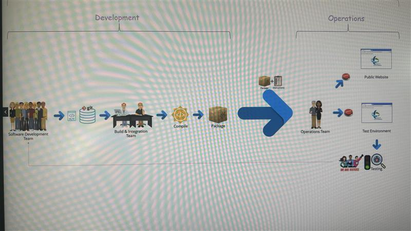
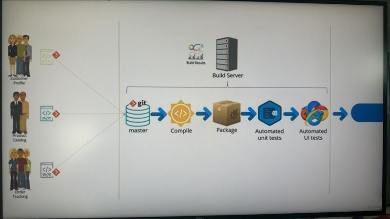
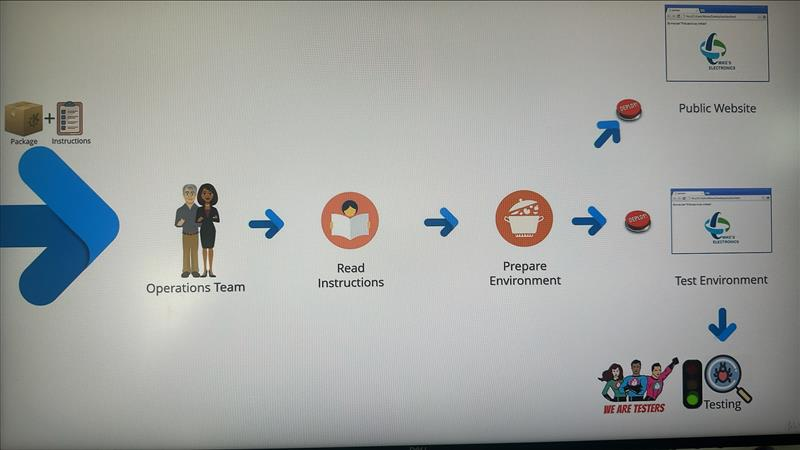
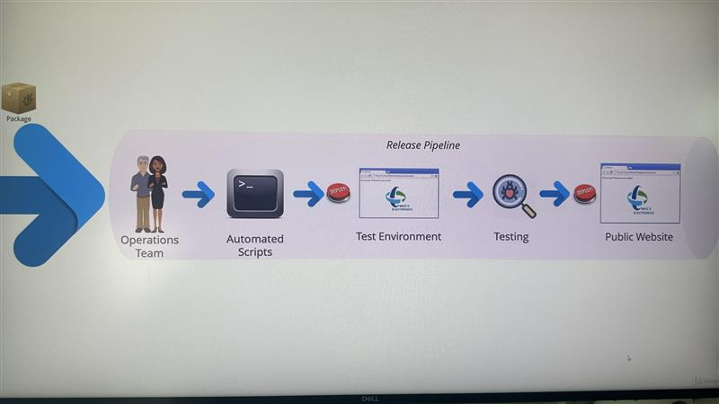

# CI & CD

## CI

### CI Defination

1. CI: Continuous Integration. 持续集成
2. 定义：Continous Integration is a development prictice that requires developers to integrate code into a shared repository several times a day.
3. 基本原则：
   1. A single central repository where the code lives.
   2. developers check in their code frequently.
   3. Build should be triggered every time a developer checks in code.
   4. 构建是纯自动化触发的，没有人为干预。并且构建要求要快。Build should be automated, build should be fast.
   5. Build should compile the code as well as run automated tests on the compiled code.
   6. Fixing a failed build should be top priority for the concerned developers.
   7. Build results, including automated test results,should always be visible to all developers,emails should be sent out in case of failures.

### Old School CI

- 
- Pain Points
  1. Integration is painful and effort consuming
  2. Fixing issues at the end of iterations
  3. Intermediate merge issues can hold up teams
  4. Long feedback cycle for functional defects
  5. Long iterations

### CI tools

1. 
2. Jenkins:
   1. 好处：
      1. It has some workspaces to cache the dependencies every time a job is running, so you don't have to download all these dependencies again and again.

<!-- ### CI Build Pipeline

1. Stages:
   1. Code integration
   2. compilation
   3. packaging
   4. running automated unit tests
   5. running automated UI tests
2. 特点：
   1. Pipelining is a must-have feature rather than a good-to-have feature.
   2. All steps should be automated, without any manual intervention.
   3. All those steps should run on a dedicated build server. -->

## CD

### CD: Continuous Delivery

1. CD: Continuous Delivery 持续交付
2. 定义： Continuous Delivery is a software development pravtice where software can be released to production at any time. CD 保证 构建后的包 是ready 的状态，只需要最终决定一下“要不要发布”，所以定义中的描述是：“Can be released” to production at any time.
3. 基本原则：
   1. 构建不是完全自动化的。大部分依靠脚本和自动化，但最终的决定依靠人为干预，比如最后的 人工测试 和 QA 提供的通过测试的 certification.

### CD: Continuous Deployment

1. CD: Continuous Deployment 持续部署
2. 定义：Continuous Deployment is a software development practice where code is automatically deployed to production all the time continuously.
3. 基本原则：
   1. 完全自动化地。只要代码改变通过了所有的自动化测试，就会被自动化部署到生产环境。

### Continuous Delivery VS Continuous Deployment

1. 区别：
   1. 有无 manual intervention 人工干预，比如 QA manual test and certify
   2. continuous deployment 并不 common, Only enterprises whose IT department has reached a very high maturity level will go with Continuous Deployment, because of the risks involved.

### Old School CD

- 
- Pain point:
  1. Correctness of Instructions
  2. Didderence in instructions across environments
  3. Error prone nature of manual tasks. 手工任务容易出错
  4. Deployments are sophisticated, high-impact with downtime

### CD Release Pipeline

1. 
2. Stages:
   1. (In old school model: Operations team get the compiled packages with instructions.) Now the operations team menbers job is to now maintain the installation scripts in the shource code repository and code sophisticated automation scripts if required.
   2. (In old school model: Manually installation instructions.) Now replaced manual installation instructions with automated scripts. So we can see sometimes there are .yml files in the root of the project. While the scripts are also under the git version control.
   3. Deploy to test environment.
   4. QA certify.
   5. Deploy to PROD environment.
3. 特点：
   1. Script-based automation.

## DevOps

1. 定义：取自 DEVelopment & OPerationS 的部分字母。It is a new culture and a new way of thingking.
2. 人员：不是一些人同时具备 developement and deployment skillset, 而是在 development team 有 operation man，operation team 有 development man. 让大家更紧密地合作，降低沟通阻碍。
3. Automation tools：自动化工具是帮助实现的一种方式，并不能说 集成了自动化部署工具，就是实现了 DevOps 这种思想

## Pipeline

1. 文件格式：例如.gitlab-ci.yml。 YAML stands for YAML Ain't Markup Language.
2. 文件位置：root of the project
3. 内容缩进：不要用 tabs, 用空格 space * 2
4. 概念：见 ./pipeline.md

## Docker

1. 定义：Docker is a technology based on containers which allows virtualization.
2. 职责：
   1. What Docker does is to provide you with images.
   2. When the Docker executes an image, it becomes a container that is similar to a virtual machine.
   3. Docker allows us to package applications and all necessary dependencies and to easily deploy them.
3. 好处：
   1. What Docker is good at is to make it easier to create and deploy and run applications when using containers.
   2. And what a container allows us to do is to package up an application with everything that it needs, so we have Node.js, but maybe Node.js is also dependent on other tools that we need to install as well.And you can more or less install all these dependencies that we need, configure them as we wanted to have, and sort of package them in a container and say, well, if you want to run this tool, just take this container, start it, and you'll have everything that you need.
   3. 可以指定不同的任务安装不同的版本。比如在 CI server 工作时, CI runner execute a specific image with specific Node.js version.
4. 理解：可以把 Docker 理解成一个 virtual machine，拥有一个自己的操作系统 operating system.

### Docker images

1. 定义: An image is a file with a set of instructions on how to package up code or utilities and all dependencies.
2. 职责：When I build an image, I can have tools like Node.js installed on demond on this image. When I am using this image, I only have to start it and I can already interact with Node.js because Node.js will be somehow installed.

### Docker Hub

1. 官方 images 页面: <https://hub.docker.com/search?image_filter=official> 搜索可以得到 docker node image: <https://hub.docker.com/_/node/>
2. 作用：It is like a repository with all the images that are being built. They're like official images from almost any software provider out there that's generating  ese images so that everybody can use it so that you do not have to worry about these additional steps.
3. command：image: node // docker pull node
4. 版本：
   1. image: node:16 // use node16
   2. 如果没有指定版本，就默认拉取 latest 最新版本
