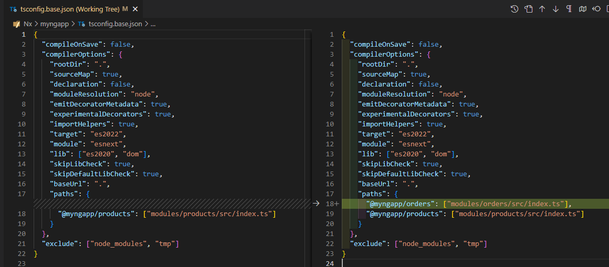
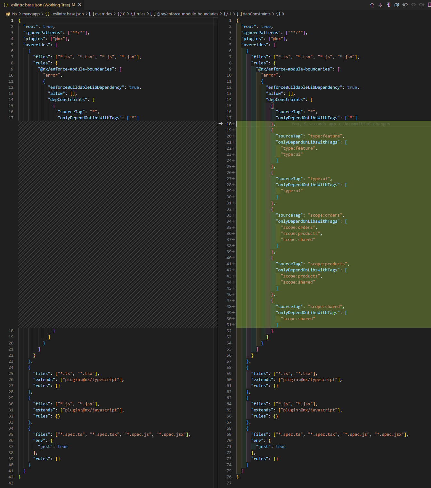

# Nx

## Nx基础

### CLIs

1. 执行 Lint 验证：`nx run-many -t lint`
2. 查看所有插件：`nx list`

### Nx 定义

1. 文档 <https://nx.dev/>
2. 定义：Nx 是一个功能强大的开源构建系统，提供用于提高开发人员生产力、优化 CI 性能和维护代码质量的工具和技术。
3. 核心特点：
   1. 高效运行任务：Nx 并行运行任务，并根据任务之间的依赖关系对任务进行排序
   2. 本地/远程缓存：通过在本地和远程进行缓存，可以节省时间，避免不必要的 re-run 任务重运行
   3. 自动对依赖更新：如果您利用 Nx 插件，您将获得其他功能，例如代码生成和自动升级代码库和依赖项的工具。
   4. 打造您自己的：Nx 具有高度可定制性和可扩展性
4. 用处：
   1. 加速现有项目的本地和 CI 构建和测试（无论是单一存储库还是独立应用程序）
   2. 快速构建新项目（使用 Nx 插件），而无需配置任何较低级别的构建工具
   3. 轻松地将新工具（例如 Storybook、Tailwind 等）集成到您的项目中。
   4. 使用自定义生成器和 lint 规则确保一致性和代码质量
   5. 使用自动代码迁移功能更新您的框架和工具并保持您的工作空间常青
5. 架构：
   1. Nx包提供与技术无关的基本功能，例如：工作区分析、任务运行、缓存、分发、代码生成和自动代码迁移
   2. Plugins 是构建在 Nx 包提供的基本功能之上的 NPM 包。
      1. Nx 插件包含代码生成器、执行器（用于抽象较低级别的构建工具）和自动代码迁移，以使您的工具保持最新。
      2. Nx 无关技术，与此相反，Plugins 通常是特定于技术的。例如，@nx/react添加了对构建 React 应用程序和库的支持，@nx/cypress添加了 Cypress 的 e2e 测试功能。
      3. 插件消除了不同工具相互集成的任何摩擦，并提供实用程序使它们保持最新状态，从而提高了开发人员的工作效率。Nx 团队维护 React、Next、Remix、Angular、Jest、Cypress、Storybook 等插件。
      4. 您可以使用该@nx/plugin包轻松构建新插件，甚至自动化您的本地工作区。还有超过 80 个社区插件。
   3. Devkit是一组用于构建 Nx 插件的实用程序。
   4. Nx Cloud通过添加远程缓存和分布式任务执行来帮助扩展 CI 上的项目。它还通过与 GitHub、GitLab 和 BitBucket 集成并提供可搜索的结构化日志来改善开发人员的人体工程学。请访问nx.app了解更多信息。
   5. Nx Console是VSCode、IntelliJ 和 VIM的扩展。它提供代码自动完成、交互式生成器、工作区可视化、强大的重构等等。

### Package-Based Monorepo 基于包的 Monorepo

1. 创建一个新的工作区: `npx create-nx-workspace@latest package-based --preset=npm`

### Angular Standalone

1. 注意：不要与 Angular standalone API 混淆，
2. 定义：a standalone project 是一个 non-monorepo 项目，在 root-level 只有一个应用程序。可以理解为 standalone 为 single-project.
3. 创建一个 angular standalone 项目
   1. 命令：`npx create-nx-workspace@latest myngapp --preset=angular-standalone` 取名为 myngapp
      1. 生成文件 nx.json: 在这里我们可以微调 Nx 的工作方式、定义可缓存操作、我们的任务管道以及 Nx 生成器的默认值。
      2. 生成文件 project.json: Nx 使用此文件来定义可以运行的目标，类似于 Angular CLI 使用该angular.json文件的方式。
         1. 配置文档：<https://nx.dev/reference/project-configuration>
         2. project.json VS angular.json:
            1. 文档：<https://nx.dev/concepts/more-concepts/nx-and-angular> ❓❓❓
   2. 启动项目: `nx serve`
      1. 运行语法：
      2. 所有在 package.json 中的 scripts, 例如 start, build, test 或者任何自定义的脚本命令， 都是在 project.json 中的 targets 里定义的。每个 target 都包含一个配置对象，告诉 Nx 如何运行该 target。
         1. 示例：

            ```code
            {
               "name": "myngapp",
               "targets": {
                  "serve": {
                     "executor": "@angular-devkit/build-angular:dev-server",
                     "configurations": {
                     "production": {
                        "browserTarget": "myngapp:build:production"
                     },
                     "development": {
                        "browserTarget": "myngapp:build:development"
                     }
                     },
                     "defaultConfiguration": "development"
                  },
                  ...
               },
            }
            ```

         2. executor: 表示该命令的实际运行者。在 Angular API workspace 中，executor 是 builder 构建器；在 Nx workspace 中是 Nx plugins.
         3. options: 用来配置其他的属性，或者给 executor function 传进去一些 flags 标志来完成一些自定义的功能。
      3. Cache the task you run 缓存运行的任务
         1. 默认：上述 all of targets 默认被 Nx cached automatically 自动缓存. 当 re-run 一个命令甚至所有命令，会发现命令几乎是瞬间就执行结束了。在终端执行完命令后，能看到命令后面标注了存在匹配的 existing outputs match the cache, left as is. 现有输出与缓存匹配，保持原样.
         2. 指定要缓存的 task results：不是所有的 target 都是 cacheable 可缓存的。可以在 nx.json 中配置
            1. 文档：<https://nx.dev/core-features/cache-task-results>
            2. 示例：

               ``` code
               // Nx.version >= 17
               {
                  "targetDefaults": {
                     "build": {
                        "cache": true
                     },
                     "test": {
                        "cache": true
                     }
                  }
               }
               ```

         3. 指定决定Cache 的条件和结果

            ```code
            // Globally configurate in nx.json
            {
               "targetDefaults": {
                  "build": {
                     "inputs": ["{projectRoot}/**/*", "!{projectRoot}/**/*.md"],
                     "outputs": ["{workspaceRoot}/dist/{projectName}"]
                  }
               }
            }

            // Project-level configuration in project.json
            {
               "name": "some-project",
               "targets": {
                  "build": {
                     ...
                     "inputs": ["!{projectRoot}/**/*.md"],
                     "outputs": ["{workspaceRoot}/dist/apps/some-project"],
                     ...
                  }
                  ...
               }
            }
            ```

         4. Nx 都 restore 存了什么
            1. the terminal output
            2. the files & artifacts created as a result of running the task (e.g. your build or dist directory)
         5. 支持 remote caching 远程缓存：
            1. 通过连接到 Nx Cloud: `npx nx connect`
            2. 未完待续 ❓❓❓
         6. 取消缓存：两种方法：
            1. `nx build projectName --skip-nx-cache`.如果是 Nx Cloud 远程缓存，使用 `--no-cloud` flag to skip remote caching.
            2. 保证该模块没有在 targetDefaults 的缓存目录中
         7. 清空本地缓存：`npx nx reset`
   3. Deploy the application: `npx nx build`
      1. output: 在 root 根文件夹下新增了一个 'dist/{{projectName}}' 文件夹, 这里就是 dist/myngapp.
   4. Create Components: @nx/angular:component
      1. 命令：`npx nx g @nx/angular:component hello-world --directory=src/app/hello-world --standalone --dry-run`
      2. --dry-run 不会真正创建文件，只为了 first check the output 首先检查输出，it means no change were make. 如果想要真正执行该 generator 创建文件, 移除这个 flag。
      3. Where to place 组件放哪: --directory 指定组件创建的 local subfolder
   5. Create Libraries: @nx/angular:library
      1. 命令：

         ```code
            nx g @nx/angular:library products --directory=modules/products --standalone
            nx g @nx/angular:library orders --directory=modules/orders --standalone
            nx g @nx/angular:library shared-ui --directory=modules/shared/ui --standalone
         ```

      2. 生成： modules folder 里: Use --directory flat to place libraries in to a subfolder under 'modules' folder.
         1. 注意，library 会被放进 modules folder.
         2. modules folder 跟 src folder， 跟 tsconfig.base.json 是并列的，都是 root-level 的。
         3. 名为 shared-ui 的库，实际创建出来的 path 是 shared/ui，变成了两个 levels。
      3. 示例：The output of `nx g @nx/angular:library orders --directory=modules/orders --standalone`

         ```code
         >  NX  Generating @nx/angular:library

         √ What should be the project name and where should it be generated? · orders @ modules/orders
         CREATE modules/orders/project.json
         CREATE modules/orders/README.md
         CREATE modules/orders/tsconfig.json
         CREATE modules/orders/tsconfig.lib.json
         CREATE modules/orders/src/index.ts
         CREATE modules/orders/jest.config.ts
         CREATE modules/orders/src/test-setup.ts
         CREATE modules/orders/tsconfig.spec.json
         CREATE modules/orders/src/lib/orders/orders.component.html
         CREATE modules/orders/src/lib/orders/orders.component.spec.ts
         CREATE modules/orders/src/lib/orders/orders.component.ts
         CREATE modules/orders/src/lib/orders/orders.component.css
         CREATE modules/orders/.eslintrc.json
         UPDATE tsconfig.base.json
         ```

         1. 有自己的 projece.json 用来配置可运行的 targets。
         2. index.js 是整个 library workspace exported 的 "public APIs" 的入口。注意：要确保该库中要暴露的组件在本文件中被 export 了，同时应该只 export 外界用的必要的部分。
         3. Update tsconfig.base.json ，在 paths 数组中添加了这个 orders 的路径。
      4. Library aliase 库别名: 所有自动生成的库，都在 tsconfig.base.json 中被创建了别名。All libraries we generate automatically have aliases created in the root-level tsconfig.base.json. 这样我们在导入它们的时候就很容易。
   6. Import libraries into the Angular application

      ```code
      // src/app/app.routes.ts
      import { Route } from '@angular/router';

      export const appRoutes: Route[] = [
         {
            path: 'orders',
            loadComponent: () =>
               import('@myngapp/orders').then((m) => m.OrdersComponent),
         },
      ];

      // app.component.html
      <router-outlet></router-outlet>

      // 启动后访问 http://localhost:4200/orders
      ```

4. 可视化项目结构：`nx graph`
5. Module Boundary Rules 模块边界规则：使用模块边界规则施加约束，限制模块引用 Imposing constraints with Module Boundary Rules
   1. 定义：允许模块之间怎么互相引用的规则。
   2. 约束的两个维度：
      1. type: feature | utility | data-access | ui | more..
      2. scope(domain): 开发中定义的 scope。比如 products | orders | shared.
   3. 打 tags：
      1. 定义：Nx 带有一个通用机制，允许您为项目分配“标签”。“标签”是您可以分配给项目的任意字符串，稍后在定义项目之间的边界时可以使用这些字符串。
      2. 用法：在 target module 的 project.json 中，配置 `tags: []`

         ``` code
         // myngapp\modules\products\project.json
         {
            "name": "products",
            "tags": [
               "type:feature",
               "scope:products"
            ],
         }
         // myngapp\modules\orders\project.json
         {
            "name": "orders",
            "tags": [
               "type:feature",
               "scope:orders"
            ],
         }
         // myngapp\modules\shared\ui\project.json
         {
            "name": "shared-ui",
            "tags": [
               "type:ui",
               "scope:shared"
            ],
         }
         ```

   4. Enforce module boundaries 执行边界约束：
      1. 定义4种约束
         1. type:feature should be able to import from type:feature and type:ui
         2. type:ui should only be able to import from type:ui
         3. scope:orders should be able to import from scope:orders, scope:shared and scope:products
         4. scope:products should be able to import from scope:products and scope:shared
      2. 借助 ESLint rule. 在 .eslintrc.base.json 中的顶层结构上，添加一个 depConstraints 属性。
   5. 验证：执行 lint 命令行

      ```code
      // 在 products 里用 @myngapp/orders 这种方式导入
      import { Component } from '@angular/core';
      import { CommonModule } from '@angular/common';

      import { OrdersComponent } from '@myngapp/orders';// It is not allowed. 

      @Component({
         selector: 'myngapp-products',
         standalone: true,
         imports: [CommonModule, OrdersComponent],
         templateUrl: './products.component.html',
         styleUrl: './products.component.css',
      })
      export class ProductsComponent {}

      // 执行 `nx run-many -t lint`, 在控制台报错
      √  nx run orders:lint  [existing outputs match the cache, left as is]
      √  nx run myngapp:lint  [existing outputs match the cache, left as is]
      √  nx run shared-ui:lint  [existing outputs match the cache, left as is]
      √  nx run e2e:lint  [existing outputs match the cache, left as is]

      ×  nx run products:lint
         Linting "products"...
      NX   Running target lint for 5 projects
      C:\Personal-XXT\Projects\Nx\myngapp\modules\products\src\lib\products\products.component.ts
      5:1  error  A project tagged with "scope:products" can only depend on libs tagged with "scope:products", "scope:shared"  @nx/enforce-module-boundaries
         ⠧    nx run products:lint
      ✖ 1 problem (1 error, 0 warnings)
         √    4/4 succeeded [4 read from cache]
      Lint errors found in the listed files.
      ```

### Angular Monorepo

### Nx Plugins

1. 查看所有插件：执行 `nx list`.

2. Nx Generator
   1. 定义：与 Angular API 依靠 Schematic 相似，Nx 依靠 generator 具有生成代码的能力。
   2. 查看某个 plugin 都集成了哪些 generators: 比如 @nx/angular package, 执行 `npx nx list @nx/angular`，在 outputs 可以看到有 generators: ... 列表。

3. executors

### Monorepo 是 monorepository 的简写

1. 文档：<https://nx.dev/concepts/more-concepts/why-monorepos>
2. 定义：monorepo 是一个单一的 git 仓库，其中包含多个应用程序和库的源代码以及相关工具。❓❓❓
3. 好处：

### Nx Module Federation

1. 文档 <https://nx.dev/concepts/module-federation/module-federation-and-nx#what-is-module-federation>

### Practice

1. #### Use @Nx/plugin to scaffold a new plugin

2. #### Use Devkit utilities to build Nx plugins

3. #### Use Nx Cloud
