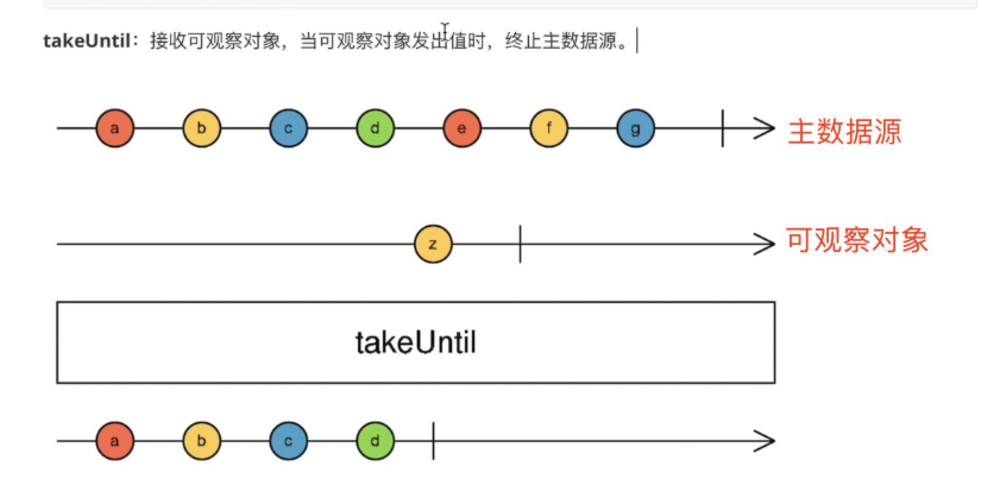

## RxJs

### 相关基础

1. 背景： Reactive Extensions (RX)
2. 定义： RxJS 是使用 Observables 的响应式编程的库，它使编写异步或基于回调的代码更容易。
3. 理解：RXJS就是一个用于管理 event 的库，就像 Lodash一样，是工具方法的集合。
4. 用处：有效管理非同步或者事件
5. 使用Rxjs的特点
   1. 纯净性 Purity: 使用纯函数来产生值，减少出错的概率
   2. 流动性 Flow: 提供了一套流程操作符来控制事件流程 例如 throttleTime filter delay debounceTime take takeUntil distinct distinctUntilChanged
   3. 值 Values: 对于流经 observalbles 的值， 可以对其进行转换， 例如 map scan pluck pairwise sample 等

### 核心类

1. Observable (可观察对象): 一组未来值或事件的集合。
2. Observer (观察者): 一个回调函数的集合，它知道如何去监听由 Observable 提供的值，即接受观察结果
3. Subscription (订阅): 表示 Observable 的执行，可用于取消 Observable 订阅。代表正在执行 Observabe/Observer 的执行个体，建立观察者与被观察者之间的观察关系，
4. Operators (操作符): 采用函数式编程风格的纯函数 (pure function)，主要用来处理一系列的事件资料集合。常见 map、filter、concat、flatMap 等这样的操作符来处理集合。
5. Subject (主体): 相当于 EventEmitter，并且是将值或事件多路推送给多个 Observer 的唯一方式，通俗来讲就是广播收到的事件资料给多位 Observer.
   1. 方法 asObservable: 投射 subject 实例为一个observable 对象
6. Schedulers (调度器): 用来控制并发并且是中央集权的调度员，允许我们在发生计算时进行协调, 以控制事件并发情况，例如 setTimeout 或 requestAnimationFrame 或其他。

### Observable

1. 定义：
2. Observable & Event Loop:
   1. Observable is MicroTask. Similar to Promise,
   2. 也是用 microtask queue 来实现的
3. 实验：

   ``` c
      import { from } from 'rxjs';
      console.log('Start');
      Promise.resolve('From Promise')
         .then(val => {
            console.log(val);
         });
      from(Promise.resolve('From Observable'))
         .subscribe(val => {
            console.log(val);
         });
      setTimeout(() => {
         console.log('Timeout Callback');
      }, 0);
      console.log('End');

      // output
      Start
      End
      From Promise
      From Observable
      Timeout Callback
   ```

### Observer

### operator

### Subject

### Schedular

1. 定义：
2. 原理：
3. 分类：
   1. asyncSchedular
      1. 作用：
      2. code理解：

         ``` c
            const observable = new Observable((proxyObserver) => {
               proxyObserver.next(1);
               proxyObserver.next(2);
               proxyObserver.next(3);
               proxyObserver.complete();
            }).pipe(
               observeOn(asyncScheduler)
            );
            const proxyObserver = {
               next(val) {
                  asyncScheduler.schedule(
                     (x) => finalObserver.next(x),
                     0, // delay
                     val
                  );
               },

               // ...
            };
         ```

      3. 原理：
         1. 官网原文：The async Scheduler operates with a setTimeout or setInterval, even if the given delay was zero. As usual, in JavaScript, setTimeout(fn, 0) is known to run the function fn earliest on the next event loop iteration. This explains why got value 1 is delivered to the finalObserver after just after subscribe happened.
         2. 翻译：异步Scheduler使用setTimeout或setInterval进行操作，给定的延迟为0。通常，在JavaScript中，setTimeout(fn, 0)被认为是在下一个 Event Loop 的一开始运行函数fn。

### Observable subscribe 的本质

1. 传入一个对象，拥有 next error 方法

   ```dash
      this.someService.getSomething().subscribe({
         next: (something: []) => this.something = something,
         error: err => this.errorMessage = err
      })

   ```

2.

### 操作符(一)

1. pluck: 获取数据流对象中的属性值

   ```dash
    from(axios.get('http://...'))
      .pipe(
         pluck('data', 'token') // 获取返回对象data属性对象的token属性
      )
   ```

2. switchMap: 切换可观察对象，返回一个新的 Observable.
   1. 用途：Cancels the current subscription/request and can cause race condition.Use for get requests or cancelable requests like searches. 可以打断当前的订阅或者请求，适用于请求或者取消当前 request, 适用于 搜索 业务场景。

   ```
   import { fromEvent, interval } from 'rxjs'
    import { switchMap } from 'rxjs/operators';

    const button = document.getElementById('btn');
    // 此时是一个点击事件的 observable 对象 
    // fromEvent(button, 'click').subscrive(console.log)
    fromEvent(button, 'click')
    .pipe(
        // 将要传给subscribe调用的Observable切换成interval返回的新的Observable对象了
        switchMap(event => interval(1000))
    )
    .subscribe(console.log)
   ```

3. concatMap: 合并 Observable 对象. 可以用来实现串联请求.
    1. 用途：Runs subscriptions/requests in order and is less performant.Use for get, post and put requests when order is important. 用来按顺序执行订阅或请求。
    2. 优点：安全性. 当顺序重要，可以用来执行 get/post/put 等请求。
    3. 缺点：性能相对弱一点

   ```dash
   import { from, fromEvent } from 'rxjs'
   import { pluck, concatMap } from 'rxjs/operators';
   fromEvent(button, 'click')
    .pipe(
       // 注意是串联，第一个请求完成再发第二个请求
       concatMap(event=>
         from(axios.get('http://...1'))
         .pipe(
            pluck('data', 'token')
         )
       ),
       concatMap(token=>
         from(axios.get('http://...2'))
         .pipe(
            pluck('data')
         )
       )
    )
    .subscribe(console.log)
   ```

4. mergeMap: 并行地执行几个 Observable 对象
   1. 用途：Runs subscriptions/requests in parallel and it is more performant. Use for get, put, post and delete methods when order is not important. 并行地订阅或者请求，性能更高，当顺序不重要，可以用来执行 get/put/post 请求
   2. 优点：性能更高
   3. 缺点：不保证顺序
5. exhaustMap: Ignores all subsequent subscriptions/requests until it completes.在未完成前，忽略后续所有的订阅或请求
   1. 用途：Use for login when you do not want more requests until the initial one is complete. 比如在登陆成功前，其他的请求或订阅不被允许，就可以用这个
6. first():
   1. 用途：
   2. 示例：
   3. 对比：
7. take(n):
   1. 用途：Takes the first count values from the source, then completes.获取数据流中的前几个,然后这个 Observable 就自动结束了， After that, it completes, regardless if the source completes.无论这个源是否真的结束，此处的 subscribe 都不会收到新的值
   2. 示例:

      ```dash
      import { take } from 'rxjs/operators';
      range(1,10).take(5).subscribe(console.log) // 1 2 3 4 5
      ```

   3. 与其他对比：
      1. take(1) VS unsubscribe
      2. take(1) VS first()
      3. take(1) VS single()

8. takeWhile: 根据条件从数据源前面开始获取。 注意：当数据流中某一个数据不满足条件，则遍历停止，后面还有符合条件的也不会生效。

   ```dash
   import { takeWhile } from 'rxjs/operators';
   range(1,10).takeWhile(x=>x<=3>).subscribe(console.log)
   ```

9.  takeUntil: 接收可观察对象，当可观察对象发出值时，终止主数据源 

   ```dash
   import { fromEvent } from 'rxjs';
   import { takeUntil } from 'rxjs/operators';
   const button = document.getElementById('btn');
   // 实现效果：鼠标移动时源源不断发出数据，点击按钮后停止发出数据
    fromEvent(document, 'mousemove')
    .pipe(
        takeUntil(fromEvent(button, 'click))
    )
    .subscribe(console.log)
   ```

10. throttleTime: 节流操作 限制一段时间内只能操作一次

   ```dash
   import { throttleTime } from 'rxjs/operators';
   fromEvent(document, 'click')
    .pipe(
       throttleTime(2000)
    )
    .subscribe(console.log)
   ```

11. debounceTime: 防抖 限制一段时间内的操作只有最后一次是生效的

   ```dash
   import { debounceTime } from 'rxjs/operators';
   fromEvent(document, 'click')
    .pipe(
       debounceTime(2000)
    )
    .subscribe(console.log)
   ```

12. distinctUntilChanged: 检测数据源当前要发出的数据流是否和上次发出的相同，如果相同就跳过；不相同才发出

   ```dash
   import { of } from 'rxjs'
   import { distinctUntilChanged } from 'rxjs/operators';
   of(1,1,2,2,3,4,4)
    .pipe(
       distinctUntilChanged()
    )
   .subscribe(console.log)
   ```

13. timer 延时 time(2000) 单位毫秒

   ```bash
   import { timer } from 'rxjs'
   this.actions$.pipe(
      ofType('[async] increment'), 
      mergeMap( () => timer(2000) ),
   )
   ```

14. catchError 捕捉错误的操作符。
    1. 入参：一个函数

        ``` c
        of([100]).pipe(
         tap( n => console.log(n)),
         catchError(this.handleError)
        )
        handleError(err: HttpErrorResponse){
         return throwError(()=>'Error occurs.')
        }

        ```

    2. 注意：它不会自动返回一个 Observable

### 操作符(二) 辅助方法: 都返回 Observable类对象

1. range
2. from: 用于将 Array promise Iterator 等转化成Observable类对象

    ```bash
    import { from } from 'rxjs'
    function p(){
        return new Promise((resolve,reject)=>{
            setTimeout(()=>{
                resolve({a: 1})
            }, 2000)
        })
    }
    from(p()).subscribe(console.log) // {a: 1}
    ```

3. forkJoin: 类似于 Promise.all,表示等所有的Observable都完成之后才一次性返回值

   ```bash
   import { from, forkJoin } from 'rxjs'
   forkJoin({
       optionA: from(axios("aaa")),
       optionB: from(axios("bbb")),
   }).subscribe(console.log)
   // { optionA: {}, optionB: {} }
   ```

4. fromEvent: 将事件转化为 Observable

   ```bash
    import { fromEvent } from 'rxjs'
    import { map, pluck } from 'rxjs/operators';
    const button = document.getElementById('btn');
    fromEvent(button, 'click')
    .pipe(
        // 可以用 map
        map(event=>event.target) // 获取事件源
        // 也可以用 pluck
        pluck("target")
    )
    .subscribe(console.log)
   ```

5. interval: 每隔一段时间发出一个递增的数值，从0开始

   ```bash
   import { interval } from 'rxjs'
   interval(1000).subscribe(console.log)
   ```

6. timer: 间隔时间过去以后发出数值，行为终止；或者间隔时间发出数值后，继续按第二个参数的时间间隔继续发出值

   ```bash
   import { timer } from 'rxjs'
   timer(2000).subscribe(console.log)
   timer(0, 1000).subscribe(console.log)
   timer(3000, 1000).subscribe(console.log)
   ```

7. of: 将参数列表作为数据流返回

   ```bash
   import { of } from 'rxjs'
   of("a", 1, true, {}, []).subscribe(console.log)
   ```

### 怎么写 Observable 对象的 UT 单元测试 ❓❓❓

