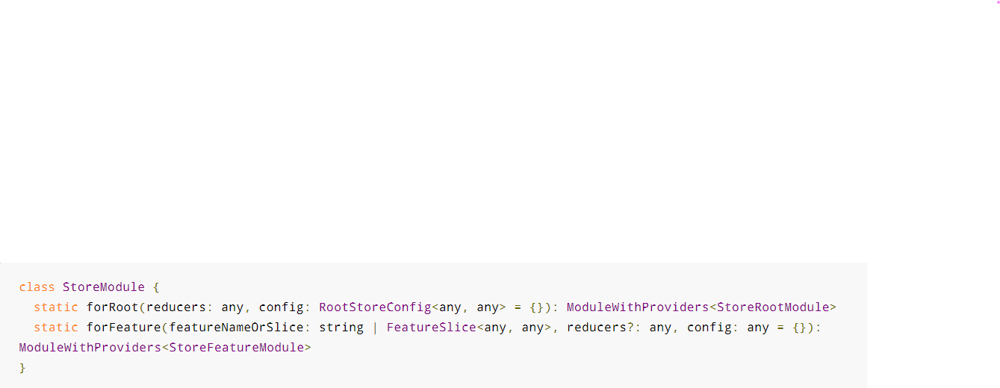
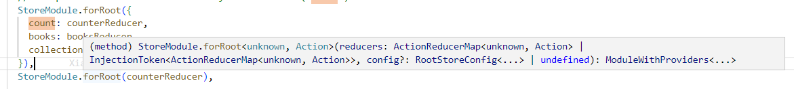
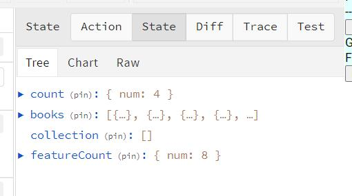

## NgRx

### 定义

### 原理

### 核心组成部分

1. Store
   1. 定义: 提供全应用范围内的全局状态管理。Global state across an entire application
   2. 注册状态: 通过 reducer 注册状态，例如想提供一个全局都可以用的状态: 具体可以看下面 Reducer 部分文档
      1. 导入 StoreModule.forRoot 并加入根模块的 Imports 数组

         ```bash
         import { StoreModule } from '@ngrx/store';
         @NgModule({
            imports: [
               // `StoreModule.forRoot` 方法注册了使 store 可以被整个应用使用的全局提供者
               StoreModule.forRoot({ count: counterReducer }),
               ...
            ]，
            ...
         })
         ```

      2. 在组件中，作为 constructor 的参数

         ```bash
         export class MyCounterComponent {
            count$: Observable<{num: number}>;// TODO: Connect `this.count$` stream to the current store `count` state
            // Store< 这里面表示要引用的数据类型 >
            constructor( private store: Store<{ count: {num: number} }> ) { // The count is from `StoreModule.forRoot` from 'app.module.ts'
               this.count$ = store.select('count');// select 的字符串参数表示要取得的数据的名称是 count 的一部分数据， 也可以看出 store.select(...)的返回结果是一个 ovservable
            }
         }
         ```

      注意：例如这里的 count$ 是observable 对象， 它没办法直接在 template 中使用，所以要先用 async 管道符转换后，才能用 .符号取得其中属性，即 (count$ | async).num
   3. State
      1. 定义：数据状态，store 是存储的所有 state 的总和，通过 store 来访问 state
      2. 更新状态：在组件中，使用 store.dispatch(action) 即可。会有对应 reducer 监听 action 的触发，然后执行响应处理函数，产生新的 state
2. Actions
   1. 定义：actions 描述了各种独一无二的事件，这些事件是由 components 或者 service 触发的
   2. 接口：NgRx中的 Actions 是由一个简单的接口组成的.

      ```bash
      interface Action {
         // type 属性用来描述这个 Action 被触发的信息，写法以 [Source] Events 这样的形式表现 action 的分类和从哪里被触发。 action 的 category 被
         type: string;
         // 可以给 action 添加额外的信息或者数据
         username: string;
         password: string;
      }
      ```

   3. 创建 Action:

      ```bash
      import { createAction, props } from '@ngrx/store';
      // createAction 函数: 当它被调用时返回一个 Action 接口形状的对象。
      export const increment = createAction('[Counter Component] Increment');
      export const decrement = createAction('[Counter Component] Decrement');
      export const reset = createAction('[Counter Component] Reset');
      
      // props 方法，是用来定义 action 中除了 type 属性外其他属性的，这些属性将参与该 action event 的逻辑处理 
      export const login = createAction(
         // 【】里面写的是 action 的分类。这个分类在一些时候会用来分组 比如这个action 的分类就是 登录页面里的事情，是一个分类
         // 【】后面的文字是用来描述 发生了什么事件。比如这个 action 的事件就是登录
         '[Login Page] Login',
         props<{ username: string; password: string }>()
      );

      // 这里的 login 就时一个 action creator login() 返回的就是一个 action 对象
      onSubmit(username: string, password: string) {
         store.dispatch(login({ username: username, password: password }));
      }
      ```

   4. 写好 action 的规则
      1. 先写: 在开发之前，先写 action
      2. 分割: 基于事件信息，将 actions 分类
      3. 多写：写 action 的成本不高，写的越多，对事件流程的表述就越清楚
      4. 事件驱动：action 用来捕获事件，而不是捕获命令，因为对事件的描述和处理是分开的
      5. 描述性的：action 的描述信息可以帮助开发者工具的调试
3. Reducer：
   1. 定义：
      1. 文档：NgRx中的 reducer 负责处理应用程序中从一个 state 到下一个 state 的转换。reducer 通过根据 action 的 type 决定处理哪些 action 来处理这些转换。
      2. 通俗理解：是用来改变 state 的函数，是纯函数，需要当前的 state 和最新 被 dispached 的 action，一番操作后，得出新的 State
   2. 原理：
      1. 每个 reducer 都是一个用来监听 action 的 listener。当一个 action 被触发，所有注册了这个 action 的 reducers 都会接收到， 监听的方法是通过 `on` 方法
      2. 每次 reducer 返回的 new state 都是 immutable, 是一个完全新的对象，不是在原来对象上进行修改。这样的好处就是可以保障原来的被舍弃的状态对象可以被销毁
   3. 创建 Reducer:

      ```dash
      import { on } from '@ngrx/store';
      import { increment, decrement, reset } from './counter.actions';

      // state 的初始值
      export const initialState = { 
         num: 0,
      };
      // createReducer(initialState, action1, action2,...actions)
      export const counterReducer = createReducer(
         initialState, // 初始化 state
         on(increment, (state) => state.num + 1), // increment is action name
         on(decrement, (state) => state.num - 1), 
         on(reset, (state) => ({num: 0})), 
      );
      ```

   4. 通过 Reducer 注册状态：
      1. 定义 piece of state: 应用程序的所有状态就是一个很大的对象。reducer 来管理一部分的状态，就是在这个大对象中，定义一些关联状态的键值 key。
      2. StoreModule 注册状态：以键值对形来管理状态
         1. 原理：本来 在 reducer 里定义了 state 中数据的各个部分，组成 store 中总的数据。使用 for*(key)
         2. 分类：
            1. 注册全局状态：
               1. 定义：文档原文：The StoreModule.forRoot() registers the global providers for your application, including the Store service you inject into your components and services to dispatch actions and select pieces of state. 翻译为:StoreModule.forRoot()为你的应用程序注册了全局提供者，包括你注入到组件和服务中的Store服务，以分配行动和选择状态的片段。
               2. 注册位置：app.module.ts
               3. 用法：导入 StoreModule.forRoot，并在 Imports 数组中调用, 创建键值对, 成为全局提供者，于是可以使用注入的 store 服务

                  ```bash
                  import { StoreModule } from '@ngrx/store';
                  @NgModule({
                     imports: [
                        // 键值对 count: countReducer
                        // `StoreModule.forRoot` 方法注册了使 store 可以被整个应用使用的全局提供者
                        // `StoreModule.forRoot` 方法能够保证在应用启动的一开始，定义的state 就被定义
                        // 在这里注册的状态，应该是那种立刻要被全局使用到的状态
                        
                        StoreModule.forRoot({ count: counterReducer }),
                        ...
                     ]，
                     ...
                  })
                  ```

               4. 注意：虽然官网 API 中，使用说明如下: 但实际使用中，入参类型应该入下: ;

            2. 注册分支状态： {key: *reducer}
               1. 定义：跟 storeModule.forRoot 类似，但是 feature state 允许使用一个 特指的 key/value 键值域来存储数据，用于在一个特定模块内，自己管理自己的数据
               2. 注册位置：任何 feature module 都可以
               3. 用法：导入 StoreModule.forFeature 并加入到 AppModule，并在 Imports 数组中调用, 创建键值对
               4. 调用时机：Lazily load. 会在加载 SharedModule 时，懒加载 counterReducer

                  ```bash
                     // shared.module.ts
                     import { StoreModule } from '@ngrx/store';
                     import { counterReducer } from './counterReducer.reducer';
                     @NgModule({
                        imports: [
                           // 键值对 count: countReducer
                           StoreModule.forFeature('count', counterReducer)
                        ],
                     })
                     export class SharedModule {}

                     // app.module.ts
                     import { StoreModule } from '@ngrx/store';
                     import { SharedModule } from './scoreboard/scoreboard.module';
                     @NgModule({
                        imports: [
                           SharedModule 
                        ],
                     })
                     export class AppModule {}
                  ```

         3. 最终数据如图：
      3. 用法：
         1. forRoot 和 forFeature 都可以像上面一样，直接在 app.module.ts 里写在 imports 里
         2. forRoot 写在 app.module.ts 里， forReature 写在 ABC.module.ts 里的 imports 里， 然后 在 app.module.ts 的 imports 里，直接引用 AbcModule
         3. 代码 demo 请看 ./angular-demo/src/app/shared/shared.module.ts/components/print 
      4. 建议；像上面分支状态例子中的 featureKey 即 'count'， 是先抽象出来一个值，这样可以防止硬编码

         ```bash
         const COUNT_FEATURE_KEY = 'count';
         StoreModule.forFeature(COUNT_FEATURE_KEY, counterReducer)
         ```

   5. 注意：
      1. The exported reducer function is no longer required if you use the default Ivy AOT compiler (or JIT). It is only necessary with the View Engine AOT compiler as function calls are not supported there. ❓❓❓
4. Selectors:
   1. 定义：selector 是一个选择器函数，决定如何从 store 中获得 某些数据片 slices of data，是纯函数. 入参是函数，返回值也是函数.
   2. 用途：createSelector可以用来根据同一状态的几个片断来选择状态中的一些数据。createSelector函数最多可以带8个选择器函数，用于更完整的状态选择。
   3. 特性：ngrx 中的 Selectors 具有一些特性： 都是啥意思❓❓❓
      1. Portability 可移植性
      2. Memoization 记忆化：
         1. 记忆化:当参数匹配时，可以返回最后的结果，而无需重新调用你的选择器函数 ❓❓❓ 源码在哪怎么看
         2. selector 自带性能优化：memoizedSelector 类 实例
            1. 追踪参数：
               1. 文档原文：When using the createSelector and createFeatureSelector functions @ngrx/store keeps track of the latest arguments in which your selector function was invoked. Because selectors are pure functions, the last result can be returned when the arguments match without reinvoking your selector function. This can provide performance benefits, particularly with selectors that perform expensive computation.
               2. 翻译：当使用createSelector和createFeatureSelector函数时，@ngrx/store会跟踪你的 selector 被调用的最新参数。因为 selector 是纯函数，当参数匹配时可以返回最后的结果，而无需重新调用 selector 函数。这可以提供性能上的好处，特别是对于那些执行昂贵计算的选择器。
            2. 缓存结果：
               1. 文档原文：The selector function returned by calling createSelector or createFeatureSelector initially has a memoized value of null. After a selector is invoked the first time its memoized value is stored in memory. If the selector is subsequently invoked with the same arguments it will return the memoized value. If the selector is then invoked with different arguments it will recompute and update its memoized value.
               2. 翻译：通过调用createSelector或createFeatureSelector返回的选择器函数最初有一个null的记忆值。选择器第一次被调用后，它的记忆值被保存在内存中。如果该选择器随后以相同的参数被调用，它将返回记忆化的值。如果随后用不同的参数调用选择器，它将重新计算并更新其记忆值。
      3. Composition 构成化
      4. Testability 可测试性
      5. Type Safety 类型安全性
   4. selectors API：
      1. createFeatureSelector： 获取顶层数据。
         1. 文档原文：The createFeatureSelector is a convenience method for returning a top level feature state. It returns a typed selector function for a feature slice of state.
         2. createFeatureSelector 的用法：

            ```dash
               import { createSelector, createFeatureSelector } from '@ngrx/store';

               // 获取顶层的 count 的状态
               export const selectCountState = createFeatureSelector<{ num: number }>('count');

               export const selectNumFromCount = createSelector(
                  selectCountState,
                  (count) => count.num
               );

               // 获取顶层的 featureCount
               export const selectFeatureCountState = createFeatureSelector<{ num: number }>(
                  'featureCount'
               );

               export const selectFeatureNumFromFeatureCount = createSelector(
                  selectFeatureCountState,
                  (featureCount) => featureCount.num
               );

               // ❓❓❓猜想：虽然 Store.forFeature('featureCount') 是写在 shared.module.ts 模块里的，sharedModule 在 app.module.ts 里被引入在 Imports[] 数组中了，所以 featureCount state 跟 Count state 都存在于顶层的位置

            ```

      2. createSelector： 
         1. 定义：通过 createFeatureSelector 获取内层数据
         2. createSelector 的用法：
            1. 获取 a piece of state:

               ```dash
                  import { createSelector } from '@ngrx/store';

                  export interface FeatureState {
                     counter: number;
                  }

                  export interface AppState {
                     feature: FeatureState;
                  }

                  export const selectFeature = (state: AppState) => state.feature;

                  export const selectFeatureCount = createSelector(
                     selectFeature,
                     (state: FeatureState) => state.counter
                  );
               ```

            2. 获取 multiple pieces of state:

               ```dash
                  import { createSelector } from '@ngrx/store';

                  export interface User {
                     id: number;
                     name: string;
                  }

                  export interface Book {
                     id: number;
                     userId: number;
                     name: string;
                  }

                  export interface AppState {
                     selectedUser: User;
                     allBooks: Book[];
                  }

                  export const selectUser = (state: AppState) => state.selectedUser;
                  export const selectAllBooks = (state: AppState) => state.allBooks;

                  export const selectVisibleBooks = createSelector(
                     selectUser,
                     selectAllBooks,
                     (selectedUser: User, allBooks: Book[]) => {
                        if (selectedUser && allBooks) {
                           return allBooks.filter((book: Book) => book.userId === selectedUser.id);
                        } else {
                           return allBooks;
                        }
                     }
                  );
                  // 调用 selector: `this.store.select( selector )` 跟 `this.store.select('count')` 类似，传入的参数不同
               ```

            3. 通过传入参数 props 获取 state:

               ```dash
                  // 缺点：由于 selector 天然具有记忆化的特点，可以保留之前输入的参数，从而直接从内存中拿selector，而不用多次调用。但当 props 传参调用时传入不同的 multiply 参数，选择器不得不重新评估它的参数，就会多次调用，解决方案是可以使用工厂函数：
                  export const getCount = createSelector(
                     getCounterValue,
                     (counter, props) => counter * props.multiply
                  );
                  ngOnInit() {
                     this.counter = this.store.select(fromRoot.getCount, { multiply: 2 })
                  }

                  // Better with 工厂函数：使用 props.id 来返回不同的选择器实例
                  export const getCount = () =>
                     createSelector(
                        (state, props) => state.counter[props.id],
                        (counter, props) => counter * props.multiply
                     );
                  ngOnInit() {
                     this.counter2 = this.store.select(fromRoot.getCount(), { id: 'counter2', multiply: 2 });
                     this.counter4 = this.store.select(fromRoot.getCount(), { id: 'counter4', multiply: 4 });
                     this.counter6 = this.store.select(fromRoot.getCount(), { id: 'counter6', multiply: 6 });
                  }
               ```

      3. selectorInstance.release(): 将选择器实例及其所有依赖的祖先选择器，递归地全部释放掉 所有选择器返回的记忆化函数在内存中的资源，使其全部重归 null 值，

         ```dash
         export interface State {
            a: number[];
            b: number[];
         }

         export const selectSumEvenNums = createSelector(...);
         export const selectSumOddNums = createSelector(...);

         export const selectTotal = createSelector(
            selectSumEvenNums,
            selectSumOddNums,
            (a, b) => a + b
         );

         selectTotal({
            a: [2, 4],
            b: [1, 3],
         });

         /**
         * Memoized Values before calling selectTotal.release()
         *   selectSumEvenNums  6
         *   selectSumOddNums   4
         *   selectTotal        10
         */

         selectTotal.release();

         /**
         * Memoized Values after calling selectTotal.release()
         *   selectSumEvenNums  null
         *   selectSumOddNums   null
         *   selectTotal        null
         */
         ```

   5. store.select('') VS store.select(selector) 对比
      1. 可以用来查询的 key 值不同：例子请看 /angular-demo/src/app/app.component.ts line 50，61
         1. store.select('key') 通过字符串查找的数据，这个字符串 'key' 必须是存在于传入的数据对象中的属性，即 constructor 入参的属性
         2. store.select(selector) 不限制要查的数据是否在 constructor 的入参中
   6. Using Store Without Type Generic ❓❓❓
      1. 注意：It is important to continue to provide a Store type generic if you are using the string version of selectors as types cannot be inferred automatically in those instances. ❓❓❓
   7. 高阶用法：
      1. 使用 RxJS 中的语法例如 store.pipe(...) ❓❓❓
5. Effects
   1. 定义：Effects 是由 RxJS 提供的给 Store 使用的副作用模块，比如网络请求，异步事件等。
   2. 作用：在一个基于服务的Angular应用程序中，component 负责直接通过 serivce 与外部资源进行交互。相反，effects 提供了一种与这些 service 交互的方式，并将它们与 component 隔离。effects 是你处理业务的地方，如获取数据、产生多个事件的长期运行的任务，以及其他外部交互，你的组件不需要明确了解这些交互。
   3. 核心概念：
      1. Effects isolate side effects from components, allowing for more pure components that select state and dispatch actions.效果将副作用与组件隔离开来，允许选择状态和调度动作的更纯的组件。
      2. Effects are long-running services that listen to an observable of every action dispatched from the Store.效果是长时间运行的服务，它侦听从Store调度的每个操作的可观察对象。
      3. Effects filter those actions based on the type of action they are interested in. This is done by using an operator.效果根据他们感兴趣的动作类型过滤这些动作。这是通过使用运算符来完成的。
      4. Effects perform tasks, which are synchronous or asynchronous and return a new action.效果执行同步或异步的任务并返回一个新动作
   4. Effect 的本质
      1. A Effect is a type of Angular Service. 即 Effects 的本质就是一个服务
      2. 使用 effects 时，也需要 @Injectable, 写法也一样
   5. 注册 root effects: 
      1. 自动注册到顶层：利用 Angular CLI 的命令 ng add @ngrx/effects 会自动下载安装包，然后自动更新 app.module.ts 和 package.json 两个文件。

         ```dash
            @NgModule({
               imports: [
                  EffectsModule.forRoot([]), // 自动在顶层出现这行：默认是空数组
               ],
            })
            
         ```

      2. 手动注册顶层 top-level effects. 
         1. 写到 根模块中 app.module.ts 里，

            ```dash
            @NgModule({
               imports: [
                  EffectsModule.forRoot([BoooksEffects])
               ],
            })
            export class AppModule {}
            ```

         2. 调用时机：当 AppModule 一经加载，effects 就会立刻被加载，这样才能保证监听得到所有的 actions
         3. 注意: 无论是否定义了 top-level effects,  EffectsModule.forRoot() 这个方法都要添加进 AppModule imports 数组中

      3. 手动注册 feature effects:
         1. 写在  根模块中 app.module.ts 里 或者 分支 Module 里

            ```dash
               // 在 BooksModule 里
               @NgModule({
               imports: [
                  EffectsModule.forFeature([BoooksEffects])
               ],
            })
            export class BookModule {}
            ```

         2. 调用时机：Lazily load. 会在加载 BookModule 时，懒加载 BooksEffects
   6. 用法：
      1. 注入语法
      2. 构造函数注入 Aciton Observable

      ```bash
      // 1.注入语法
      @Injectable()
      export class BoooksEffects {
         // 2.当组件触发 action 时，effect 需要通过 Actions 类服务接收 Action， 所以在 Effect 类中通过 constructor 参数的方式将 Actions 的实例注入，当有 Action 被触发时，Action 对象本身会作为数据流被发出
         constructor(
            private actions$: Actions, // Actions 服务类的实例对象是 Observable 对象，当有 Action 被触发时，Action 对象本身会作为数据流被发出
            private booksService: GoogleBooksService
         ) {}

         // createEffect 接受一个回调函数作参数，回调函数中返回 observable 对象，即 loadBooks$，对象中要返回副作用执行完成后要触发的 action$,当最后反回的那个 action 被触发时，loadBooks$ 就会发出流数据
         loadBooks$ = createEffect(() => this.actions$.pipe(
            ofType('[Book List/API] fetch Books'), // 每个 action 被 dispatched 的时候，都会发出数据流，effects 会监听所有被触发的 actions$ 数据流，但只会对 'ofType' 里的 一个或多个 action 做出反应
            // 使用 mergeMap 操作符将 action stream 扁平化❓❓❓并映射到一个新的可观察对象。必须使用‘扁平化’操作符，比如 mergeMap,concatMap, exhaustMap 等
            mergeMap(() => { 
               // 返回那个副作用执行完成后想触发的 action$, 也是 Observable 对象. 
               return this.booksService.getBooks().pipe( 
                  map((books) => {
                     return {
                        type: '[Book List/API] Retrieve Books Success', // 然后这个 action 也会被 store 触发，当数据需要改变，这个 action 就会被对应的 reducer 处理
                        payload: books,
                     };
                  }),
                  catchError(() => EMPTY), // Effects 会始终监听 observable streams 直到错误出现或者流结束。这里是返回了一个 empty observable，if an error occurs.
               ))
            })
         );
      }
      ```

   7. 注意：
      1. 上述所有的 event streams 都是可观察对象，但不限制于 被触发的 action$， 任何新的或者别的库产生的可观察对象都可以，比如 Angular Router、浏览器事件等任何 observable streams.
   8. root effects VS feature effects: ❓❓❓
      1. EffectsModule.forFeature([*effects])
6. Entity
   1. 定义：实体，就是集合中的一条数据。
   2. 作用：ngrx提供了实体适配器对象，这个适配器对象提供了各种操作集合中实体的方法，目的就是提高开发者操作实体的效率。
   3. 写在哪里：*.reducer.ts 既然是增强处理一条数据(实体)的能力，那肯定是写在处理数据逻辑的地方，就是reducer
   4. 核心成员：
      1. EntityState: 实体类型接口.
         1. EntityState 接口类型存储的数据格式：有 ids 和 entities 两个属性

            ```bash
            {
               ids: [1,2],
               entities: {
                  1: {id: 1, ...}, 
                  2: {id: 2, ...}
               }
            }
            ```

         2. 状态接口继承该实体类型接口后，就也有了ids&entities两个属性

            ```bash
            export interface State extends EntityState<T> {} 
            ```

         3.
      2. EntityAdapter： 实体适配器对象类型接口
      3. createEntityAdapter: 创建实体适配器对象的方法

         ```bash
         const adapter: EntityAdapter<T> = createEntityAdapter<T>();
         const initialState: State = adapter.getInitialState(); //{ ids: [], entities: {} }
         ```

   5. 核心方法
      1. 适配器方法：就是用来操作实体的方法
         1. 目录:

            ```bash
            // 删
            removeOne: Remove one entity from the collection.
            removeMany: Remove multiple entities from the collection, by id or by predicate.
            removeAll: Clear entity collection.
            // 增
            addOne: Add one entity to the collection.
            addMany: Add multiple entities to the collection.
            // 增 or 改
            upsertOne: Add or Update one entity in the collection. 
            upsertMany: Add or Update multiple entities in the collection. 
            setOne: Add or Replace one entity in the collection.
            setMany: Add or Replace multiple entities in the collection.
            // 改
            setAll: Replace current collection with provided collection.
            updateOne: Update one entity in the collection. Supports partial updates.
            updateMany: Update multiple entities in the collection. Supports partial updates.
            // 遍历(查) + 改
            mapOne: Update one entity in the collection by defining a map function.
            map: Update multiple entities in the collection by defining a map function, similar to Array.map.
            ```

         2. 用法：大部分两个参数的方法是fn(参数,state)，state是作为第二个参数使用的，注意区别

            ```bash
            on(UserActions.addUser, (state, { user }) => {
               return adapter.addOne(user, state)
            }),
            on(UserActions.setUser, (state, { user }) => {
               return adapter.setOne(user, state)
            })
            // ...
            ```

         3. 注意：目录中的方法，没说 Support partial updates.的就是 不支持局部更新， 比如  upsertOne and upsertMany
      2. 选择器方法：就是用来选择实体的 adapter.getSelectors()
         1. 目录：

            ```bash
            // 来自 adapter.getSelectors() 的返回值
            const { selectIds, selectEntities, selectAll, selectTotal, } = adapter.getSelectors();
            ```

         2. 用法：不是方法，是变量可直接赋值

            ```bash
            // 获取 id 集合，以数组形式呈现
            export const selectUserIds = selectIds;

            // 获取实体集合，以字典形式呈现
            export const selectUserEntities = selectEntities;

            // 获取所有数据，以数组形式呈现
            export const selectAllUsers = selectAll;
            
            // 获取数据条数
            export const selectUserTotal = selectTotal;
            ```

   6. Entity 与 Selector 的结合
      1. 用法

         ```bash
         import { createSelector, createFeatureSelector } from '@ngrx/store'; 
         export const selectBooksState = createFeatureSelector<ReadonlyArray<Book>>('books');
         // 原来:得到所有对象
         export const selectBookCollection = createSelector(selectBooksState,(books) => books);
         // 现在：得到所有实体
         const { selectAll } = adapter.getSelectors();
         export const selectBookCollection = createSelector(selectBooksState,selectAll);
         ```

      2.
7. ComponentStore
   1. 定义：提供组件范围内的局部状态管理。如果不想使用在全局范围的状态管理，只是想使用临时状态或者组件内的状态，可以使用这个

### 执行过程

1. 图示 
2. 注意
   1. 所有的 actions 在应用内被触发时，永远是先被 reducer 处理，然后才是 effects ❗❗❗

### Action 与 Reducer 是如何绑定/映射的，实现原理 ❓❓❓

1. 思想：每个 reducer 都是一个用来监听 action 的 listener。当一个 action 被触发，所有注册了这个 action 的 reducers 都会接收到， 监听的方法是通过 on 方法
2. 源码：
