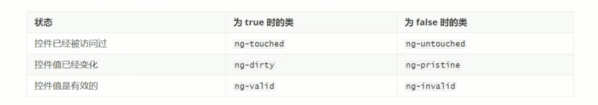
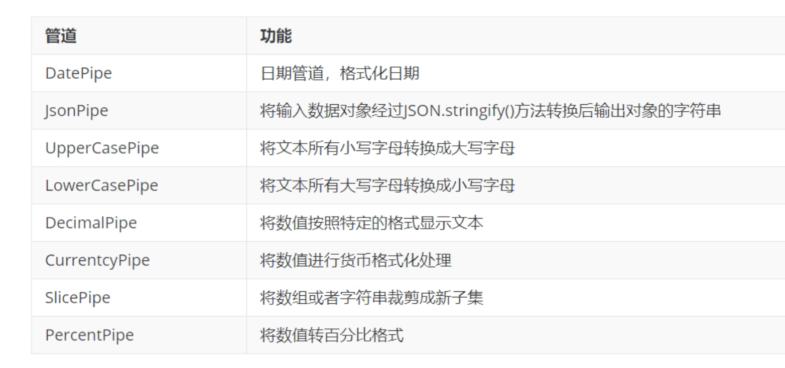
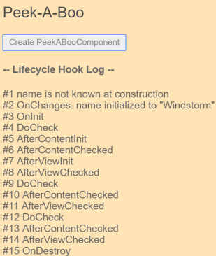
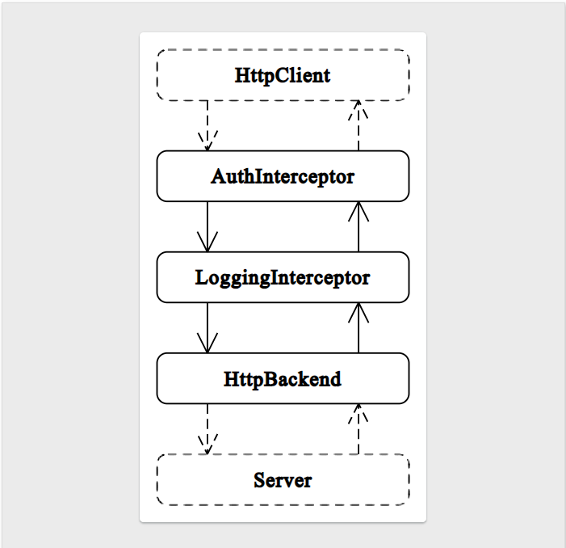
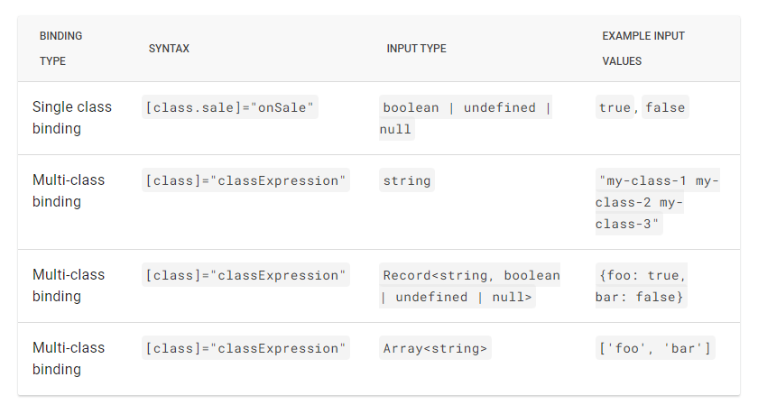

# Angular

1. 视频课：<https://www.bilibili.com/video/BV1oS4y1c7or?p=1>
2. 视频课：<https://www.acfun.cn/v/ac25920410_1>

## Basic conceptions

### Angular vs Angular.js

1. 定义：angular是由Google维护的一款开源javaScript。
2. 版本：Anguar1.5叫做angularJs，Angular4.0称为Angular，Angular1.5到Angular4.0是完全重写。

### 基础

1. 架构：angular是一种组件架构，用户可以与组件交互，组件之间互相路由，组件和服务之间通过依赖注入调用，服务调用webSocket与服务器端发生http通信。
2. 基础语言：Typescript
3. js：基于Es6开发
4. 入口：/src/index.html+main.ts+style.css

### 样式问题

1. 导入全局样式的方法
   1. 在入口样式 style.css 文件中导入

      ```dash
      // 这个~波浪号代表相对 node_module 文件夹
      @import "~bootstrap/dist/css/bootstrap.css"
      ```

   2. 在 入口模版 index.html 中引入外链
   3. 在文件根目录下的 angular.json 中，加入样式数组

      ```dash
      // angular.json
      "styles":[
         "./node_modules/bootstrap/dist/css/bootstrap.min.css",
         "src/style.css"
      ]
      ```

### angular/cli

1. 创建项目 ng new angular-demo
   1. 精简创建 ng new angular-demo -minimal 最小化，会创建一个精简的项目，不会包含 karma *spec.ts 等单元测试相关，并且也会把 html/css/ts 文件统一都打进一个 ts文件里
   2. 精简创建 ng new angular-demo --inlineTemplate 创建一个的项目，使 html 文件和 ts文件是分开的
   3. 总结第2、3点，可以使用 ng new angular-demo -minimal --inlineTemplate 最合适
   4. --skipGit=true 会跳过设置git
   5. --skip-install 会跳过自动安装依赖，可手动安装
   6. --style=css 设置项目的css的方式
   7. --routing=false 不创建路由文件
   8. --inlineStyle=true 则组件类文件+组件样式文件会合并
   9. --prefix="xxt" 指定组件默认前缀 默认是app 例如 app-menu-index
2. 创建组件 ng generate component name 缩写 ng g c name
    1. 带文件夹创建组件 ng g c folder/name 默认会创建 folder
    2. 不带文件夹创建组件 ng g c folder/name --flat 只会在该 folder 下创建组件，不会重新创建 folder
3. 创建服务 ng generate service name 缩写 ng g s name
4. 创建路由守卫 ng generate guard name 缩写 ng g g name

### 启动命令

1. ng serve
2. --open=true 应用构建完成后在浏览器中运行
3. --hmr=true 开启热更新
4. hmrWarning=false 禁用热更新警告
5. --port=1234 更改应用的运行端口 默认4200

### 常见问题

1. 用 cnpm install @angular/cli 可能会有问题，提示无权限安装，还是用npm直接安装吧
2. 一直卡在 installing packages: 可以 ng new projectName --skip-install 之后在项目里用淘宝镜像安装依赖 cnpm intall

### Angular Module

1. 定义：一个含有 NgModule 装饰器的类，就是一个Module。原文：Angular Module is a class with an NgModule decorator
2. 如何使用
3. 调用时机 两种
   1. 在项目启动之前就调用：An Angular module can be loaded eagerly when the application starts
   2. 可以被路由以懒加载的方式异步加载。 Can be lazy loaded asynchtonously by the router.

4. #### Shared Module 共享模块

   1. 定义：共享模块中放置的是 Angular 应用中模块级别的需要共享的组件或者逻辑
   2. 用途：可以把常用的指令、管道和组件放进一个模块中，然后在应用中其它需要这些的地方导入该模块
   3. 创建
      1. 共享模块：ng g m shared  这里取名叫shared
      2. 创建第一个组件：
         1. 在该共享模块下 创建组件：ng g c shared/components/Layout  demo 取名叫Layout
         2. 此时，在shared.module.ts里可以看到，在declaration里已经自动注入了 LayoutComponent

            ``` c
            @NgModule({
               declarations: [
                  LayoutComponent
               ],
               imports: [
                  CommonModule
               ],
               exports:[
                  LayoutComponent,
                  PrintComponent
               ]
            })
            export class SharedModule { }
            ```

      3. 创建第二个组件：
         1. 如果继续创建组件 ng g c shared/components/Print
         2. 此时，在shared.module.ts里可以看到,在 declarations 里已经自动添加了 printComponent, 但是在 exports 里没有自动添加，如果想导出，就自己手动添加，否则不导出是用不了的

            ``` c
            @NgModule({
               declarations: [
                  LayoutComponent,
                  PrintComponent 
               ],
               imports: [
                  CommonModule
               ],
               // 导出
               exports:[
                  LayoutComponent,
                  // 这里没有自动 添加进 exports，手动添加
                  PrintComponent
               ]
            })
            export class SharedModule { }
            ```

   4. 导出：在共享模块中导出共享组件: 在shared.module.ts中的 exports数组中指定要导出的模块名 LayoutComponent, PrintComponent
   5. 使用：
      1. SharedModule 已经被自动导入了根组件 app.module.ts 的 imports 中了, 注意这里自动导入的是分享模块SharedModule，而不是内部的 LayoutComponent 或者 PrintComponent，但是可以直接引用 分享模块中的 components
      2. 然后在想要使用的地方 直接引用标签就行了， `<app-layout></app-layout>`  `<app-print></app-print>`

### Decorator 装饰器

   1. 定义：使用 @ 来开头的保留字段，具有对应的装饰作用，表示类有特殊的含义
   2. 成员:
      1. @Directive:
         1. 定义: 把一个类标记为 Angular 指令。
         2. 用途：可以自定义指令，来为 DOM 中的元素添加自定义行为。该选项提供配置元数据，用于决定该指令在运行期间要如何处理、实例化和使用
         3. 文档链接：<https://angular.cn/api/core/Directive#directive>
         4. Metadata properties:
            1. selector:会创建一个该名字的 HTML element(指令实例化)叫做`<app-header></app-header>`。css选择器用于在模版中标记出该指令，并触发该指令的实例化
            2. @inputs decorator:
               1. 作用：列举某个指令的一组可供数据绑定的输入属性。原文：Is used to mark a class property that binds to incoming data
               2. 用法：

                  ``` c
                     import { Input } from '@angular/core';
                     @Component({ ... })
                     export class HeaderComponent {
                        // 1. 可直接取变量
                        @Input()
                        title1: string = 'Header'; // html: `<div>{{ title1 }}</div>`

                        // 2. 可以取别名 但 不推荐！应避免
                        @Input('rename-title3')
                        title2: string = 'Header'; // html: `<div>{{ title 2 }}</div>`

                     }
                     <app-header [title1]="My Header"></app-header>
                     <app-header [rename-title3]="My Header"></app-header>
                  ```

            3. @outputs + EventEmitter 一起使用
               1. 作用：创建一组可供事件绑定的输出属性
               2. 用法：❓❓❓

                  ``` c
                     https://angular-book.dev/ch05-07-output-events.html

                  ```

            4. host: ❓❓❓
               1. 作用：使用一组键-值对，把类的属性映射到宿主元素的绑定（Property、Attribute 和事件）
               2. <https://angular-book.dev/ch05-09-host.html>
            5. providers:
               1. 作用：每个被标记为 module/component 的类都可以声明自己的 providers 数组，用来定义要使用的是哪一个服务的某一个实例.
               2. 作用范围
                  1. 两种：
                     1. component-level 在组件中生成一个 service instance 服务实例
                     2. module-level 在整个 module 中生成并共享同一个 instance
                  2. 优先级：component-level > module-level(global-leval) 所以如果用了同一个服务，component级别的可以“顶替掉”module级别的
                  3. 好处：允许使用多个 service 的实例，方便自定义组件逻辑实现
               3. providers 里的配置项
                  1. provide
                  2. provide && useClass
                  3. provide && useFactory
                  4. deps for useFactory:
                     1. 作用：用来定义依赖关系，允许工厂函数在执行期间访问相应的实例对象。you can use additional deps property to define dependencies and allow your factory function to access corresponding instances during execution.
                  5. provide:String && useFactory && @Inject。 具体见 @Inject decorator 部分
                  6. provide && useValue
                  7. provide && alias && useExisting 创建别名
               4. 用法：

                  ``` c
                     // 在整个 Module 里设置的 provider, 下面所有的 components 都共用这些服务
                     import { ClickCounterService } from './click-counter.service';
                     import { LogService } from './services/log.service';
                     import { CustomLogService } from './services/custom-log.service';
                     @NgModule({
                        providers: [ 
                           // 1-1. 在模块中使用
                           ClickCounterService,
                           // 2-1. 使用对象类型：此时 key && value 都是 LogService，
                           {
                              provide: LogService,  
                              useClass: LogSerivce
                           },
                           // 2-2. 此时 key && value 是不同的类
                           {
                              provide: LogService,  // Key: 被注入了 LogService 类的
                              useClass: CustomLogService  // Value: 实际上使用的是 CustomLogService 的实例
                           },
                           // 3: 创建多个实例：一般constructor parameter 传进去的类都只会被创建一个实例，Angular 提供了一种方式，可以控制创建多个实例化对象
                           {
                              provide: LogService, 
                              useFactory: customLogServiceFactory // 这是个 factory function，返回对象作为实例给 LogService 用
                           },
                           // 4: deps for useFactory:
                           {
                              provide: AuthenticationService, 
                              useFactory: authServiceFactory 
                              deps: [RoleService, LogService] // 是 AuthenticationService 需要的服务
                           },
                           // 5: provede 提供字符串，与 @Inject 结合使用
                           { 
                              provide: 'DATE_NOW',    // 字符串
                              useFactory: dateFactory
                           }
                           // 6-1: 与 useFactory 很相似，都会先创建出实例化对象
                           const logService = new CustomLogService();
                           { 
                              provide: LogService, 
                              useValue: logService  // value 是实例化对象
                           }
                           // 6-2: 可以用来传递配置对象给组件或者服务，用来初始化或者配置。
                           {
                              LogService,
                              {
                                 provide: 'logger.config',
                                 useValue: {
                                    logLevel: 'info',
                                    prefix: 'my-logger'
                                 }
                              }
                           }
                           // 7: 给组件取别名
                           SafeAuthenticationService,  // 正常注册
                           { 
                              provide: AuthenticationService,  // 所有引用了 AuthenticationService 类的地方
                              useExisting: SafeAuthenticationService // 其实使用的是 SafeAuthenticationService 的实例。而且允许我们使用的是 singleton 单例实例。这是与 useClass 的区别。useClass 产生的和注入的实例，是两个不同的实例，这不是理想状态。
                           }

                        ],
                     })
                     export class AppModule { }

                     <!-- 分割线，下面functions是对上面配置用到的函数的补充 -->
                     // 3-customLogServiceFactory
                     export function customLogServiceFactory() {
                        const service = new CustomLogService();
                        return service;
                     }
                     // 4-AuthenticationService
                     @Injectable({ providedIn: 'root' })
                     export class AuthenticationService {
                        constructor(private roles: RoleService, private log: LogService) {}
                     }
                     // 4-authServiceFactory
                     export function authServiceFactory(roles: RoleService, log: LogService) {
                        const service = new AuthenticationService(roles, log);
                        // do some additional service setup
                        return service;
                     }
                     // 5-dateFactory
                     export function dateFactory() {
                        return new Date();
                     }
                     // 6-2:为了方便类型管理，可以创建一个 TypeScript 接口来描述这个 setting object
                     export interface LoggerConfig {
                        logLevel?: string;
                        prefix?: string;
                     }

                     <!-- 分割线：使用 -->
                     // 1-2 在组件中使用：在某个 component 里设置的 provider, 就单独使用服务的一个 instance copy
                     import { ClickCounterService } from '../click-counter.service';
                     @Component({
                        selector: 'app-component-b',
                        providers: [ClickCounterService ]
                     })
                     export class ComponentBComponent implements OnInit {
                        // ...
                     }
                     // 6-2：使用：此时任何 component/service/directive 一旦注入字符串‘logger.config',都可以获取到配置的 value。
                     @Injectable({ providedIn: 'root' })
                     export class LogService {
                        constructor(
                           @Inject('logger.config') config: LoggerConfig
                        ) {
                           console.log(config);
                        }
                        info(message: string) {
                           console.log(`[info] ${message}`);
                        }
                     }

                     


                  ```

            6. exportAs: 定义一个名字，用于在模板中把该指令赋值给一个变量
            7. queries:
               1. 作用：❓❓❓
               2. <https://angular-book.dev/ch05-10-queries.html>
            8. jit:
            9. standalone:
               1. 用处：表示一个 component/directive/pipe 是独立的。
               2. 背景：以往我们想在一个组件A中引用另一个组件B时，必须依赖 @ngModule 并在 @ngModule-declarations array 里声明这个组件B，这就导致我们始终无法摆脱 ngModule. 有了 standalone 后，将组件A 和 组件B 都声明成独立组件，就可以在 @componentA-imports array 里直接引入B
               3. 用法：
                  1. 在对应的 component 的 decorator 里新增设置 `standalone: true`; 就可以将该组件标记为独立组件
                  2. 将依赖导入 import the dependency components, services, directives, pipes, etc.
                     1. 这些依赖也应该是 standalone: true 的；

                        ``` c
                           @Component({
                              standalone: true, // 1. 本身标记为独立组件
                              selector: 'photo-gallery',
                              imports: [ImageGridComponent],  // 2. ImageGridComponent 也是 standalone:true
                              template: ` <image-grid [images]="imageList"></image-grid>`,
                           })
                           export class PhotoGalleryComponent {}
                        
                        ```

                     2. 如果依赖不是 standalone, 而是在 module 中注册的，可以直接将这个 module 导入进来

                        ``` c
                           @Component({
                              standalone: true,
                              selector: 'photo-gallery',
                              imports: [MatButtonModule], // an existing module is imported directly into a standalone component
                              template: `<button mat-button>Next Page</button>`,
                           })
                           export class PhotoGalleryComponent {}
                        ```

                  3. 也可以将独立组件像普通组件一样导入到 ngModule imports array 中
                  4. `bootstrapApplication`: ❓❓❓ 通过使用独立组件作为程序的根组件， 一个 Angular 程序可以在没有任何 NgModule 的情况下被启动，通过一个 API: bootstrapApplication 完成。
               4. 注意：???
            10. hostDirectives:❓❓❓
      2. @NgModule decorator:
         1. 作用：标记一个模块
         2. metadata:
            1. bootstrap array:
               1. 定义：数组用来定义一个项目的初始组件。 The bootstrap array of @NgModule devorator defines the component that is the starting point of the application. Those components will be loaded when the application once launched.
               2. 注意：
                  1. 每个应用至少应该有一个组件，Every application must bootstrap at lease one component, the root application component.
                  2. bootstrap 只能用在根模块中,当我们创建其他模块时，都不再配置 bootstrap 数组了。Bootstrap array should only be used in root application module: AppModule. As we build other Angular modules, we won't use the bootstrap array.
            2. declaration array:
               1. 作用：定义属于本 module的 components/directives/pipes 的集合。The set of components, directives, and pipes (declarables) that belong to this module.
               2. 注意：
                  1. 每个模块、指令、管道，都必须属于一个也只能属于一个模块。Every component,directive, and pipe we create must belong to one and only one Angular module.
                  2. 只能用来声明 component/directive/pipe，不能用来声明别的类。
                  3. 默认情况下，声明的这三样东西是 private 私人的，只有属于同一个Module 里才能使用这三个。All declared components, directives, and pipes are private by default. They are only accessibe to other components, direcitives, and pipes declared in the same module.
            3. imports array:
               1. 作用：导入，声明哪些 modules 的 component/directive/pipe 可以在本模块中被使用。The set of NgModules whose exported declarables are available to templates in current module.
               2. 注意：
            4. exports array:
               1. 作用：由当前 ngModule 声明的 component/directives/pipes 被导出后，其他 ngModule 只要导入了这个模块，其他 ngModule 下的任意 component 都可以使用这些 component/directives/pipes, 这些导出的类可以理解成该模块的公共api。 原文：The set of components, directives, and pipes declared in this NgModule that can be used in the template of any component that is part of an NgModule that imports this NgModule. Exported declarations are the module's public API.
         3. Comparison:
            1. declaration VS imports:
               1. imports makes the exported declarations of other modules available in the current module.
               2. declarations are to make directives (including components and pipes) from the current module available to other directives in the current module. Selectors of directives, components or pipes are only matched against the HTML if they are declared or imported.
      3. @Component decorator:
         1. 定义：标记一个类是一个组件
         2. Component Metadata：可以有很多属性，至少应该传入 selector 和 template
            1. selector(required & Inherited from @Directive)
            2. template(required)：要渲染的一段 HTML template string. 这段代码会自动被 div 标签包裹。
            3. templateUrl(popular): 组件模版文件的URL
            4. styleUrls(popular): 组件央视文件
            5. styles(popular): 组件内联样式
            6. changeDetection: 用于当前组件的变更检测策略
            7. viewProviders:
            8. moduleId: 包含该组件的那个模块的ID
            9. animations
            10. encapsulation:
            11. interpolation: 改写默认的插值表达式起止分界符（{{ 和 }}）
            12. entryComponents:
            13. preserveWhitespaces:
            14. imports:
            15. schemas:
            16. inputs(Inherited from @Directive):
            17. outputs(Inherited from @Directive):
            18. host(Inherited from @Directive):
            19. providers(Inherited from @Directive):
            20. exportAs(Inherited from @Directive):
            21. queries(Inherited from @Directive):
            22. jit(Inherited from @Directive):
            23. hostDirectives(Inherited from @Directive):
         3. 用法：

            ``` c
               // 1. 定义 Component
               import { Component } from '@angular/core';
               @Component({
                  selector: 'app-header', 
                  template: '<div>{{ title }}</div>'
               })
               export class HeaderComponent {
                  title: string = 'Header';
               }
               // 2. 在 main application module 应用主模块比如 `src/app/app.component.ts` 中 register 注册该组件
               import { HeaderComponent } from './components/header.component';
               @NgModule({
                  declarations: [
                     HeaderComponent
                  ],
               })
               export class AppModule { }


            ```

      4. @Injectable decorator
         1. 作用：将一个 class 标记成可注入的,将会参与 DI 依赖注入，可以被注入到例如  services, components, directives or pipes 等其他实体。Angular 框架会将这些 @Injectable 的类，通过单例模式，创建出(可多个)实例，然后注入到需要的地方。
         2. 原文：We use a special @Injectable decorator here to mark the class and instruct Angular that the given class should participate in the dependency injection layer. All classes marked with @Injectable can get imported into other entities like services, components, directives or pipes. The Angular framework creates instances of those classes, usually in the form of "singletons", and injects into other primitives on demand.
         3. 用法：

            ``` c
               // 使这个类成为一个可注入服务
               @Injectable({ providedIn: 'root' })
               export class LogService {
                  constructor() { }
                  info(message: string) {
                     console.log(`[info] ${message}`);
                  }
               }

               // 使用这个可注入类
               import { Component } from '@angular/core';
               import { LogService } from './../services/log.service';
               @Component({/*...*/})
               export class Component1Component {
                  // 通过 constructor parameters 来注入要使用的可注入实例,这里是个服务类。 这中间的步骤就由 Angular 框架负责了，它会去找到预期的类型 LogService, 实例化一个实例赋值给 logService
                  constructor(logService: LogService) {
                     logService.info('Component 1 created');
                  }
               }


            ```

      5. @Inject decorator
         1. 作用：@Inject用来指示 Angular 在运行时注入给定的parameter参数。The @Inject decorator instructs Angular that a given parameter must get injected at runtime.
            1. 也可以用来获取通过“字符串”设置的Injectables 的对象的引用。You can also use it to get references to "injectables" using string-based keys.
            2. 也可以用来指明自定义类。In this case, you are getting access to real CustomLogService class that is injected by Angular for all the LogService keys. If your custom implementation has extra methods and properties, not provided by the LogService type, you can use them from within the component now.
         2. 用法：2种

            ``` c
            @NgModule({
               providers: [
                  { 
                     provide: 'DATE_NOW',    // 字符串
                     useFactory: dateFactory
                  }
               ],
            })
            export class AppModule { }

            // 1-dateFactory
            export function dateFactory() {
               return new Date();
            }


            // 1-使用字符串做key
            @Component({...})
            export class Component1Component {
               constructor(
                  logService: LogService, 
                  @Inject('DATE_NOW') now: Date
               ) {
                  logService.info('Component 1 created');
                  logService.info(now.toString());
               }
            }

            // 2-使用自定义的非同名类：此时可以访问真正的 CustomLogService 类，该类由 Angular 为所有的 LogSerivce Key 注入。如果自定义实现有额外的方法和属性，而不是由 LogService 提供的，就可以在本组件中使用他们了
            @Component({/*...*/})
            export class Component1Component {
               constructor(
                  @Inject(LogService) logService: CustomLogService 
               ) {
                  // 名字是 logSerivce, 看着被注入的是 LogService 类，但实际是 CustomLogService 的实例
                  logService.info('Component 1 created');
               }
            }


            ```

      6. Property decorator:
         1. @ViewChild:
            1. 定义：@ViewChild 是一种本地组件模板查询机制，无法查看其子组件的内部结构。获取 template view 的引用，注入到 component 中。@ViewChild is a local component template querying mechanism, that cannot see the internals of its child components.
            2. 作用: 通过将引用直接注入组件类，我们可以轻松编写任何涉及模板多个元素的协调逻辑。By injecting references directly into our component class, we can easily write any coordination logic that involves multiple elements of the template.
            3. 能获取到视图的范围：The @ViewChild decorator cannot see across component boundaries. 也就是说能获取的是组件的 local template，不能是元素里的子元素。The queries done using @ViewChild can only see elements inside the template of the component itself.
            4. 何时注入的 ViewChild variable：
               1. injected time: 视图变量不是在 component construction time 完成的，而是在 view initialization 完成后，把这个对 view 的 reference 注入到 component 中的
               2. use time: ngAfterViewInit回调中可以开始使用 view 的 reference。
               3. 注意：
                  1. 有时候可能会在 ngOnInit 里能拿到 View 的 reference，但是我们不应该指望它，还是在 ngAfterViewInit 中是稳妥的，always.
            5. 注意: 获取`第一个`匹配的元素或者指令，并且angular会通过detector自动监听更改
            6. Metadata properties:
               1. selector:
                  1. The following 'selectors' are supported.
                     1. Any class with the @Component or @Directive decorator
                     2. A template reference variable as a string (e.g. query `<my-component #cmp></my-component>` with @ViewChild('cmp'))
                     3. Any provider defined in the child component tree of the current component (e.g. @ViewChild(SomeService) someService: SomeService)
                     4. Any provider defined through a string token (e.g. @ViewChild('someToken') someTokenVal: any)
                     5. A TemplateRef (e.g. query `<ng-template></ng-template>` with @ViewChild(TemplateRef) template;)
               2. read:
                  1. 用处：
                     1. TemplateRef, ElementRef, and ViewContainerRef
                        1. 举例：取 component 对应的 DOM element，即 ElementRef

                           ``` c
                           // template
                           <color-sample #primaryColorSample ></color-sample>

                           // component 中：
                           @ViewChild('primaryColorSample', {read: ElementRef}) sample: ElementRef; // 此时得到的变量类型是 ElementRef
                           ngAfterViewInit(){
                              console.log(this.sample.nativeElement);
                           }
                           ```

                     2. Any class with the @Component or @Directive decorator
                        1. 举例：取 component/DOM 上的某个 directive

                           ``` c
                           // template: input 标签上应用了一个叫 colorPicker 的 directive。点击color-sample组件，调用起 colorPicker 的 dialog。
                           <color-sample [color]="primary" #primaryColorSample (click)="primaryInput.openDialog()"></color-sample>
                           <input matInput #primaryInput [(colorPicker)]="primary" [(ngModel)]="primary"/>

                           // component:
                           @ViewChild('primaryInput', {read: ColorPickerDirective}) colorPicker: ColorPickerDirective;
                           openColorPicker() {
                              this.colorPicker.openDialog(); 
                           }
                           ```

                     3. Any provider defined on the injector of the component that is matched by the selector of this query
                        1. 举例 ❓❓❓
                     4. Any provider defined through a string token (e.g. {provide: 'token', useValue: 'val'})
                        1. 举例 ❓❓❓
               3. static: boolean
            7. 参考链接：
               1. <https://blog.angular-university.io/angular-viewchild/>

         2. @ViewChildren
            1. Metadata properties: selector / read / emitDistinctChangesOnly
            2. 用法:

               ``` c
               @ViewChild(SomeComponent) someComponents: QueryList<SomeComponent>
               ```

         3. @ContentChild
            1. 作用：用来查询 ng-content 标签中的内容
            2. 用法：

               ``` c
                  @Component({
                     selector: 'alert',
                     template: `
                        <h1> Alert component </h1>
                        <ng-content></ng-content>
                     `,
                  })
                  export class AlertComponent {
                     @ContentChild("insideNgContent") insideNgContent;

                     ngAfterContentInit(){
                        console.log(this.insideNgContent);
                     }
                  }

                  @Component({
                     selector: 'my-app',
                     template: `
                        <alert>
                           <p #insideNgContent> Inside ng-content </p>
                        </alert>
                     `,
                  })
                  export class App {}
               ```

         4. @ContentChildren
             1. 用法：

                ``` c
                      @Component({
                         selector: 'tab',
                         template: `
                            <p>{{title}}</p>
                         `,
                      })
                      export class TabComponent {
                         @Input() title;
                      }

                      @Component({
                         selector: 'tabs',
                         template: `
                            <ng-content></ng-content> // 传进俩 tab 组件 作为 content
                         `,
                      })
                      export class TabsComponent {
                         @ContentChildren(TabComponent) tabs: QueryList<TabComponent>
                      
                         ngAfterContentInit() {
                            this.tabs.forEach(tabInstance => console.log(tabInstance))
                         }
                      }

                      @Component({
                         selector: 'my-app',
                         template: `
                            <tabs>
                               <tab title="One"></tab>
                               <tab title="Two"></tab>
                            </tabs>
                         `,
                      })
                      export class App {}
                   ```

         5. 对比 @View*和 @Content*：
            1. 区别：View*不包含在 ng-content 中的内容，Content* 只包含在 ng-content 中的内容。
      7. @HostBinding ❓❓❓

### 服务  Service

1. 定义：用来放置和特定组件无关并希望能跨组件共享的数据或逻辑
2. 好处：把组件和服务区分开，有助于提高模块性和复用性。通过把组件和视图有关的功能与其它类型的处理分离开，可以让组件类更加精简、高效
3. 创建：
   1. 命令：ng g serviceFolerName/serveName 创建后，通过 @Injectable()装饰器标识服务
   2. 注意：
      1. 在使用服务时，不要用 new 手动创建服务，需要由 Angular 内置的依赖注入系统创建和维护。服务是依赖需要而被注入到组件中的！！
      2. Angular CLI 只管帮我们创建服务，不会自动放进 Provider 数组中
   3. demo: /angular-demo/src/app/service/menu.service.ts
4. 设置服务的 3 种作用域
   1. 全局作用域：在根注入器中注册服务，所有模块使用同一服务实例对象.
      1. 默认root：root表示默认注入到 AppModule 里，就是app.module.ts
      2. 注意！！ 如果暂时不想定义任何区域，可以传入 null, 不能让 Injectable 里传入空对象,会报错。
      3. provedIn 的参数选项：  `({ providedIn: Type<any> | "root" | "platform" | "any" | null; } & InjectableProvider) | undefined`

         ``` c
         import { Injectable } from '@angular/core';
         @Injectable({
            // 1.全局作用域 默认 app.module.ts
            providedIn: 'root', 
            // providedIn: null
         })
         export class MenuService {}
         ```

   2. 模块级别：该 module 中的所有 components 使用同一服务实例对象。
      1. 有两种语法都可以，第一种：在服务中用 providedIn 声明要在哪个 module 里生效

         ``` c
         import { Injectable } from '@angular/core';
         import { SharedModule } from '../shared/share.module';
         @Injectable({
            // 在服务中用 providedIn 声明要在哪个 module 里生效
            providedIn: sharedModule, // 2.模块作用域
         })
         export class MenuService {}
         ```

      2. 两种语法都可以，第二种：在模块中用 providers 表示使用哪些服务

         ``` c
         import {MenuService} from './menu.service'
         @ngModule({
            // 在模块中用 providers 表示使用哪些服务  
            providers: [MenuService],
         })
         export class sharedModule{}
         ```

   3. 组件级别：该 component 组件及子组件中使用同一服务实例对象

      ``` c
      // 在组件中
      import {MenuService} from './menu.service'
      @Component({
         providers: [MenuService]
      })
      export class MenuIndexComponent implements OnInit {
         constructor(
            private menuServer: MenuService,
         ) {}
      }
      ```

5. 使用：
   1. 在app.module.ts中手动import并放进 @Component的providers数组

      ``` c
      @NgModule({
         declarations: [...],
         imports: [...],
         // 存放服务 
         providers: [ MenuService ],
         bootstrap: [...],
      })
      export class AppModule {}
      ```

   2. 在目标模块中也需要手动import，然后作为入参传给类的constructor. 之后可以通过 this.serviceName 查询到. 如果没有还没有处理，就得到一个空对象，可以给该服务类添加属性
      1. 多个服务时，依靠服务的类别来判断使用哪个服务
      2. private 权限修饰符表示：
         1. 修饰的该服务，不作为参数，而是当前类的属性使用，所以可以通过 this.menuService 来访问。这是 Typescript的知识点
         2. 修饰的该服务，只能在组件类中使用，不能在组件模版中使用。如果使用public修饰的，才可以在模版中使用。

         ``` c
         constructor(
            private anotherServer: AnotherService,
            private menuServer: MenuService,
         ) {}
         ```

      3. 总结：通过类构造函数里的private服务，就可以在当前业务类中，使用this.服务.*来获取操作数据的方法
6. 设计模式：单例模式，所以当服务本身修改时，所有依赖注入到的组件内都会使用到新的修改

   1. 缺点：只能在 parent-template 也就是 html 中调用 child, 在 parrent-component 组件中 has no access to the child.
7. 通过 @ViewChild 获取元素: 能在 parent-component 中 获取对 child 的使用权限, inject the child component into the parent as a ViewChild.
   1. 通过指定'#字符串'，得到第一个匹配的子类

#### Service 服务

   1. 定义：用来放置和特定组件无关并希望能跨组件共享的数据或逻辑
   2. 怎么生效
      1. new: 在组件中 let ss = new SomeService() 可以创建一个该服务的实例，但是无法在实例之间共享数据.注意：在使用服务时，不要用 new 手动创建服务，需要由 Angular 内置的依赖注入系统创建和维护。服务是依赖需要而被注入到组件中的！！
      2. Angular singleton: Angular injects a single instance of the service class, called a singleton
      3. Angular injector: Angular提供了一个内置的注入器，它维护了一个创建服务实例的容器. 原文：Angular provides a build-in injector which maintains a container of created service instances。 这个 injector 就用来维护那个 single instance
   3. 好处：把组件和服务区分开，有助于提高模块性和复用性。通过把组件和视图有关的功能与其它类型的处理分离开，可以让组件类更加精简、高效
   4. 创建：
      1. 命令：ng g serviceFolerName/serveName 创建后，通过 @Injectable()装饰器标识服务
      2. demo: /angular-demo/src/app/service/menu.service.ts
   5. 设置服务的 3 种作用域
      1. 全局作用域：在根注入器中注册服务，所有模块使用同一服务实例对象.
         1. 默认root：root表示默认注入到 AppModule 里，就是app.module.ts
         2. 注意！！ 如果暂时不想定义任何区域，可以传入 null, 不能让 Injectable 里传入空对象,会报错。
         3. provedIn 的参数选项：  `({ providedIn: Type<any> | "root" | "platform" | "any" | null; } & InjectableProvider) | undefined`

            ``` c
               import { Injectable } from '@angular/core';
               @Injectable({
                  // 1.全局作用域 默认 app.module.ts
                  providedIn: 'root', 
                  // providedIn: null
               })
               export class MenuService {}
            ```

      2. 模块级别：该 module 中的所有 components 使用同一服务实例对象。
         1. 有两种语法都可以，第一种：在服务中用 providedIn 声明要在哪个 module 里生效

            ``` c
            import { Injectable } from '@angular/core';
            import { SharedModule } from '../shared/share.module';
            @Injectable({
               // 在服务中用 providedIn 声明要在哪个 module 里生效
               providedIn: sharedModule, // 2.模块作用域
            })
            export class MenuService {}
            ```

         2. 两种语法都可以，第二种：在模块中用 providers 表示使用哪些服务

            ``` c
            import {MenuService} from './menu.service'
            @ngModule({
               // 在模块中用 providers 表示使用哪些服务  
               providers: [MenuService],
            })
            export class sharedModule{}
            ```

      3. 组件级别：该 component 组件及子组件中使用同一服务实例对象

            ``` c
            // 在组件中
            import {MenuService} from './menu.service'
            @Component({
               providers: [MenuService]
            })
            export class MenuIndexComponent implements OnInit {
               constructor(
                  private menuServer: MenuService,
               ) {}
            }
            ```

   6. 使用：
      1. 在app.module.ts中手动import并放进 @Component的providers数组

         ``` c
         @NgModule({
            declarations: [...],
            imports: [...],
            // 存放服务 
            providers: [ MenuService ],
            bootstrap: [...],
         })
         export class AppModule {}
         ```

      2. 在目标模块中也需要手动import，然后作为"入参"传给"类的constructor".
         1. 之后可以通过 this.serviceName 查询到. 如果没有还没有处理，就得到一个空对象，可以给该服务类添加属性
         2. 多个服务时，依靠服务的类别来判断使用哪个服务
         3. private 权限修饰符表示：
            1. 修饰的该服务，不作为参数，而是当前类的属性使用，所以可以通过 this.menuService 来访问。这是 Typescript的知识点
            2. 修饰的该服务，只能在组件类中使用，不能在组件模版中使用。如果使用public修饰的，才可以在模版中使用。

            ``` c
            constructor(
               private anotherServer: AnotherService,
               private menuServer: MenuService,
            ) {}
            ```

         4. 总结：通过类构造函数里的private服务，就可以在当前业务类中，使用this.服务.*来获取操作数据的方法
   7. 设计模式：单例模式，所以当服务本身修改时，所有依赖注入到的组件内都会使用到新的修改

### 组件的组成

1. 组件类class
2. 组件模版html
   1. 数据绑定：
      1. 讲组件类中的数据显示在组件模版中，当组件类中的数据发生变化，会自动同步到组件模版中。简言之就是，数据驱动DOM
      2. 插值表达式：{{}}
   2. 属性绑定：
      1. 普通属性：
3. 组件样式css
4. 组件逻辑 ts
   1. 有三个层级的结构
      1. 全局 app.module.ts
      2. 模块：里面有 @NgModule 修饰符的，是通过 ng g m name 创建的 (ng generate module name)
      3. 组件：里面有 @Component 修饰符的，是通过 ng g c name 创建的 (ng generate component name)
   2. 关系：
      1. 全局文件中 declarations 里可以定义要使用的 compoennts, imports 里可以定义要导入的 modules
      2. 在 module 文件中，可以 declareations 和 exports 相关的 components
      3. component 文件，就是最小的文件层级了

### 类里各个部分装饰器

1. @Input ❓❓❓
2. @ViewChild
   1. 定义：一个属性装饰器，用于配置一个视图查询。变更检测器会在视图DOM中查找能匹配该选择器的第一个元素或者指令。如果视图DOM更新，该属性装饰器匹配了新的子节点，该属性也会被更新。
   2. 视图查询的配置时机：在调用 GgAfterViewInit 之前
   3. 支持选择：
      1. 任何带有 @Component 或 @Directive 装饰器的类
      2. 字符串形式的模板引用变量（比如可以使用 @ViewChild('cmp') 来查询 `<my-component #cmp></my-component>`
      3. 组件树中任何当前组件的子组件所定义的 privider 比如 service
      4. 任何通过字符串令牌定义的提供者（比如 @ViewChild('someToken') someTokenVal: any）
      5. TemplateRef（比如可以用 @ViewChild(TemplateRef) template; 来查询 `<ng-template></ng-template>`）
3. @ViewChildren()
   1. 定义：
   2. 结果类型：QueryList[]

### 获取原生DOM对象

1. 获取一个元素：利用 模版 #name
   1. 给模版对象设置一个模版引用变量 username，通过模版名称直接取得DOM ,从而可以获取事件对象的值

      ``` c
      <input #username/>
      <button (click)="share(username.value)">分享</button>
      // share(val){// val即为input输入}
      ```

2. 获取一个元素：利用 @ViewChild + #name 模版引用

   ``` c
   <p #username></p>
   class AnotherComponent implements AfterViewInit {
      @ViewChild("username") nickname: ElementRef<HTMLParagraphElement> | undefined
      ngAfterViewInit(){
         console.log(this.nickname?.nativeElement)
      }
   }
   ```

3. 获取一组元素：利用 @ViewChildren

   ``` c
   <ul>
      <li #items></li>
      <li #items></li>
      <li #items></li>
   </ul>
   class AnotherComponent implements AfterViewInit {
      @ViewChildren('items') items: QueryList<HTMLElement> | undefined
      ngAfterViewInit(){
         // console.log(this.items) items里有一个_result私有属性里才是真正的结果，但是私有属性不建议直接访问，可以通过 .toArray将结果转化为数组
         console.log(this.items?.toArray());  //[ElementRef, ElementRef, ElementRef]
      }
   }
   ```

### 双向绑定 ngModel

1. 定义：数据在组件类和组件模版中双向同步
2. 语法：`[(ngModule)]="组件类中属性"`
   1. 使用ngModel:

      ``` c
      // 先在根模块中导入FormsModule依赖：
      import { FormsModule } from '@angular/forms';
      // 并在imports中导入FormsModule以供所有组件使用
      @NgModule{
         imports: [FormsModule]
      }
      ```

   2. 用法：

      ``` c
      <input [(ngModel)]="title">
      <p>{{title}}</p>
      ```

   3. 注意：ngModel 只对表单元素有效！！
3. 表单元素通过绑定ngModel的引用，可以拿到当前组件的信息，通过引用获取到验证的信息
   1. 通过ngModel跟踪修改状态与有效性验证，使用三个CSS类来更新控件 

### 表单

1. 两种类型：模版驱动 template-driven && 模型驱动 model-driven or reactive form
2. 模版驱动表单：like ngModel, ngModelGroup, ngForm... from FormsModule
   1. 定义：表单的控制逻辑写在组件模版中，适合简单的表单类型
   2. 使用：
      1. 在根模块中：import {FormsModule } form '@angular/forms'，并在模块的 imports 中注入 FormsModule
      2. 在使用表单的模块中 import { NgForm } from '@angular/forms';
      3. 将普通的 DOM 表单转化成 ngForm 表单 #name="ngForm"

         ``` c
         // 这里的 f 是自定义的名字
         <form #f="ngForm" (submit)="onSubmit(f)">
         ```

      4. 声明表单字段为 ngModel：标识该字段受 ngForm 表单管控

         ``` c
         // 3
         <form #f="ngForm" (submit)="onSubmit(f)">
            // 4
            用户名：<input type="text" name="username" ngModel/>
            <button type="submit">提交</button>
         </form>
         ```

      5. 之后就可以获取表单字段值了 form.value 对象里包含所有字段值

         ``` c
         onSubmit(form: NgForm){
            console.log('form',form.value)
            console.log('验证通过',form.valid)
            console.log('验证未通过',form.invalid)
         }
         ```

   3. 表单分组 ngModelGroup

      ``` c
      <form #f="ngForm" (submit)="onSubmit(f)">
         <ng-container ngModelGroup="user">
            用户名：<input type="text" name="username" ngModel/>
         </ng-container>
         <ng-container ngModelGroup="contact">
            手机：<input type="text" name="phone" ngModel/>
         </ng-container>
         <button type="submit">提交</button>
      </form>
      // 此时 form.value 变成了一个对象中包含多个组对象
      form.value:{
         user:{username:'aaa'}
         contact:{phone:'bbb'}
      }
      ```

   4. 表单验证：
      1. required maxLength minLength pattern 等直接作为属性放到表单元素上就可以
      2. 整体表单验证的两个属性：form.valid:boolean 验证通过、 form.invalid:boolean 验证未通过
      3. 具体表单项验证：
         1. 获取表单项：使用 #name="ngModel"

            ``` c
            // 这里的 #username 里，username 是自定义名
            用户名：<input type="text" name="username" ngModel #username="ngModel"/>
            <div *ngIf="username.touched"> 出现</div>
            ```

         2. 表单属性：
            1. *.touched 标识是否操作过该表单项的值
            2. *.valid 验证通过：boolean
            3. *.errors 可能是对象或者是 null, 对象里包含的是未通过的表单项的信息
         3. 自定义表单样式：官方提供了几个样式类名，可以自行添加样式
            1. ng-touched
            2. ng-invalid
            3. ng-dirty
            4. 组合
               1. input.ng-touched.ng-invalid 修改过但不合格
3. 模型驱动表单：ReactiveFormModule
   1. 定义：表单的控制逻辑在组件类中，适合复杂的表单的类型
   2. 三个概念：
      1. 表单项 FormControl: 在模型驱动表单中，所有表单字段都得是 FormControl 类的实例，实例对象可以验证字段中的值
      2. 表单组 FormControlGroup: 一组表单字段组成整个表单组，整个表单是 FormControlGroup 的实例，可以对表单进行整体的验证
      3. 表单数组 FormArray: 可以动态添加表单项或者表单组，适用于复杂表单。在表单验证时，只要有一个没通过，那整个 FormArray 就整体不通过
   3. 表单项：FormControl
      1. 在根模块中: import { ReactiveFormModule } from '@angular/forms',并在模块的 imports 中注入 ReactiveFormModule
      2. 在使用表单的模块中： import { FormControl, FormGroup } from '@angular/forms'，并且创建表单组对象

         ``` c
         import { FormControl, FormGroup } from '@angular/forms'
         export class AppComponent
         ```

      3. 在 html 中绘制表单
         1. formGroup 绑定表单对象，该表单对象是个引用，所以要用方括号将 formGroup框起来
         2. formControlName 绑定表单项的名字，名字是string, 它不是一个实时变化的数据，所以不需要方括号框起来

         ``` c
         // 使用 formGroup 跟 ts 类中定义的表单对象关联起来,需要[]
         <form [formGroup]="loginForm">
            // formControlName 绑定的是 string 类型的名字，不需要[]
            用户名：<input formControlName="username" /> 
            密码：<input type="password" formControlName="password" />
            <button (click)="done()">提交</button>
         </form>
         ```

      4. 在 ts 类中写逻辑
         1. 表单组是 FormGroup 实例
         2. 表单项是 FormControl 实例, new 初始化的入参是默认值
         3. 通过表单.value 获取表单数据

         ``` c
         // 模型驱动表单
         loginForm: FormGroup = new FormGroup({
            // new 的时候可以传入默认值
            username: new FormControl("defaultValue",[
               // ... 验证规则
            ]),
            password: new FormControl(),
         });
         done() {
            // this.表单.value 获取表单的全部属性
            console.log(this.loginForm.value);
         }
         ```

   4. 表单分组 formGroup
         1. 在 html 中：
            1. formGroupName：注意：表单绑定用`[formGroup]`绑定对象, 内部的组用 formGroupName 绑定字符串

            ``` c
            <form [formGroup]="loginForm" (submit)="done()">
            // formGroupName 绑定名称
               <div formGroupName="fullName">
                  姓：<input formControlName="lastName" /> 
                  名：<input formControlName="firstName" /> 
               </div>
               密码：<input type="password" formControlName="password" />
               <button>提交</button>
            </form>
            ```

         2. 在ts类中：
            1. 在 FormGroup 里面再写 FormGroup 即可
            2. .get 获取表单项：传参方式：
               1. 通过数组：`表单.get(['parentName', 'childName'])` 传入表单组层级`数组`，可以获取对应的表单项
               2. 通过点运算符：`表单.get('parentName.hildName')` 传入表单组层级名称，注意这里不用数组了哦

            ``` c
            loginForm: FormGroup = new FormGroup({
               fullName: new FormGroup({
                  firstName: new FormControl(),
                  lastName: new FormControl()
               }),
               password: new FormControl(),
            });
            done() {
               console.log(this.loginForm.value); // {fullName: { firstName, lastName },password}
               // 表单.get() 获取对应表单项
               let formControlObj1 = this.loginForm.get(['fullName', "firstName"]);
               let formControlObj2 = this.loginForm.get("fullName.firstName")
               formControlObj1 === formControlObj2; // true
               console.log(formControlObj1.value); //依然用 .value 取值
            }
            ```

   5. 表单数组 FormArray
      1. 参考链接：<https://www.bilibili.com/video/BV113411t7rG/?spm_id_from=pageDriver%20Typescript>
      2. 既可以放 FormGroup 也可以放 FormGroup
      3. API:
         1. 获取表单DOM对象：也可以用 formName.get 方法
         2. ts 中移除某个表单：formNameObj.removeAt(index)
         3. html 中遍历 formArray: 实际上遍历的是 `formNameObj.controls`
         4. 表单数组中的表单，遍历的 formGroupName 的值 实际上是遍历`formNameObj.controls`时的 index

            ``` c
            <div formArrayName="contacts">
               // 真正遍历的是 fromArray实例的controls 属性 
               // i 是变量而不是字符串，所以formGroupName 要用 [] 框起来
               <div *ngFor="let contact of contacts.controls; let i = index" [formGroupName]="i">
                  <input formControlName="name" />
                  <input formControlName="phone" />
                  <input formControlName="address" />
                  <button (click)="remoceContact(i)">删除联系方式</button>
               </div>
            </div>
            ```

      4. demo：/angular-demo/src/app/form-array/*
      5. 验证规则
         1. Angular 内置规则
            1. 创建规则：

               ``` c
               import { FromControl, FormGroup，Validators } from '@angular/forms"
               myForm: FormGroup = new FormGroup({
                  name: new FormControl('默认值', [
                     Validators.reqired, //注意这里没有括号，Angular会帮我们调用
                     Validators.minLength(2),
                     // ...
                  ])
               })
               ```

            2. 规则验证：

               ``` c
               // 在 ts 中
               this.myform.valid //boolean 
               // 在 html 中
               <button [disabled]="myForm.invalid"> 提交 </button>
               ```

            3. 规则列表：touched, valid, invalid, required, maxLength, minLength...
         2. 自定义同步表单验证器
            1. 参考链接：<https://www.bilibili.com/video/BV1tP4y1V7DX/?spm_id_from=pageDriver>
         3. 自定义异步表单验证器
            1. 参考链接：<https://www.bilibili.com/video/BV1GF411871e/?spm_id_from=pageDriver>
   6. FormBuilder: 创建模型表单的快捷方式,允许我们试用工厂模式来创建表单项和表单组
      1. 参考链接：<https://www.bilibili.com/video/BV1aU4y1T7hD/?spm_id_from=pageDriver>
   7. 复选表单：<https://www.bilibili.com/video/BV1Bi4y1o7Gp/?spm_id_from=pageDriver>
   8. 单选表单：<https://www.bilibili.com/video/BV1aY411s7tF/?spm_id_from=pageDriver>
   9. 其他内置常用API：
      1. patchValue: 设置表单控件的值，可以设置全部or其中某几个，其他不受影响
      2. setValue: 设置表单整体的值，一个表单项都不能落下
      3. valueChanges: 当表单控件的值发生变化时会触发的事件
      4. reset: 表单内容初始化

### 属性的写法

1. class：

    ``` c
    // 都可以
    [class.big-btn] = "true" //单一类样式
    [class] = "'big-btn big-btn2'" 
    [class] = "classList" // 需要在ts中定义变量classList: string = "big-btn big-btn2"
    [class] = "['big-btn', 'big-btn2']"
    [class]="{'big-btn':1+1===2,'big-btn2': 1+1===3}"
    ```

2. style

   ``` c
   [style.width] = "300px" //单一样式
   [style.width.px] = "300" // 也可以，但不如上边的常用
   [style] = "'width:300px, color:red'" 
   [style] = "{'width':'300px', 'color': 'red'}"
   ```

3. ngClass 相当于绑定了一个class

   ``` c
   // class="myClass"
   [ngClass] = "{'myClass': isActive}" // 在ts中定义 isActive:boolean = true
   ```

4. ngStyle

   ``` c
    [ngStyle] = "{'color': isActive ？'red' : 'blue'}" // 在ts中定义 isActive:boolean = true
   ```

### 指令

1. 属性指令：
   1. 定义：修改现有元素的外观或者行为，使用`[]`包裹
   2. 分类
      1. `[ngSwitch]` 注意写法，不是带星的
         1. 注意：内部的选项是结构指令：*ngSwitchCase*ngSwitchDefault

            ``` c
             <div [ngSwitch]="type">
                 <p *ngSwitchCase="1">1</p>
                 <p *ngSwitchCase="2">2</p>
                 <p *ngSwitchDefault>0</p>
             </div>
            ```

      2. `[hidden]`: 根据条件显示 DOM 节点的显隐，与 display:none 同理

         ``` c
         <div [hidden]="1+1===2"></div>
         ```

2. 结构指令
   1. 定义：修改 DOM 节点从而修改布局，使用 * 作为指令前缀
   2. 分类
      1. *ngIf / else + 'ng-template #template'
         1. 作用：根据条件渲染或者移除 DOM 节点
         2. 本质：相当于给html的标签设置一个`[ngIf]="true/false"`的属性

            ``` c
             <div *ngFor="let name of [1, 2, 3, 4]">
                 <a [title]="'haha'" *ngIf="name % 2 === 0; else elseArea "> {{ name }} </a>
             </div>
             // 这里是用一个模版引用 #elseArea
             <ng-template #elseArea>
                 <div>奇数</div>
             </ng-template>
            ```

      2. *ngFor
         1. 作用：遍历数据生成HTML结构
         2. Angular提供的内部变量：
            1. let item of list
            2. let i = index  序号从0开始
            3. let isEven = even  是否是偶数
            4. let isOdd = odd  是否是奇数
            5. let isFirst = first  是否是第一个
            6. let isLast = last  是否是最后一个
         3.

            ``` c
            <div *ngFor="let name of names let i=index let isOdd=odd">
                  {{ name }}
                  {{i}}
                  {{isOdd}}
               </div>
               // 解析完相当于
               <ng-template ngFor let-name [ngForOf]="names" let-i="index" let-odd="odd">
                  <div>
                     {{ name }}
                     {{i}}
                     {{isOdd}}
                  </div>
               </ng-template>
            ```

3. 自定义指令 ❓❓❓
   1. <https://www.bilibili.com/video/BV1mQ4y1m7o6/?spm_id_from=pageDriver>
   2. 定义：自定义指令以操作 DOM
   3. 创建：ng g d path/dName 也就是 ng generate directive path/dName，并且会被放进根模块的declaration中

      ``` c
      ng g d directives/hover
      ```

   4. 指令类：用 @Directive 装饰的类

      1. 定义：事件用括号包裹起来表示是一个事件语法
      2. 直接获取事件对象`$event`:

         ``` c
         // 在change share函数体内都可以直接使用$event
         <input (input)="change($event)"/>
         <button (click)="share($event)">分享</button>
         ```

      3. 获取 DOM: 利用 模版 #name
      4. 给模版对象设置一个模版引用变量 username，通过模版名称直接取得DOM ,从而可以获取事件对象的值

         ``` c
            <input #username/>
            <button (click)="share(username.value)">分享</button>
            // share(val){// val即为input输入}
         ```

### 管道 Pipe

1. 定义：Detect changes and update the display. 检测值的变化，更新显示内容。本质是一个管道用来 transform 传输数据，支持链式管道，从左到右，逐个执行。
2. 自带的管道
   1. 
      1. async pipe: 从一个异步单元中解锁一个值。
         1. 用法：{{ obj_expression | async }} 支持重命名 {{ obj_expression | async as newName1}} 这个 newName1 可以是一个本地的变量
         2. 描述：The async pipe subscribes to an Observable or Promise and returns the latest value it has emitted. When a new value is emitted, the async pipe marks the component to be checked for changes. When the component gets destroyed, the async pipe unsubscribes automatically to avoid potential memory leaks. When the reference of the expression changes, the async pipe automatically unsubscribes from the old Observable or Promise and subscribes to the new one.
         3. 描述翻译：异步管道订阅一个Observable或Promise，并返回它所发出的最新值。当一个新的值被发射出来时，异步管道会标记该组件以检查是否有变化。当组件被销毁时，异步管道会自动取消订阅以避免潜在的内存泄漏。当表达式的引用发生变化时，异步管道会自动取消订阅旧的Observable或Promise，并订阅新的。
         4. obj 可接受的值类型：`Observable<T> | Subscribable<T> | Promise<T>`
         5. 示例：

            ```dash
            @Component({
               selector: 'async-promise-pipe',
               template: `<div>
                  <code>promise|async</code>:
                  <button (click)="clicked()">{{ arrived ? 'Reset' : 'Resolve' }}</button>
                  <span>Wait for it... {{ greeting | async }}</span>
               </div>`
            })
               export class AsyncPromisePipeComponent {
               greeting: Promise<string>|null = null;
               arrived: boolean = false;

               private resolve: Function|null = null;

               constructor() {
                  this.reset();
               }

               reset() {
                  this.arrived = false;
                  this.greeting = new Promise<string>((resolve, reject) => {
                     this.resolve = resolve;
                  });
               }

               clicked() {
                  if (this.arrived) {
                     this.reset();
                  } else {
                     this.resolve!('hi there!');
                     this.arrived = true;
                  }
               }
            }
            ```

   2.

      ```dash
      <div>{{ books$ | async }}</div> 
      <div>{{ date | date: 'yyyy-MM-dd' }}</div> 2022-05-08
      <div>{{ money | currency: "Y" }}</div> // ¥123
      <div>{{  content | uppercase }}</div>
      <div>{{  object | json }}</div> // 就不会直接打印出[Object object],而是展开的对象，在一行
      <div><pre>{{  object | json }}</pre></div> //再用 pre标签包裹，就会把对象在大括号处换行，格式清晰明了

      // The KeyValue Pipe converts given Object or Map into an array of key-value pairs. 
      <ul>
         <li *ngFor="let item of objOrMap | keyvalue">
            {{item.key}} ---> {{item.value}}
         </li>
      </ul>

      ```

3. 自定义管道：
   1. 用法：ng generate pipe pipeName 或者 ng g p pipeName ( 简写模式 ) 创建出来一个 带有 @Pipe decorator 的 class, 就是一个自定义 pipe，把它放进对应的 module-declarations 里，即可使用。
   2. 文档：<https://angular.io/guide/pipes-custom-data-trans>
   3. 分类：
      1. Pure pipe: Detects pure change, 或者说，pure pipe is triggered by pure change.

         ``` c
         // 示例 /angular-demo/src/app/pipes/custom-pipe-one.pipe.ts
         @Pipe({
            name: 'exponentialStrength'
         })
         export class ExponentialStrengthPipe implements PipeTransform {
            // 这个入参 number 类型的 value 就是 pipe 的传参, 以及返回值, 这里是 number, 都可以自定义
            transform(value: number, exponent = 1): number {
               return Math.pow(value, exponent);
            }
         }
         // 使用
         <p>count: {{ 2 | exponentialStrength: 10 }}</p> // 传入 value = 2

         // 源码：interface PipeTransform 
         export interface PipeTransform {
            transform(value: any, ...args: any[]): any; // 都是 any 类型，可以完全自定义任何想要的数据格式
         }
         ```

      2. impure pipe: Detects impure change 或者说 impipe pipe is triggered by impure change. 比如用来展示 Observable 的 AsyncPipe 就是一个 impure pipe. 源码位置：angular\packages\common\src\pipes\async_pipe.ts

         ``` c
         @Pipe({
            standalone: true,
            name: 'flyingHeroesImpure',
            pure: false  // 标记为一个 impure pipe
         })
         ```

      注意：这个 impure or pure 指的是，会触发这个 pipe 的 change 是不是 pure 的，pipe function 本身应该 pure的纯函数。
4. 原理：
   1. pipe 依靠 change detection 检测变化。angular change detection 检测到值 pure change 纯变化了，就会触发 pure pipe execution; 检测到 impure change, 就会触发 impure pipe execution.
   2. pure change: A pure change is either a change to a primitive input value or a changed object reference. 即 原始类型 或者 引用类型的引用地址 发生的变化叫纯变化。
      1. 为什么通常只检测纯变化，而不去对比应用类型比如一个对象的属性的变化：因为对比纯变化要比 perfoming a ‘deep check’ for differences within objects 快得多。这样 angular 就能最快地知道是跳过执行 pipe 还是 更新 view.
   3. impure change: 非纯变化，就是在 composite object 引用类型的值变化时，比如一个数组里多了一个元素，这种变化就是 impure change.
      1. 什么时候触发 impure pipe execution: 在每次 change detection 比如 keystroke or mouse movement 值发生了变化，都会触发 impure pipe. Angular executes an impure pipe every time it detects a change with every keystroke or mouse movement.
   4. 每一处使用了 pipe, 相当于一个 binding, 都会获得一个管道实例。Each binding gets ites own pipe instance.
5. 对比
   1. pipe VS function：在 template 中使用 pipe 好于直接使用 function，pipe 默认是个纯函数 pure function, 只有输入值发生纯变化 pure change 时 ，才会重新运行管道。而 function 会在每一次的 user interaction event 发生时都被触发，所以如果在控制台打印出来，会发现 function 被疯狂调用，而 pipe 只会在数据变化的时候调用一次。
   2. pure pipe performance VS impure pipe performance: 有时候 impure pipe 可能会很有用，但是一个 long-running 长期执行的 impure Pipe 会极大地让程序变慢。
6. 应用：
   1. caching http request 缓存请求路径和返回数据

      ``` c
      import { HttpClient } from '@angular/common/http';
      import { Pipe, PipeTransform } from '@angular/core';

      @Pipe({
         standalone: true,
         name: 'fetch',
         pure: false,
      })
      export class FetchJsonPipe implements PipeTransform {
         private cachedData: any = null;
         private cachedUrl = '';
         constructor(private http: HttpClient) { }
         transform(url: string): any {
            if (url !== this.cachedUrl) {
               this.cachedData = null;
               this.cachedUrl = url;
               this.http.get(url).subscribe(result => this.cachedData = result);
            }
            return this.cachedData;
         }
      }
      ```

### 生命周期

1. 生命周期定义：当 Angular 实例化组件类并渲染组件视图及其子视图时，组件实例的生命周期就开始了。生命周期一直伴随着变更检测，Angular 会检查数据绑定属性何时发生变化，并按需更新视图和组件实例。当 Angular 销毁组件实例并从 DOM 中移除它渲染的模板时，生命周期就结束了。当 Angular 在执行过程中创建、更新和销毁实例时，指令就有了类似的生命周期。
2. constructor
   1. 定义：其实不是生命周期函数，是构造函数，是组件实例化时执行的实际，可以用来接受Angular注入的 服务实例对象。
   2. 用途：在这里，只适合设置初始本地变量，不应该执行例如访问远程服务器等复杂操作
   3. 注意:组件的@input 输入属性，都是在 组件构造完之后才绑定的
3. 生命周期钩子接口：从 angular/core 库中定义的生命周期钩子接口来响应组件或指令的生命周期事件。每个接口都有唯一的钩子方法，它们的名字是由接口名再加上 ng 前缀构成的
4. 官方文档声明周期demo: <https://angular.cn/guide/lifecycle-hooks#lifecycle-example-set>
5. 生命周期钩子事件 顺序 及 具体含义
   1. ngOnChanges(changes: SimpleChanges)
      1. 用途：检测输入属性的变化, respond when angular sets or resets data-bound input properties. 如果没有 input 就不会调用到这个钩子
      2. 入参：SimpleChanges 类实例：当前和上一次发生了变化的 input properties 会存储在对象中

         ``` c
         // in component
         @Input() hero!: Hero;
         @Input() power = '';
         ngOnChanges(changes: SimpleChanges) {
            for (const propName in changes) {
               // propName: hero、power
               const change = changes[propName];
               console.log(change);
               //{
               //   currentValue: 当前值,
               //   firstChange: false/true,
               //   previousValue: 之前值,
               //}
            }
         }
         
         ```

      3. 执行时机：初始化时会执行一次，顺序优于ngOnInit && 输入属性值变化时总会触发.
      4. 检测变化：
         1. 检测器：❓❓❓ 看 <https://angular.cn/guide/lifecycle-hooks#use-directives-to-watch-the-dom>
         2. 检测方式:如果是基础类型，值变了就触发；如果是引用类型，当对象的引用地址改变可以检测到，如果对象没变但是对象中的属性值，不会触发本方法，但是不影响页面正常展示新数据
         3. 注意：判断属性变化的方式是，普通类型判断值，引用类型判断地址
      5. 注意：
         1. 不论同时多少个属性在变化，都只会执行一次钩子函数 ❓❓❓❓
         2. 如果属性变化，这个钩子可能会被触发得非常频繁，在这里执行的任何操作都会显著影响性能
   2. ngOnInit()
      1. 用途：执行以下初始化任务
         1. 在构造函数外部执行复杂的初始化：ngOnInit 是组件获取初始数的好地方，例如访问远程服务器
         2. 在 Angular 设置好输入属性之后设置组件：组件的@input 输入属性，都是在 组件构造完之后才绑定的，所以如果想要根据这些输入属性来初始化指令，要在 ngOnInit 方法里操作
            1. 原文：Keep in mind that a directive's data-bould input properties are not set until adter construction. If you need to initialize the directive based on those propreties, set them when ngOnInit() runs.
      2. 执行时机：组件先调用一次 ngOnChanges 后，就会调用 ngOnInit, 之后还可能会调用 ngOnChanges 很多次，但只会调用 ngOnInit 这一次
   3. ngDoCheck
      1. 用途：只要输入属性发生变化，基本类型、引用类型、引用类型中的属性，任意变化都会触发本方法。所以可以跟 ngOnChanges一样监听到变化，常在这个生命周期里处理自定义变更检测的逻辑
      2. 时机：每次 ngOnChanges 调用之后 && ngOnInit 调用之后，都会立刻调用 doCheck
      3. 注意：被触发的频率可能过高
   4. ngAfterContentInit
      1. 用途：当Angular把内容投影进组件或者指令之后时调用
      2. 时机：第一次 ngDoCheck 之后调用，只调用一次
   5. ngAfterContentChecked
      1. 用途：内容投影更新完成后执行
      2. 时机：在 ngAfterContentInit之后 & 每次 ngDoCheck 之后
   6. ngAfterViewInit
      1. 用途：当组件视图渲染完成后调用
      2. 前提：组件 Implements AfterViewInit
      3. 时机：第一次 ngAfterContentChecked 之后调用，只调用一次
   7. ngAfterViewChecked
      1. 用途：组件视图更新完成后执行
      2. 时机：在 ngAfterViewInit 之后 & 每次 ngAfterContentChecked 之后
   8. ngOnDestroy
      1. 用途：组件销毁之前调用，例如切换页面时，主要在这里做清理工作，比如清理事件订阅、定时器等
      2. 时机：在Angular真正销毁指令执行之前，只调用一次
6. 对比：
   1. AfterContent 和 AfterView:
      1. AfterView 钩子所关心的是 ViewChildren，这些子组件的元素标签会出现在该组件的模板里面
      2. AfterContent 钩子所关心的是 ContentChildren，这些子组件被 Angular 投影进该组件中
      3. 时间窗：❓❓❓❓
         1. 链接：<https://angular.cn/guide/lifecycle-hooks#responding-to-projected-content-changes>
         2. 该组件的 doSomething() 方法会立即更新该组件的数据绑定属性 comment。而无需延迟更新以确保正确渲染。Angular 在调用 AfterView 钩子之前，就已调用完所有的 AfterContent 钩子。在完成该组件视图的合成之前，Angular 就已经完成了所投影内容的合成工作。AfterContent... 和 AfterView... 钩子之间有一个小的时间窗，允许你修改宿主视图。 ❓❓❓
7. 顺序：
   1. 调用： 
8. 阶段：

   ``` c
   // 挂载阶段
   constructor
   ngOnChanges
   ngOnInit
   ngAfterContentInit
   ngAfterViewInit
   // 更新阶段
   ngOnChanges
   ngDoCheck
   ngAfterContentChecked
   ngAfterViewChecked
   // 卸载阶段
   ngOnDestroy
   ```

### 组件交互

1. 父2子：利用 @Input("父母给孩子传的变量名") 实际变量名
2. 子2父：利用 @Output 父组件监听子组件的事件 eventEmitter
3. 利用 setter 截听输入属性值的变化
   1. demo:
   2. Provider 提供者:
      1. 定义：是注入器 Injector 的配置对象
      2. 访问依赖对象的标识 provide：
         1. 数据类型：既可以是对象比如 MailService 也可以是 "mail" 字符串。
         2. 意义：将实力对象和外部的引用建立松耦合关系，外部通过标识获取实例对象，只要标识保持不变，内部代码怎么变化都不会影响到外部。
         3. 用法：

            ``` c
            // resolveAndCreate 创建注入器
            const injector = ReflectiveInjector.resolveAndCreate([
               {
                  // 注意：属性名是 provide 不是 provider
                  // 这样写的时候，就不需要在 
                  // provide: MailService,  // 用哪个标识去获取实例对象，也可以是字符串
                  provide: “mail”,  // 用哪个标识去获取实例对象，也可以是字符串
                  useClass: MailService //用那个类创建实例对象
               }
            ]);
            ```

      3. useValue: 作为配置对象，也可以传递一个对象

         ``` c
         // resolveAndCreate 创建注入器
         const injector = ReflectiveInjector.resolveAndCreate([
            {
               provide: “Config”,  // 用哪个标识去获取实例对象，也可以是字符串
               // 使用 Object.freeze 使外部无法修改该对象
               useValue: Object.freeze({
                  APIKEY: '12345',
                  APISCRET: '500-400-300',
               })
            }
         ]);
         ```

      4.

4. 利用 ngOnChanges() 截听输入属性值的变化
5. 获得子组件实例：
6. 服务

### 共享模块

1. 定义：共享模块中放置的是 Angular 应用中模块级别的需要共享的组件或者逻辑
2. 创建
   1. 共享模块：ng g m shared  这里取名叫shared
   2. 创建第一个组件：
      1. 在该共享模块下 创建组件：ng g c shared/components/Layout  demo 取名叫Layout
      2. 此时，在shared.module.ts里可以看到，在declaration里已经自动注入了 LayoutComponent

         ``` c
         @NgModule({
            declarations: [
               LayoutComponent
            ],
            imports: [
               CommonModule
            ],
            exports:[
               LayoutComponent,
               PrintComponent
            ]
         })
         export class SharedModule { }
         ```

   3. 创建第二个组件：
      1. 如果继续创建组件 ng g c shared/components/Print
      2. 此时，在shared.module.ts里可以看到,在 declarations 里已经自动添加了 printComponent, 但是在 exports 里没有自动添加，如果想导出，就自己手动添加，否则不导出是用不了的

         ``` c
         @NgModule({
            declarations: [
               LayoutComponent,
               PrintComponent 
            ],
            imports: [
               CommonModule
            ],
            // 导出
            exports:[
               LayoutComponent,
               // 这里没有自动 添加进 exports，手动添加
               PrintComponent
            ]
         })
         export class SharedModule { }
         ```

3. 导出：在共享模块中导出共享组件: 在shared.module.ts中的 exports数组中指定要导出的模块名 LayoutComponent, PrintComponent
4. 使用：
   1. SharedModule 已经被自动导入了根组件 app.module.ts 的 imports 中了, 注意这里自动导入的是分享模块SharedModule，而不是内部的 LayoutComponent 或者 PrintComponent，但是可以直接引用 分享模块中的 components
   2. 然后在想要使用的地方 直接引用标签就行了， `<app-layout></app-layout>`  `<app-print></app-print>`

      ``` c
      // Parent Component
      <app-child></app-child>

5. 服务

### 路由 Routing & Navigation

1. 定义：
2. 传参：
   1. RouterModule.forRoot
      1. withComponentInputBinding
      2. bindToComponentInputs
3. Multiple outlets: <https://blog.angular-university.io/angular2-router/>
4. Angular ActivatedRoute VS Angular Router 的区别是什么 ❓❓❓
5. 注册：
   1. RouterModule.forRoot([]): This establishes the routes for the root of our application 这就为我们的应用程序的根建立了路由。
   2. RouterModule.forChild([])

   ``` c
      // app.module.ts
      @NgModule({
         imports: [
            RouterModule.forRoot( [] ) // 传入的 [] 是 routers array 导航数组
         ]
      })
   ```

6. 配置路由 Configuring Routes:
   1. 数组里的每一个对象，就是一个 Route path 必须属性：就是要在 URL 中使用的路径片段。
      1. 传参：例如 path:'abc' URL: 'www.baidu.com/abc'. 如果要传递参数，就用'/:parameterName'的形式传递
      2. 默认路由： path：'' 默认重定向到 redirectTo 所指向的路径，路径匹配方式由 pathMatch 配置
   2. 配置顺序原则：First-match-wins strategy。 从上到下，匹配第一个能匹配的。所以书写时，应该把按照:最具体的-没那么具体的-通配符 的顺序定义路由
   3. 原理：当对应的 Route 被 activated, 对应的 component view 就会被 display

   ```dash
      // 将会传入 forRoot 或者 forChild
      [
         {path: 'aaa' , component: AaaComponent},
         {path: 'bbb/:id' , component: BbbComponent}, // 传递参数
         {path: '' , redirectTo: 'ccc', pathMatch: 'full'}, // 默认路由
         {path: '**' , component: DddComponent}, // 通配符 是2颗星！！ 注意
      ]
   ```

7. 使用：当哪个 Route is activated, 就会显示那个路由对应的 Component
   1. 首先，在项目的 index.html 的 header 中，需要一个 `<base href='/' />` 标签元素。( Angular CLI 已经帮我们做了这一步 )。 href 会决定 Routers 如何合并 URLs, 比如当前设置的'/' 就会直接在用 path 在原来的 URL 后面拼接
   2. 放置路由展示位置： `<router-outlet></router-outlet>` 写在哪，路由就在哪里生效
   3. 触发 Activate a Router：
      1. 使用 routerLink 指令：来指定该元素对应的 Router 的 path.  注意！指令要用 【方括号】括起来，

         ```dash
            <li>
               <a [routerLink]="['/aaa']">AAA</a>
            </li> 
            // 简写: 如果路由没有参数要传递，只有 path 属性，可以直接简写
            <li>
               <a routerLink="/aaa">AAA</a>
            </li> 

            // 传参：传入的参数是个数组，第一个元素是对应的 path, 后面可以跟要传递的可选参数 parameter. 最终形成的 URL 是用 / 连接的 比如 www.baidu.com/bbb/2
            <li>
               <a [routerLink]="['/bbb', bbbComp.id ]">BBB</a>
            </li> 
            // 添加样式：
            <a routerLink="/aaa" routerLinkActive="router-link-active">跳转</a>  // 其中 routerLinkActive 是内置的一个样式入参，可以给跳转自定义一些样式
         ```

      2. 使用代码更改路由

         ```dash
            import { Router } from '@angular/router';
            constructor( private router: Router){}

            onNavigate(): void {
               this.router.navigate(['/aaa']);
               this.router.navigate(['/bbb', bbbComp.id]); // 传参的方式一样
            }
         ```

8. 获取路由参数：获取参数的 key 就是 Route 里 /:parameterName 的字符串 parameterName

   ```dash
      // {path: 'bbb/:id' , component: BbbComponent} // key: 'id'
      // <a [routerLink]="['/bbb', bbbComp.id ]">BBB</a>

      import { ActivateRoute } from '@angular/router';
      constructor( private route: ActivatedRoute ){}
      // Way 1  
      this.route.snapshot.paramMap.get('id') // 这种方式提供了‘某个时间点’上的入参值，适用于展示组件时入参不会随之变化的场景
      // Way 2
      this.route.paramMap.subscribe( params => { // 这种方式可以监控参数变化，在有变化时会触发回调函数执行，适合入参可能会变化的场景。其中 paramMap 是一个 Observable 对象
         let id = params.get('id');
      })
   ```

9. 子路由：利用children注册，然后在父页面里也设置一个 `<router-outlet></router-outlet>`用来防止子路由渲染
10. 传参方式：两种传参互不影响
   1. query: (推荐，因为不会有顺序的坑)
      1. 传递：

         ```dash
         // 直接在a标签上设置一个属性传递参数对象 
         <a [routerLink]="['/menuDetail']" [queryParams]="{id:3,name:'abc'}">跳转</a>
         ```

      2. path变成：`/menuDetail?id=3&name=abc`
      3. 接收：在目标页面 引用ActivatedRoute并 作为构造函数的入参被使用. 然后通过 `this.ActivatedRoute实例.*`得到相关信息，可以用它的 `this.ActivatedRoute实例.snapshot.queryParams` 接受参数
      4. 参数顺序：要求不严格
   2. params
      1. 传递：

         ```dash
         //在router配置中 name后配置参数
         path: 'menuDetail/:menuId/:nickname'
         //在 a标签传参时，第二个参数开始是参数 
         <a [routerLink]="['/menuDetail', 123, 'Bob']"></a>
         ```

      2. path变成: `/menuDetail/123/Bob?id=3&name=abc`
      3. 接收：在子路由页面中接收

         ```dash
         this.routerinfo.params.subscribe((params: Params) => {
            console.log(params);
         });
         ```

      4. 参数顺序：params 在router里注册的先后顺序，与传参数组里的顺序 是严格对应的
11. Guards 守卫：本质是 Service
   1. 四大守卫：Boolean类型时，当返回 true 则可以激活路由，返回 false 则不行
      1. CanActivate: to guard navigation to a route
      2. CanDeactivate: to guard navigation away from the current route
      3. Resolve: to prefetch data before activating a route
      4. CanLoad: to prevent asynchronous routing
   2. 定义：可以通过 Angular-CLI 快捷创建 ng g g folder/name

      ```dash
         // product-detail.guard.ts
         import { Injectable } from '@angular/core'; 
         import { ActivateRoute，CanActivate, ActivatedRouteSnapshot, RouterStateSnapshot, UrlTree } from "@angular/router';

         // 本质是 Service
         @Injectable({  
            providedIn: 'root' 
         }) 
         export class ProductDetailGuard implements CanActivate { 

            constructor( private route: ActivatedRoute ){}
            canActivate(
               router: ActivatedRouteSnapshot,  // 提供 activated router information 即当前被激活的路由信息，不限制时间，包含任何时间节点的路由信息
               state: RouterStateSnapshot， // 提供 router state information 路由状态信息
            ): Observable<boolean | UrlTree> | Promise<boolean | UrlTree> | boolean | UrlTree {  // 返回值类型可以是 boolean Observable Promise... 等 
               // 判断  
               let id = route.paramMap.get('id'); // 默认取出来的是 string 类型
               id = Number(id); 
               if(!id){   // 当传入的参数不符合判断，比如 www.baidu.com/bbb, 压根就没传
                  this.router.navigate(['/aaa']);
                  return false;  // 返回 false 就不会继续走 path: bbb 那条路由，而是像上面那样，直接转向 /aaa 了
               }
               return true; 
            }
         }
      ```

   3. 使用：

      ```dash
         RouterModule.forRoot([
            {path: 'aaa' , component: AaaComponent},
            {
               path: 'bbb/:id' , 
               component: BbbComponent,
               canActivate: [ProductDetailGuard]  // 传入数组
            },
         ])
      ```
12. NavigationExtras 是什么 ❓❓❓

### 特殊的选择器 ❓❓❓

1. :host
   1. host 是宿主元素：每个组件里的selector对应的组件选择器匹配的元素，称为宿主元素，模版template内容会渲染到其中
   2. 定义: :host 是针对 host 宿主元素的伪类选择器
   3. 用途：:host 伪类选择器可创建针对宿主元素自身的样式，而不是针对宿主内部的元素。 但是可能会影响后代的样式，有的样式会继承
   4. 注意!! :host 是唯一的方式可以把宿主元素作为目标，因为宿主元素不是组件自身template的一部分，而是父组件模版中的一部分
   5. 组合：比如 :host h2，:host 选择器也可以与其他选择器组合使用
2. :host-context()
   1. 用途：angular 中的 :host-context() 选择器允许开发者基于当前组件外的一些条件为当前组件设置样式。选择器不限于 类样式or节点属性attribute
   2. 选择器匹配过程：选择器将会从当前元素，一直向上查找，匹配所有祖先节点/组件，直到 document root 元素. 无需将 ViewEncapsulation 设置为 none.
   3. 举例：

      1. ```dash
         :host-context(.dark-theme) .my-component { // set style }
         // 祖先节点中如果能找到 .dark-theme 类样式，当前style将会成功设置
         ```

      2. ```dash
         <div theme="dark">...</div>
         :host-context([theme="dark"]) .my-component { // set style}
         // 任一祖先节点上设置了 theme=dark，当前 style 将会成功设置
         ```

   4. 必须组合：它只能与其他选择器组合使用
   5. 参考链接：<https://tinytip.co/tips/angular-host-context/#:~:text=The%20Angular%20%3Ahost-context%20%28%29%20selector%20allows%20you%20to,of%20your%20component%20up%20to%20the%20document%20root>.

### ::ng-deep 是什么 ❓❓❓

### Content Projectioin 内容投影 && 三种嵌入视图

1. 定义：在组件标签之间的内容可以传递给组件中展示，这一过程就是投射
2. 官网文档：(<https://angular.io/guide/content-projection>)
3. 单插槽投影：ng-content
   1. 定义：创建一个组件，可以在其中投影一个组件
   2. slot：`<ng-contnet></ng-content`
   3. 但一插槽 且 没有select，会将所有内容都投影在一个 插槽中
4. 多插槽投影：ng-content
   1. 定义：一个组件可以具有多个插槽。每个插槽可以指定一个CSS选择器，该选择器会决定将哪些内容放进该插槽。
   2. slot + class:

      ``` c
      <app-menu-detail>
         <div class="a">a</div>
         <div class="b">b</div>
      </app-menu-detial>
     
      // 在 menu-detail.component.html 中
      <ng-content select=".a"></ng-content>
      <ng-content select=".b"></ng-content>
      ```

   3. slot + select：定义了select属性的插槽是专门给定义了对应属性的内容投影的。其余没有select选项的内容默认都放到其他不带select属性的插槽中

      ``` c
      // 插槽
      组件内部: `
         <h2>Multi-slot content projection</h2>

            Default:
            <ng-content></ng-content>

            Question:
            <ng-content select="[question]"></ng-content>
         `
         // 组件标签中间的内容
         <子组件>
            // question 对应select
            <p question> 
               Is content projection cool?
            </p>
            <p>Let's learn about content projection!</p>
         </子组件>
         ```

5. ng-container
   1. 定义：不包含外部的例如`<div></div>`，只想要内容，可以用 ng-container代替 div
   2. 用法：

      ``` c
      <app-menu-detail>
         <ng-container class="a">a</ng-container>
         <div class="b">b</div>
      </app-menu-detial>
     
      // 在 menu-detail.component.html 中
      <ng-content select=".a"></ng-content>
      <ng-content select=".b"></ng-content>

      // 页面展示：
      a
      <div>b</div>
      ```

   3. 优点：不会实例化真实 DOM
   4. 用处：
      1. 创建一个 View-container ，动态调整 ❓❓❓
6. ng-template
   1. 定义：
   2.
7. comparison:
   1. ???

### View Encapsulation 视图封装

1. 前提：
   1. encapsulation 封装：It defines the idea that all the data and methods that operate on that data are kept private in a single unit (or class). It is like hiding the implementation detail from the outside world. The consumer of encapsulated object know that it works, but do not know how it works.
2. 定义：在 angular 中，一个组件的样式可以被封装在组件的宿主元素中，这样就不会影响应用中的其余部分
3. 内置: 组件的装饰器 decoretor 提供封装选项，来控制每个组件怎样应用封装规则
4. 封装选项: ViewEncapsulation 的值
   1. ShadowDom:
   2. Emulated (recommended):
   3. None：When you use this, the styles defined in one component affects the elements of the other components.
5. 用法：

   ``` c
      @Component({
         template: `<p>Using Emulator</p>`,
         styles: ['p { color:red}'],
         encapsulation: ViewEncapsulation.Emulated     //This is default
      })
   ```

6. 文档链接：<https://angular.cn/guide/view-encapsulation>
7. 参考链接: <https://www.tektutorialshub.com/angular/angular-view-encapsulation/>

### 动态组件

1. 定义：有些时候，需要展示的组件内容是运行时加载的，没有办法写静态组件，这时候就需要加载动态组件了
2. 用法：`*ngComponentOutlet="componentInstance"`
3. 例子：<https://stackblitz.com/run?file=src%2Fapp%2Fad-banner.component.ts,src%2Fapp%2Fad.service.ts>

<https://angular.cn/guide/dynamic-component-loader>

### Angular 元素 ❓❓❓

<https://angular.cn/guide/elements>

### 网络请求模块 HttpClient

1. 用途：发送http请求，用于发送请求的方法都返回 Observable 对象
2. 使用步骤：

   ``` c
   // 1. 在项目根配置导入 HttpClientModule 模块 并放置在 @ngModule-imports里
   //  app.module.ts 中
   import { httpClientModule } from '@angular/common/http';
   @ngModule{
      imports:{
         httpClientModule
      }
   }

   // 2. 在要引入的组件ts文件中，从@angular/common/http 导入, 
   // menu-index.component.ts 中
   import { HttpClient } from '@angular/common/http';
   
   // 3. 在类的constrcutor中注入，才能在类中使用，比如在生命周期函数ngOnInit中
   // menu-index.component.ts 中
   import { HttpClient } from '@angular/common/http';
   export class MenuIndexComponent{
      constructor(private http: HttpClient){}
      ngOnInit(){
         this.http.get('https://www.baidu.com')
      }
   }
   ```

3. 方法：get post delete put
4. 传参：利用 HttpParams 类、HttpParamsOptions 类
   1. HttpParams类的实例对象上，有一些方法，
      1. has(param:string):boolean
      2. get(param:string):string | null
      3. getAll(param:string):string[] | null
      4. keys(): string[]
      5. append(param:string, value:string):HttpParams  注意，凡是返回HttpParams类型的方法，新参数就是返回值，记得接收新值
      6. set(param:string, value:string):HttpParams
      7. delete(param:string, value?:string):HttpParams
      8. toString(): string
   2. HttpParamsOptions 有三种属性
      1. fromString 表示参数通过query键值对的形式传入
      2. fromObject: 表示传入的参数可以是对象形式, 但要注意，对象中的属性值，都是字符串类型的，传入的数字也都要string类型表示
      3. encoder: 指定入参的编码形式
   3. demo：

      ``` c
      constructor(
         private http: HttpClient 
      ) {}
      let params = {
                  name: 'zhangsan',
                  age: '20' //注意：传参的值都是string类型
               }
      this.http
         .get('https://jsonplaceholder.typicode.com/users',{
            params: new HttpParams({
               // fromObject: params
               fromString: "name=zhangsan&age=30"
            })
         })
         .subscribe(console.log);
      // 在network中可看到一条https://jsonplaceholder.typicode.com/users?name=zhangsan&age=20地址的请求发出去了
      ```

5. 请求头：使用 HttpHeader 类
   1. 在HttpHeader类实例对象下面有各种操作请求头的方法
   2. demo:

      ``` c
      let headers = new HttpHeaders({
         test: 'hello'
      })
      this.http
      .get('https://jsonplaceholder.typicode.com/users',{
        headers
      })
      .subscribe(console.log);
      ```

6. 响应内容
   1. 通过设置一个type, 可以取出返回内容
   2. type HttpObserve = 'body' | 'response | text'
      1. body: 表示返回的response中的响应体
      2. response: 表示整个返回的内容 包含 body headers ok status type 等
      3. text: 表示返回的是 text 类型的内容
   3. demo：

      ``` c
      // 不需要引入什么，就直接用 observe属性指定type就行
      this.http
      .get('https://jsonplaceholder.typicode.com/users',{
        {observe: 'response'}
      })
      .subscribe(console.log);
      ```

7. Interceptor 拦截器
   1. 定义：在全局范围内，捕获和修改由 HttpClientModule模块发出的 Http 请求和响应。如果没有拦截器，开发者需要为每一个 httpClient 方法实现一遍处理逻辑
   2. 原理：
      1. 双向拦截器链：Multiple interceptors form a forward-and-backward chain of request/response handlers. 多个拦截器形成了一个请求/响应处理程序的前向和后向链。
      2. `interceprt()`: 一个 interceptor,就是实现接口 HttpInterceptor 的 intercept 方法. intercept 方法将一个请求转化成一个最终返回 http response 的 Observable. 从这个角度来说， 每个拦截器都有足够的能力自己处理整个request.
      3. 传递给next:大多数拦截器在进入时检查请求，并将可能被改变的请求转发给下一个对象的handle()方法，这个对象实现了. Most interceptors inspect the request on the way in and forward the potentially altered request to the handle() method of the next object which implements the.

            ``` c
            import { Injectable } from '@angular/core';

            import {
               HttpEvent, HttpInterceptor, HttpHandler, HttpRequest
            } from '@angular/common/http';

            import { Observable } from 'rxjs';

            /** Pass untouched request through to the next request handler. */
            @Injectable()
            export class NoopInterceptor implements HttpInterceptor {

               intercept(req: HttpRequest<any>, next: HttpHandler):
                  Observable<HttpEvent<any>> {
                  return next.handle(req);
               }
            }

            ```

      4. next 对象：在`next.handle()`中，next 代表了拦截器链中的下一个拦截器。The next interceptor in the chain of interceptors.
      5. 最后一个 next 拦截器：链中的最后一个拦截器是 HttpClient backend handler, 负责真正向服务端发送请求和接受请求
      6. 拦截器的工作流：每一个拦截器通过调用 `next.handle()` 将请求传递给下一个拦截器。大部分拦截器都会这样做，最终流向后端处理拦截器。但其实，也可以不调用这个方法，就会使拦截器链短路，实现绕过这个链条，返回一个Observable和自己造的服务端响应的效果。
   3. 在 module 里配置拦截器列表：

      ``` c
      // @NgModule 或 @Component 中 
      @NgModule({
         provides: [
            {
               provide: HTTP_INTERCEPTORS,
               useClass: FileSyncServiceInterceptor,
               multi: true,
            },
            {
               provide: HTTP_INTERCEPTORS,
               useClass: FileSyncErrorInterceptor,
               multi: true,
            },
         ]
      })
      ```

   4. 拦截器的顺序：按照定义的顺序依此执行。发送时 A-B-C, 响应时 C-B-A. The last interceptor in the process is always the HttpBackend that handles communication with the server. 
   5. Immutable HttpRequest and HttpResponse: 这两个都是 readonly instance. 原因是，在每次请求后，都有可能retry, 为了保证每次重试的上游 request Observable 是 original 的，就要保证在流动的过程中不能被更改。
   6. 注意：
      1. 所以在写拦截器时，非必要不修改经过的事件(request & response). 如果非要改变，使用 clone 方法克隆 url/body 等 用于传给 next.handle
      2. 如果想清除 request body, 需要明确地设置`req.clone({ body: null})`, 如果不复写或者设置为 undefined, 都将被认为成‘不修改’

8. Angular Proxy  ???
   1. <https://www.bilibili.com/video/BV1Qa41167H1/?spm_id_from=pageDriver>

### 内容投影的变更检测是跟着父组件还是子组件 ❓❓❓

### ng-container

两个结构化指令不能出现在一个标签上

### ng-template VS template ❓❓❓

1. 辅助结构化指令语法糖
2. template 是 html的原生标签 不建议用 建议用 ng-template
3. template 包含 ng-template，
4. template 对应的是 component 的view模版
5. ng-template 是 template 内部可以复用的小的 template
6. ngTemplateOutlet 复用模版， context可以传入参数

### ngTemplateOutlet ❓❓❓

### angular matierial - cdk - portal 动态

### templateRef 各种ref 是什么，干嘛的

### 幂等  pure-pipe相关的概念 pure = 幂等 ❓❓❓

### 是不是只有service 才能被 injectede? false! ❓❓❓

### HostBinding ❓❓❓

### host 是什么

### 如何监听宿主

### ElementRef

### CommonModule 是干嘛的

### 数据绑定的原理，在 Angular 和 Vue 中有什么不一样

### 组件生命周期

### @HostBind 是啥

### 视图封装 ViewEncapsulation ❓❓❓

1. 定义：组件的样式可以封装在组件的宿主 DOM 元素中。
2. 用法：每个组件的装饰器都提供了 encapsulation 选项，用来控制如何基于每个组件应用视图封装
3. 视图包装的三种模式
   1. ViewEncapsulation.None： 不应用任何形式的视图封装

      ``` c
      @Component({
         selector: 'app-no-encapsulation',
         template: `
            <h2>None</h2>
            <div class="none-message">No encapsulation</div>
         `,
         styles: ['h2, .none-message { color: red; }'],
         encapsulation: ViewEncapsulation.None,
      })
      export class NoEncapsulationComponent { }
      ```

   2. ViewEncapsulation.ShadowDom ：Angular 使用浏览器内置的 Shadow DOM API 将组件的视图包含在 ShadowRoot（用作组件的宿主元素）中，并以隔离的方式应用所提供的样式
   3. ViewEncapsulation.Emulated：Angular 会修改组件的 CSS 选择器，使它们只应用于组件的视图，不影响应用程序中的其他元素（模拟 Shadow DOM 行为）
4. 代码：❓❓❓

### 性能优化

参考链接：`https://app.pluralsight.com/guides/bundling-and-code-splitting-in-angular`

1. Bundling Size
2. Code Splitting

### [(ngModel)] 双向绑定的原理是什么 ？

### Angular project recommended structure 推荐的项目结构

1. app 文件夹下的几大目录：参考链接：`https://zhuanlan.zhihu.com/p/63515048`
   1. core：核心模块
      1. 坚持在 core 目录下创建一个叫 CoreModule 的模块
      2. 坚持把要共享给整个应用的单例服务放进核心模块
      3. 可以把那些数量庞大、辅助性的、只用一次的类收集到核心模块，对外隐藏实现细节
      4. 只会在根模块 AppModule 中被导入
   2. feature:
      1. 坚持为应用中每个明显的特性创建一个 ngModule
      2. 坚持把特性模块放在与特性区同名的目录中
      3. 特性区的名字应该能反映特性
   3. routes：
   4. shared: 共享模块
      1. 坚持在共享文件夹中创建 sharedModule 的特性模块，考虑把有可能在整个应用中到处引用的模块命名为 sharedModule
      2. 坚持在共享模块中声明那些可能被特性模块引用的可复用组件、指令和管道。Do declare components, directives, and pipes in a shared module when those items will be re-used and referenced by the components declared in other feature modules.
      3. 避免在共享模块中指定应用级的单例服务提供者，如果是可以要得到多个服务单例也行，不过还是要小心。
   5. service：服务模块
      1. 在服务模块中处理数据交互或与数据相关的通用逻辑

### 使用 Nx

1. 创建 workspace: npx create-nx-workspace@latest
2. 创建 component：npx nx g @nrwl/angular:component `${componentName}` --project=`${component-path}` --export
3. 测试模块：npx nx test `${applicationName}`
4. 运行本地：npx nx serve `${applicationName}`
5. 打包模块：npx nx build `${applicationName}`
6. 配置 pipeline: 链接 `https://nx.dev/angular-standalone-tutorial/4-task-pipelines#configuring-task-pipelines` ❓❓❓

### Binding 绑定

#### Property binding 属性绑定

1. 定义：property binding 用来给 HTML elements 或者 directives 的 property 赋值。
2. example: To bind the 'src' property of an img element to a component's property.

   ``` c
   // in template
   

   // in component
   itemImageUrl = '../assets/phone.svg';

   ```

3. '[]' 的作用：能让 angular 去评估右手边的是动态表达式。如果没有这个方括号， angular将会把右边的表达式当成字符串并且直接将该字符串作为一个静态值进行赋值。

#### Attribute binding

1. 定义：用来直接给 attribute 赋值
2. 用法：attr.属性名 用 [] 方括号 括起来，再用一个结果是 string 类型的表达式进行赋值
3. example:

   ``` c
      <button [attr.aria-label]="name"> {{name}} </button>
   ```

4. 注意：如果这个 expression 的结果是 undefined 或者 null, 这个 attribute 会被移除

#### Class and Style binding

1. class binding:
   1. 支持多个class: 
2. style binding:
   1. 风格：
      1. dash-case style: `<div [style.background-color]="expression"></div>`
      2. camelCase style: `<div [style.backgroundColor]="expression"></div>`
   2. 支持多个 styles, 有两种写法
      1. A string list of styles such as `"width:*px; height: *px; ... "`
      2. An object with style names as the keys and style values as the values such as `{ width: *px, height: *px, ...}`

#### Event binding

1. 应用：
   1. 联合键组合可以用'.'来间隔：`<input (keydown.shift.t)="onKeydown($event)" />` 同时按下 shift 和 t
2. 注意：根据电脑的操作系统不同，有一些内置的按键组合可能会覆盖自定义的按键组合

#### Two-way binding 双向绑定

1. 定义：双向绑定提供了一个组件间共享数据的方式：监听事件，然后同时地更新父母组件和孩子组件中的值
2. 用法：
   1. 用 `[()]` 包裹变量名，例如: `<app-demo [(name)]="nameValue"></app-demo>`
      1. 用法的本质：是 property binding 和 event binding 的联合快捷写法。拆开写是这样：

         ``` c
         // AppParentComponent.ts
         <app-demo [name]="nameValue" (nameChange)="nameValue=$event"></app-demo>

         // AppDemoComponent.ts
         @Input() name: string = '';
         @Output() nameChange = new EventEmitter<string>();
         ```

      2. $event 是什么： ❓❓❓
         1. 定义：$event 变量包含了 AppDemoComponent.nameChange 事件 的 data.
         2.
   2. ngModel: `<input [(ngModel)]="size"/>`
3. 要求：组件的 @Input 和 @Output 必须符合模式，即 @Output 的名字必须是 `${@Input name} + Change` 模式，例如 @Input 的名字是 name, @Output 名字必须是 nameChange.

### Template 模板

1. 定义：使用模板变量，可以把模板中这一处的数据，使用在模板中的另一处
2. 用法：用一个 # 符号 声明一个模板变量
3. example:

   ``` c
   <input #phone />
   <button (click)="callPhone(phone.value)"></button>
   ```

4. Template variable 模板变量的用法
   1. 大多数的例子中，模板变量都引用的是元素本身
   2. 但当变量右侧指定了一个名字，那么这个变量将指向该 directive/component 所 exportAs 的 name。 ❓❓❓

      ``` c
      <form #itemForm="ngForm></form>
      ```

   3. Template variable scope：❓❓❓
   4. Accessing in a nested template


### Directive 指令: Custom HTML syntax 本质就是一个自定义的 HTML 元素语法

1. 定义：指令是angular 中给 elements 添加额外行为的 class。本质是 Class, 添加在 elements 上.
2. 分类：
   1. Components: 组件就是一个跟 template 一起使用的 directive.
   2. Attribute directives:
      1. 定义：属性指令监听和改变 HTML elements/components/attributes/properties 的行为。
      2. Build-in attribute directive:
         1. NgClass: Add or remove CSS classes. From CommonModule

            ``` c  // Example：use ngClass with object
               // In component
               currentClasses: Record<string, boolean> = {};
               setCurrentClasses() {
                  this.currentClasses = {
                     // Values are all Boolean type.
                     saveable: this.canSave,
                     modified: !this.isUnchanged,
                     special: this.isSpecial,
                  };
               }
               onClick(){
                  this.setCurrentClasses();
               }

               // In template
               <div [ngClass]="currentClasses">...</div>
            ```

         2. NgStyle: Add or remove HTML styles. From CommonModule

            ``` c  // Example：use ngStyle with object
               // In component
               currentStyles: Record<string, string> = {};
               setCurrentStyles() {
                  // CSS styles: set per current state of component properties
                  this.currentStyles = {
                     'font-style': this.canSave ? 'italic' : 'normal',
                     'font-weight': !this.isUnchanged ? 'bold' : 'normal',
                     'font-size': this.isSpecial ? '24px' : '12px',
                  };
               }
               onClick(){
                  this.setCurrentStyles();
               }

               // In template
               <div [ngStyle]="currentStyles">...</div>
            ```

         3. NgModel: Add two-way data binding to HTML "form" element. From FormModule
            1. 本质：NgModel 指令是对那些支持了 ControlValueAccessor 的 elements 生效的。Angular 默认对 HTML "form" elements 生效。其他 non-form 的元素想要使用 ng-model，需要开发者自己写一个 value accessor.
            2. 注意：这里有个例外。如果在写组件时，遵守了双向绑定的
            3. ControlValueAccessor: ❓❓❓
            4. DefaultalueAccessor: ❓❓❓
         4. ngNonBindable：可以阻止元素编译或者绑定子元素，例如 `<divngNonBindable>{{1 + 1}}</divngNonBindable>` 中的值不会展示为2， 而是原始的 1+1, 比如要展示一段代码片段，这个指令就很有用。
         5. ngTemplateGuard_**:
            1. 定义：A type guard function narrows the expected type of an input expression to a subset of types that might be passed to the directive within the template at run time.
            2. 用法：❓❓❓
         6. ngTemplateContextGuard: 把值从 directive 中往 template 中传递，通过提供一个 static ngTemplateContextGuard function. ❓❓❓
      3. Custom attribute directives 自定义属性指令
         1. 创建一个指令：
            1. CLI 命令: ng generate directive highlight 执行后生成 highlight.directive.ts
            2. ElementRef: 是即将应用本 directive 的 DOM element 的引用，可以通过 ElementRef.nativeElement 获得直接访问宿主 DOM element 的权限.

               ``` c
                  import {Directive, ElementRef} from '@angular/core';
                  @Directive({
                     standalone: true,
                     selector: '[appHighlight]', // CSS attribute selector
                  })
                  export class HighlightDirective {
                     // Import ElementRef in constructor: inject a reference to the host DOM element
                     constructor(private el: ElementRef) {
                        this.el.nativeElement.style.backgroundColor = 'yellow';
                     }
                  }
                  

                  // 应用一个指令
                  <div appHighlight></div>
               ```

         2. 用 @HostListener 指令监听用户事件:

            ``` c
               @Directive({
                  standalone: true,
                  selector: '[appHighlight]',
               })
               export class HighlightDirective {
                  constructor(private el: ElementRef) {}

                  @HostListener('mouseenter') onMouseEnter() {
                     this.highlight('yellow');
                  }

                  @HostListener('mouseleave') onMouseLeave() {
                     this.highlight('');
                  }

                  private highlight(color: string) {
                     this.el.nativeElement.style.backgroundColor = color;
                  }
               }

               // 应用一个指令
               <div appHighlight>鼠标移进变黄色，移除无色</div>
            ```

         3. 给指令传值

            ``` c
               // In AppComponent which applies the highlight directive
               color = 'green';
               <div [appHighlight]="color">Highlight me!</div>

               // In HighlightDirective
               @Directive({
                  standalone: true,
                  selector: '[appHighlight]', // CSS attribute selector
               })
               export class HighlightDirective {
                  @Input() appHighlight: string = ''; // 接收入参 'color' variable

                  @HostListener('mouseenter') onMouseEnter() {
                     this.highlight(this.appHighlight);
                     ...
                  }
               }

            ```

   3. Structural directives:
      1. 定义：用来修改 DOM elements layout, add or remove.
      2. Built-in structural directives:
         1. NgIf:
            1. 支持 shorthand：*ngIf="name" 等同于*ngIf="name as n", 在孩子节点中使用 n 变量
         2. NgFor:
            1. Angular提供的内部变量：
               1. let item of list
               2. let-i="idex" / let i = index / index as i  序号从0开始
               3. let-isEven="even" / let isEven = even / even as isEven;  是否是偶数
               4. let-isOdd="odd" / let isOdd = odd / odd as isOdd  是否是奇数
               5. let-isFirst="first" / let isFirst = first / first as isFirst 是否是第一个
               6. let-lsLast="last" / let isLast = last / last as isLast 是否是最后一个
               7. trackBy property: 按照某个条件来调整列表，该条件变了，符合该条件的元素才会重新渲染.否则会全部重新渲染。

               ``` c
                  <div *ngFor="let item of items;index as i; odd as isOdd; even as isEven; trackBy: trackByItems">
                     ({{item.id}}) {{item.name}}
                  </div>

                  // 自动传入 Index, item
                  trackByItems(index: number, item: Item): number {
                     // 只有 id 变了的 items 才去 re-render
                     return item.id;
                  }
               ```

         3. NgSwitch:
      3. Custom structural directives:
         1. 命令行 ng generate directive unless
         2. The UnlessDirective creates an embedded view from the Angular-generated `<ng-template>` and inserts that view in a view container adjacent to the directive's original `<p>` host element.TemplateRef helps you get to the `<ng-template>` contents and ViewContainerRef accesses the view container

            ``` c
               import { Directive, Input, TemplateRef, ViewContainerRef } from '@angular/core';

               @Directive({
                  selector: '[appUnless]',
               })
               export class UnlessDirective {
                  private hasView = false;

                  @Input() set appUnless(condition: boolean) {
                     if (!condition && !this.hasView) {
                        this.viewContainer.createEmbeddedView(this.templateRef);
                        this.hasView = true;
                     } else {
                        this.viewContainer.clear();
                        this.hasView = false;
                     }
                  }
                  constructor(
                     private templateRef: TemplateRef<any>,
                     private viewContainer: ViewContainerRef
                  ) {}
               }

               // 应用
               <button (click)="condition = !condition">切换 condition 条件</button>
               <div *appUnless="condition">Test unless when false</div>
               <div *appUnless="!condition">Test unless when true</div>
            ```

      4. 承载指令的元素
         1. DOM elements
         2. ng-template:
            1. 实质：Angulartranslates the instruction into an ng-templat4e around the host element, then uses this template repeatedly to create a new set of elements and bindings for each item in the list.

               ``` c
                  // 指令代码               
                  <li *ngFor="let contact of contacts | async">
                     <contact-card [contact]="contact"></contact-card>
                  </li>

                  // 本质上
                  <ng-template ngFor let-i="index" let-c="count" let-contact [ngForOf]="contacts | async">
                     <li>
                        <contact-card [contact]="contact"></contact-card>
                     </li>
                  </ng-template>
               ```

            2. 现象：所有跟 ngFor 有关的东西，都转移到了 这个 ng-template 上
            3. 注意：用 ng-template 包围，并不会真的创建一个 real DOM element. 这个元素里面的内容默认并不会渲染。所以如果用 ng-template 包围了一些元素，但没有使用 结构化指令，那这些元素并不会被渲染。
         3. `<ng-container *ngIf='condition'>...</ng-container>`: 当没有元素适合承接指令时，就可以用 ng-container
   4. 用法：Directive composition API ❓❓❓
      1. 在template 中写：`<admin-menu menuBehavior></admin-menu>`
      2. 在 decorator 中写，这种叫 host directives：与上面写法相似，但有不同 ❓❓❓

         ``` c
            @Component({
               standalone: true, // 能使用 host directives 的组件必须是 standalone: true
               selector: 'admin-menu',
               template: 'admin-menu.html',
               hostDirectives: [MenuBehavior],
            })
            export class AdminMenu { }
         ```

3. 注意：不允许同一个 DOM element 上同时有多个个 directive. 因为无法确定两个指令的优先顺序。It is not allowed to apply multiple directives to the same plain HTML element.
4. Directive composition API ❓❓❓

### Dependency Injection / DI 依赖注入 ❓❓❓

   1. 定义：
   2. 4个核心概念：
      1. Dependency: 组件要依赖的服务实例对象
      2. Injection Token: 依赖的服务实例对象有很多，用 Token 做服务实例对象的标识，即通过 Token 来获取服务实例对象
         1. useClass
         2. useExisting
         3. useFactory
            1. 定义：useFactory 可以指定一个函数，它的调用返回值将会作为依赖被注入
            2. 用处：支持动态地取得并注入一些 app 运行后才能得到的数据，
            3. 用法：

               ``` c
                  // in hero.service.ts
                  constructor(
                     private logger: Logger,
                     private isAuthorized: boolean
                  ){}
                  getHeroes() {
                     const auth = this.isAuthorized ? 'authorized ' : 'unauthorized';
                     this.logger.log(`Getting heroes for ${auth} user.`);
                     return HEROES.filter(hero => this.isAuthorized || !hero.isSecret);
                  }

                  // in hero.service.provider.ts
                  const heroServiceFactory = (logger: Logger, userService: UserService) => {    
                     return new HeroService(logger, userService.user.isAuthorized);
                  }

                  export const heroServiceProvider = { 
                     provide: HeroService,
                     useFactory: heroServiceFactory,
                     deps: [Logger, UserService]   // heroServiceFactory 方法的依赖放在这
                  };
               ```

         4. useValue

      3. Injector 注入器：
         1. 定义：负责创建服务类实例对象，并将服务类实例对象注入到需要的组件中. An injector for an application (created automatically during bootstrap) instantiates dependencies when needed, using a configured provider of the service or value.
         2. 用法：

            ``` c
            // 创建注入器 注意：ReflectiveInjector 会带有中划线是因为此API未来将会被废弃
            import { ReflectiveInjector } from '@angular/core'
            // 服务类
            class MailService {}
            // 创建注入器并传入服务类
            const injector = ReflectiveInjector.resolveAndCreate([MailService]);
            // 获取注入器中的服务类的实例对象
            const mailService = injector.get(MailService)
            console.log("mailService", mailService);
            
            ```

         3. 相同的注入器，返回的服务实例对象是单例模式，同一个注入器在创建服务实例后会对其进行缓存

            ``` c
            const mailService1 = injector.get(MailService)
            const mailService2 = injector.get(MailService)
            console.log(mailService1 === mailService2); // true
            ```

         4. 不同的注入器，返回的是不同的服务实例对象

            ``` c
            const injectorFirst = ReflectiveInjector.resolveAndCreate([MailService]);
            const injectorSecond = ReflectiveInjector.resolveAndCreate([MailService]);
            const firstService = injectorFirst.get(MailService)
            const secondService = injectorSecond.get(MailService)
            console.log(firstService === secondService); // false
            ```

         5. resolveAndCreateChild可以创建子注入器，服务实例对象的查找类似函数作用域链，当前级别可以找到就使用当前级别，当前级别找不到就去父级中查找

            ``` c
            // resolveAndCreate 创建注入器
            const injector = ReflectiveInjector.resolveAndCreate([MailService]);
            // resolveAndCreateChild 创建子注入器
            // 数组里没传入服务 所以当前级别没有对应服务实例对象 
            const childInjector = injector.resolveAndCreateChild([])
            const fatherService = injector.get(MailService)
            // 在 get的时候发现本层没有，就会向上查找
            const sonService = childInjector.get(MailService)
            console.log(fatherService === sonService); // true 最终查到的一个实例对象

            ```

      4. Provider 提供者:
         1. 定义：是注入器 Injector 的配置对象
         2. 访问依赖对象的标识 provide：
            1. 数据类型：既可以是对象比如 MailService 也可以是 "mail" 字符串。
            2. 意义：将实力对象和外部的引用建立松耦合关系，外部通过标识获取实例对象，只要标识保持不变，内部代码怎么变化都不会影响到外部。
            3. 用法：

               ``` c
               // resolveAndCreate 创建注入器
               const injector = ReflectiveInjector.resolveAndCreate([
                  {
                     // 注意：属性名是 provide 不是 provider
                     // 这样写的时候，就不需要在 
                     // provide: MailService,  // 用哪个标识去获取实例对象，也可以是字符串
                     provide: “mail”,  // 用哪个标识去获取实例对象，也可以是字符串
                     useClass: MailService //用那个类创建实例对象
                  }
               ]);
               ```

         3. useValue: 作为配置对象，也可以传递一个对象

            ``` c
            // resolveAndCreate 创建注入器
            const injector = ReflectiveInjector.resolveAndCreate([
               {
                  provide: “Config”,  // 用哪个标识去获取实例对象，也可以是字符串
                  // 使用 Object.freeze 使外部无法修改该对象
                  useValue: Object.freeze({
                     APIKEY: '12345',
                     APISCRET: '500-400-300',
                  })
               }
            ]);
            ```

   3. Inject Context 注入环境上下文 ❓❓❓
      1.
      2. 查找路径：当前层级 injector 没找到，就去上一层找
   4. 文档 Using an InjectionToken object 这一节 ❓❓❓

### Change Detection & Zone.js & NgZone

1. Change Detection：
   1. 定义：是Angular 检测应用状态是否发生改变的过程，以及是否有任何 DOM 需要更新, 需要就 update HTML。 在高层次上，Angular从上到下检查你的组件，寻找变化。Angular定期运行它的变化检测机制，以便将数据模型的变化反映在应用程序的视图中。变化检测可以通过手动或异步事件（例如，用户互动或XMLHttpRequest完成）来触发。它的职责主要有两个部分：1.detecting + 2.propagating changes from your application's data model to the user interface.
   2. When to trigger Change Detectioni:
      1. Component initialization: when bootstrapping an Angular application, Angular loads the bootstrap component and triggers the `ApplicationRef.tick()`` to call change detection and View Rendering.
      2. Event listener: All browser events like click, mouseover, keyup etc.
      3. HTTP Request.
      4. MacroTasks: like setTimout, setInterval, requestAnimationFrame
      5. MicroTasks：Promise, Observable
      6. `WebSocket.onmessage()`
      7. `Canvas.toBlob()`
   3. change detection 时机：上面这些场景，只要数据可能会变，都会触发 angular runs change detection.
      1. 在 component initialization 中，angular 显示地调用一次检擦
      2. 其他时候，都是委托在一个 zone 中取检测变化
   4. detector: 每一个 component 都有自己的 detector. 所以 angular 是一颗 component-tree, 自然也有一棵对应的 detector-tree.
   5. Strategies 变化检测策略
      1. by default：
         1. 用处：默认是一个组件的变化，会引起它的所有孩子组件共同变化。这里的孩子组件，是指有传参关系的父子组件。 如果 parent 组件 template 中使用了 child 组件，但是并没有传递任何属性，那 parent 属性的变化能引起 re-render, 但是 child 里没有重渲染。
      2. OnPush:
         1. 用处：当我们确信应用的一部分并不会被状态的改变而影响时， 就可以用 OnPush 来跳过整个子树的更新检测。
         2. 设置为 OnPush 后，也不是完全不会 change detection. 何时去 detect：只有在显下面三种情况发生时才会去检测子树的变化
            1. 手动调用：cdf: ChangeDetectorRef
               1. cdf.markForCheck
               2. cdf.detectChanges
            2. @Input 改变
               1. subtree root component 子树的根组件接收的 @Input 变量(无论在子组件中这个@Input variable 有没有与tameplate binding的)，与之前的变量，通过 '==' 比较之后只要 @Input variable 发生了变化，那么这个 root component 就会 change detection. 同时，这个子树根组件下面的 child component 子组件，如果设置了 OnPush, 除非这个 child component 的 @Input 变了，否则这个子组件是不会 change detect 的
               2. template 的 async pipe 订阅的 Observable 值变化也会引起 change detection
            3. Events：
               1. angular 在‘子树根组件 或 它的任意孩子组件’中 在处理event (比如 event binding, @Outout binding, @HostListener 等), 无论这些组件是否应用了 OnPush 策略，那么都会触发 change detection in the entire component tree, 包括它的 ancestors 祖先组件 (及时祖先组件有 OnPush 也会 detect)。因为孩子组件是父母组件的一部分。
      3. 示例：angular-demo\src\app\zone\granda\granda.component.ts
      4. 对比：Granda - Parent - Child 三层组件, 每个组件显示一个随机数，每个组件 model 有一个定时器能更改这个数据，同时 template 中有 click event 可以更改数据。默认组件之间没加 @Input property。
         1. granda & parent & child: by default: 三个组件的值，一直在变化。
         2. granda: onPush，parent & child: by default:
            1. 三个层级的值都不再变化。说明祖先组件中 onPush 会影响 自己&所有 by default 后代的 detection.
            2. click on 任意 template: granda & parent & child 的值都发生变化。granda 变化是因为 event，parent & child 变化是因为 granda.
         3. granda & parent: by default，child: onPush:
            1. granda & parent 都能自动变化，child 不变
            2. 此时给 child 增加一个 @Input, 从 parent 传进来。这时，strategy 设置不变，三个组件都开始变化。这是因为 child 的 @Input 变化，会自动触发 change detection.
         4. granda & parent: onPush, child: by default。
            1. 三个组件都不变化。
            2. event on granda: 只有 granda 自己变化。 说明变化没有传递给 下层的 onPush components。
            3. event on parent: 三个组件都变化。无论此时 parent 给不给 child 一个 Input, 三个组件都变化。因为 event 会让 parent 组件自动 detect, 并 propagate to grada, 而 child 由于是 by default， 所以也会受影响。
            4. event on child：三个组件都变化。
         5. granda & child: onPush, parent：by default。
            1. 三个组件都不变化。此时无论 parent 有没有给 child 传递参数，child 都变化
         6. granda & parent & child: onPush
            1. event on granda: 只有 granda 自己变化。
            2. event on parent: granda & parent 变化，child 不变化。
            3. event on parent & 给 child 一个 Input 参数：三个都变化。
            4. event on child: 三个都变化。
         7. granda: by default, parent & child: onPush:
            1. 只有 grada 自己变化，节奏跟随 setInterval 的间隔
            2. event on granda: 只有 grada 自己变化，变化的节奏是 setInterval + event
            3. event on parent: granda 一直在变(setInterval的节奏)，parent 也变(event的节奏)。
            4. event on child: granda 一直在变(setInterval的节奏)，parent & child 也变(event的节奏)。
            5. 此时增加传参 @Input： granda 传 parent 但 parent 没传 child, 那么 granda 的传参变化会影响 parent 但不会影响 child。
      5. Edge cases:
         1. 手动修改 OnPush 组件的 @Input 的输入属性时，并不会引起变化检测，可以在需要的地方，需要告诉 Angular 安排一次 change detection：

            ``` c
               // parent 中：
               <app-child #child></app-child>
               @ViewChild('child') child: any;
               setInterval(() => {
               this.number = Math.random() * 100;
                  this.child.parentNumber = Math.random(); // 手动赋值
               }, 1000);

               // child is onPush.
               @Input() parentNumber: any = 0;
               constructor(private cdf: ChangeDetectorRef){}
               this.cdf.markForCheck(); // 加上这句后，child 组件的显示值才开始变化
            ```

         2. 当输入值的内存引用地址没有变，即使内容变化了，也不会引起 change detection, 这是预期行为， 因为对象比较的就是内存地址。所以在开发过程中，要注意对象的赋值问题。
      6. Change Detection & Pipe vs function: ❓❓❓
   6. Q&A：
      1. markForCheck VS detectChanges 的区别是什么: 作用不同。detectChanges 是用来 checks the change detector and its children, 是干活儿的。 markForCheck 是用来 marks all ChangeDetectionStrategy ancestors as to be checked. 是来安排活儿的。
   7. 注意：
      1. change detection 可能会引起减速，所以不能运行太频繁。
   8. Source code:
      1. Dirty flag: default strategy 将所有的 component 标注为 dirty, 而 onPush strategy 只在 certain conditions 某些情况发生时才标注 dirty flag.
2. Zone.js:
   1. 定义：Zone is a mechanism for intercepting and keeping track of asynchronous work. Zone 是一种拦截和跟踪异步工作的机制。
   2. A zone: A zone is a global object with is configured with rules about how to intercept and keep track of the asynchronous callbacks.
   3. Zone 的职责：
      1. Intercept asynchronous task scheduling 拦截异步任务调度
      2. Wrap callbacks for error-handling and zone tracking across async operations. 在异步操作中，为错误处理和区域追踪包裹一层 callback.
      3. Provide a way to attach data to zones
      4. Provide a context specific last frame error handling. 提供特定于上下文的最后一帧错误处理
      5. (Intercept blocking methods)
   4. 原理：
      1. Zone 本身不做什么，反而依赖其他代码去 route to the existing platform API.
      2. 区域库随附的代码会对浏览器的所有异步 API 进行修补，并通过区域进行重定向以进行拦截。The zone library ships with code which monkey patches all of the browsers's asynchronous API and redirects them through the zone for interception.
      3. 在最简单的形式中，区域允许拦截异步操作的调度和调用，并在异步任务之前和之后执行附加代码。拦截规则通过 ZoneConfig 进行配置。 In its simplest form a zone allows one to intercept the scheduling and calling of asynchronous operations, and execute additional code before as well as after the asynchronous task. The rules of interception are configured using ZoneConfig.
      4. 系统中可能有许多不同的区域实例，但在任何给定时间内，只有一个区域处于活动状态，可以使用 Zone#current.There can be many different zone instances in a system, but only one zone is active at any given time which can be retrieved using Zone#current.
      5. Zone.js 可以创建在异步操作中持续存在的上下文，并为异步操作提供生命周期钩子。Zone.js can create contexts that persist across asynchronous operations as well as provide lifecycle hooks for asynchronous operations.
      6. Zone execution context：
         1. A zone is an execution context that persists across async tasks. 是一种跨越异步任务而持续存在的上下文。在异步操作中，在下一个 loop 执行的函数可能会丢失当前的执行上下文的 this，zone 提供了一个新的 zone context 上下文取代 this，想获取这个 zone context, 调用 `Zone.current`。
         2. Callback Wrapping:
            1. 为了实现 zone execution context persists across async tasks, 当未来某个通过 async API 而执行的工作也能获得这个 context，必须 capture and restore the current zone 必须捕获和存储当前的 zone context.
            2. 示例：b 运行在 BGC zone 中，此时设置了一个 setTimeout, 为了能让 callback C 也能使用相同的 context, zone 会做两件事
               1. Capture the current zone.
               2. Wrap the 'WrapCallback' in code which will restore the current zone 'BGC' once the wrapCallback executes.

               ``` c
               const zoneBC = Zone.current.fork({name: 'BGC'});
               function c() {
                  console.log(Zone.current.name);  // BGC
               }
               function b() {
                  console.log(Zone.current.name);  // BGC
                  setTimeout(c, 2000);  // Wrap the 'WrapCallback' in code which will restore the current zone 'BGC' once the wrapCallback executes.
               }
               function a() {
                  console.log(Zone.current.name);  // <root>
                  zoneBC.run(b);
               }

               a();

               ```

            3. 注意：setTimeout 这种 task, callback wrapping 跟 scheduling 是同时发生的。其他的有些 task, callback wrapping 和 scheduling 可能是分开的。
      7. Scheduling tasks: 3 kinds
         1. MicroTask: non-cancelable witch is guaranteed to run exactly once and immediately.
         2. MacroTask: Typically cancelable with is guaranteed to execute at least once after some well-understood delay. Typically these methods include:  setTimeout, setImmediate, setInterval, requestAnimationFrame, and all browser specific variants. 这些方法通常包括  setTimeout"、"setImmediate"、"setInterval"、"requestAnimationFrame "以及所有浏览器特定的变体。
         3. EventTask: represent a request to create a listener on an event. Unlike the other task events they may never be executed, but typically execute more than once. There is no queue of events, rather their callbacks are unpredictable both in order and time. EventTask 表示在事件上创建监听器的请求。与其他任务事件不同，它们可能永远不会被执行，但通常会执行不止一次。事件没有队列，它们的回调在顺序和时间上都是不可预测的。Used for listening on some future event. This may execute zero or more times with an unknown delay.
      8. Zone lifecycle hooks: 有了这些钩子函数，Zone 就能观察所有的同步或异步操作的状态
         1. onScheduleTask: 当调度新的异步任务时会触发本函数。Triggers when a new asynchronous task is scheduled, such as when you call `setTimeout()`.
         2. onInvokeTask: 当异步任务即将运行时触发，例如`setTimeout(callback)` 中 callback 即将运行时会触发本函数。Triggers when an asynchronous task is about to run, such as when the callback of setTimeout() is about to run.
         3. onHasTask: 当区域内某类任务的状态从稳定变为不稳定或从不稳定变为稳定时触发。状态为 "稳定 "表示区内没有任务，而 "不稳定 "表示区内计划了新任务。Triggers when the status of one kind of task inside a zone changes from stable to unstable or from unstable to stable. A status of "stable" means there are no tasks inside the zone, while "unstable" means a new task is scheduled in the zone.
         4. onInvoke: 当同步函数要在 Zone 内运行时触发。Triggers when a synchronous function is going to run in the zone.
      9. Composability 组合性：
         1. Root Zone: 在浏览器运行的一开始，就是运行在一个 special root zone 中。这个 root zone 被配置得就跟 platform (比如 browder as platform)一样，使任何 non-zone-aware 感知不到 zone 的现存代码都能按照预期的方式运行。
         2. chilren zones: All zones are children of the root zone. 所有的 zones 都是 root zone 的 children.
         3. fork : 通过 `parent.fork()` 会创建一个 child zone, 挂在该 parent zone 下面。
         4. Composability: 也就是说，zone 是具有继承关系的。官方习惯把这种关系叫做 zone 的可组合性。
         5. child zone 的能力：
            1. 可以把拦截器委托给上级 zone，并且选择性地添加自己的 hooks, 这些 hooks 可以在 wrapCallback 执行 之前 or 之后 执行。Delegate the interception to a parent zone, and optionally add before and after wrapCallback hooks.
            2. 可以自行处理请求，不委托授权给 parent zone. Process the request itself without delegation.
            3. child 委托给 parent 是怎么实现的: 每个 child zone 都保存了其 parent zone 的对象；每个 parent zone 也能监听到 child zone 的事件。
            4. 为什么 parent zone 能监听到 child zone 的事件：通过 monkey patch, 在初始化的时候对相关 APIs 做了改动，将普通的浏览器异步方法，封装成 zone.js 的异步方法。同时，由于这些任务中定义了很多钩子函数，导致 zone.js 中可以完全监控这些异步任务的整个生命周期。
         6. 好处：各自 zone 中保持其要关注的点 clean.
         7. 由于 zone 的这种特性，使得 zone 经常被用于异步任务的追踪和调试中。
   5. 示例：

      ``` c
      const zone = Zone.current.fork({
         name: 'zone',
         onScheduleTask: function(delegate, curr, target, task) {
            console.log('new task is scheduled:', task.type, task.source);
            return delegate.scheduleTask(target, task);
         },
         onInvokeTask: function(delegate, curr, target, task, applyThis, applyArgs) {
            console.log('task will be invoked:', task.type, task.source);
            return delegate.invokeTask(target, task, applyThis, applyArgs);
         },
         onHasTask: function(delegate, curr, target, hasTaskState) {
            console.log('task state changed in the zone:', hasTaskState);
            return delegate.hasTask(target, hasTaskState);
         },
         onInvoke: function(delegate, curr, target, callback, applyThis, applyArgs) {
            console.log('the callback will be invoked:', callback);
            return delegate.invoke(target, callback, applyThis, applyArgs);
         }
      });
      zone.run(() => {
         setTimeout(() => {
            console.log('timeout callback is invoked.');
         });
      });
      ```

   6. Monkey Patching:Zone.js 库能实现这些功能是通过 Monkey Patching 拦截所有的 异步APIs.
      1. 定义：是一种在不更改源码的情况下，在函数运行时，能够新增或修改函数默认行为的技术。Monkey patching is a technique to add or alter the default behavior of a function at runtime without changing the source code.
      2. 示例：

         ``` c
         // 在 控制台 编码
         const originalConsoleLog = console.log;
         console.log = function (...args) {
            originalConsoleLog(...args);

            // custom logics
            console.warn('This method was monkey-patched.');
            const appChildComponent = ng.getComponent(document.getElementsByTagName('app-child')[0]); // 
            appChildComponent.cdr.detectChanges(); // 需要当前加载的组件里注入了 cdr: ChangeDetectorRef
         }

         // 在控制台执行 console.log('try to console.log') 得到：
         -try to console.log
         -This method was monkey-patched.
         ```

   7. 源码：zone.js/lib/zone.js
      1. interface Zone:

         ``` c
         parent: Zone | null;  // parent zone
         name: string; // zone name
         get(key: string): any;  // 获取跟 key 关联的任意类型的 value，如果当前 zone 中没有该 key, 这个请求将会被委托到 parent zone.
         getZoneWith(key: string): Zone | null; // 向 parent zone 递归地寻找直到找到 a Zone which defines a 'key'
         fork(zoneSpec: ZoneSpec): Zone; // returns a new child zone follows the ZoneSpec which is a set of rules.
         wrap： // wrap a 'callback' function in a new function which restore teh current zone. The wrapped function will properly forward 'this' and 'arguments' to the 'callback' Returns the 'wrappedCallback'.
         run： // Invoke a function in given zone: switch to new zone, save and restore the 'Zone.current' and perform the actural execution of the callback in this new zone. Optionally performans error handling. 
         runGuarded: // run & catch any exceptions. 所有错误都会被抛出给 Zone.HandleError (源码中没找到这个 方法 ❓❓❓)
         runTask： // Execute the Task by restoring the [Zone.currentTask] in the Task's zone.
         scheduleTask: // Schedule an existing Task.
         ```

      2. interface ZoneType:

         ``` c
         current: Zone; // returns the current Zone. 唯一更改当前 zone 的方式是运行 newzone.run(), 将在 run 方法执行期间更改 current zone.
         currentTask: Task | null;  // return The task associated with the current execution
         root: Zone;  // Return the root zone.
         assertZonePatched(): void; // 确认 Zone 已被正确地 patched。特别是 Promise 能感知 Zone ❓
         ```

      3. interface ZoneSpec: Provides a way to configure the interception of zone events. 对于 Zone 来说，就是一系列需要 follow 的 rules.

         ``` c
         name: string;  // Zone name
         properties?: {[key: string]: any}; // A set of properties to be associated with Zone. Use [Zone.get] to retrieve them.
         onFork: 参数都是怎么运行的 ❓❓❓ // 监听 fork 被调用的拦截器。 When the zone is being forked, this request is forwarded to this method for interception.
         onIntercept: // 监听 the wrapping of the callback, 设置一个 hook before the function is wrapped.
         onInvoke: // 监听 callback 被 Invoke, 设置一个 hook 钩子函数 before the function is invoked.
         onInvokeTask:  ❓❓❓ 跟 onInvoke 的区别是啥 ？
         onScheduleTask: // 监听 task scheduling
         onCancelTask: // 监听 task 的 取消
         onHasTask: // 发出通知，当 task queue empty status change 时
         ```

      4. interface ZoneDelegate: ❓❓❓
         1. A delegate when intercepting zone operations. 拦截 zone 操作时的委托对象。
         2. 有 Zone, 为什么还要 ZoneDelegate: 因为一个 child zone 不能只是简单的调用 parent zone 中的方法而不影响 zone 的绑定( 会自动创建一个 callback which is bound to the parent zone).
         3. ZoneDelegate 要做啥：
            1. Intercept the callback before it is bould to any zone.
            2. Pass the targetZone (the zone which recieved the original request) to the delegate.
         4. ZoneDelegate 与 Zone 里的方法一样，只是比 targetzone (接收原始请求的那个 zone) 在函数签名中多了几个额外的参数 extra targetZone argument in the method signature. 由于只有某些方法语义和参数不同，为了防止混淆，重命名以区分：

            ``` c
            // Renamed functioins: intercept、run

            intercept: // 允许 wrap the callback，以便在前后运行附加代码，但不会将回调与区域关联。 Zone.wrap 方法委托为 intercept. 将会 wrap the callback so that the additional code can be run before and after but without associate the callback with the zone. 
            run： // Zone.invoke 委托为 run。 但不会做 error handling or zone management (switch & save & restore).
            ```

         5. Not every method is usually overwritten in the child zone, for this reason the ZoneDelegate stores the closest zone which overwrites this behavior along with the closest ZoneSpec. ❓❓❓

            ``` c
            zone: Zone;
            fork:
            intercept:
            invoke:
            handleError:
            scheduleTask:
            invokeTask:
            cancelTask:
            hasTask:
            ```

      5. type TaskType = 'microTask'|'macroTask'|'eventTask';

            ``` c
            MicroTask: MicroTask queue //微任务队列
            MacroTask: MacroTask queue //宏任务队列
            EventTask: EventTask set //事件任务集处于 MacroTask 队列的尾部。is a set of tasks which can at any time be inserted to the end of the Macrotask queue. This happens when the event fires.
            ```

      6. type TaskState = 'notScheduled'|'scheduling'|'scheduled'|'running'|'canceling'|'unknown';

            ``` c
            notScheduled 
            scheduling
            scheduled
            running
            canceling
            unknown
            ```

      7. interface TaskData：

         ``` c
         isPeriodic?: boolean;
         delay?: number;
         handleId?: number;
         ```

      8. interface Task:

         ``` c
         readonly zone: Zone. // 用来在 invoke callback 时使用的 zone, 这个 zone 是在 task creation 时被捕获的。
         type: TaskType;
         state: TaskState;
         invode: // 这个方法会在 虚拟机进入到 Task 中被使用到。这个方法将会进一步委托给 Zone.runTask 和 callback.
         callback: //真正要被执行的函数
         data: TaskData; // 传给 scheduleFn 用的 task options 可选项 (但在源码中看到 scheduleFn 的入参只有一个 Task ❓)
         scheduleFn?:(task: Task) => void;  // 默认要被 schedule 的 task. 可能会被 Zone 用拦截器 执行该task + 其他的逻辑
         cancelFn?:(task: Task) => void; // 取消一个 task。 并非所有的 task 都是 cancelable, 所以这个方法时 Optional.
         runCount: number; // task 被执行的次数。 被 canceled 时为 -1.
         cancelScheduleRequest: // 取消 scheduling request. 这个方法会被 ZoneSpec.onScheduleTask 触发从而取消当前的 current scheduling interception. 一旦 task 被取消，有两种选择，要么废弃，要么可以调用 Zone.scheduleTask 重新在另一个 Zone 中被 re-scheduled.
         ```

      9. MicroTask extends Task; MacroTask extends Task; EventTask extends Task;
      10. const zone: ZoneType;

3. NgZone:
   1. 定义：既然 Zone.js 可以监控 同步+异步 操作， Angular 额外提供了一个 service 取名叫 NgZone. 这个 NgZone service 会 create a zone named angular , 当满足下面两个条件，会自动触发 change detection.是一种信号机制，Angular用它来检测应用程序的状态何时可能改变。它捕捉异步操作，如setTimeout、网络请求和事件监听器。Angular 借助 Zone.js 用来识别这些情况，检测可能发生变化的地方，并自动运行 change detection.
      1. When a sync or async function is executed
      2. When there is no microTask schedule ❓❓❓ 为啥必须是没有微任务的时候才能 change detection?
   2. 用途：
      1. 检测变化：比如某些第三方库没有被 Zone 处理，也需要监控值的改变，就可以用 zone.run 方法使其运行在 Angular zone 上下文中，更新检测也会被正确地触发。

         ``` c
            this.ngZone.run(() =>{
               ...
            })
         ```

      2. 不检测变化：在Angular 外执行任务。例如 setTimeout, setInterval, requestAnimationFrame, or an event handler 产生的一系列调用，不需要变化检测，此时可以使用 NgZone.runOutsideAnguar 来实现

         ``` c
            import { Component, NgZone, OnInit } from '@angular/core';
            @Component(...)
            class AppComponent implements OnInit {
               constructor(private ngZone: NgZone) {}
               ngOnInit() {
                  // 这样，执行 pollForUpdates 函数后不会引起 change detection
                  this.ngZone.runOutsideAngular(
                     () => setInterval(pollForUpdates),
                     500
                  );
               }
            }
         ```

   3. Some best practices:
      1. Disabling some asynchronous API monkey patching for better performance. For example, disabling the requestAnimationFrame() monkey patch, so the callback of `requestAnimationFrame()` does not trigger change detection. This is useful if, in your application, the callback of the `requestAnimationFrame()` does not update any data.
      2. Specify that certain DOM events do not run inside the Angular zone. For example, to prevent a mousemove or scroll event to trigger change detection.
         1. 用法都在 angular/packages/zone.js/MODULE.md 中有写。把这些写在一个文件中，在 polyfills.ts 中，插入到 import zone.js 语句之前

            ``` c
            // zone-flags.ts
            (window as any).__Zone_disable_requestAnimationFrame = true;
            (window as any).__zone_symbol__UNPATCHED_EVENTS = ['scroll', 'mousemove'];
            
            // polyfill.ts
            import `./zone-flags`;
            import 'zone.js';  // Included with Angular CLI.
            ```

      3. 但有些时候，不想完全取消对某个事件的监听，也不想一直被 event 触发，可以重写一些这个元素的某个事件（示例只为展示思路）。

         ``` c
         // template
         <div (click)="paint()">
            <div
               style="width: 100%; height: 500px"
               [ngStyle]="style"
               (click)="repaint()"
            ></div>
         </div>

         // component
         constructor(
            private ngZone: NgZone,
            private renderer: Renderer2,
            private element: ElementRef
         ) {}
         ngAfterViewInit(): void {
            this.ngZone.runOutsideAngular(() => {
               this.renderer.listen(
                  this.element.nativeElement,
                  'click',
                  this.repaint.bind(this)
               );
            });
         }
         ```

   4. 禁止 Angular 使用 ngZone：不再会有任何 change detection

      ``` c
      // 1. remove the zone.js import from the plyfills.ts
      // 2. set noop to the configuration in main.ts
      platformBrowserDynamic().bootstrapModule(
         AppModule,
         { ngZone： 'noop' }
      )
      ```

   5. 源码：❓❓❓
      1. NgZone 怎么做的，分为 2 个 steps:
         1. View Checking: Synchronization of the component view with the data model.
         2. Re-Render process(optional): Automatically re-execute the View Checking when application state might change. 如果 ngZone: 'noop' 这一步就没有了
      2. 疑问：
         1. 怎么判断应不应该检测变化呢，比如一个树状图，异步回调后要刷新某个节点，这样应该检测变化嘛，页面状态并么有改变

### `inject(*)` 是怎么实现的？