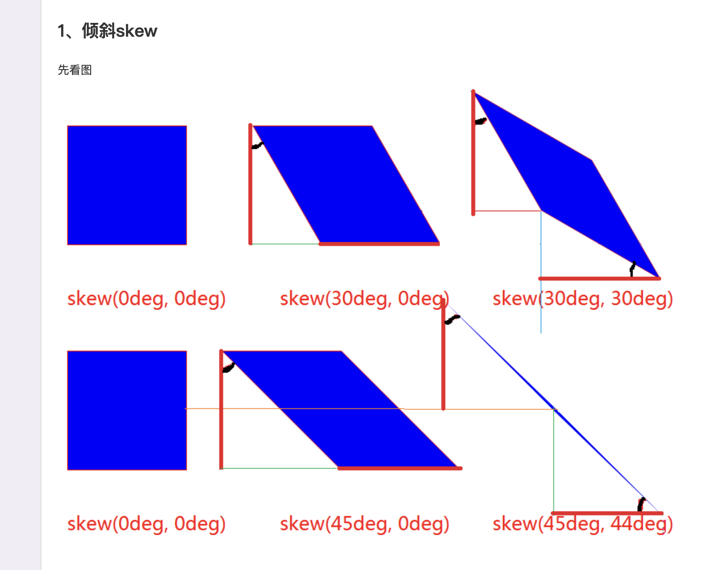
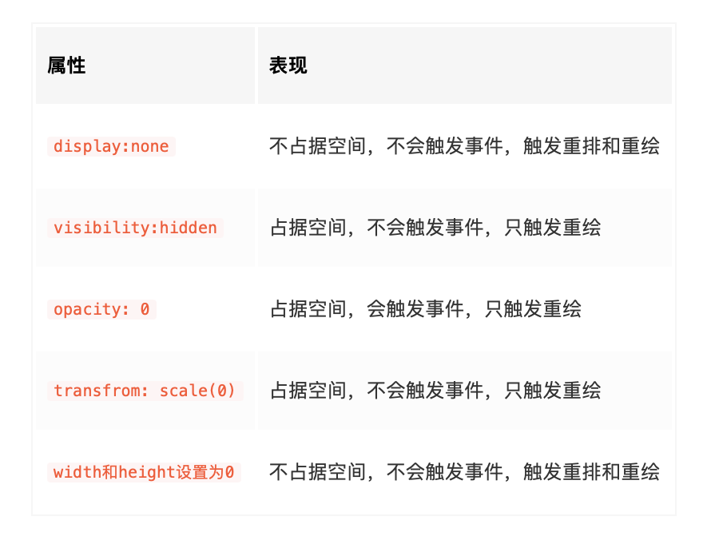

### 1px问题 有几种解决方案
### 0.5px的线 怎么画
1. height: 1px; transform: scaleY(0.5); transform-origin: 50% 100%;
2. `<meta name="viewport" content="width=device-width,initial-scale=0.5">` + rem 实现：将border设置为1px,然后将页面根据设备的dpr缩小相应的倍数，接着将rem放大相应的倍数，这样页面中只有1px的边框缩小了，而其他内容经过缩小和扩大，还是原来的状态。(rem元素大小不变，仅仅是px元素会根据dpr进行缩放) 缺点是页面都要设置为原来的两倍大小
3. height: 1px; background: linear-gradient(0deg, #fff, #000);
4. border-image:url(...) 

### 写个动画，一个盒子，开始时缩放是 0，50%时是 1，100%时是 0，开始结束都是慢速，持续 2 秒，延迟 2 秒，结束后固定在结束的效果

### 如果让你做一个动画，一个地球本身在自转，外面有个飞机围着它转，飞机的螺旋桨自己也在转，有哪些需要考虑的点

### CSS 实现一个扇形 transform: skew
1. 以物体的中心点为origin
2. 坐标轴跟普通坐标轴是不同的，计算机上 向右侧方向的是y轴，向下方向的是x轴
3. skew(x偏移量, y偏移量)
4. 

### 如果实现一个三栏布局，需要三栏占同样的宽度，放多个元素时会自动换行，有哪些做法

### 移动端适配是用 rem 还是 vw？分别的原理是什么？

### css 选择器权重是如何计算的

### 盒模型与DOCTYPE
1. DOCTYPE 是 document type的简称，通知浏览器用什么模式来解析html htm文件
   1. 页面中有DOCTYPE,将采用w3c标准
   2. 页面中没声明，将由浏览器自己决定，IE9以下的将采用IE标准，其他浏览器大多采用w3c标准
2. w3c VS IE 
   1. w3c标准采用 标准盒模型
   2. IE标准采用 怪异盒模型
3. 盒模型：前提，一个页面Block由 content、padding、border、margin 构成
   1. 标准盒模型：width 表示的是content的宽 高也一样
   2. 怪异盒模型：width 表示的是 content+padding+border的宽 高也一样
4. css中box-sizing可以手动设置盒模型
   1. box-sizing:content-box; 相当于标准盒模型
   2. box-sizing:border-box; 相当于怪异盒模型 所以当一个设置了width 且同时设有padding的块，当设置为border-box后，会缩小，因为实际宽度width值从原来的content width + padding 变成了 width 

### BFC VS IFC VS FFC VS GFC
1. 背景
   1. 盒模型 Box：是CSS的布局基本单位。有两种类型：block-level 和 inline-level
      1. block-level: block块级元素
      2. inline-level: inline元素 + inline-block元素
      3. 对比
         1. block 元素 : 默认宽度是父元素的100%  可以设置宽/高/边距
         2. inline 元素 ：默认宽度是自身或自元素自身宽度  不可以设置宽/高/边距
         3. inline-block 元素：可以设置宽/高/边距 其余 跟inline元素都一样  例如img input
   2. Formatting Context：是一个决定如何渲染的容器。 不同的Box类型对应了不同的Formatting context
      1. Blocing Formatting Context: BFC 规定了block-level元素的布局规则
      2. Inline Formatting Context
2. 定义：BFC是一个独立的布局环境，或者说是一个独立的渲染区域，其中的元素布局与外界的布局互不影响
3. BFC的布局规则
   1. 块级元素在垂直方向依次排列
   2. 垂直排列的两个block-box，如果属于同一个BFC,就会发生margin塌陷,即两个元素垂直方向上中间只间隔了一个margin的距离而不是两个
   3. BFC VS Float: 
      1. BFC不与float区域重叠 (双栏布局基于此实现)
      2. 计算BFC高度时，子元素float元素也参与计算
    (背景：正常文档流中，子元素float后，子元素会脱离文档流并且自己成为一个BFC, 此时父元素的表现有：无法包裹子元素，高度撑不起来； 子元素覆盖在父元素之上，父元素局部区域被遮挡； 如果父元素中有文字，文字会围绕在浮动的子元素周围； 如果父元素有backgroud或者border, 只能包含父元素的文字区域，其余区域因为高度撑不起来，而无法覆盖。)
4. 怎么创建BFC
   1. html元素本身是一个BFC
   2. float的值不是none的 即 浮动元素是BFC
   3. 绝对定位元素, 即position 为 absolute 和 fixed 两个脱离文档流的是BFC
   4. overflow的值不是visible 这种方案可能会对页面隐藏或者滚动造成影响
   5. display: flow-root 给父元素设置成一个BFC块，所有的子元素都将在该BFC中参与计算 是替代使用visible:auto的无副作用的优秀方案  名字理解：创造一个类似于根元素(html)的上下文，在在其中进行flow layout
   6. 行内块元素：display:inline-block
   7. 表格元素：display值为 tabel、table-cell、table-row 等
   8. 弹性元素：diaplay值为 flex 等
   9. 网格元素：display值为 grid 等
   10. 多列元素：多列元素的 column-count 或 column-width属性 不为 auto时，创建BFC
   11. 跨列元素：元素设置column-span：all 值为all时，始终会创建一个BFC，无论是否在一个多列元素中
5. 应用：
   1. 解决margin塌陷问题:将相邻元素中的一个变成一个BFC即可
   2. 解决元素浮动后父元素高度塌陷：将父元素变成一个BFC即可
   3. 通过BFC实现两栏自适应布局: 左元素float,右元素设置成为BFC,由于BFC不与Float重叠的特性，可以实现双列布局

### 实现水平居中、垂直居中布局
1. 水平居中
2. 垂直居中 参考链接：https://blog.csdn.net/qq_43677117/article/details/109475579
   1. flex
   2. table-cell
   3. margin + transform
   4. inline-block + vertical-aligin
   5. absolute + 负margin
   6. absolute + margin:auto
   7. absolute + transform
   8. display: grid


### 边距的百分比是根据什么计算的 父元素的宽度？
padding和margin的百分比，无论是垂直方向还是水平方向，都是根据其最近父元素的宽度来计算的。不用父Height计算，是因为子元素的高会撑大父元素的高，再去影响子元素...陷入死循环，所以都用父的width做参照

### 通过css将一个元素向左平移10个像素的方法
1. transition过度 + transform变换(translate是transform的一个方法)
   ```
   .transition {
      transition-property: transform; // 要更改的属性名
      transition-delay: 2s; //延迟执行2s
      transition-timing-function: linear; //直线运动
      transition-duration: 4s; //过渡总时长
   }
   .transition:hover {
      transform: translateX(-50px); // 鼠标悬浮时，向左运动50像素
   }
   ```
2. animation动画 多个transition的组合

### 遇到过什么兼容性问题

### 怎么渲染一个宽度是百分比的图片，自适应的方案是什么，怎么解决图片闪烁问题
1. 原因：宽高自适应的图片闪烁，是因为图片加载后造成重排重绘，所以如果知道图片的宽高比，可以预留出图片的大小
2. 解决高度问题：利用:after伪类，按比例留出高度 
   ```
   // 假设图片宽高比是1:1.3
   .item {
      width: 20px;
      position: relative;    
   }
   .placeholder:after {
      content: '';
      display: block;
      padding-top: 130%; // padding 和 margin 设置百分比时，都是按照父元素的width来设置的。这里使用伪类，就是假设在img后面有一个兄弟dom，那么.item的宽度就是该伪dom的padding-top的基数，而img的宽度是100%，所以高度可以设置成130%
   }
   .img {
      position: absolute;
      width: 100%;
      left: 0;
      top: 0;
   }
   <div class="item placeholder">
      
   </div>
   ```
3. 解决图片加载问题：可以使用prefetch或者preload提前加载


### display:none VS opacity:0  VS visibility:hidden

1. 子元素是否继承 ？？？ 

### 如何通过 contain 属性 控制 重排和重绘
1. 定义：CSS contain 属性允许开发者声明当前元素和它的内容尽可能的独立于 DOM 树的其他部分。这使得浏览器在重新计算布局、样式、绘图、大小或这四项的组合时，只影响到有限的 DOM 区域，而不是整个页面，可以有效改善性能。
2. 应用：这个属性在包含大量独立组件的页面非常实用，它可以防止某个小部件的 CSS 规则改变对页面上的其他东西造成影响
3. 兼容性：目前各浏览器支持的情况还不那么好
4. 用法：
  1.  contain: size 设置该属性的元素的 尺寸不被它的子元素的尺寸影响
  2.  contain: paint 设置了该属性的节点，如果不在视窗内，则该节点和其子元素节点都不必渲染
  3.  contain: layout 表示区域内的变化，不会影响到区域外的重排重绘


### clip

### 三种动画方式

### css模块化

### css布局
1. float
2. flex
3. grid
4. position

### css继承 + 权重

### vh单位


### flex:1 是什么意思
1. flex属性 是 flex-grow、flex-shrink、flex-basis三个属性的缩写。
2. flex-grow：定义项目的的放大比例； 
   1. 默认为0，即 即使存在剩余空间，也不会放大；
   2. 所有项目的flex-grow为1：等分剩余空间（自动放大占位）；
   3. lex-grow为n的项目，占据的空间（放大的比例）是flex-grow为1的n倍。
3. flex-shrink：定义项目的缩小比例；
   1. 默认为1，即 如果空间不足，该项目将缩小
   2. 所有项目的flex-shrink为1：当空间不足时，缩小的比例相同；
   3. flex-shrink为0：空间不足时，该项目不会缩小
   4. flex-shrink为n的项目，空间不足时缩小的比例是flex-shrink为1的n倍。
4. flex-basis： 定义在分配多余空间之前，项目占据的主轴空间（main size），浏览器根据此属性计算主轴是否有多余空间
   1. 默认值为auto，即 项目原本大小
   2. 设置后项目将占据固定空间。
5. flex: *; 不同值组合的不同含义：
   1. flex: 0 1 auto 不放大会缩小 占据默认值
   2. flex: 0 0 auto  不放大也不缩小
   3. flex: 1 1 auto  （放大且缩小）
   4. flex为一个非负数字n： flex：n;  该数字为flex-grow的值 即flex-grow：n； flex-shrink：1； flex-basis：0%；
   5. flex为一个长度或百分比L： flex: L; 视为flex-basis的值，即 flex-grow：0；flex-shrink：1；flex-basis：L；
   6. flex为两个非负数字n1，n2： flex：n1 n2;分别为flex-grow和flex-shrink的值。即  flex-grow：n1；flex-shrink：n2；flex-basis：0%；
   7.  flex为一个非负数字n和一个长度或百分比L：flex：n L； 分别为flex-grow和flex-basis的值， 即 flex-grow：n；flex-shrink：1；flex-basis：L;
6. 所以 flex:1 就是 flex-grow:1; 自动放大占满剩余空间，实现自适应布局。


### css 导入 import 和 link 的区别

### css选择器
1. :root 根选择器匹配文档根元素。在 HTML 中，根元素始终是 html 元素。
2. * 所有元素
3. .类名
   1. .classA.classB: 同时有 classA classB 两个类的元素
   2. .classA .classB: 选择 类名 classA后面 所有类名为 classB 的元素
4. ‘#id名’
5. element 就是Html原生的标签
6. elementA.classA 选择类为classA的标签A
7. element,element: 逗号表示 和 
8. elementA elementB 选择标签A`内部`的所有标签B
9. elementA>elementB 选择父亲是标签A的元素中的标签B, 一层亲父子
10. elementA+elementB 表示跟紧标签A的首个标签B
11. `[attribute]` 带有对应属性的所有元素 也可以`[attribute]=value`
12. ...还有超多

### css中的变量
1. sass： 用 $ 声明
2. less： 用 @ 声明
3. 原生css： 
   1. 用 -- 声明 变量名大小写敏感
      ```
      body{
         --color:red;
         --Color:blue;
         --font-stack: fangsong;
      }
      ```
   2. 用 var(变量, (可选)默认值) 读取变量，只能做属性值，不能做属性名
      ```
      div {
         color: var(--color,);
         color: var(--Color,#545454); //第二个参数可选 //第二个参数不处理内部的逗号或空格，都视作参数的一部分
         --logo-text: var(--font-stack); //读取后用于声明新的变量
         <!-- var(--font-stack):'';  //Error:不能做属性名 -->
      }
      ```
   3. 变量类型
      1. 字符串类型：支持拼接
         ```
         div {
            --bar: 'hello';
            --foo: var(--bar)' world'; // ‘hello word’
         }
         ```
      2. 数值类型： 不能直接与单位连用，必须用calc()函数
         ```
         div {
            --gap: 20;
            <!-- margin-top: var(--gap)px;  //无效 -->
            margin-top: calc(var(--gap) * 1px);
         }
         ``` 
   4. 作用域：
      1. 变量的作用域，就是它所在的选择器的有效范围。所以全局的变量通常放在根元素 :root里面，确保任何选择器都可以读取它们。
      2. 同一个css变量，可以在多处声明。读取的时候，优先级最高的生效。跟 CSS 本身的样式层叠规则是一致的。与JS的作用域不同，注意不要混淆。