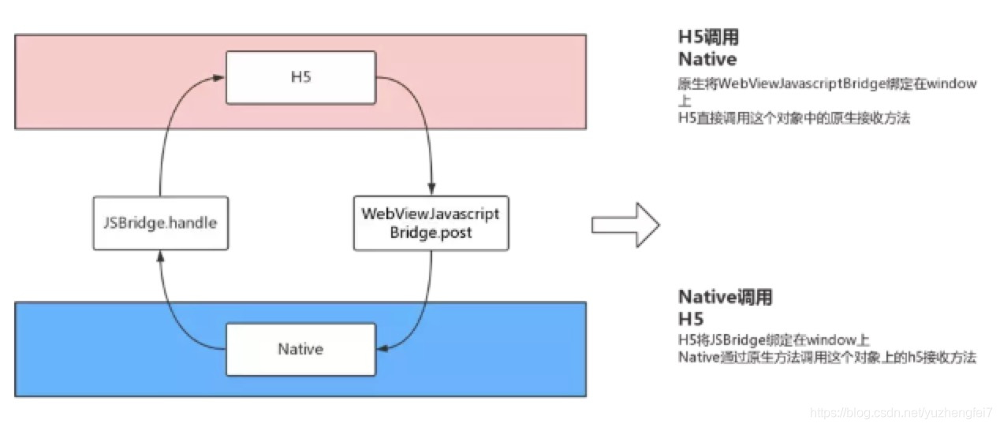
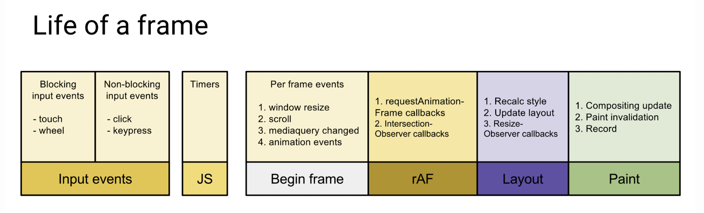
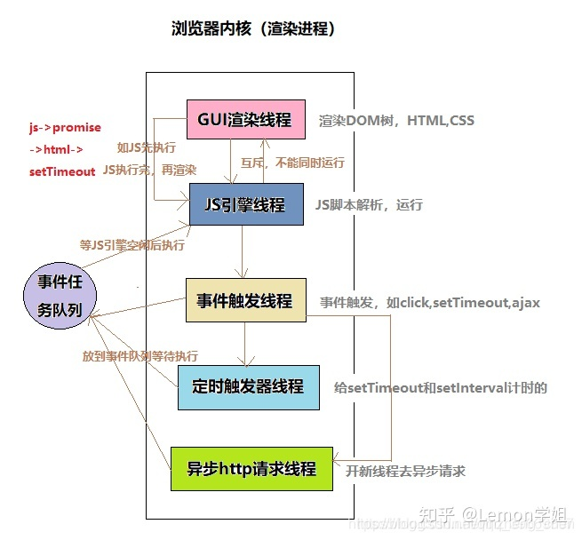
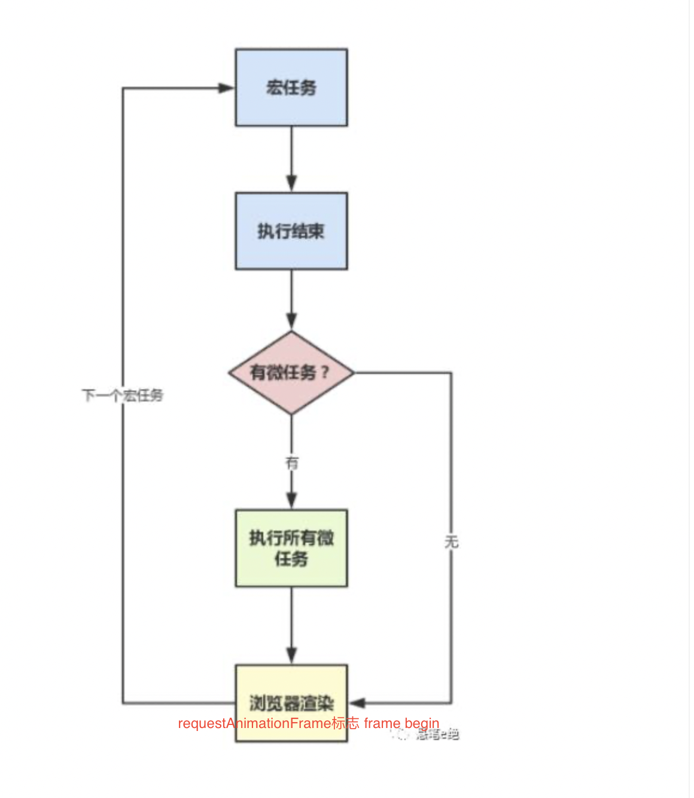

### 编写一个方法，判断一个字符串是否是合法的 XML
```
const str1 = "<html><div>123</div></html>"; // true
const str2 = "<div><div>123</div><div></div></div>"; // true
const str2 = "<html><div>123</html></div>"; // false
```
### V8引擎是什么
V8 是谷歌开源的 JavaScript 引擎，被用于 Chrome 和 Node.js 。程序最终会被 CPU 执行，不同架构 CPU 提供的指令是不同的，而我们写的一套代码需要跑到不同架构的 CPU 上，这就需要 JavaScript 引擎来做这件事情。最初的时候 V8 直接通过 AST 生成对应机器码，后来爆出一堆问题，比如内存占用大、启动时间长等。于是，现在使用的是解释器与编译器混合的JIT技术(Just In Time)

### js是解释型语言还是编译型语言: 解释型
参考链接：https://mp.weixin.qq.com/s/ZJsokYm5EjdHKxUPoRmI6g
1. 编译型语言：
   1. 直接可以转换为计算机处理器可以执行的机器代码，运行编译型语言需要一个 “构建” 的步骤，每次更新了代码你也要重新 “构建” 
   2. 由计算机系统(CPU)来执行。
2. 解释型语言：
   1. 是通过一个解释器逐行解释并执行程序的每个命令
   2. 由解释器执行。
   3. js引擎的工作就是一个解释器，例如常见的V8引擎
3. 机器码：machine code 也叫原生码，是电脑CPU能直接解读的数据(只有0和1)
4. 字节码：byte code 是一种二进制文件，是一种中间码，比机器码更抽象，需要直译器转译后才能成为机器码，被CPU读懂
5. JIT 即时编译技术：采用了解释执行和编译执行这两种方式，V8 采用的就是这种技术。在解释器执行字节码的过程中，如果发现有热点代码，比如一段代码被重复执行多次，这种就称为热点代码，那么后台的编译器就会把该段热点的字节码编译为高效的机器码，然后当再次执行这段被优化的代码时，只需要执行编译后的机器码就可以了，这样就大大提升了代码的执行效率。


### V8是如何执行一段代码的
1. 运行时环境(浏览器orNode环境)：初始化基础运行时环境，包括：堆/栈空间、全局执行上下文、事件循环系统 等
2. 解析器：负责将 JavaScript 代码转换成 AST 抽象语法树 和 执行上下文
   1. 词法分析：将字符序列转换为token序列。token是原文件中不可再分割的最小单元
   2. 语法分析：将token序列根据语法规则转换为AST+执行上下文，所有函数体中的变量和函数参数，都将放进作用域中。
3. 解释器：根据AST+执行上下文，解释器生成字节码、并执行字节码
4. JIT即时编译技术：用到编译器(可选)。 如果代码中有一部分代码重复多次，就会被标记为“热点代码”,由优化编译器在后台将字节码编译成机器码(二进制代码),再执行时就会直接执行机器码而不是字节码；如果热点代码有变化，优化编译器执行“反优化操作”，使下次执行重新由解释器执行


### V8里的内存机制
1. 数据类型：
   1. 基本数据类型 7种：null undefined string number boolean symbol bigint
   2. 引用数据类型 1种：Object (Function函数也是对象)
2. 内存的空间结构：有三种空间
   1. 栈空间：存储调用栈/可执行上下文、基本类型数据。栈不会很大
   2. 堆空间：存放引用类型数据。堆空间很大，是一种树形存储结构
   3. 代码空间：存放可执行代码
3. 堆 VS 栈：
   1. let a = Obj; a存储的是引用类型Obj在堆中的引用地址
   2. let b = 'abc'; b存的是完整复制的原始类型变量


### V8垃圾回收机制
1. 垃圾回收策略的基础是代际假说。代际假说：1.大部分对象都是朝生夕死 2.不死的对象会活得更久
2. V8堆空间结构：
   1. 堆 = 新生代 + 老生代； 
   2. 新生代：用来存放活得短的，空间也较小，只有1-8M；
   3. 老生代：存储活得长的(新生代两次垃圾回收都没被回收的就会放进老生代) + 对象本身很大的。老生代的空间比新生代大得多。
   4. 新生代 = 对象区 + 空间区
      1. 对象区：新加入的对象都会存放到对象区域，当对象区域快被写满时，就需要执行一次垃圾清理操作。对象区一般设置的较小(原因：副垃圾回收器每次执行清理操作时，都需要将存活的对象从对象区域复制到空闲区域，复制操作需要时间成本，如果新生区空间设置得太大了，那么每次清理的时间就会过久，所以为了执行效率，一般新生区的空间会被设置得比较小)
      2. 空闲区：
3. 垃圾回收器 
   1. 副回收器：副回收器负责新生代的垃圾回收
   2. 主回收器：主回收器负责老生代的垃圾回收
4. 垃圾回收总体流程
   1. 总体思想三步走：1. 标记活动/非活动对象 2.回收内存 3.内存整理(内存回收后产生很多内存碎片整理后变成大块的连续内存)
   2. 副回收器：
      1. 在垃圾回收过程中，首先要对对象区域中的垃圾做标记；
      2. 标记完成之后，就进入垃圾清理阶段。副垃圾回收器会把这些存活的对象复制到空闲区域中，同时它还会把这些对象有序地排列起来，所以这个复制过程，也就相当于完成了内存整理操作，复制后空闲区域就没有内存碎片了。
      3. 完成复制后，对象区域与空闲区域进行角色翻转，也就是原来的对象区域变成空闲区域，原来的空闲区域变成了对象区域。这样就完成了垃圾对象的回收操作，同时，这种角色翻转的操作还能让新生代中的这两块区域无限重复使用下去。
      4. 中间有个优化策略：副垃圾回收器还会采用对象晋升策略，也就是移动那些经过两次垃圾回收依然还存活的对象到老生代中
   3. 主回收器：两种回收算法
      1. 标记-清除算法：
         1. 标记过程阶段。标记阶段就是从一组根元素开始，递归遍历这组根元素，在这个遍历过程中，能到达的元素称为活动对象，没有到达的元素就可以判断为垃圾数据
         2. 清除过程：主垃圾回收器会直接将标记为垃圾的数据清理掉。但这样会产生很多内存碎片，所以引入了标记-整理算法。
      2. 标记-整理算法：
         1. 标记过程：标记可回收对象，跟上面一样
         2. 整理过程：不直接清除，而是让所有存活的对象都向一端移动，然后直接清理掉这一端之外的内存。

### 如果在 js 中执行 location.href = url，这个行为有可能会有哪些安全问题


### 如何实现秒开Webview  
1. 打开的同时加载数据 ❓❓❓
2. 缓存webview  ❓❓❓

### 浏览器时间切片

### 浏览器本地缓存

### 浏览器缓存机制


### jsBridge的原理


### 一个页面的性能指标有哪些


### 如何做页面的监控

### 浏览器从输入地址URL之后都做了什么， 重绘 与 回流 

### 各个浏览器包括App端/小程序端WebView的内核都是什么

### 基于DOM画一个扇形，提出方案

### 浏览器在一帧的16ms里要做 2+5 件事：
1. 处理用户输入等交互
2. 执行JS包含EventLoop回调、
3. 帧开始：窗口尺寸变更，页面滚动、媒体查询、动画事件等的处理
4. 调用requestAnimationFrame执行动画、 
   1. 参考链接：实现进度条https://www.jianshu.com/p/d36c161943d9  协同reacthooks实现倒计时https://juejin.cn/post/7022636375136534565 https://baijiahao.baidu.com/s?id=1702088861129925384&wfr=spider&for=pc
   2. 同时调用两次 requestAnimationFrame 会在一帧里执行；在requestAnimationFrame里调用requestAnimationFrame，会放到下一帧里执行。
5. 布局layout加样式css、
6. 绘制渲染paint。
7. 当这些事都做完了还没到16ms,就会执行window.requestIdleCallback方法


### 进程 VS 线程  VS 协程
1. 进程：一个进程就是一个程序的运行实例。详细解释就是，启动一个程序的时候，操作系统会为该程序创建一块内存，用来存放代码、运行中的数据和一个执行任务的主线程，我们把这样的一个运行环境叫进程。
2. 线程：线程是不能单独存在的，它是由进程来启动和管理的，线程是依附于进程的，而进程中使用多线程并行处理能提升运算效率
3. 协程：一个线程也可以拥有多个协程。每一时刻该线程只能执行其中某一个协程,即同一时间只能有一个协程在运行的，其他协程会暂停执行、之后交换执行权。协程不是被操作系统内核所管理，而完全是由程序所控制，（也就是在用户态执行）。这样带来的好处就是性能得到了很大的提升，不会像线程切换那样消耗资源
4. 子例程：子例程是源代码里具有一定独立功能的模块单元。
5. 进程vs进程 进程VS线程 之间的关系
   1. 进程中的任意一线程执行出错，都会导致整个进程的崩溃。
   2. 线程之间共享进程中的数据。
   3. 当一个进程关闭之后，操作系统会回收进程所占用的内存。
   4. 进程之间的内容相互隔离。一个挂了，另一个也不受影响。如果进程之间需要进行数据的通信，这时候，就需要使用用于进程间通信的 IPC 机制了。

### 浏览器 目前多进程架构
1. 进程图：  
2. 进程功能
   1. 1个 browser 主进程：主要负责界面显示、用户交互、子进程管理，同时提供存储等功能
   2. 最多1个 GPU进程：绘制3D CSS，现在普遍用来绘制UI界面 
   3. 1个 Network 网络进程: 负责网络资源加载
   4. 多个 沙箱模式 渲染进程：核心任务是将 HTML、CSS 和 JavaScript 转换为用户可以与之交互的网页，
      1. 排版引擎 Blink 和 JavaScript 引擎 V8 都是运行在该进程中，
      2. 默认情况下，Chrome 会为每个 Tab 标签创建一个渲染进程。
      3. 出于安全考虑，渲染进程都是运行在沙箱模式下。
   5. 多个 插件进程：主要是负责插件的运行，因插件易崩溃，所以需要通过插件进程来隔离，以保证插件进程崩溃不会对浏览器和页面造成影响，每个类型的插件对应一个进程，只有当使用该插件时才创建
3. 打开一个页面，最少有几个进程协同工作：4个。打开 1 个页面至少需要 1 个网络进程、1 个浏览器主进程、1 个 GPU 进程、 1 个渲染进程，共 4 个

### 一个渲染进程的多线程架构
1. 定义：每个tab页面创建一个渲染进程，这个进程内是多线程的，有几个大类线程 
2. 线程图： 
   1. GUI渲染线程：(有的文档里也叫它渲染进程的主线程)负责渲染浏览器界面，解析HTML，CSS，构建DOM树和RenderObject树，布局和绘制等，当界面需要重绘（Repaint）或由于某种操作引发回流(reflow)时，该线程就会执行. 例如window.requestAnimationFrame就属于GUI线程，会在下一次重绘之前调用获取动画计算结果
   2. JS引擎线程：负责执行js脚本，渲染进程无论什么时候都会有一个且只有一个js引擎始终存在，现在大部分用的都是排版引擎 Blink 和 JavaScript 引擎 V8，同步的任务在这个线程中运行，维持一个执行栈，js引擎是单线程的，它一直等待着任务队列中任务的到来，一旦执行栈中的所有同步任务执行完毕（此时JS引擎空闲），就会读取事件线程中的任务队列，将可运行的异步任务添加到可执行栈中，开始执行
   3. 事件队列线程：这个线程管理一个任务队列，即事件循环EventLoop, 将来自其他线程的任务加入到事件队列中等待js引擎线程空闲时处理，(任务可能来自不同线程，例如setTimeout来自定时触发器线程、ajax异步请求来自网络请求线程)
   4. 定时器线程：setInterval与setTimeout所在线程。 所以说浏览器定时计数器并不是由JavaScript引擎线程计数的,因为JavaScript引擎线程是单线程, 如果处于阻塞线程状态就会影响记计时的准确。另外规定要求setTimeout中低于4ms的时间间隔算为4ms。 这个时间间隔后，将事件推入任务队列，然后就等着js引擎空闲时执行了(如果js还是在忙，可能执行时间还会延后哦)
   5. 异步网络请求线程：产生一个xhr连接后会新开一个网络请求线程，监控到xhr的readyState状态变化后，如果设置了处理状态的回调函数，异步线程将回调函数放进事件触发线程中的任务队列中，等待JS引擎线程执行。注意Chrome浏览器对同一域名的请求并发数限制为6
   6. 合成线程：将图层分为图块，这些图块的大小通常是 256x256 或者 512x512，合成线程会按照视口附近的图块来优先生成位图 (位图的使用看下面渲染流程的栅格化过程)
3. 关系：
   1. GUI 与 JS 线程 互斥，一个执行时另一个挂起，
      1. 所以不能让js执行时间过长，会阻塞页面渲染 
      2. 互斥的原因：由于JavaScript是可操纵DOM的，如果在修改这些元素属性同时渲染界面（即JS线程和UI线程同时运行），那么渲染线程前后获得的元素数据就可能不一致了。因此为了防止渲染出现不可预期的结果，浏览器设置GUI渲染线程与JS引擎线程为互斥的关系
   2. 上述5个线程中，只有js引擎线程执行js脚本，3-5这三个线程只负责将满足条件的函数推进事件循环中的任务队列，等待js引擎进程空闲时执行

### EventLoop事件循环 (浏览器环境) 
参考链接：https://baijiahao.baidu.com/s?id=1702088861129925384&wfr=spider&for=pc
1. 处于一个渲染进程中的事件队列线程，维护了一个栈，分为 宏任务 和微任务。
2. 宏任务：
   1. setTimeout
   1. setInterval
   2. messageChannel 
3. 微任务：
   1. Promise (包含promise.then promise.catch promise.finally)
   2. MutationObserver，监控dom节点变化、
   3. window.queueMicrotask 可以创建一个微任务
4. 特殊的任务队列：Animation callbacks 是由 requestAnimationFrame定义的回调，也是一个队列，不属于事件循环
5. 优先级 同步任务 > 微任务 > 宏任务
6. 浏览器执行机制：
   1. 浏览器的事件循环，是在渲染进程中的；
   2. 执行一个宏任务，栈中没有就从事件队列中获取；
   3. 执行过程中如果遇到微任务，就添加到微任务的队列中；
   4. 当前这个宏任务执行完毕后，立即执行当前微任务队列的所有微任务；
   5. 当前宏任务执行完毕，GUI线程接管渲染； 其中这个GUI线程接管后，就执行 requestAnimationFrame ，这也是一帧的开始
   6. 渲染完毕后，JS线程继续接管，开始下一个宏任务；
7. 事件循环与帧的关系：
   1. 
   2. js引擎获得执行权：执行同步代码，从任务队列取出一个宏任务执行，然后执行当前所有微任务，微任务都执行完后才切换执行权。
   3. GUI线程获取执行权，开始新的一帧： requestAnimationFrame、页面布局、渲染，如果这一帧还有空闲时间就执行requestIdleCallback. 这一帧结束后，切换执行权
   4. js引擎获得执行权：再次取出任务队列的一个宏任务、所有微任务。。。
   5. 总结：js线程与GUI线程的一次交接就是一个循环。在每个循环里，浏览器只执行一个宏任务，而微任务要全部执行完才继续循环。如果微任务耗时特别长，那么这一帧内，浏览器刷新的时机就会被阻塞，页面卡顿


### 渲染引擎的渲染执行流程 
(有的文档里说渲染进程的主线程blabla...就是本文中的GUI渲染线程)
1. 构建 DOM 树、
   1. 渲染引擎GUI线程接收到html文件后，由HTML解析器将HTML文本转化成浏览器能懂的树状DOM结构
   2. window.document就是在浏览器环境下，在内存中保存的DOM结构。DOM 和 HTML 内容几乎是一样的，但是和 HTML 不同的是，DOM 是保存在内存中树状结构，可以通过 JavaScript 来查询或修改其内容。
2. 样式计算 calculate style
   1. 渲染引擎GUI线程接收到CSS文本后，将CSS文本转化为浏览器可以理解的styleSheets结构，document.styleSheets 就是样式对象
   2. 将各个数据标准化，比如把rem单位转化为px,将颜色的单词转化为rgb()颜色数值等
   3. 计算每个DOM的css样式
      1. css的继承规则：CSS 继承就是每个 DOM 节点都包含有父节点的样式
      2. css的层叠规则：定义了如何合并来自多个源的属性值
   4. 把css样式结果输出：每个DOM的css都保存在该DOM的ComputedStyle的结构中
3. Layout布局阶段: (传统意义上的布局阶段包括Layout和Layer)
   1. 创建布局：构建一棵可见元素的layoutTree:遍历所有节点，把所有可见的节点加入到布局树中，不可见的元素忽略掉
   2. 布局计算: 计算DOM中可见元素的几何位置
4. Layer分层构建图层树LayerTree, 也属于布局阶段
   1. 因为一些动画、z轴变化等特殊效果，渲染引擎还需要为特定的节点生成专用的图层，并生成一棵对应的图层树（LayerTree）
   2. 图层：
   3. 并不是布局树的每个节点都包含一个图层，如果一个节点没有对应的层，那么这个节点就从属于父节点的图层。但不管怎样，最终每一个节点都会直接或者间接地从属于一个层。
   4. 会被提升为单独图层的2种情况
      1. 拥有层叠上下文属性的元素会被提升为单独的一层，例如不在文档流内的position、opacity透明的元素、css filter滤镜的元素 等。参考链接：https://developer.mozilla.org/zh-CN/docs/Web/CSS/CSS_Positioning/Understanding_z_index/The_stacking_context
      2. 需要裁剪 或 出现滚动条的,会提升为单独的层 例如小区域大内容的overflow:hidden
5. 图层绘制：并非真的绘制，其实是组装一个待绘制指令列表。 完成图层树后，渲染引擎会对图层树中的每个图层拆解成一个个小的绘制指令，再将这些指令按照顺序组成待绘制列表，绘制阶段就是合成并输出待绘制指令列表。 
6. 图层分块: 从这一步开始，下面的操作才是真正的绘制，是由合成线程真正完成的。
   1. 当图层的待绘制指令列表组装好后，渲染引擎中的GUI线程将该列表提交给合成线程。
   2. 合成线程将图层分为图块
7. raster栅格化：
   1. 栅格化是指合成线程将图块转换为位图，图块是栅格化执行的最小单位。合成线程会按照视口附近的图块来优先生成位图
   2. 渲染进程维护了一个栅格化的线程池，所有的图块栅格化都是在线程池内执行的  
   3. 通常，栅格化过程都会使用 GPU 来加速生成。如果使用了GPU,合成线程通过栅格化线程池将图块交给GPU,最终生成位图的操作是在GPU进程中完成的，生成的位图被保存在 GPU 内存中。GPU是单独的进程，这中间涉及跨进程操作。  
   4. GPU完成所有的栅格化之后，将结果返回给合成线程
8. 合成: 
   1. 一旦所有图块都完成栅格化，合成线程执行合并图层，然后将合成的图层提交给browser浏览器主进程。
   2. browser浏览器主进程里面有一个叫 viz 的组件，用来接收合成线程发过来的合成图层，浏览器主进程执行显示合成操作(Display Compositor),就是在内存中将所有的图层合成可以显示的页面图片，最后再将图片显示在屏幕上。
   3. 进程关系：
9. 相关概念
   1.  重排：修改元素的几何位置，触发从Layout、Layer开始的所有后续渲染流水线，开销大
   2.  重绘：修改了styleSheets, 没有几何位置的改变，就不会触发Layout和Layer，直接进入绘制阶段，比重排效率高些
   3.  重绘与重排的关系：重排一定会重绘，重绘不一定重排
   4.  直接合成：有些修改，既不修改布局也不修改样式，将跳过重排重绘，只执行后续的合成操作。例如transform:translate 实现的动画效果，利用了GPU擅长绘制CSS动画的特点，可以在不同位置绘制同一张位图，所以能直接执行合成操作，这样的效率最高
10. 开启GPU硬件加速的属性
    1.  transform
    2.  opacity
    3.  filter
    4. will-change 告知浏览器该元素会有哪些属性发生变化(实验中)
11. 其他优化：
    1.  在内存中操作或缓存起来：在js中统一操作dom 或者缓存dom，之后操作一次dom
    2.  脱离文档流操作：将要修改的dom设置为 绝对定位或者浮动、或者display:none等，目的是脱离文档流，统一操作dom后再放回文档流
    3.  合并css样式修改：多个通过dom.style.*的修改 可以合并成一次 class的覆盖
    4.  通过css的contain属性控制：CSS contain 属性允许开发者声明当前元素和它的内容尽可能的独立于 DOM 树的其他部分。这使得浏览器在重新计算布局、样式、绘图、大小或这四项的组合时，只影响到有限的 DOM 区域，而不是整个页面，可以有效改善性能。这个属性在包含大量独立组件的页面非常实用，它可以防止某个小部件的 CSS 规则改变对页面上的其他东西造成影响(目前各浏览器支持的情况还不那么好)
        1.  contain: size 设置该属性的元素的 尺寸不被它的子元素的尺寸影响
        2.  contain: paint 设置了该属性的节点，如果不在视窗内，则该节点和其子元素节点都不必渲染
        3.  contain: layout 表示区域内的变化，不会影响到区域外的重排重绘


### 主流浏览器引擎前缀:
-webkit- （谷歌，Safari，新版Opera浏览器 ...
-moz- （火狐浏览器）
-o- （旧版Opera浏览器）
-ms- （IE浏览器 和 Edge浏览器）


### 页面上的 加载相关事件  window.load VS document.DOMContentLoaded VS document.readyStateChange
参考：https://juejin.cn/post/6914479519394955271
1. document.DOMContentLoaded 会在 DOM解析完成+同步js脚本执行完 后触发， 此时异步资源、外部资源可能还没加载完。 (外部资源:例如 css、图片、视频、字体、脚本).如果页面上有 用defer 或 async 或 type=module 标识的script脚本，如果在html没解析完就下载完了，则 DOMContentLoaded事件 会在这些下载好的js脚本同步执行完之后才触发
2. window.onload： 上述全部加载完之后才触发。 
3. document.readyStateChange 监听的是document.readyState的状态 三种 loading 正在加载中; interactive表示html解析完毕类似document.DOMContentLoaded; complete 加载完成 类似 window.load 
```
document.addEventListener('DOMContentLoaded', (event) => {
   console.log('DOMContentLoaded'); 
});
window.addEventListener('load', (event) => {
   console.log('load'); 
});
doucument.addEventListender('readyStateChange', ()=>{
   switch(document.readyState){
      case 'laoding':
      case 'interactive':
      case 'complete':
   }
})
<!-- 输出顺序: -->
loading
interactive
DOMContentLoaded
complete
load
```


### 是否阻塞渲染
1. 外部css的加载 不会 阻塞DOM解析 页面中会出现dom标签
2. 外部css的加载 会 阻塞 后面的 DOM渲染 页面中出现的标签中，在css加载后 才会渲染出内容
3. 外部css的加载 不会 阻塞 前面的 DOM渲染， 页面中标签和内容都会正常渲染，css加载完成后会引发重绘
4. 外部CSS的加载 会 阻塞 后面的 JS
5. JS 会 阻塞 后面的 DOM 解析和渲染
6. 视频、图片、字体 等都不会阻塞渲染

### 移动端 click touch tap 的区别
参考：https://www.cnblogs.com/zhuzhenwei918/p/7588553.html
1. click的300ms延迟
2. 多指时 一个手指的离开就会触发touchend
3. tap 的穿透问题

### MessageChannel
1. 定义：js允许使用messageChannel创建一个新的消息通道，并通过它的两个MessagePort 属性发送数据。
2. 用法：
   1. 跨通道通信 port.postMessage(data) 
      ```
      var channel = new MessageChannel();
      var port1 = channel.port1;
      var port2 = channel.port2;
      port1.onmessage = function(event) {
         console.log("port1收到来自port2的数据：" + event.data);
      }
      port2.onmessage = function(event) {
         console.log("port2收到来自port1的数据：" + event.data);
      }
      port1.postMessage("发送给port2");
      port2.postMessage("发送给port1");
      ```
   2. 跨域/跨文档/跨iframe之间通信  window.postMessage(data, origin)
      1. 用法：
         ```
         1. postMessage(data,origin)方法接受两个参数
            data: 要传递的数据，html5规范中提到该参数可以是JavaScript的任意基本类型或可复制的对象，然而并不是所有浏览器都做到了这点儿，部分浏览器只能处理字符串参数，所以我们在传递参数的时候需要使用JSON.stringify()方法对对象参数序列化，在低版本IE中引用json2.js可以实现类似效果。
            origin: 字符串参数，指明目标窗口的源，协议+主机+端口号[+URL]，URL会被忽略，所以可以不写，这个参数是为了安全考虑，postMessage()方法只会将message传递给指定窗口，当然如果愿意也可以建参数设置为”*”，这样可以传递给任意窗口，如果要指定和当前窗口同源的话设置为”/”。
         2. onmessage(event) event对象里有多个属性
            event.data: 传过来的数据
            event.origin: 发送端指定的接收方。只有协议主机端口号三个都符合的才会接受到这条消息
            event.source: 对发送消息的窗口对象的引用; 您可以使用此来在具有不同origin的两个窗口之间建立双向通信
         ```
      2. 消息的发送方为自己： 有两个页面a.html 与 b.html 不同源，在a页面中用iframe加载b, 通过b.contentWindow发送消息到b的域名下的接口，b页面里接收到消息后，再a.window再向a发消息, a页面再接收消息
         ```
         //a.html
         <iframe src="b.html" id="myIframe"></iframe>
         window.onload = () =>{
            let iframe = document.querySelector("#myIfram");
            iframe.contentWindow.postMessage('早上好', "b.html"); // 注意 在 a.html 中用 b_iframe.contentWindow.postMessage
            window.onMessage = (e)=>{
               console.log(e.data); // 中午好
            }
         }
         //b.html
         window.onload = () =>{
            window.onMessage = (e){
               console.log(e.data); // 早上好
               e.source.postMessage('中午好', e.origin );  // 注意 在 b.html 中用 a.window.postMessage
            }
         }
   3. 可以在web_worker之间： ？？？

### 事件
```
preventDefault()    取消事件默认行为，如阻止点击提交按钮时对表单的提交
stopImmediatePropagation()   取消事件冒泡同时阻止当前节点上的事件处理程序被调用
stopPropagation()   取消事件冒泡
cancelBubbe()     取消事件冒泡
returnValue()      取消事件默认行为
```