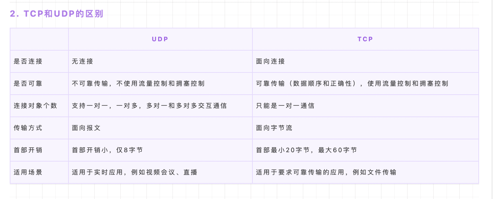

### 

### https 的加解密过程

### https，为什么 https 可以防中间人攻击

### HTTP/1.0  HTTP/1.1  HTTPS/2.0
1. 前提：HTTP是基于TCP协议的，浏览器最快也要第三次握手时才能携带HTTP请求报文，实现真正建立连接。如果这个连接无法复用，就会导致每个请求都要经历三次握手、四次挥手。
2. 版本及问题：
   1. 连接方式 connection：request header中的connection属性可以决定一个TCP连接是在一个HTTP请求后断开还是不断开复用连接。
   2. 在HTTP/1.0 中默认 connection:close 用完就断开。
   3. 在HTTP/1.1中默认 connection:keep-alive 连接可复用。 如果想每次连接完就断开，可以手动设置为close.
      1. 缺点1：HTTP/1.1 存在一个问题，单个 TCP 连接在同一时刻只能处理一个请求，即两个请求的生命周期不能重叠，任意两个 HTTP 请求从开始到结束的时间在同一个 TCP 连接里不能重叠
      2. 缺点2: HTTP/1.1使用管道串行化HTTP-Pipelining试图解决上述问题:一个持久连接的客户端可以在一个连接中发送多个请求,收到请求的服务器必须按照收到请求的顺序返回响应。但还有问题：现代浏览器默认不开启Pipelining,有的代理服务器不能正确处理HTTP Pipelining; 如果队头请求没有处理完，后面的都阻塞了
      3. 缺点3：HTTP/1.1中，对同一Host建立TCP连接，浏览器有自己的限制，例如Chrome浏览器最多同时支持6个
   4. 在HTTPS/2.0中，提供了Multiplexing多路传输特性，可以在一个 TCP 连接中同时并行完成多个 HTTP 请求
      1. 缺点：HTTP2其实是支持明文HTTP请求的，但HTTP/2.0是基于SPDY的，而SPDY强制使用HTTPS。所以目前几个主流浏览器还是支持基于TLS部署的HTTP/2协议。所以如果不能使用HTTPS,就只能使用HTTP/1.1。所以还是先升级为HTTPS再升级HTTP/2比较好
      2. 优点：对同一域名下的请求不管访问多少文件都只建立一路连接，客户端只用一个连接就能加载一个页面。并且Http/2完全能向下兼容Http/1.*的语义。
3. http/1.1的分块传输
   1. 定义：分块传输编码（Chunked transfer encoding）是超文本传输协议（HTTP）中的一种数据传输机制，允许HTTP由网页服务器发送给客户端应用（ 通常是网页浏览器）的数据可以分成多个部分。分块传输编码只在HTTP协议1.1版本（HTTP/1.1）中提供
   2. content-length:“如果head中有Content-Length，那么这个Content-Length既表示实体长度，又表示传输长度。如果实体长度和传输长度不相等（比如说设置了Transfer-Encoding），那么则不能设置Content-Length。如果设置了Transfer-Encoding，那么Content-Length将被忽视”。
   3. Transfer-Encoding 消息首部
      1. Transfer-Encoding 消息首部指明了将 entity 安全传递给用户所采用的编码形式。
      2. Transfer-Encoding 是一个逐跳传输消息首部，即仅应用于两个节点之间的消息传递，而不是所请求的资源本身。
      3. 一个多节点连接中的每一段都可以应用不同的Transfer-Encoding 值。
      4. 如果想要将压缩后的数据应用于整个连接，那么请使用端到端传输消息首部  Content-Encoding 。
      5. 当这个消息首部出现在 HEAD 请求的响应中，而这样的响应没有消息体，那么它其实指的是应用在相应的  GET 请求的应答的值。
   4. 怎么判断传输完成：
      1. 要么直接关闭tcp;
      2. 要么传输的最后一个内容的大小为0，content-length为0
4. HTTPS/2.0的多路复用
   1. 定义：在Http2上，多个请求可以共用一个TCP连接，称为多路复用
   2. stream流：
      1. HTTP/2 长连接中的数据包是不按请求-响应顺序发送的，一个完整的请求或响应称一个数据流stream，
      2. 每个数据流都有一个独一无二的编号，一个流分成的多个数据包可能会分成非连续多次发送。
      3. 数据包发送的时候，都必须标记所属的数据流ID，用来区分它属于哪个数据流。
      4. 另外还规定，客户端发出的数据流，ID一律为奇数，服务器发出的，ID为偶数。
      5. 数据包发送的机制，称为”二进制帧“设计
   3. 多路复用：
      1. HTTP/2虽然依然遵循请求-响应模式，但客户端发送多个请求和服务端给出多个响应的顺序不受限制，这样既避免了"队头堵塞"，又能更快获取响应。
      2. 数据包处理思路：在复用同一个TCP连接时，服务器同时(或先后)收到了A、B两个请求，先回应A请求，但由于处理过程非常耗时，于是就发送A请求已经处理好的部分， 接着回应B请求，完成后，再发送A请求剩下的部分。
      3. HTTP/2.0长连接可以理解成全双工的协议。
      4. 客户端还可以指定数据流的优先级，优先级越高，服务器就会越早响应
   4. 取消发送/中断请求：
      1. HTTP 1.1 取消数据流的唯一方法，就是关闭TCP连接；
      2. HTTP/2 数据流发送到一半的时候，客户端和服务器都可以发送信号 ”RST_STREAM帧” 取消这个数据流。即使取消某一次请求，该TCP连接还打开着，可以被其他请求使用。
5. HTTPS/2 VS http1.1
   1. 内容格式：二进制帧
      1. http1.1采用文本格式，通过换行符进行文本分割；服务器解析 HTTP1.1 的请求时，必须不断地读入字节，直到遇到分隔符 CRLF 为止。
      2. HTTP/2引入二进制数据帧和流的概念，其中帧对数据进行顺序标识，每个帧都有表示帧长度的字段。浏览器收到数据之后，就可以按照序列对数据进行合并，而不会出现合并后数据错乱的情况。同样是因为有了序列，服务器就可以并行的传输数据，这就是流所做的事情。解析速度更快了
   2. 线路：多路复用
      1. HTTP1.1是单路排队连接,有序，阻塞。
      2. HTTP/2是完全多路复用的，即共享连接，非有序，非阻塞的，并行的。
   3. header压缩：HTTP/2 实现了头信息压缩，由于 HTTP 1.1 协议不带状态，每次请求都必须附上所有信息。所以，请求的很多字段都是重复的，比如 Cookie 和 User Agent ，一模一样的内容，每次请求都必须附带，这会浪费很多带宽，也影响速度。HTTP/2 对这一点做了优化，引入了头信息压缩机制。一方面，头信息使用 gzip 或 compress 压缩后再发送；另一方面，客户端和服务器同时维护一张头信息表，所有字段都会存入这个表，生成一个索引号，以后就不发送同样字段了，只发送索引号，这样就能提高速度了。
   4. 服务端推送：HTTP/2让服务器可以将响应主动“推送”到客户端缓存中，在发送页面HTML时主动推送其他资源，而不用等浏览器解析到相应的位置，发起请求后再响应。这个功能是基于 SPDY 协议的。它位于HTTP与SSL之间。 HTTP > SPDY > SSL > TCP
6. HTTP/2.0 VS QUIC
   1. QUIC协议：
      1. 定义： Quick UDP Internet Connections 是由Google提出的一种基于UDP改进的低时延的互联网传输层（其实有疑义，QUIC基于UDP，其实更像应用层协议）协议
      2. 优点：


### 浏览器的本地存储
1. localStorage 持久化缓存 大小5M左右
2. sessionStorage  会话缓存，网页关闭即销毁 几十K
3. coockie 

### 如果 a.com 是我的域名，向 b.com 发请求，带的是哪个域名的 cookie

### 请求头、响应头 常见字段


### RFC


### 说一说长缓存

### 浏览器输入URL后发生了什么 发起请求的全过程 越详细越好
1. 解析URL
2. 缓存判断
3. dns域名解析
4. 获取MAC地址
5. TCP三次握手
6. HTTPS 握手
7. 发起http请求 
   1. 一个HTTP请求报文有请求行（request line）、请求头部（header）、空行、请求数据4个部分
   2. 请求行分为三个部分：请求方法、请求地址和协议版本。 
      1. HTTP/1.1 定义的请求方法有8种：GET、POST、PUT、DELETE、PATCH、HEAD、OPTIONS、TRACE。
      2. 请求地址URL:统一资源定位符，是一种自愿位置的抽象唯一识别方法。组成：<协议>：//<主机>：<端口>/<路径> 注：端口和路径有时可以省略（HTTP默认端口号是80）
      3. 协议版本的格式为：HTTP/主版本号.次版本号，常用的有HTTP/1.0和HTTP/1.1
   3. 请求头部 request-header
   4. 请求数据：可选，比如get请求没有请求数据
8. 反向代理服务器做负载均衡：
   1. 反向代理：
   2. 负载均衡：
   3. 原理：
   4. 常用：Nginx服务器
9. 服务器响应请求
   1. HTTP响应报文主要由状态行、响应头部、空行以及响应数据组成
   2. 状态行由3部分组成，分别为：协议版本，状态码，状态码描述
   3. 响应头部 response-header
   4. 响应数据
10. 返回数据
11. TCP 四次挥手
12. 浏览器接收响应：
   5. 根据connection配置决定是否关闭tcp连接 关闭则四次挥手
   6. 浏览器解析html代码，并请求html中的资源：
   7. 遇到js/css/image等静态资源时，就向服务器端去请求下载（会使用多线程下载，每个浏览器的线程数不一样），这个时候就用上keep-alive特性了，建立一次HTTP连接，可以请求多个资源，下载资源的顺序就是按照代码里的顺序
   8. 在请求资源时，会判断资源是否命中缓存策略(强缓存协商缓存)
13. 将html和请求到的资源渲染

### SSL/TLS 协议
1. 定义： ？
2. 关系： ？
3. 区别：？

### https  VS http 
1. HTTPS协议需要CA证书，费用较高；而HTTP协议不需要；
2. HTTP协议是超文本传输协议，信息是明文传输的，HTTPS则是具有安全性的SSL加密传输协议；
   1. 加密方式：
      1. 对称加密：服务端和客户端共享相同密钥，服务器把对称密钥发送给客户端，不同客户端密钥不同，用对称密钥对明文数据进行加密，服务端维护多个密钥。但是中间人也可以获取对称密钥，还是不安全，所以引入非对称加密，对 对称密钥 进行加密。
      2. 非对称加密：公钥加密的数据，有且只有唯一的私钥才能解密。私钥放在服务端，公钥发送给客户端，客户端信息只能服务器解密。但中间人也可以作为客户端获取公钥，还是能通信，所以，非对称密钥不是对数据加密，是对 给数据加密的对称密钥 加密。一旦确定好双方的身份后，后续数据的加密解密都是由对称密钥来做的
   2. 验证公钥真伪：https协议中身份认证的部分是由CA数字证书完成的，证书由公钥、证书主体、数字签名等内容组成。
      1. 在客户端发起SSL请求后，服务端会将数字证书发给客户端，客户端会对证书进行验证（验证这张证书是否是伪造的？也就是公钥是否是伪造的），如果证书不是伪造的，证书包含合法公钥，客户端就获取用于对称密钥交换的非对称密钥（获取公钥）。
      2. CA数字证书：？？？ 
         1. 参考链接：https://juejin.cn/post/6908327746473033741#heading-24
      3. CA数字证书的作用：
         1. 身份授权。确保浏览器访问的网站是经过CA验证的可信任的网站
         2. 分发公钥。每个数字证书都包含了注册者生成的公钥（验证确保是合法的，非伪造的公钥）。在SSL握手时会通过certificate消息传输给客户端
         3. 验证证书合法性。客户端接收到数字证书后，会对证书合法性进行验证。只有验证通过后的证书，才能够进行后续通信过程
3. 使用不同的连接方式，端口也不同，HTTP协议端口是80，HTTPS协议端口是443；
4. HTTP协议连接很简单，是无状态的；HTTPS协议是有SSL和HTTP协议构建的可进行加密传输、身份认证的网络协议，比HTTP更加安全。


### 文件切片上传下载的原理

### TCP VS UDP
1. 背景
   1. 保护消息边界/保护报文边界：指传输协议把数据当做一条独立的消息在网上传输，接收端一次只能接受一条独立的消息。
2. TCP协议：
   1. 定义是面向连接的、可靠的、基于字节流的运输层通讯协议，不保护报文边界
      1. 三次握手：与服务器建立连接，连接成功后，正式开始传输数据。这个过程中某一环如果没有得到回应，就会重新发送一个相同的包。
         1. Client首先发送一个连接试探，ACK=0 表示确认号无效，SYN = 1 表示这是一个连接请求或连接接受报文，同时表示这个数据报不能携带数据，seq = x 表示Client自己的初始序号（seq = 0 就代表这是第0号包），这时候Client进入syn_sent状态，表示客户端等待服务器的回复
         2. Server监听到连接请求报文后，如同意建立连接，则向Client发送确认。TCP报文首部中的SYN 和 ACK都置1 ，ack = x + 1表示期望收到对方下一个报文段的第一个数据字节序号是x+1，同时表明x为止的所有数据都已正确收到（ack=1其实是ack=0+1,也就是期望客户端的第1个包），seq = y 表示Server 自己的初始序号（seq=0就代表这是服务器这边发出的第0号包）。这时服务器进入syn_rcvd，表示服务器已经收到Client的连接请求，等待client的确认
         3. Client收到确认后还需再次发送确认，同时携带要发送给Server的数据。ACK 置1 表示确认号ack= y + 1 有效（代表期望收到服务器的第1个包），Client自己的序号seq= x + 1（表示这就是我的第1个包，相对于第0个包来说的），一旦收到Client的确认之后，这个TCP连接就进入Established状态，就可以发起http请求了
         4. 
      2. 为什么一定要三次握手：
         1. 为了确认双方的接收能力和发送能力是否都正常。双方都要 发一次数据，接收一次数据，还要验证对方的回复是对的。这样才能确认两方对上暗号，所以这一过程一定会往来“三句话”
         2. 为了确保是真正发起了请求。由于TCP具有重传机制，如果先发一个数据包在网络层滞留了，发送端TCP重传，后滞留包姗姗来迟，服务端先后收到2个包，处理一个后，由于不知道是重传的请求，只会当成新的请求响应，如果不握手三次而是两次握手，那么服务端就会一直处于等待接收数据的状态。
      3. 可靠：
         1. 保证有序：TCP给每个包一个序号，接收端根据序号重新排序，保证数据的完整性和准确性。
         2. 重传机制：基于 时间+确认信息。
            1. 接收端接收到数据实体后，会发回一个相应的确认报文ACK。
            2. TCP在发送端发送一个数据之后，就开启一个定时器，设置一个合理的往返时延(RTT)，若是在这个时间内, 没有收到接收端返回的ACK确认报文，就对该报文进行重传。如果多次重传到一定次数还没有成功,发送端直接丢弃缓冲区的包+发送一个复位信号RST+关闭本次连接，接收端接收到复位信号RST后也不会再发送ACK确认报文。
         3. 拥塞控制：当网络出现拥塞的时候，TCP能够减小向网络注入数据的速率和数量，缓解拥塞
            1. 慢启动：
            2. 拥塞避免
            3. 快速重传
            4. 快速恢复
         4. 提供双全工通道：TCP允许通信双方的应用程序在任何时候都能发送数据。因为TCP连接的两端都设有缓存，用来临时存放双向通信的数据。当然，TCP可以立即发送一个数据段，也可以缓存一段时间以便一次发送更多的数据段
      4. 四次挥手：
         1. 第一次挥手： 若客户端认为数据发送完成，则它需要向服务端发送连接释放请求
         2. 第二次挥手：服务端收到连接释放请求后，会告诉应用层要释放 TCP 链接。然后会发送 ACK 包，并进入 CLOSE_WAIT 状态，此时表明客户端到服务端的连接已经释放，不再接收客户端发的数据了。但是因为 TCP 连接是双向的，所以服务端仍旧可以发送数据给客户端
         3. 第三次挥手：服务端如果此时还有没发完的数据会继续发送，完毕后会向客户端发送连接释放请求，然后服务端便进入 LAST-ACK 状态。
         4. 第四次挥手： 客户端收到释放请求后，向服务端发送确认应答，此时客户端进入 TIME-WAIT 状态。该状态会持续 2MSL（最大段生存期，指报文段在网络中生存的时间，超时会被抛弃） 时间，若该时间段内没有服务端的重发请求的话，就进入 CLOSED 状态。当服务端收到确认应答后，也便进入 CLOSED 状态。最后一次挥手中，客户端会等待一段时间再关闭的原因，是为了防止发送给服务器的确认报文段丢失或者出错，从而导致服务器 端不能正常关闭
         5. 
      5. 为什么要挥手四次呢：
         1. 连接不一定是立刻断开：相比于三次握手，当服务端收到客户端的SYN连接请求报文后，可以直接发送SYN+ACK报文，表示立即响应连接。其中ACK报文是用来应答的，SYN报文是用来同步的。但是关闭连接时，当服务端收到FIN报文时，很可能并不会立即关闭SOCKET，所以只能先回复一个ACK报文，告诉客户端，“你发的FIN报文我收到了”。只有等到我服务端所有的报文都发送完了，我才能发送FIN报文，因此不能一起发送，故需要四次挥手。
         2. TCP是双全工连接，需要双方分别释放与对方的连接。单独一方的连接释放，只代表不能向对方发送数据，连接还处于半释放的状态。
      6. 延迟传送：默认情况下，TCP协议会启用延迟传送算法 Nagle算
      7. 法。 
         1. 发送端：发送端为了更加高效地向接收端发送数据，将多次、间隔时间短、数据量较小 的数据，合并成一个数据量大的数据块，然后进行封包。
         2. 接收端：接收端采用对应的拆包机制来分辨这些数据。
      8. 仅支持一对一传输数据
   2. TCP粘包: 
      1. 定义：是指发送方发送的若干包数据，到达接收方时，粘成了一包。
      2. 从接收缓冲区来看，后一包数据的头紧接着前一包数据的尾
      3. 造成粘包原因多样：
         1. 前提原因：TCP协议不保护报文边界。
         2. 发送方原因：由于 Nagle 算法 延迟发送
         3. 接收方原因：来不及响应的数据包在接收端缓存区粘在一起。TCP接收到数据包时，并不会马上交到应用层进行处理，或者说应用层并不会立即处理。实际上，TCP将接收到的数据包保存在接收缓存里，然后应用程序主动从缓存读取收到的分组。这样一来，如果TCP接收数据包到缓存的速度大于应用程序从缓存中读取数据包的速度，多个包就会被缓存，应用程序就有可能读取到多个首尾相接粘到一起的包。
      4. 何时处理粘包：
         1. 从发送方解决：关闭Nagle延迟传送算法。
         2. 从接收方解决：接收方的应用层中应用程序来不及处理接收到的数据才造成粘包，解决思路就是提高处理能力。
            1. 循环处理：应用程序从接收缓存中读取数据时，读完一条数据就循环读取下一条数据，直到所有数据都处理完
            2. 与发送方约定1：格式化数据，每条数据都有固定格式，每条数据都有一个开始符和结束符。但要注意，每条数据的内容中不能包含这两个符号。
            3. 与发送方约定2：发送每条数据时，将数据长度一并发送。例如规定数据的前4位表示数据的长度。这样应用程序在处理时就可以根据长度判断每个分组的开始和结束位置。
3. UDP: 面向无连接数据传输
   1. 定义：Unreliable Datagram Protocol 不可靠的数据报协议，面向无连接数据传输，是有保护消息边界的。
      1. 发送端：应用层将数据发给传输层，udp属于传输层，发送端发送数据前不会握手，也不会对数据报文做任何拆分和拼接，只标注一下ip后就交给网络层发出
      2. 接收端：网络层将数据传递给传输层，接收端接到报文后发现是个udp协议的数据，将ip报文头去掉后就交给应用层，不会做任何拼接操作，也不会备份
      3. 支持 一对一、一对多、多对多 的传输方式
   2. 用法：UDP只有一个socket接受缓冲区，没有socket发送缓冲区，即只要有数据就发，不管对方是否可以正确接受。而在对方的socket接受缓冲区满了之后，新来的数据报无法进入到socket接受缓冲区，此数据报就会被丢弃，udp是没有流量控制的，故UDP的数据传输是不可靠的
   3. 不靠谱：无连接，想发就发，收到什么数据就传递什么数据，不会备份，也不关心对方是否收到
      1. 不保证消息交付：不确认，不重传，无超时
      2. 不保证交付顺序：不设置包序号，不重排，不会发生队首阻塞
      3. 不跟踪连接状态： 不必建立连接或重启状态机
      4. 不需要拥塞控制： 不内置客户端或网络反馈机制
   4. UDP不会粘包：
      1. 原因1:因为UDP是面向消息的协议，接收端每次提取的都是一个消息。并且UDP数据包有保护消息边界，每个UDP数据包都自带消息头，所以接收端很容易区分数据包
      2. 原因2:UDP传输的是独立的消息，接收端一次只能接收一个数据包，如果一次接收能接收的数据量 小于发送端发来的数据量，那么UDP宁肯丢失一部分数据，也不会分两次接收。
4. TCP VS UDP: 
   1. 适用场景：
      1. TCP:效率要求相对低，但对准确性要求相对高的场景。因为传输中需要对数据确认、重发、排序等操作，相比之下效率没有UDP高。例如：文件传输（准确高要求高、但是速度可以相对慢）、接受邮件、远程登录。
      2. UDP: 效率要求相对高，对准确性要求相对低的场景。例如：QQ聊天、在线视频、网络语音电话（即时通讯，速度要求高，但是出现偶尔断续不是太大问题，并且此处完全不可以使用重发机制）、广播通信（广播、多播）
   2. 粘包问题：TCP有 UDP没有
   3. 

### dns 查询流程 https://time.geekbang.org/column/article/9895
1. 协议：同时使用TCP 和 UDP协议
   1. 在区域传输时使用TCP协议，用于 辅域名服务器向主域名服务器定期更新变动。
   2. 在域名解析的时候使用UDP协议。 域名查询返回的内容一般不超过512字节，用UDP传输即可。不用经过三次握手，负载更低，响应更快。其实也可以使用TCP，但大多数DNS服务器配置时仅支持UDP.
2. 查询顺序
   1. 浏览器缓存：首先会在浏览器的缓存中查找对应的IP地址，如果查找到直接返回，若找不到继续下一步。在chrome浏览器通过chrome://net-internals/#dns 可以查看
   2. 操作系统缓存/本地DNS服务器：将请求发送给本地DNS服务器，在本地域名服务器缓存中查询，如果查找到，就直接将查找结果返回，若找不到就下一步或者直接查找DNS服务器
   3. (可能)路由器缓存、网络运营商服务器等第三方 先查自己的缓存，如果没有，会代替我们去迭代查找域名的dns服务器
   4. dns服务器 查找顺序：
      1. 根域名服务器：向根域名服务器发送请求，根域名服务器会返回一个所查询域的顶级域名服务器地址。
         1. 根域名就是 .com .cn 等共13个根域名，”十三太保“
         2. 各个国家都会在自己境内做多个DNS域名的镜像服务器，所以不存在某一国关闭根域名服务器就导致网络瘫痪的情况。
      2. 顶级域名服务器：向顶级域名服务器发送请求，接受请求的服务器查询自己的缓存，如果有记录，就返回查询结果，如果没有就返回相关的下一级的权威域名服务器的地址
      3. 权威域名服务器：向权威域名服务器发送请求，域名服务器返回对应的结果
   5. 查到结果后 本地DNS服务器会将返回的结果保存在缓存中，方便下次使用
   6. 本地DNS服务器再将结果返回给浏览器
   7. demo：比如要查询 www.baidu.com 的 IP 地址，首先会在浏览器的缓存中查找是否有该域名的缓存，如果不存在就将请求发送到本地的 DNS 服务器中，本地DNS服务器会判断是否存在该域名的缓存，如果不存在，则向根域名服务器发送一个请求，根域名服务器返回负责 .com 的顶级域名服务器的 IP 地址的列表。然后本地 DNS 服务器再向其中一个负责 .com 的顶级域名服务器发送一个请求，负责 .com 的顶级域名服务器返回负责 .baidu 的权威域名服务器的 IP 地址列表。然后本地 DNS 服务器再向其中一个权威域名服务器发送一个请求，最后权威域名服务器返回一个对应的主机名的 IP 地址列表。
3. 查询方法：递归查询+迭代查询
   1. 递归查询：查询请求发出后，域名服务器代为向下一级域名服务器发出请求，最后向用户返回查询的最终结果。使用递归 查询，用户只需要发出一次查询请求
   2. 迭代查询：查询请求后，域名服务器返回单次查询的结果。下一级的查询由用户自己请求。使用迭代查询，用户需要发出 多次的查询请求。这里的用户自己，指的是真正执行查询操作的对象，一般是本地DNS服务器
   3. 总结：一般我们向本地 DNS 服务器发送请求的方式就是递归查询，因为我们只需要发出一次请求，然后本地 DNS 服务器返回给我 们最终的请求结果。而本地 DNS 服务器向其他域名服务器请求的过程是迭代查询的过程，因为每一次域名服务器只返回单次 查询的结果，下一级的查询由本地 DNS 服务器自己进行。


### http状态码
1. 1**
2. 2**
3. 3**: 注意：当用浏览器直接访问资源时会自动重定向，但是如果用ajax局部请求获得301之类的时，无法自动重定向资源
   1. 301 Permanently moved 永久移动：服务端返回一个Location头部字段，浏览器会自动访问新的地址。规范里规定重定向时不得改变原来的访问方法，但各个浏览器的实现不一致，有的post就变成get请求了，所以规定一个新的308状态码，表示不得改变请求方法的永久移动/重定向
   2. 308 Permanently redirect 永久重定向：是301的补充，区别是禁止post请求变成get请求。
   3. 302 Found: 原名是Temporarily moved,表示资源暂时移动了，返回一个Location的头部字段，浏览器自动重定向。规范里规定重定向时不得改变原来的访问方法，但各个浏览器的实现不一致，有的post就变成get请求了。所以规定了303、307两个状态表示临时重定向，两者的区别是重定向时能否改变原来的请求方法
   4. 303 See other: 是302的补充，重定向的post 变成 get
   5. 307 Temprarily redirect: 是302的补充，重定向的post 禁止变成 get
   6. 304 Not modifed: 请求资源还处于缓存期限，可以直接读取缓存
   7. 305 Use agent: 原服务器才能返回的，表示请求必须由代理服务器请求
4. 4**:请求出错
   1. 400 Bad Request 请求报文存在语法错误
   2. 401 Unauthorized没有权限
   3. 402 非正式的错误编号 Payment Required 表示用户请求的内容要求付费
   4. 403 Forbidden 禁止访问
   5. 404 Not Found 无法找到
   6. 405 Method Not Allowed 方法不被允许
5. 5**:服务器出错
   1. 500 Internal Server Error 服务端内部错误
   2. 501 Not Implemented
   3. 502 Bad Gateway
   4. 503 Service Unavailable 
   5. 504 Gateway Timeout 网关超时


### http请求方法
1. methods:
   1. Get 获取资源，参数拼在URL后面，浏览器对长度有限制，不同的浏览器长度不同，不适合大量数据的传输和私密数据
   2. POST、提交数据去创建/修改资源 数据没有大小限制
   3. PUT、上传资源
   4. OPTIONS、返回请求的资源所支持的方法
   5. HEAD、仅请求响应头部
   6. DELETE、请求服务器删除指定资源
   7. TRACE、追查一个请求所经过的所有代理商
   8. CONNECT、
2. get VS post 区别
   1. 请求长度：GET请求时，不同浏览器对URL的长度是有限制的
   2. 请求参数：get直接拼在url上，post有body
   3. 请求次数：所以优先使用Get
      1. GET产生一个TCP数据包，浏览器会把http header和body一并发送出去，服务器响应200(返回数据);
      2. POST产生两个TCP数据包，浏览器先发送请求头header部分，服务器响应100 continue，浏览器再发送请求体body部分，服务器响应200 ok(返回数据)。
      3. 比较：对TCP而言，通信次数越多反而可靠性越低。能在一次连接中传输完所需的信息是最可靠的，所以优先选择Get方法减少网络耗时。如果通信时间增加，通信一直保持连接状态，服务器端的负载可能会增加，可靠性也会降低。
   4. 请求缓存：GET请求会被浏览器主动cache，也可以被bookmark为浏览器书签，也会在history历史记录里保存完整请求参数信息，而POST不会，除非手动设置。
   5. 页面回退：GET在浏览器回退时是无害的，POST会再次提交请求。
   6. 地址编码：GET请求只能进行url编码，而POST支持多种编码方式。
   7. 参数字符：GET只接受ASCII字符的参数的数据类型，而POST没有限制

### 浏览器缓存
1. HTTP缓存：
2. 内存缓存：
3. Service Worker 缓存
4. Push 缓存

### http 304 与 缓存
1. 缓存存在哪：
   1. 浏览器缓存
   2. 内存缓存 memory cache:退出程序时会清除；内存缓存读取更快；空间有限；一般将脚本、字体、图片放在内存中；
   3. 磁盘缓存 disk cache: 退出后不清楚；磁盘没有内存读得快；磁盘空间比内存大；一般非脚本例如css文件会放在磁盘
   4. 读取顺序：会先从内存中找对应的缓存，找不到再找磁盘，再找不到就向服务器重新请求
2. 强缓存：
   1. 定义：浏览器在请求某一资源时，会先获取该资源缓存的header信息，判断是否命中强缓存。 强缓存即强制缓存，是由服务端返回的response header里设置了一系列配置，就是给资源设置个过期时间，客户端每次请求资源时只会看是否过期；只有在过期后，才会去询问服务器，未到时间之前，就算资源更新了，客户端也不会请求服务端
   2. 相关header字段：优先级 cache-control > espires
      1. expires: 值为一个绝对时间，表示在此时间之前，本地缓存有效，
      2. cache-control: 
         1. no-store：优先级最高 任何终端都不会存储
         2. no-cache：一般如果你做了强缓存，只有在强缓存失效了才走协商缓存的，设置了no-cache就不会走强缓存了，每次请求都回询问服务端
         3. max-age:* 表示自请求开始后资源缓存的时长，单位为秒，所以经过计算的缓存失效时间是一个相对值。在此时间之前，请求同样资源会从缓存中拿，但如果用户手动F5刷新，就会想服务器发起http请求
         4. immutable：immutable表示该资源永远不变，但是实际上该资源并不是永远不变，它这么设置的意思是为了让用户在手动刷新页面的时候不要去请求服务器
         5. public:表示可以被浏览器和代理服务器缓存,代理服务器一般可用nginx来做
         6. private：只让客户端可以缓存该资源；代理服务器不缓存
      3. cache-control多个值的组合：
         1. cache-control: max-age=xxxx，public
         客户端和代理服务器都可以缓存该资源；
         客户端在xxx秒的有效期内，如果有请求该资源的需求的话就直接读取缓存,statu code:200 ，如果用户做了刷新操作，就向服务器发起http请求
         1. cache-control: max-age=xxxx，private
         只让客户端可以缓存该资源；代理服务器不缓存
         客户端在xxx秒内直接读取缓存,statu code:200
         1. cache-control: max-age=xxxx，immutable
         客户端在xxx秒的有效期内，如果有请求该资源的需求的话就直接读取缓存,statu code:200 ，即使用户做了刷新操作，也不向服务器发起http请求。 
         1. cache-control: no-cache
         跳过设置强缓存，但是不妨碍设置协商缓存；一般如果你做了强缓存，只有在强缓存失效了才走协商缓存的，设置了no-cache就不会走强缓存了，每次请求都回询问服务端。
         1. cache-control: no-store
         不缓存，这个会让客户端、服务器都不缓存，也就没有所谓的强缓存、协商缓存了。
3. 协商缓存：
   1. 定义：浏览器在请求某一资源时，会先获取该资源缓存的header信息，判断是否命中强缓存，如果没有命中强缓存，就会携带第一次请求返回的有关缓存的header字段信息（Last-Modified/If-Modified-Since和Etag/If-None-Match）由服务器根据请求中的相关header信息来比对结果是否协商缓存命中；若命中，则服务器返回新的响应header信息更新缓存中的对应header信息，但是并不返回资源内容，它会告知浏览器可以直接从缓存获取；否则返回最新的资源内容
   2. 协商过程：
      1. 默认：浏览器默认先判断命中强缓存，之后才判断命中协商缓存
      2. 具体：浏览器发请求、判断资源是否过期、过期了就请求服务器，上次请求返回来 response header 中的 etag和 last-modified，在这次请求时在 request header 就把这属性带上，属性名有变化，if-modified-since属性的值发送last-modified值、if-none-matched属性发送etag值。服务端把接收到的标识与自己存储的对比，判断资源是否更改了，更改了就返回新的资源、状态码200、更新response-header里的etag、last-modified；如果资源没改，就返回304状态码，客户端读取本地缓存。
   3. 相关header字段：
      1. last-modified: 来自服务端。文件的最近修改时间 精确到秒
      2. etag: 来自服务端。相当于文件的hash,只有资源的内容改变，etag才会改变
      3. if-modified-since: 来自客户端，对应last-modified时间。
      4. if-none-matched: 来自客户端，对应etag字符串
   4. 为什么要有etag:
      1. 有的文件可能是周期性的更改，但是内容不变，所以实际上并不需要用户重新请求
      2. 有的文件更改过于频繁时，last-modified只能精确到秒，没办法及时判断文件修改了
      3. 有些服务器不能得到文件的最后修改时间
4. Vary头域：
   1. 定义：Vary告知下游的代理服务器(缓存服务器)，应当如何对以后的请求协议头进行匹配，以决定是否可使用已缓存的响应内容而不是重新从原服务器请求新的内容
   2. 原理：不同的客户端发起的相同的请求，返回的结果可能因为accept-encoding 或者 user-agent等请求头字段的不同而响应不同，当发起一个请求，由真正响应服务器设置vary在response header中，缓存服务器对该接口的响应结果缓存时，会将Vary一起缓存；下一次发起相同的请求，缓存服务器会检查请求头，如果request header里的相关字段能跟缓存中的同一请求的vary指定的头域都匹配，那么这个请求直接取用缓存中的response 而不用真的向真正服务器发起请求。
   3. 常见配置方式
      ```
      Vary: Accept-Encoding 
      Vary: Accept-Encoding,User-Agent 
      Vary: X-Some-Custom-Header,Host 
      Vary: *  //请求头中的所有信息都不可作为是否从缓存服务器拿数据的判断依据。
      ```
5. 304缓存的缺点：搜索引擎蜘蛛会更加青睐内容源更新频繁的网站。通过特定时间内对网站抓取返回的状态码来调节对该网站的抓取频次。若网站在一定时间内一直处于304的状态，那么蜘蛛可能会降低对网站的抓取次数。相反，若网站变化的频率非常之快，每次抓取都能获取新内容，那么日积月累，的回访率也会提高。
   1. 网站快照停止
   2. 收录减少
   3. 权重下降


### 计算机网络的七层模型
1. 物理层：利用传输介质为数据链路层提供物理连接，实现比特流的透明传输。例如电缆、转接头。这一层的数据形式是比特
2. 数据链路层：在不可靠的物理线路上进行数据的可靠传递。例如交换机。为了保证传输，从网络层接收到的数据被分割成特定的可被物理层传输的帧。这一层的数据形式是帧
3. 网络层：将网络地址翻译成对应的物理地址，并决定如何将数据从发送方路由到接收方。例如路由器。这一层的数据形式是数据包
4. 传输层：
   1. 定义：传输协议同时进行流量控制或是基于接收方可接收数据的快慢程度规定适当的发送速率。除此之外，传输层按照网络能处理的最大尺寸将较长的数据包进行强制分割（标记整理成有序的包）。
   2. 简言之，运输层为项目总指挥：主要任务为将大项目分割并标识为有序的小项目、规定项目完成速率。
   3. 工作在传输层的一种服务是TCP/IP协议套中的TCP(传输控制协议)，另一项传输层服务是IPX/SPX协议集的SPX(序列包交换)
5. 会话层：负责在网络中的两节点之间建立、维持和终止通信
6. 表示层：是应用程序和网络之间的翻译官
7. 应用层：应用层直接和应用程序接口并提供常见的网络应用服务。应用层也向表示层发出请求。是开放系统的最高层,是直接为应用进程提供服务的。其作用是在实现多个系统应用进程相互通信的同时，完成一系列业务处理所需的服务
8. 例子：机A向主机B发送数据，该数据的产生肯定是一个应用层的程序产生的，如IE浏览器或者Email的客户端等等。这些程序在应用层需要有不同的接口，IE是浏览网页的使用HTTP协议，那么HTTP应用层为浏览网页的软件留下的网络接口。Email客户端使用smtp和pop3 协议来收发电子邮件，所以smtp和pop3就是应用层为电子邮件的软件留下的接口。
实例：
1、应用层
我们假设A向B发送了一封电子邮件，因此主机A会使用smtp协议来处理该数据，即在数据前加上SMTP的标记，以便使对端在收到后知道使用什么软件来处理该数据。
2、表示层
应用层将数据处理完成后会交给表示层，表示层会进行必要的格式转换，使用一种通信双方都能识别的编码来处理该数据。
同时将处理数据的方法添加在数据中，以便对端知道怎样处理数据。
3、会话层
表示层处理完成后，将数据交给会话层，会话层会在A主机和B主机之间建立一条只用于传输该数据的会话通道，并监视它的连接状态，直到数据同步完成，断开该会话。
注意：A和B之间可以同时有多条会话通道出现，但每一条都和其他的不能混淆。会话层的作用就是有办法来区别不同的会话通道。
4、传输层
会话通道建立后，为了保证数据传输中的可靠性，就需要在数据传输的构成当中对数据进行不要的处理，如分段，编号，差错校验，确认、重传等等。
这些方法的实现必须依赖通信双方的控制，传输层的作用就是在通信双方之间利用上面的会话通道传输控制信息，完成数据的可靠传输。
5、网络层
网络层是实际传输数据的层次，在网络层中必须要将传输层中处理完成的数据再次封装，添加上自己的地址信息和对端接受者的地址信息，并且要在网络中找到一条由自己到接收者最好的路径。然后按照最佳路径发送到网络中。
6、数据链路层
数据链路层将网络层的数据再次进行封装，该层会添加能唯一标识每台设备的地址信息（MAC地址），是这个数据在相邻的两个设备之间一段一段的传输。最终到达目的地。
7、物理层
物理层将数据链路层的数据转换成电流传输的物理线路。
通过物理线路传递的B主机后，B主机会将电信号转换成数据链路层的数据，数据链路层再去掉本层的硬件地址信息和其他的对端添加的内容上交给网络层，网络层同样去掉对端网络层添加的内容后上交给自己的上层。最终数据到达B主机的应用层，应用层看到数据使用smtp协议封装，就知道应用电子邮件的软件来处理。

### TCP/IP 四层协议模型 
参考链接：https://zhuanlan.zhihu.com/p/38240894

1. 链路层：
   1. ARP（地址解析协议）
   2. RARP（逆地址解析协议）
2. 网络层
   1. IP协议:IP是一种网络层协议，提供的是一种不可靠的服务，它只是尽可能https://nextjs.org/快地把分组从源结点送到目的结点，但是并不提供任何可靠性保证。同时被TCP和UDP使用。TCP和UDP的每组数据都通过端系统和每个中间路由器中的IP层在互联网中进行传输
   2. ICMP协议（Internet互联网控制报文协议）ICMP是IP协议的附属协议。IP层用它来与其他主机或路由器交换错误报文和其他重要信息。
   3. IGMP协议（Internet组管理协议）IGMP是Internet组管理协议。它用来把一个UDP数据报多播到多个主机
3. 传输层
   1. TCP（传输控制协议）TCP为两台主机提供高可靠性的数据通信。它所做的工作包括把应用程序交给它的数据分成合适的小块交给下面的网络层，确认接收到的分组，设置发送最后确认分组的超时时钟等。由于运输层提供了高可靠性的端到端的通信，因此应用层可以忽略所有这些细节。为了提供可靠的服务，TCP采用了超时重传、发送和接收端到端的确认分组等机制
   2. UDP（用户数据报协议）UDP则为应用层提供一种非常简单的服务。它只是把称作数据报的分组从一台主机发送到另一台主机，但并不保证该数据报能到达另一端。一个数据报是指从发送方传输到接收方的一个信息单元（例如，发送方指定的一定字节数的信息）。UDP协议任何必需的可靠性必须由应用层来提供。
4. 应用层
   1. HTTP 超文本传输协议
   2. FTP（File Transfer Protocol，文件传输协议）
   3. DNS（Domain Name System，域名系统）


### Cookie VS Session VS LocalStorage
https://www.cnblogs.com/l199616j/p/11195667.html
1. session 保存在服务器端 识别用户
2. cookie 保存在浏览器端 识别用户
3. Cookie VS Session关系：每次HTTP请求的时候，客户端都会发送相应的Cookie信息到服务端。实际上大多数的应用都是用 Cookie 来实现Session跟踪的，第一次创建Session的时候，服务端会在HTTP协议中告诉客户端，需要在 Cookie 里面记录一个Session ID，以后每次请求把这个会话ID发送到服务器，我就知道你是谁了。有人问，如果客户端的浏览器禁用了 Cookie 怎么办？一般这种情况下，会使用一种叫做URL重写的技术来进行会话跟踪，即每次HTTP交互，URL后面都会被附加上一个诸如 sid=xxxxx 这样的参数，服务端据此来识别用户。


### 打开两个页面，一个对localstorage修改，怎么让另一个事实监听
1. 同源的 window.addEventListener('storage', resolveFunction)
2. 不同源的 可以用 messageChannel实现

### 常用的协议及默认端口号
1. http 80
2. https 443
3. ftp 21


### Websocket 介绍一下，它和 http 有什么关系
1. 定义：WebSocket 是一种网络通信协议， 是 HTML5 定义的新协议
2. websocket vs http：
   1. http：基于tcp连接，只能由客户端发起， 如果服务器有连续的状态变化，只能通过客户端轮询，每隔一段时间就发出一个询问。
   2. websocket： 基于Tcp连接，服务器可以主动向客户端推送信息，客户端也可以主动向服务器发送信息，双全工协议，是真正的双向平等对话，属于服务器推送技术的一种
3. 特点：
   1. 可以主动向服务器发送信息，是双全工的协议
   2. 建立在 TCP 协议之上
   3. 默认端口也是80和443
   4. 没有同源限制，客户端可以与任意服务器通信
   5. 可以发送文本，也可以发送二进制数据。
   6. 数据格式比较轻量，性能开销小，通信高效。
   7. 协议标识符是ws（如果加密，则为wss），服务器网址就是 URL。 例如 `ws://example.com:80/some/path`
4. demo:
   ```
   import WebSocket from 'ws; //npm install ws
   var ws = new WebSocket('ws://localhost:8080'); // 生成一个客户端实例
   var server = new WebSocket.Server({port:3000}); // 生成一个服务端实例
   // readyState属性返回实例对象的当前状态
   switch (ws.readyState) {
      case WebSocket.CONNECTING: //值为0，表示正在连接。
         // do something
         break;
      case WebSocket.OPEN: //值为1，表示连接成功，可以通信了。
         // do something
         break;
      case WebSocket.CLOSING: //值为2，表示连接正在关闭。
         // do something
         break;
      case WebSocket.CLOSED: //值为3，表示连接已经关闭，或者打开连接失败。
         // do something
         break;
      default:
         // this never happens
         break;
   }
   // 其他API 客户端的回调函数入参为e 服务端没有
   on('open')
   on('close')
   on('message')
   send
   on('error')
   ```

### 即时通讯 的实现方案
1. 短轮询：浏览器每隔一段时间向浏览器发送 http 请求，服务器端在收到请求后，不论是否有数据更新，都直接进行响应。这种方式实现的即时通信，本质上还是浏览器发送请求，服务器接受请求的一个过程，通过让客户端不断的进行请求，使得客户端能够模拟实时地收到服务器端的数据的变化。
   1. 基于 http 协议
   2. 优点：比较简单，易于理解
   3. 缺点：由于需要不断的建立 http 连接，严重浪费了服务器端和客户端的资源。当用户增加时，服务器端的压力就会变大，这是很不合理的。
2. 长轮询：首先由客户端向服务器发起 http 请求，当服务器收到客户端发来的请求后，服务器端不会直接进行响应，而是先将这个请求挂起，然后判断服务器端数据是否有更新。如果有更新，则进行响应，如果一直没有数据，则到达一定的时间限制才返回。客户端 JavaScript 响应处理函数会在处理完服务器返回的信息后，再次发出请求，重新建立连接。
   1. 基于 http 协议
   2. 优点：和短轮询比起来，它的优点是明显减少了很多不必要的 http 请求次数，相比之下节约了资源
   3. 缺点：连接挂起也会导致资源的浪费
3. SSE 服务端推送事件：Server-sent Events 由服务器使用流信息向客户端推送信息。严格地说，http 协议无法做到服务器主动推送信息。但是，有一种变通方法，就是服务器向客户端声明，接下来要发送的是流信息。也就是说，发送的不是一次性的数据包，而是一个数据流，会连续不断地发送过来。这时，客户端不会关闭连接，会一直等着服务器发过来的新的数据流，视频播放就是这样的例子。SSE 就是利用这种机制，使用流信息向浏览器推送信息。它基于 http 协议。只能由服务端推向客户端，如果客户端向服务端发送数据，那就是下一个http请求了，不属于本次SSE
   1. 基于 http 协议
   2. 优点：不需要建立过多的http连接，节约资源
   3. 缺点：是单全工的协议，只能由服务端推向客户端
   4. SSE 与 HTTP/2.0 的关系：没有关系，可以合作，实现一个基于HTTP的双向连接。 代替基于tcp的WebSocket
4. WebSocket
   1. 基于 tcp 协议 
   2. 基于帧，而不是流
   3. 优点：是双全工的协议
5. 总结：
   1. 前三个都是基于http协议 最后一个是基于tcp协议
   2. 性能：WebSocket > 服务端推送事件（SEE） > 长轮询 > 短轮询
   3. 兼容性：短轮询 > 长轮询 > 服务端推送事件（SEE） > WebSocket
   4. 使用场景：
      1. 多向、低延迟、强事实：使用WebSocket。例如大型的多人在线游戏，在各个连接终端会产生大量的信息，希望尽量少一些例如头部信息这样的数据
      2. 双向、尽量实时：使用HTTP/2.0+SSE。例如显示实时市场新闻，市场数据，聊天程序等等。

### 网络安全
1. 同源策略
   1. 同源的定义：如果两个 URL 的协议、域名和端口都相同，我们就称这两个 URL 同源  
   2. 同源策略：浏览器默认两个相同的源之间是可以相互访问资源和操作 DOM 的。两个不同的源之间若想要相互访问资源或者操作 DOM，那么会有一套基础的安全策略的制约，我们把这称为同源策略。
   3. 本地存储(cookie/sessionStorage/localStorage)都遵循同源政策：cookie:只有用服务器域名设置的 Cookie 才会上传，其他域名的 Cookie 并不会上传，且（跨域）原网页代码中的document.cookie也无法读取服务器域名下的 Cookie. 
   4. 源origin的继承：在页面中通过 about:blank 或 javascript: URL 执行的脚本会继承打开该 URL 的文档的源，因为这些类型的 URL 没有包含源服务器的相关信息
   5. 同源策略有三个方面限制：
      1. DOM：略限制了来自不同源的 JavaScript 脚本对当前 DOM 对象读和写的操作。
      2. web数据安全：限制了不同源的站点读取当前站点的 Cookie、IndexDB、LocalStorage 等数据
      3. 网络：限制了通过 XMLHttpRequest 等方式将站点的数据发送给不同源的站点
   6. 如何解决同源策略的三个方面限制：
      1. 解决DOM限制：messageChannel跨文档消息机制： 解决不同域页面无法相互操作dom的问题，方式是避免直接操作对方dom，改为消息通知的方式。可以通过 window.postMessage 的 JavaScript 接口来和不同源的 DOM 进行通信。
      2. 解决Web数据安全限制： CSP (Content-Security-Policy 内容安全策略): 页面可以引用第三方资源，在页面添加CSP白名单，告诉浏览器来自哪些地址的哪些资源可以用，让浏览器自己决定是否会执行内联js代码，能解决XSS攻击
      3. 解决网络限制：CORS (Cross-Origin-Resource-Sharing 跨域资源共享)：使用该机制可以进行跨域访问控制，需要服务端配合改造
2. 网络攻击：
   1. XSS 攻击(Cross Site Scripting 跨站脚本)
      1. 定义：往 HTML 中或者 DOM 中注入恶意js脚本，在用户浏览页面时利用注入的恶意脚本对用户实施攻击
      2. 恶意js脚本都能怎么攻击：
         1. 窃取 Cookie 信息：document.cookie窃取cookie后发到恶意服务器，然后在其他电脑模拟用户登录，进行转账等
         2. 监听用户行为：例如监听键盘事件，获取登录密码
         3. 修改DOM做假窗口，骗取登陆密码
         4. 生成广告牟利
      3. 恶意js是怎么注入的：
         1. 存储型XSS: 将恶意js提交到目标网站的数据库中，例如利用表单保存用户名是一段恶意js，当下次用户请求了包含该数据的内容，就会执行该恶意js
         2. 反射型XSS: 页面内某些数据依赖URL输入时，服务端根据URL输入的返回相应信息，这些信息后展示在页面上，例如URL中某属性name="abc",页面上展示abc，如果一个恶意脚本使URL变成`name="<script>恶意脚本</script>"`,那么页面打开返回的资源时，就会执行该恶意脚本，这就是反射型XSS
         3. 基于DOM型：在web资源传输过程中将恶意JS存储在DOM中，比如劫持路由器等，修改web页面
      4. 如何阻止XSS：
         1. 思路：但无论是何种类型的 XSS 攻击，它们都有一个共同点，那就是首先往浏览器中注入恶意脚本，然后再通过恶意脚本将用户信息发送至黑客部署的恶意服务器上。所以要阻止 XSS 攻击，我们可以通过阻止恶意 JavaScript 脚本的注入和恶意消息的发送来实现。
         2. 策略：
            1. 服务器对输入脚本将一些关键的字符进行过滤或转码,例如script脚本的尖括号、或者干脆把前端输入的脚本过滤删掉
            2. 利用好CSP
            3. HttpOnly保护Cookie: 由于很多 XSS 攻击都是来盗用 Cookie 的，因此还可以通过使用 HttpOnly 属性来保护我们 Cookie 的安全。使用 HttpOnly 标记的 Cookie 只能使用在 HTTP 请求过程中，所以无法通过 JavaScript 来读取这段 Cookie
   2. CSRF 攻击: (Cross-site request forgery 跨站请求伪造)
      1. 定义：指黑客引诱已登陆用户打开黑客的网站，在黑客的网站中，利用已登陆状态的发起伪造的跨站请求。
      2. CSRF怎么攻击： 
         1. 原理：用户在站点A登录后，站点A服务器返给用户一个cookieA，此时用户打开黑客的第三方站点B,B里的恶意接口也去访问站点A, 浏览器发现访问过站点A了且还登陆中，就会在恶意接口中带上之前站点A给的cookieA(这一步是浏览器默认设置，浏览器的锅)，之后就可以在用户无感知的情况下，在站点B里伪装成用户发请求了。 CSRF攻击之所以能成功，就是因为浏览器会自动带上已经登陆的站点的cookie，所以黑客并不需要拿到cookie在手里,只要访问同一站点，浏览器就会‘帮忙’完成CSRF攻击。
         2. 具体方式
            1. 自动发起 Get 请求：将恶意接口放在不可见的img标签上，打开页面，解析该图片的src，就会自动发起Get请求
            2. 自动发起 POST 请求：构建了一个隐藏的表单，当打开页面后就自动提交该表单发起Post请求
            3. 引诱用户点击链接：例如 `<a href="恶意接口">`
      3. 如何阻止CSRF:
         1. 思路：CSRF 攻击不需要将恶意代码注入用户的页面，仅仅是利用服务器的漏洞和用户的登录状态来实施攻击. 攻击的前提有：网页有同源策略的漏洞(黑客可以在第三方域中用cookieA等信息伪装请求) + 用户正在登陆状态 + 打开了某外链或第三方站点
         2. 策略：
            1. SameSite保护Cookie: SameSite可以设置在哪个站点才能使用cookie (三种设置：仅同源站点、第三方仅get请求使用、都可以) 
            2. 在服务器端验证请求的来源站点：利用HTTP请求头中的Referer和Origin，禁止第三方站点的请求.Origin 属性只包含了域名信息，并没有包含具体的 URL 路径，这是 Origin 和 Referer 的一个主要区别。使用Origin就不会暴露站点的详细路径给服务器了。因此，服务器的策略是优先判断 Origin，如果请求头中没有包含 Origin 属性，再根据实际情况判断是否使用 Referer 值。
            3. CSRF Token：在浏览器向服务器发起请求时，服务器生成一个 CSRF Token植入到返回的页面中,或者放在目标域名下的localstorage中，反正本地存储也是遵循同源策略的。在浏览器端如果要发起请求，那么需要带上页面中的 CSRF Token，然后服务器会验证该 Token 是否合法。如果是从第三方站点发出的请求，那么将无法获取到 CSRF Token 的值，所以即使发出了请求，服务器也会因为 CSRF Token 不正确而拒绝请求。
   3. SYN攻击：
      1. 定义：在三次握手过程中，客户端发出一个SYN、服务器回应一个SYN-ACK之后，在再次收到客户端的ACK之前的TCP连接称为半连接(half-open connect).此时服务器处于Syn_RECV状态.当收到ACK后，服务器转入ESTABLISHED状态.Syn攻击就是 攻击客户端 在短时间内伪造大量不存在的IP地址，向服务器不断地发送syn包，服务器回复确认包，并等待客户的确认，由于源地址是不存在的，服务器需要不断的重发直至超时，这些伪造的SYN包将长时间占用未连接队列，正常的SYN请求被丢弃，目标系统运行缓慢，严重者引起网络堵塞甚至系统瘫痪
      2. 怎么阻止：服务端解决，没研究 ？？
   4. 中间人攻击：
      1. 定义：作为一个中间人，伪造成客户端，与服务端通信劫持公钥；伪装成服务端，给客户端发送一个伪造的公钥。这样用户用伪造公钥发送的请求中间人可以用自己的私钥解密，再用真的公钥加密发送给服务端，之后服务器给客户端的所有数据都是由对称密钥进行加解密，中间人就可以获取所有信息。
      2. 怎么阻止：所以需要验证公钥是否是伪造的。 ？？？
   5. RST攻击：
      1. 定义：服务器A和服务器B之间建立了TCP连接，此时服务器C伪造了一个TCP包发给B，使B异常的断开了与A之间的TCP连接，这就是RST攻击。
      2. 思路1：假定C伪装成A发过去的包，这个包如果是RST包的话，毫无疑问，B将会丢弃与A的缓冲区上所有数据，强制关掉连接；思路2:如果发过去的包是SYN包，B会表示A已经发疯了（与OS的实现有关），正常连接时又来建新连接，B主动向A发个RST包，并在自己这端强制关掉连接；
      3. 如何伪造包：这里有两个关键因素，源端口和序列号。一个TCP连接都是四元组，由源IP+源端口、目标IP+目标端口唯一确定一个连接。所以，如果C要伪造A发给B的包，要在上面提到的IP头和TCP头，把源IP、源端口、目标IP、目标端口都填对。这里B作为服务器，IP和端口是公开的，A是我们要下手的目标，IP当然知道，但A的源端口就不清楚了，因为这可能是A随机生成的。当然，如果能够对常见的OS如windows和linux找出生成source port规律的话，还是可以搞定的。此外，伪造的TCP包里需要填序列号（SeqNum），如果序列号的值不在A之前向B发送时B的滑动窗口内，B是会主动丢弃的。所以我们要找到能落到当时的AB间滑动窗口的序列号。这个可以暴力解决，因为一个sequence长度是32位，取值范围0-4294967296，如果滑动窗口大小为65535的话，则最多只需要发65537（4294967296/65535=65537）个包就能有一个序列号落到滑动窗口内。RST包是很小的，IP头＋TCP头也才40字节，算算我们的带宽就知道这实在只需要几秒钟就能搞定。
3. 解决跨域问题的方案
   1. JSONP 
      1. 原理：利用了使用src引用静态资源时不受跨域限制的机制。带有“src”这个属性的标签都拥有跨域的能力，比如img/iframe/script.动态创建script标签发起请求，然后从后端拿到请求回来的数据进行处理，再然后把刚刚创建的script标签删掉，这就是JSONP的整套流程
      2. 优点：能跨域 && 用户感知不到 && 支持老式浏览器、以向不支持 CORS 的网站请求数据
      3. 缺点：只能get请求、没有错误处理机制不像CORS那样可以对xhr进行onerror、安全问题(后端给来自前端的函数注入数据)
      4. JSONP VS Ajax: Ajax核心是通过XmlHttpRequest获取非本页内容；JSONP：核心是动态添加 script 标签来调用服务器提供的js脚本。
   2. CORS 跨域资源共享Cross-origin resource sharing：
      1. 前因：由于同源策略，浏览器限制脚本内发起跨域HTTP请求。除非响应报文中包含了正确的CORS响应头
      2. 定义：是一种基于HTTP头的机制，它允许浏览器向跨域的服务器，发出XMLHttpRequest请求，从而克服了AJAX只能同源使用的限制。服务器标识一些除了自己以外的origin(域、协议、端口),允许这些origin访问自己
      3. 什么情况需要CORS:
         1. 由 XMLHttpRequest 或 Fetch APIs 发起的跨源 HTTP 请求。
         2. Web 字体 (CSS 中通过 @font-face 使用跨源字体资源)，因此，网站就可以发布 TrueType 字体资源，并只允许已授权网站进行跨站调用。
         3. WebGL 贴图
         4. 使用 drawImage 将 Images/video 画面绘制到 canvas。
         5. 来自图像的 CSS 图形
      4. 分工：整个 CORS 通信过程，都是浏览器自动完成，不需要用户参与。对于开发者来说，CORS 通信与普通的 AJAX 通信没有差别，代码完全一样。浏览器一旦发现 AJAX 请求跨域，就会自动添加一些附加的头信息，有时还会多出一次附加的请求，但用户不会有感知。因此，实现 CORS 通信的关键是服务器。只要服务器实现了 CORS 接口，就可以跨域通信
      5. CORS 两种请求
         1. 简单请求simple request：简单请求就是简单的 HTTP 方法与简单的 HTTP 头信息的结合。满足两个条件：
            1. 请求方法是 head get post之一
            2. http的 request header里 信息不超过以下几个：
               1. Accept
               2. Accept-Language
               3. Content-Language
               4. Last-Event-ID
               5. Content-Type：只限于三个值application/x-www-form-urlencoded、multipart/form-data、text/plain
            3. 浏览器在发起CORS请求时，自动往request header里添加什么信息：
                1. origin：表示本请求来自哪个域。服务器根据这个信息决定是否允许跨域请求。
                   1. 如果origin不在服务器白名单，就返回一个HTTP响应，响应里没有access-control-allow-origin字段。浏览器就知道这是不被允许的，就会抛出一个错误，被XMLHttpRequest的onerror回调函数捕获。注意这种错误不会通过http状态码捕获，返回的code有可能是200.
                   2. 如果origin在服务器白名单，response headerl i就会多出几个信息字段：
                      ```
                      Access-Control-Allow-Origin: http://api.bob.com //必须 表示可接受的域名白名单 或者 任意符* 浏览器自己判断origin是否包含在域名白名单中
                      Access-Control-Allow-Credentials: true //可选 boolean值表示服务端是否允许浏览器发送Cookie. 因为默认情况下CORS不包含Cookie信息 只能设置为true 否则不返回这个字段
                      Access-Control-Expose-Headers: FooBar  //该字段可选。CORS 请求时，XMLHttpRequest对象的getResponseHeader()方法只能拿到6个服务器返回的基本字段：Cache-Control、Content-Language、Content-Type、Expires、Last-Modified、Pragma。如果想拿到其他字段，就必须在Access-Control-Expose-Headers里面指定。上面的例子指定，getResponseHeader('FooBar')可以返回FooBar字段的值
                      Content-Type: text/html; charset=utf-8
                      ```
                   3. 注意：如果要发送 Cookie，Access-Control-Allow-Origin就不能设为星号，必须指定明确的、与请求网页一致的域名。同时Cookie的使用依然遵守同源策略。
                2. withCredentials:true/false. 通知浏览器是否给这个请求携带Cookie. CORS 请求默认不包含 Cookie 信息（以及 HTTP 认证信息等）。如果需要包含 Cookie 信息，一方面要服务器同意，指定Access-Control-Allow-Credentials字段;另一方面，开发者必须在 AJAX 请求中打开withCredentials属性
                   ```
                   var xhr = new XMLHttpRequest();
                   xhr.withCredentials = true;
                   ```
         2. 非简单请求not-so-simple request：不能同时满足上述两个条件的都是非简单请求，会先发起一个预请求。例如请求方法是PUT或DELETE，或者Content-Type字段的类型是application/json
         3. 预检请求 preflight request：浏览器在正式通信之前，增加一次 HTTP 查询请求。使用OPTIONS方法发起一个预检请求，
            1. 浏览器给预检的request header里的放入的字段：
               ```
               Origin: http://api.bob.com   
               Access-Control-Request-Method: PUT //必须 声明真正的CORS请求里会用哪些HTTP方法
               Access-Control-Request-Headers: X-Custom-Header //指定浏览器 CORS 请求会额外发送的头信息字段 用逗号分隔的字符串
               ```
            2. 浏览器接收到OPTIONS方法的请求后，检查Origin、Access-Control-Request-Method和Access-Control-Request-Headers字段，判断是否通过预检请求。如果服务器否定了“预检”请求，会返回一个正常的 HTTP 回应，但是没有任何 CORS 相关的头信息字或者明确表示请求不符合条件。浏览器就会认定，服务器不同意预检请求，因此触发一个错误，被XMLHttpRequest对象的onerror回调函数捕获。
            3. 服务器回应的其他 CORS 相关字段如：
               ```
               Access-Control-Allow-Methods: GET, POST, PUT  //该字段必需，它的值是逗号分隔的一个字符串，表明服务器支持的所有跨域请求的方法。注意，返回的是所有支持的方法，而不单是浏览器请求的那个方法。这是为了避免多次“预检”请求
               Access-Control-Allow-Headers: X-Custom-Header  //如果浏览器请求包括Access-Control-Request-Headers字段，则Access-Control-Allow-Headers字段是必需的。它也是一个逗号分隔的字符串，表明服务器支持的所有头信息字段，不限于浏览器在“预检”中请求的字段
               Access-Control-Allow-Credentials: true  ////可选 boolean值表示服务端是否允许浏览器发送Cookie. 因为默认情况下CORS不包含Cookie信息 只能设置为true 否则不返回这个字段
               Access-Control-Max-Age: 1728000  //该字段可选，用来指定本次预检请求的有效期，单位为秒。上面结果中，有效期是20天（1728000秒），即允许缓存该条回应1728000秒（即20天），在此期间，不用发出另一条预检请求
               ```
   3. messageChannel + 父子iframe跨域：
      1. 原理：有两个页面a.html 与 b.html 不同源，通过在a页面中 用 iframe加载b, 通过b页面的contentWindow发送消息到b的域名下的接口，b页面里接收到消息后，亦可用a的window的引用再向a发消息
      2. demo:
      ```
      //a.html
      <iframe src="b.html" id="myIframe"></iframe>
      window.onload = () =>{
         let iframe = document.querySelector("#myIfram");
         iframe.contentWindow.postMessage('早上好', "b.html");  // 注意 在 a.html 中用 b_iframe.contentWindow.postMessage
         window.onMessage = (e)=>{
            console.log(e.data); // 中午好
         }
      }
      //b.html
      window.onload = () =>{
         window.onMessage = (e){
            console.log(e.data); // 早上好
            e.source.postMessage('中午好', e.origin );  // 注意 在 b.html 中用 a.window.postMessage
         }
      }
      ```
   4. document.domain + 父子iframe跨域：
      1. 原理：一级域名 或 二级域名 相同的页面中，如果都声明了 document.domain = "共同的域名", 那么这些 子域页面之间的通信，是可跨域的
      2. 注意：只支持 都在相同的 一级域名 或 二级域名， 如果三级域名相同，仍然不支持跨域
      3. demo: 
         ```
         // f1.baidu.com/a.html
         <iframe src="f2.baidu.com/b.html" id="iframe"></iframe>
         document.domain = "baidu.com"; // 如果这句话不写，那iframe.contentWindow.a 的结果是 not allowd cross origin 报错 禁止跨域
         let iframe = document.getElementById('iframe')
         console.log(iframe.contentWindow.a );   // 123

         // f2.baidu.com/b.html
         document.domain = "baidu.com";
         window.onload = ()=>{
            var a = 123;
         }
         ```
   5. window.name  + 父子iframe跨域：
      1. 参考链接：https://www.bilibili.com/video/av82067703?p=9
      2. 原理：
   6. location.hash + 父子iframe跨域：
      1. 原理： 页面通过引入iframe的形式 通过iframe.src="url#hash"发送hash值 被引用的页面通过 location.hash得到传递的值。 通过三个页面互相调用，可以实现互相通信。中间页面的关键代码是`window.parent.parent.location.hash = location.hash;`
   7. webpack 里的 proxy 代理服务器支持配置
   8. websocket： 天然就支持跨域
   9. nginx代理跨域
   10. nodejs代理跨域

### Nginx反向代理服务器做负载均衡
1. 正向代理：
   1. 代理的是客户端，服务器不知道响应给了哪个客户端
   2. 理解：A向C借钱、C不肯，A就通过B向C借钱，C并不知道钱实际是给了A，此时B就是A的代理人，
   3. 应用：VPN:在国外架设一台服务器，国内请求代理服务器，代理服务器请求目标服务器，目标服务器返回数据给代理服务器，代理把数据返回给客户。这个代理服务器就是一个正向代理
2. 反向代理：
   1. 代理的是服务器，客户端不知道是哪个服务器响应的
   2. 理解：拨电话给联通客服，只需要拨打10010就行，总机会有人把电话分配给空闲的客服人员，总机这个角色，就是一个反向代理服务器。
   3. 应用：Nginx就是性能很好的反向代理服务器，用来做负载均衡。将接收到的网络请求，分发到某一台真正的服务器处理请求并返回响应

### 安全JWT


### 双全工模式
是指在发送消息的时候还能接收消息

### RESTful 
1. 定义：是一种基于网络的架构设计
2. 名称：REST 是 Representational State Transfer 的缩写， 表现层状态转化
   1. Resource 资源 网络请求的任何实体都是资源 在restful命名时忽略了这个缩写。每个资源对应一个URI(统一资源定位符), 所谓的请求资源，就是调用资源对应的URI，实现客户端与服务端上资源的互动。
   2. Representation 表现层 即 Resouce 资源的形式，体现为不同资源的后缀格式不同，例如 图片有.jpg .png 文本有 .txt .html .md 等。
   3. State Transfer 状态转移 表示客户端与服务端的互动过程。由于http是无状态协议，资源的状态只能由服务端控制，客户端无法直接操控资源，只能通过http协议里的四个请求，来间接操作资源状态的转移。get用来获取资源、post用来新建资源、put用来更新资源、delete用来删除资源
3. 总结：
   1. 每一个URI代表一种资源；
   2. 客户端和服务器之间，传递这种资源的某种表现层；
   3. 客户端通过四个HTTP动词，对服务器端资源进行操作，实现"表现层状态转化"。
4. 个人理解：服务端中不同的资源对应不同的URI,客户端通过不同的http请求方法实现对资源的不同互动方式。


### fetch
1. 定义：是随Es6发布的一种异步网络请求方式。 基于Promise设计和实现，也可以使用then catch、async/await等方法
2. 与ajax的关系：ajax是基于XMRHttpRequest实现的，但fetch是原生js的实现，与xhr没有关系
3. 与xhr的区别:
   1. 对cookie的处理不同：不会发送跨域cookie
   2. 对http code状态码的处理不同：只有网络问题会使请求失败返回的promise自动reject，否则都请求成功。返回的promise的状态取决于code。对于cod‘2**’的都自动resolve(true);对于非2**的状态码，都自动resolve(false);
   3. 不支持中断请求abort，可以借助AbortController实现
4. Demo：
   ```
   // 响应response只是一个 HTTP 响应，而不是真的 JSON。为了获取JSON的内容，我们需要使用 json() 方法
   fetch(
      'http://example.com/movies.json',
      {
         method:'post',
         headers: {
            'Content-Type': 'application/json'
         },
         body: JSON.stringify({age:123}})
      })
      .then(response => response.json())
      .then(data => console.log(data))
      .catch(error => console.log(error))
   ```
5. 请求超时控制: 当超过10秒就取消请求
   ```
   // 思路：利用Promise.race来控制执行，用AbortController的AbortSignal控制断开请求
   let controller = new AbortController();
   let signal = controller.signal; // AbortSignal
   // 辅助请求
   let timeoutPromise = (timeout) => {
      return new Promise((resolve, reject) => {
         setTimeout(() => {
               resolve(new Response("timeout", { status: 504, statusText: "timeout " }));
               controller.abort(); //当 abort() 被调用时，绑定了signal的网络请求即requestPromise 将 reject 一个名为 AbortError 的 DOMException
         }, timeout);
      });
   }
   // 目标请求
   let requestPromise = (url) => {
      return fetch(url, {
         signal: signal  // AbortSignal传入到fetch的第二个参数中
      });
   };
   Promise.race([timeoutPromise(10000), requestPromise("https://www.baidu.com")])
      .then(resp => {
         console.log(resp);
      })
      .catch(error => {
         console.log(error);
      });
   ```

### 跨域
第一种方式：jsonp请求；jsonp的原理是利用<script>标签的跨域特性，可以不受限制地从其他域中加载资源，类似的标签还有.
第二种方式：document.domain；这种方式用在主域名相同子域名不同的跨域访问中
第三种方式：window.name；window的name属性有个特征：在一个窗口(window)的生命周期内,窗口载入的所有的页面都是共享一个window.name的，每个页面对window.name都有读写的权限，window.name是持久存在一个窗口载入过的所有页面中的，并不会因新页面的载入而进行重置。
第四种方式：window.postMessage；window.postMessages是html5中实现跨域访问的一种新方式，可以使用它来向其它的window对象发送消息，无论这个window对象是属于同源或不同源。
第五种方式：CORS；CORS背后的基本思想，就是使用自定义的HTTP头部让浏览器与服务器进行沟通，从而决定请求或响应是应该成功还是应该失败。
第六种方式：Web Sockets；web sockets原理：在JS创建了web socket之后，会有一个HTTP请求发送到浏览器以发起连接。取得服务器响应后，建立的连接会使用HTTP升级从HTTP协议交换为web sockt协议。


### 大文件分片上传原理 断点续传原理
