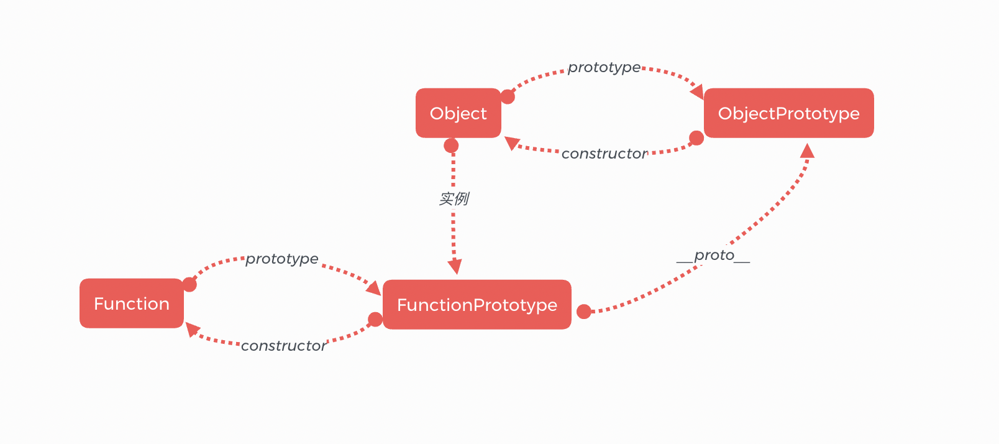
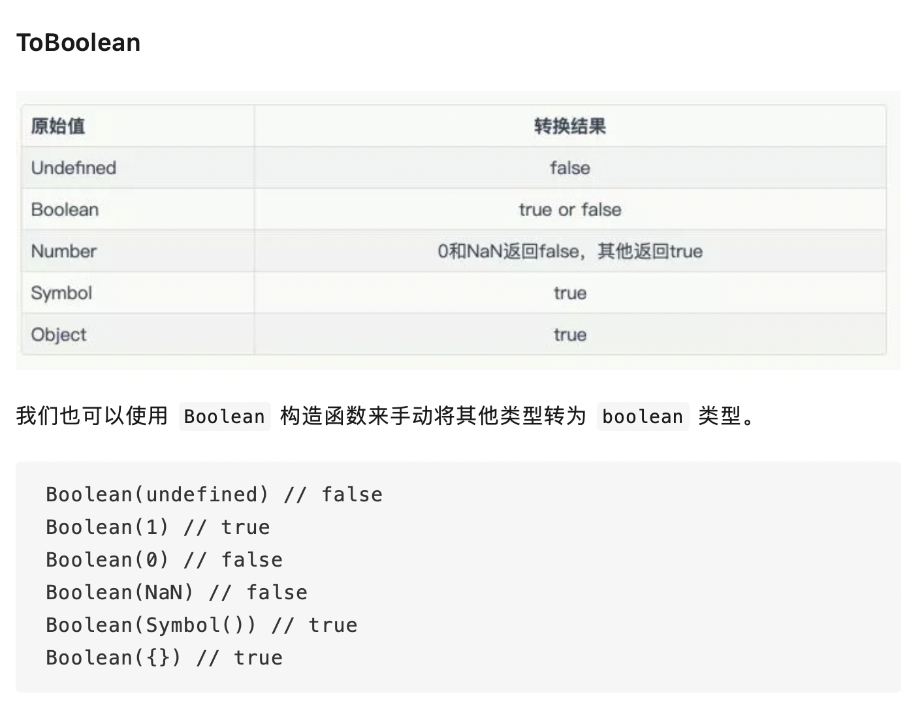
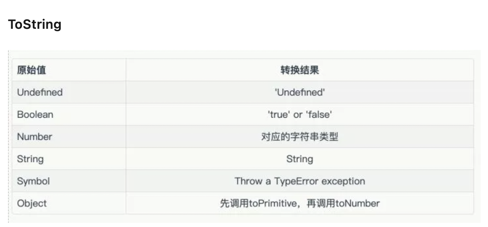
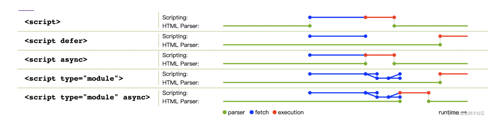
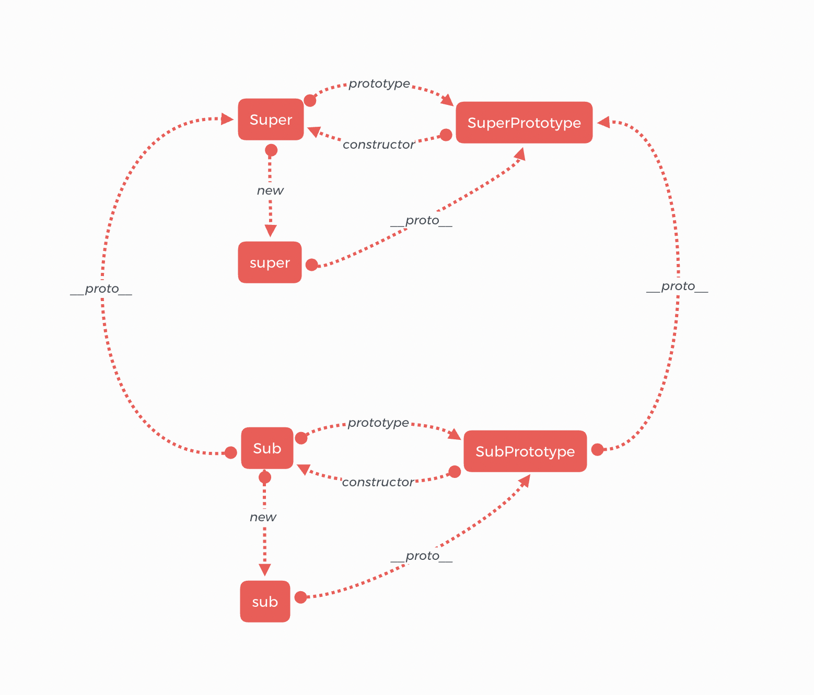

## Javascript
## 参考面经
`https://mp.weixin.qq.com/s/o9v3q88Ga8shNh1RyZRetQ`


### JS 中的基本数据类型 及 判断方式
1. 原始类型 与 原始类型的包装类
   1. 原始类型 primitive type
      1. Undefined 类型的值 为 undefined. typeof undefined // 'undefined'
      2. Null 类型的值 为 null. typeof null // 'object' 这里注意，表示一个空对象指针
      3. String 类型 typeof 'abc' //'string'
      4. Number 类型 typeof 123 // 'number'
      5. Boolean 类型 typeof true // 'boolean'
      6. BigInt 类型 typeof 52n // 'bigint'
      7. Symbol 类型 typeof Symbol() // 'symbol'
   2. 易错点：typeof NULL; //'undefined' js中类型是区分大小写的，并没有NULL这个类型，就当成一个自定义的变量，所以typeof的结果是未定义
   3. 三个原始类型的包装类: 这三个类型都可以使用 ins = new Fn()来得到实例，得到的实例是对象类型 typeof ins // 'object'
      1. String
      2. Number
      3. Boolean
   4. 原始类型 VS 原始类型包装类 VS 包装类构造函数 VS 转型函数 
      1. 基础类型能调用方法的本质：后台自动创建对应包装类实例、调用方法后删除实例
        ```
        let str = 'abc';
        typeof str; // ‘string'
        let s = str.substring(2); // 基础类型值调用方法
        // 当js引擎发现要读取一个原始类型值的方法，实际上做了这些：
        let str = new String('abc'); //自动用该原始类型对应的包装类创建一个实例 该实例只存在于执行代码的瞬间，之后立刻就被销毁掉了
        typeof str; // 'object'
        let s = str.substring(3); //调用实例上的指定方法
        str = null; //销毁包装类实例
        ```
      2. 包装类 VS 引用类型 生成实例
      ```
      // 包装类型产生的实例只存在于执行代码的瞬间，之后立刻就被销毁掉了
      let str = 'abc';
      str.age = 1;  // 给基本类型添加属性，先自动创建一个包装类对象，添加属性后销毁
      typeof str // 'string' 此时包装类对象已经销毁

      // 显示调用包装类
      let str = new String('abc');
      typeof str; // 'object'

      // 引用类型生成的实例 会一直保存在内存中，直到函数调用栈弹出，执行上下文被销毁
      let str = new Object('abc'); // Object构造函数会根据传入值的类型返回相应基本包装类型的实例
      str instanceof String; // true
      typeof str; // 'object'
      ```
      1. 转型函数 VS new构造函数
      ```

      // 转型函数
      let str = String(123); // "123"
      typeof str // 'string'
      str instanceof String; // false
        // new 实例
        let str = new String(123); "123"
        typeof str // 'object'
        str instanceof String; // true
      ```
      1. 建议：不要显示第调用包装类生成对象，容易让人分不清在处理原始基本类型还是引用类型的值
2. 唯一引用类型：Object。 
   1. Object 类型派生了一系列类型 2-8 用typeof 求类型都是 'object'
      1. Function 函数类型 有点特殊 typeof ()=>{} // ‘function' 
      2. Array 数组类型 [] instanceof Array // true 更建议使用Array.isArray(arr)
      3. Date 日期类型  new Date() instanceof Date //true
      4. RegExp 正则类型 new RegExp() instanceof RegExp //true
      5. Error 错误类型 new Error() instanceof Error //true
      6. Set  new Set() instanceof Set // true
      7. WeakSet  new WeakSet() instanceof WeakSet // true
      8. Map  new Map() instanceof Map // true
      9. WeakMap  new WeakMap() instanceof WeakMap // true
   2. 判断原型及派生原型的方法：所有原型链上出现过的原型都会被判为true
      1. 实例 instanceof 原型 new Array() instanceOf Array //true
      2. 原型.isPrototypeOf(实例) Array.prototype.isPrototypeOf(new Array()) //true
   3. 易错点： typeof function(){} == typeof class A{}; //true 都是'function'
   4. 给对象添加属性时，用到一个对象描述符 descriptor 有4个属性 + 2个方法
      1. configurable：当且仅当该属性的 configurable 键值为 true 时，该属性的描述符才能够被改变，同时该属性也能从对应的对象上被删除。默认为 false。
      2. enumerable：当且仅当该属性的 enumerable 键值为 true 时，该属性才会出现在对象的枚举属性中。默认为 false
      3. writable：当且仅当该属性的 writable 键值为 true 时，属性的值，也就是上面的 value，才能被赋值运算符改变。默认为 false。
      4. value：该属性对应的值。可以是任何有效的 JavaScript 值（数值，对象，函数等）。默认为 undefined。
      5. get(){} 当读取该属性时，会调用get方法。 函数默认为 undefined。
      6. set(v){} 当给该属性赋值，会调用set方法。 函数默认为 undefined。


### Object
1. Object.defineProperty
   1. 定义：定义对象的某个属性 Object.defineProperty(target, property, descriptor);
   2. 缺点：不能监听数组的下标变化，怎么解决:可以用Proxy
   3. 代码：
      ```
      var Obj = {}
      Object.defineProperty(Obj, 'a', {
          get: function () {
              console.log('get');
              return v
          },
          set: function (val) {
              console.log('set');
              v = val
          }
      });
      Obj.a = [] 		// set
      Obj.a.push('1') 	// get（缺点,没存进去）下标问题
      Obj.a[0] = 1 	// get（缺点,没存进去）
      Obj.a.pop(1) 	// get（缺点,没存进去）
      Obj.a = [1, 2, 3] // set
      ============================================================
      var arr = [];
      var p = new Proxy(arr, {
          get: (target, key) => {
              console.log('get')
              return key in target ? target[key] : undefined
          },
          set: (target, key, value) => {
              console.log('set')
              target[key] = value
              return true
          }
      })
      p.push(1);  // 此时浏览器会打印 get get set set 各自被调用了两次，分别是：get数组的push方法 get数组的length set数组元素值 set数组长度
      ```
2. 


### ES5函数中的一些特殊对象都是什么
#### 除了自定义的属性方法外，这些凭空出现的可用属性都是从原型链上继承的
1. 属性 length： 表示函数定义时，希望传入的参数的个数
2. 对象 arguments //直接用 包含函数执行时实际收到的所有参数的类数组对象
3. arguments.callee // 是函数参数对象的属性，是指向拥有arguments的函数自身, 这样可以解藕对函数名的依赖
   ```
   funtion a(){ 
     arguments.callee == a;  //true 
    }
   ```
4. 函数.caller // 是函数对象的属性，指向调用当前函数的函数, 用来追踪函数的调用链。在严格模式下禁用，因为会暴露源码。如果在顶层window中调用，会返回null
   ```
   function b(){ 
     console.log(b.caller); //打印调用当前函数的函数体
   } 
   function c(){ 
     b() 
    }; 
    c(); //会打印函数c的源代码 
    b(); // 打印 null
   ```
5. arguments.callee.caller //指向调用当前函数的函数 在严格模式下禁用，因为会暴露源码 作用与funName.caller一样但不需要写死funName函数名，是解藕的写法
6. 对象 this：this引用的是函数`执行的环境对象`，也就是函数执行所在的作用域对象，如果是在全局作用域，this对象引用的就是Global对象，在浏览器中就是window对象.
   1. 普通函数中this: 调用函数的那个对象所在的环境上下文对象作为普通函数的this
   2. 箭头函数中this: 定义函数时所处的环境上下文对象被箭头函数捕获作为自己的this,由声明位置决定，跟被谁调用的没关系
   3. 求输出
      ```
      var obj = {
        name: 'abc',
        // fn函数的this就是所处的外部环境window 但window中没有name属性
        fn: () => { 
          console.log(this.name)
        }
        bar: function(){
          console.log(this.name)
        }
      };
      obj.fn(); // undefined
      obj.bar(); //abc
      ```
7. 方法 call / apply ：每个函数都有的，非继承来的方法，用于在特定的环境中调用函数，效果等同于设置函数体内this的值
   1. apply的用法：接收两个参数，funName.apply(要运行函数的作用域对象,参数数组也可以是argumens)
   2. call的用法：接收两个参数，funName.apply(要运行函数的作用域对象,...需要逐个列举参数)
   3. apply VS call: 只有第二个参数不同，其他都一样
8. 方法 bind：接收一个对象参数，创建一个函数的新实例并返回，对象参数就是返回的函数中的this要绑定的执行环境对象
9.  方法 toLocaleString / toString / valueOf : 返回函数代码
10. 属性 enumerable: 判断该属性是否可枚举
11. 属性 constructor：constructor属性指向的是该引用类型的构造函数，构造函数用来定义该引用类型的属性和方法。constrctor属性不可枚举，所以在对象上for-in查不到。像Object、Array等这种原生构造函数，在运行时会自动出现在执行环境中。
```
function a(){}; a.constrctor;// Function(){};
function Person(){}; Person.constrctor;// Function(){};
Function.constructor; // Function(){}
Object.constructor; // Function(){} Object是一个构造函数，函数的终点就是Function,所以它的constructor指向Function，也说明Function在Object的原型链上
```
12. 属性 prototype: prototype属性指向的是一个对象，这个对象用来保存该引用类型的所有实例可共享的属性和方法.(该引用类型的实例就是通过new 该类型构造函数()产生的实例)。通过在这个对象上存储属性和方法，只需要让构造函数继承这些属性/方法，就不用在每一个构造函数中定义了，那么这个对象，就称为这些实例的‘原型对象’。每一个函数都有prototype属性，同样，所有的引用类型，prototype是保存他们所有实例(通用)方法的真正所在。prototype属性本身不可枚举，所以在对象上for-in查不到
```
function Person(){
  // Person.protype 就是函数Person的原型对象 
  // 可以通过构造函数的prototype属性，可以操作到原型对象中的属性或方法
  Person.prototype.name = 'haha';
  Person.prototype.sayName = console.log(this.name);
}
let p1 = new Person(); 
let p2 = new Person();
p1.name; // 'haha'
p1.sayName === p2.sayName; //true
```
13. 属性 __proto__: __proto__属性，属于new 构造函数()创建的新实例，每个新实例都有一个该属性，指向的是该构造函数的原型对象.注意：__proto__并不是js语言本身的属性，而是各个浏览器约定俗成的私有属性，所以并不建议在生产环境通过它来修改原型，可以使用Object.getPrototypeOf()获取prototype对象，其他环境可以
14. 相关方法 
     1. isPrototypeOf: `Person.prototype.isPrototypeOf(p1)` 可以判断 第一：实例p1有一个__proto__指针指向Person的原型对象，第二：p1是Person的实例。 
     2. 之后可以用 p1.getPrototypeOf() 返回的实例p1的Prototype对象, p1可以替换成任何实例。但注意，不能通过实例去操作原型对象
     3. Object.hasOwnProperty(p1) 判断是否是实例上的属性 true在实例上 false在原型上
     4. properName in Object 用in操作符可以判断该对象有没有该属性，包括实例上和原型上
     5. for-in 可以查找到某对象上的可枚举属性 for(var prop in o){}
     6. Object.keys(p1) 返回一个数组,可以获取'实例对象'上的所有`[可枚举的属性名]`，只包含实例上的
     7. Object.getOwnPropertyNames(p1)返回数组 获取实例对象上的所有实例属性，无论是否可枚举，只包含实例上的

### constructor 与 prototype 与 __proto__ 的关系:
1. 只要创建一个函数，就会为该函数创建一个prototype属性指向其原型对象Prototype
2. 同时，该原型对象Prototype会默认自动获得一个constructor属性指向当前prototype属性所属的函数；但如果手动创建了新的原型对象，那该原型的constructor是会指向Object的，可以手动修改(具体见《js高程第三版》P155)
3. 通过 new 构造函数() 创建的实例对象中，会自动创建一个叫__proto__的指针，指向的是该构造函数对应的原型对象
4. 通过图片理解： 


### 构造函数
1. 定义：构造函数以大写字母开头，用来定义该对象类型的属性和方法 function Person(){this.a = 1;this.b= function(){}}
2. 区别：与普通函数的区别仅仅是命名方式需要大写首字母、必需用new调用且会返回this,别的都一样，就是个函数而已
3. 创建实例：使用 new 关键字 调用，返回新对象，新对象的construtor属性就指向构造函数
```
let p1 = new Person('abc', ()=>{}); 
p1.constructor === Person; //true
```

### new一个构造函数 的过程发生了啥
1. 创建一个对象
2. 将构造函数的作用域对象赋给新对象，所以当前this就指向了新对象(所以属性或方法挂在到this上就是挂在到新对象上了)
```
 // 注意：当前构造函数的作用域就是函数Person的作用域，而不是调用new Person的Global对象
 function Person(){
   this.sayName = () => console.log('1',this);
   Person.prototype.sayName = console.log('2',this);
 }
 var p2 = new Person();
 p2.sayName(); 
 // 结果：2 Person {sayName: ƒ} 1 Person {sayName: ƒ} 两个方法都执行了，返回的this都指向了Person
```
3. 执行构造函数中的代码块(执行挂载属性和方法)
4. 如果没有自定义返回对象，就返回新对象(就是返回this)
 ```
 function Person(name, callback){
   // 构造函数不用显式地创建对象；
   this.name = name; //而是将对象的属性或方法挂到this
   this.fn = callback;  //而是将对象的属性或方法挂到this
   // 构造函数不用手动return this;默认自动返回this
 }
 ```
5. 检测是不是某构造函数的实例 用 a instanceOf A 方法 
   1. 实例p1既是Person的实例，也是Object的实例
   2. 特殊：Object 和 Function 互为实例
   ```
   Object instanceof Function; //true  
   Function instanceof Object; //true
   ```
6. 实现一个new函数
  ```
  function new(Fn){
    let obj = Object.create(null);  //或者直接 obj = {} 也行 区别是{}自带一个__proto__ //Object.prototype. 而Object.create(null).__proto__ //undefined
    Object.setPrototypeOf(obj, Fn.prototype);  // 不推荐用 __proto__内部指针  obj.__proto__ = Fn.prototype;
    let res = Fn.apply(obj, [].slice.call(arguments,1));  // 当前new函数的arguments类数组参数里第一个参数是Fn，不需要传进去，记得切掉
    return typeof(res) === 'object' ? res: obj;  //如果构造函数的返回值是对象,则直接返回，否则返回新对象obj
  }
  ```
7. 判断当前构造函数是被new Fn() 还是普通调用 Fn()。 解释：function定义的函数，fn()调用，内部的this是调用时的执行环境对象，这里就是window； 如果new Fn()调用，函数的this是生成的实例
   ```
   var Demo = function(){
     if( this instanceof Demo ){ } // new Fn()调用
     else {} // Fn() 调用
   }
   ```

### Object.create() 创建的对象 VS {}这样创建的对象 VS  new Object() 创建的对象  三种方式有什么区别
1. Object.create()
   1. var obj = Object.create(null); 此时 obj.__proto__; //undefined 没有原型对象 也不会继承原型链上的任何属性或方法
   2. var obj = Object.create(Object.prototype); //这样写就等同于{}或new Object()
2. var obj = {}; 此时obj.__proto__ ; // Object.prototype; 自带原型对象的
3. var obj = new Object(); 此时obj.__proto__ ; // Object.prototype; 自带原型对象的   
4. 总结：{}.__proto__ === new Object().__proto__  === Object.create(Object.prototype) === Object.prototype; //true  


### 上下文 VS 调用栈 VS 作用域 VS 闭包
前提：一段代码经过编译之后，会生成两部分：执行上下文 + 可执行代码
1. 执行上下文：
   1. 定义：是Js执行一段代码时的运行环境，包含了运行代码所需的this等各种对象。
   2. 代码编译后，首先会初始化一个全局执行上下文+全局可执行代码。
   3. 执行上下文组成：由 变量环境 + 词法环境组成
      1. 变量环境：包含
         1. 由 var 声明的变量和函数 
         2. function函数
         3. 一个指针outer:指向外部的执行上下文 全局执行上下文的outer=>NULL 注意，这个outer是在编译时跟创建执行上下文时一起创建的，它的指向是由词法作用域决定的，是在编译过程中就决定好了的
      2. 词法环境：由 let 和 const 声明的变量
   4. 代码中的变量和函数都保存在对应上下文的变量环境+词法环境中，将全局作用域压入调用栈，之后开始执行全局可执行代码，
   5. 全局可执行代码的调用过程中，当调用一个函数，会编译该函数，js引擎就会为其创建新的函数执行上下文+函数可执行代码，再把函数执行上下文压入调用栈，之后执行函数可执行代码
2. 调用栈：是把执行上下文不断压入栈种，不包含可执行函数部分
 
3. 作用域链：
   1. 作用域就是变量与函数的可访问范围，即作用域控制着变量和函数的可见性和生命周期，是在编译过程中生成的
   2. 词法作用域：词法作用域就是指 作用域是由代码中函数声明的位置来决定的，所以词法作用域是静态的作用域，通过它就能够预测代码在执行过程中如何查找标识符。
   3. 作用域链 是由词法作用域决定的
   4. outer指针：根据词法作用域决定的函数位置，存储在某执行上下文中的变量环境中,指向其外部的执行上下文
   5. 总结：根据outer指针，在作用域中不断查找变量时的查找链条，就叫做作用域链。作用域链与函数调用顺序无关：由于outer是由词法作用域决定的，词法作用域又是在编译阶段根据开发顺序决定的，所以作用域链，也是在编译阶段就决定了的
4. 作用域链查变量的顺序：ES6中的let/const声明变量可以实现块级作用域，所以词法变量里也是栈结果,而且各个代码块里的变量互相不影响，例如下图的变量1和变量2如果来自两个代码块，那他们完全可以使用同样的命名  
   1. 求输出
      ```
      var i = 1
      function b() {
         console.log(i) // 作用域链在定义的时候就确定了，b的outer指向全局作用域，在函数b作用域找不到就去全局作用域找i
      }
      function a() {
         var i = 2; //定义在函数a作用域内的i
         b()
      }
      a(); // 1
      ```
5. 闭包：
   1. 定义：根据词法作用域的规则，内部函数总是可以访问外部函数中的变量。当通过调用一个外部函数返回一个内部函数后，即使该外部函数已经执行结束了，但是内部函数引用的属于外部函数的变量依然保存在内存中，我们就把这些变量的集合称为闭包。
   2. 闭包是怎么产生的：(前提：变量在内存中，普通类型放在栈中，引用类型放在堆中)
      1. 当JS引擎执行一个外部函数，先编译它，创建一个空的执行上下文
      2. 在编译代码块过程中，遇到内部函数时，会对内部函数做一次“快速词法扫描”，这个过程就是预解析，预解析的作用是发现语法错误+发现闭包。如果发现该内部函数引用了外部函数的变量，由于这是内部函数引用外部函数的变量，所以JS引擎会判断这是一个闭包，于是在堆空间里创建一个闭包对象Closure，里面只保存被内部函数引用的外部函数的变量
      3. 内部函数对闭包在堆中的地址进行引用，以后当内部函数被调用的时候，在内部函数创建的执行上下文中，可以通过对闭包的引用地址，到堆中找到闭包，从而查找其中变量
      4. 外部函数执行完毕后，其执行上下文被弹出调用栈并销毁。调用栈在内存的栈中、而闭包被保存在堆中。所以闭包并没有随所处的执行上下文一起被销毁。
   3. 如果有闭包，怎么查找作用域链：当前执行上下文 => 闭包 => ...更外层执行上下文

### 变量提升的原理
1. 在编译过程中，将var声明的变量、function声明的函数 放进变量环境；此时，变量的值都只是声明，所以值为undefined,函数会整体被提升；只有在执行可执行代码时才会给变量赋值。这种能在代码顶层访问到的效果就是变量提升/函数提升
2. 将let、const声明的变量放进词法环境。这里的变量和函数不提升，叫做暂时性死区，在未赋值之前调用会报错。


### 原型链
1. 定义：一个构造函数的prototype属性指向一个原型对象，原型对象的constrctor指向构造函数，构造函数的实例的__proto__属性指向原型对象。让原型对象称为另一个类型的实例，那么就会形成一条通过__proto__不断指向的原型链 实例=>__proto__=>原型对象兼实例=>__proto__=>原型对象兼实例=>__proto__=>Object.prototype
2. Function 与 Object 哪个是原型链的尽头：所有引用类型默认都继承了Object, 所有函数的默认原型都是Object的实例，因此默认原型都会有一个__proto__指向Object.prototype。所以所有的自定义类型都默认有toString和valueOf方法，都是来自Object.prototype的(参考js高程第三版p164)  
3. 在ES6的类继承中，Super = Object.getPrototypeOf(Sub) 


### 实现一个.bind方法

### 实现一个.call方法
```

```

### 实现一个.apply方法
```

```

### 类型转换  参考链接https://mp.weixin.qq.com/s/FUrFCu2hb-1HYvYRoNamWg
1. == VS ===
   1. === 强等于，会先判断两个值的类型，相同类型再比较值，期间不会发生强制类型转换
   2. == 弱等于，如果两边类型不同，会先进行一次强制隐式类型转换后，再比较
2. 两边类型比较的几种情况
   1. primitive number VS primitive string: 先将string转化为number再比较。特例是 如果是加法，只要有一个操作数是字符串，另一个操作数就转化成字符串
   2. boolean VS any: 布尔类型跟任何类型比较，都先把布尔自己转化成number, true=>1, false =>0
   3. Object VS primitive string/number: 对象跟原始类型比较，需要隐式类型转换，看下面ToPrimitive的规则
   4. Object VS Object: 对比对象所在堆的引用地址
   5. Symbol 在比较时，只有跟booleanl类型能比较，toBoolean会变成true, 其余toString和toNumber都会抛出错误
3. 显式类型转换：有 Number、String、Boolean、parseInt、parseFloat、toString 等
   1. ToNumber: 
      1. Number([])=>0 
      2. 直接比较一个boolean值 会先将boolean=>number类型(静默调用一个toNumber())方法。所以，不要直接跟boolean类型比较
      1. 
   1. ToBoolean: 
      1. Boolean(null)=>false   // Boolean(*) *除了 undefined、null、0、NaN 之外，Boolean(*)都会返回true 
      2.  
   2. ToString: 
      1. String(null)=>'null' 
      2. 
4. 隐式类型转换ToPrimitive
   1. toPrimitive(input [,Type:number]) 第二个参数是期待转换成的类型，根据input的原始类型+运算环境决定是string||number类型 number > string
   2. if：如果Type(input)不是对象，是primitive原始类型，直接return input
   3. else 如果Type(input)是对象，就需要遵守一系列的规则。
   4. 如果Type是string类型，就依次调用[toString, valueOf]；
   5. 如果Type是number类型，就依次调用[valueOf, toString]。这也是为什么有的文档说valueOf的优先级大于toString,因为对象类型默认会转化成number类型，先执行valueOf
   6. ToPrimitive转化过程会在for循环上述数组方法([toString, valueOf]或者[valueOf, toString])并依次调用。过程中，如果能得到原始类型结果，就返回结果，跳出剩余循环；如果for结束了(调用完了toString和valueOf)还没有原始类型，就抛出错误TypeError
5. 运算符优先级：
    1. 逻辑非!操作符：!操作符会先转为boolean类型然后反转。 优先级：！大于 == 
    2. 所以 !! 两个非操作符是将值变成布尔类型， 相当于ToBoolean，不会反转
    3. ！和 typeof 的优先级： 优先级都是17，顺序从右向左
6. 求输出
```
   [] + []; // ""  //加操作符，[]优先被当成数值 调用valueOf获得[],不是基本类型再调一次toString,得到 ”“ + ”“ = ”“
   [] + {}; // "[object Object]" // 同理，{}.toString 得到"[object Object]"
   {} + []; // 0 // 开头的{}会被当成一个空的代码块；+[]会被当成+0

   [] == false; //true 转换顺序：[]==0 => ""==0 => 0==0
   ![]; //false  // !操作符会先转为boolean类型然后反转 相当于 !Boolean([]) => !true => false; 
   ! +1; //false // 非！跟一元+的优先级相同，但运算从右到左，相当于!(+1)=>!Boolean(1)=>!true=>false
   ! + [] + ![]; //1  !后面是个空字符串会被转化成true再变成1 []会被转化成空字符串，但前面有个+号会被转化成0 ![]是false会被转化成0 => 1+0+0

   // 当一个值直接跟boolean类型比较时，会先将boolean=>number类型(静默调用一个toNumber())方法
   // 所以，不要直接跟boolean类型比较
   "42"==true; // false 相当于 "42" == 1 => 42==1
   "42"==false; //false 相当于"42"==0 => 42==0 
   "true"==true;  //false => "true"==1 => NaN == 1

   [] == ![]; //true => ""==false => 0==0
   2==[2]; //true 2=="2" => 2==2
   ""==[null]; //true  [null].toString()=>''
   0=="\n"; //true 字符串里的\n是换行符 ???
   
   var a = [1, 2, 3], b = {[a]: 111}; 
   //输出b {'1,2,3':111} 原因：由于 a 是作为了 b 的键值，所以 preferredType 为 string，这时会调用 a.toString 方法，最后得到了'1,2,3'
```

### 各种类型调用 toString valueOf 的结果
1. valueOf
  ```
  [].valueOf() //[]
  ```
2. toString
  ```
  [].toString() // ""
  ```

### Iterator接口
1. 定义：返回一个遍历器对象
2. ES6中默认的Iterator接口部署在数据结构的Symbol.iterator属性上。
3. for...of： 一个数据结构只要具有Symbol.iterator属性就可以认为是可遍历的，可以被for…of循环所遍历。
4. 谁有：数组、类数组、Set、Map、字符串、Generator对象
5. Iterator遍历过程为:
   1. 创建一个指针对象指向当前数据结构的起始位置
   2. 调用指针对象的next方法可以返回数据结构的成员
   3. 不断调用next方法直到指针指向数据结构的结束位置
   4. 调用next方法返回的是一个包含value和done两个属性的对象,value属性就是当前成员的值,done属性是一个布尔值用来表示遍历是否结束。

### for-in VS for-of


### Set

### Map 与 WeakMap
1. Map
   1. 基本方法/属性：set get has delete 方法 + size 属性
   2. 常用方法：keys、values、entries、forEach
      1. forEach( (value, key) =>{}) // 参数函数的参数顺序是 value, key
   3. 拓展方法: 利用数组使用 map filter
   4. 与其他类型转换
      1. Map转数组：[...map]或者for of + 结合常用方法
      2. 数组转Map：双重数组 `[[a,b],[c,d]]` 相当于map.set(a,b);map.set(c,d);
      3. Map转对象：如果键名是字符串，可以obj[k]=v来赋值对象属性
      4. 对象转Map: for( let [k,v] of Object.entries(obj)){map.set(k,v)}
2. WeakMap
   1. 引用的对象不影响垃圾回收
   2. 没有size属性


### ES5普通函数 VS ES6箭头函数
####
1. 命名方式：普通函数分为具名函数or匿名函数；箭头函数都是匿名函数
2. this指向：
   1. 普通函数
      1. this是函数执行的环境对象，简言之，this是函数调用时所在的环境对象
      2. 作为构造函数调用时this为它创建的对象实例 new Fn()时默认返回this
   2. 箭头函数：本身不创建this,它在声明的时候可以捕获其所在上下文的this供自己使用，简言之this就是定义时所在的环境对象，并且一旦捕获就不再发生变化，就算使用.call或.apply或.bind也不会再变化
    ```
    function wrap(n){
        this.name="名字"
        let func=() => {
            console.log(n,":",this);
        }
        func();
    }
    // 1解释：执行这段代码时，现将函数wrap压入作用域栈，然后执行 new Wrap()使函数内部生成一个this对象实例，有一个name属性，同时声明了一个块级作用域func并调用，此时func的上下文this就是wrap函数刚生成的this
    let en= new wrap(1);// 1: {name: '名字'}
    // 2解释：执行这段代码时，wrap作为普通函数在window中调用，它的this是所处上下文的this，指向window；func在声明时取最近的上下文中的this也就是wrap函数的this 即 window
    let en2 = wrap(2); // 2: window
    ```
3. 参数arguments：普通函数有arguments，箭头函数没有 打印提示 arguments is not defined 解决办法：使用rest参数
   `let fn = (...p) =>{ //操作p数组 }`
4. 用于构造函数：箭头函数因为不创建自身this所以不能用于构造函数使用new Fn()形式调用
5. 原型：箭头函数没有prototype原型对象
   ```
   var a = () =>{}; var b = function(){};
   a.prototype; //undefined
   b.prototype; //{constrctor:function b}
   ```


### 作用域 调用栈
#### 
1. 求输出
```
let a = 3;
function func(a) {
  a = 10;
  console.log(a);
}
func();
console.log(a);
```
2. 求输出，如果想输出1，2，3, 要怎么修改，有哪些方式
```
for (var i = 0; i < 3; i++) {
  setTimeout(() => {
    console.log(new Date(), i);
  }, 1000);
}
console.log(new Date(), i);
```


### 柯里化 VS 闭包
1. 柯里化定义：把一个多参数的函数转化为单参数函数的方法。
```
// 普通函数
function plus(x, y){
  let a = 1;
  return x + y + a;
}
plus(1, 2) // 输出 4
// 柯里化后
function plus(y){
  let a = 1;
  return function (x){
      return x + y + a;
  }
}
plus(1)(2) // 输出 4
```
2. 柯里化与闭包的关系：柯里化基于闭包而实现

### Generator 函数
1. 定义：generator函数是一个能封装多个内部状态的状态机，执行函数会返回一个遍历器对象，可以遍历generator函数内部的每一个状态
2. 使用：
   1. 执行generator函数，返回一个遍历器对象obj，这个对象本身就是一个有Iterator接口的可遍历对象，它的Symbol.iterator函数调用后返回自己本身
   2. 调用obj.next()方法，内部指针才从头部或者上一个next移动到下一条yield或者return的位置。即yield语句是暂停执行的标记，next恢复执行。
   3. next()方法返回一个对象，包含value和done两个属性，value表示的就是yield语句后面的值，done表示遍历是否结束。
   4. yield语句本身没有返回值。遇到yield语句就暂停执行后面的操作，并将紧跟yield后的表达式的值作为返回对象的value返回。
   5. 没有遇到yield语句就一直执行到函数结束，直到return语句，遍历结束则value表示return语句后面的值或者没有return那value为undefined,done为true。之后就算继续next()也都是这个最终的值不会变。
   6. GeneratorObj.next方法：
      1. next的参数被当作上一条yield语句的返回值，注意区分，不是返回对象的value,这俩是两码事。
      2. 第一次调用next时，由于没有上一条yield，所以参数无效
   7. Generator.prototype.return
      1. 可以终止一个遍历器对象的遍历，并且制定返回的对象
      2. obj.return(val) 执行后设置返回的对象为 {value:val, done:true},以后再调用next方法也只会返回这个对象。如果没指定val，默认值就是undefined
      3. 如果Generator函数内部有try...finally代码块，那么return方法会推迟到finally代码块执行完再执行。即调用return方法后就开始执行finally代码块，然后等到finally代码块执行完再执行return方法
   8. yield* 可以定义在yield语句中使用一个新的generator函数
      1. 相当于在generator函数内部部署一个for...of循环, 对里面的yield依次next
      2. 内外两层generator遍历效果是叠加的
      3. 应用：很方便取出嵌套数组的所有成员 或者 二叉树
         ```
         function * iterTree(tree){
           if(Array.isArray(tree)){
             for(let i=0; i<tree.length; i++){
               yield* iterTree(tree[i])
             }
           }else{
             yield tree;
           }
         }
         const tree = [1,[2,3],[4,5]];
         for(let v of iterTree(tree)){
           console.log(v); // 1 2 3 4 5
         }
         ```
      4. 继承：generator函数调用后返回一个遍历器，该遍历器是Generator的实例，也继承了Generator的原型，但是！Generator类型的函数不是构造函数，该对象就是遍历器对象，不是this对象！Generator函数不能跟new 一起用，会报错
   9. 半协程实现：Generator函数由调用者控制程序的执行权，是半协程的实现(如果任何程序都能控制执行权，才是协程的完全实现)  
3. 注意：
   1. yield表达式只能用在generator函数里，如果在另一个表达式之中，必须放在圆括号里
   2. 注意区分yield的返回值undefined和yield返回的对象里的value，不是一回事
   3. Generator函数不能跟new 一起用，会报错
4. 与Iterator接口的关系
   1. 任意一个对象的Symbol.iterator方法等于该对象的遍历器对象生成函数，调用会返回一个对象的遍历器对象
   2. Generator函数就是遍历器生成函数
   3. 所以，可以把Generator函数赋值给对象的Symbol.iterator属性，从而使对象具有Iterator接口，可以被...运算符、for of遍历、赋值解构、Array.from内部调用
5. 与for..of
   1. for...of可以自动遍历generator函数生成的Iterator对象，不需要调用next()
   2. 注意：一旦next()返回的方法的done属性为true,for...of循环就停止，所以如果最后是return语句，则不会返回最后的那个对
6. 异步编程的方式：回调函数、事件监听、发布/订阅、Promise对象、Generator函数、async/await

### async await
1. 定义：async函数可以看做是多个异步操作包装成的一个Promise对象，await命令就是内部then的语法糖。当函数执行的时候，一旦遇到await命令就先返回Promise,等到一步操作完成，在接着执行函数体后续的语句。
2. 区别
   1. async函数的返回值是Promise对象、Generator函数返回Iterator遍历对象
   2. await可以自动执行返回结果，yield需要调用next()
   3. await后可以跟Promise或者原始类型(但此时等同于同步执行)、co模块规定yield后只能跟Thunk函数或者Promise
3. 用法：
   1. async函数一调用就会立刻返回一个Promise对象
   2. 返回的Promise会改变状态的三种情况：
      1. async内部 全部异步执行完，Promise的状态会变为resolved,
      2. async内部 return语句返回的值，变为resolved, return的值，被then用参数接收
      3. async里抛出错误的话，会使promise变成rejected状态，抛出的错误，被catch方法以参数捕捉
   3. await后面是一个Promise对象，
      1. 如果不是Promise对象会被转成一个立刻resolve的Promise对象；await 100相当于 Promise.resolve(100)
      2. 如果await后面的Promise对象变成reject状态，这个状态也会被async函数返回的promise对象的catch函数捕获。即：只要一个await语句后面的Promise编程reject,那整个async函数都会中断执行，后面的await都不会再执行
      3. 解决一个await出现reject会影响后续的问题：方法1:将await语句都放在try...catch块中 方法2:将await后面的各个Promise都设置catch方法。 
   4. 优化：如果await后面的一步操作不存在继发关系，最好让他们同时触发
      ```
      // 方法一：
      let [foo,bar] = await Promise.all(getFoo(), getBar());
      // 方法二： 
      let foo = await getFoo(); //遇到await就先返回promise,所以方法二里也是并发的异步请求
      let bar = await getBar();
      ```
   5. 注意： 
      1. 最好把await后面命令放在trycatch中或者对单个Proisme catch
      2. await只能用在async函数里
      3. forEach和map中使用async/await要谨慎 因为forEach/map函数里的异步调用是并发执行，同步代码是顺序执行
4. 与Generator的关系
   1. 是Generator函数的语法糖。将Generator函数和自动执行器包装在一个函数里
5. 求输出
   ```
    function HaveResolvePromise(){
        return new Promise((resolve, reject) => {
            setTimeout(() => {
                resolve(100)
              }, 0);
          })
    }
    async function getResult() {
        console.log(1)
        let a = await HaveResolvePromise()
        console.log(a)
        console.log(2)
    }
    console.log(0)
    getResult()
    console.log(3)
    // 0 1 3 100 2
   ```

### 实现一个async/await函数


### 设计模式
参考模式：https://juejin.cn/post/6844904032826294286#heading-66
1. 工厂模式
   1. 定义：在一个函数中，根据入参，决定创建一个类的实例，这个类的原型对象中，定义了各种工厂方法。
   2. 适用场景：多个实例都有相同的行为
2. 单例模式
   1. 定义：一个类只有一个实例，并提供一个访问它的全局访问点
   2. 代码：
      ```
       class LoginForm {
            //...
        }
        LoginForm.getInstance = (function () {
            let instance
            return function () {
                if (!instance) {
                    instance = new LoginForm()
                }
                return instance
            }
        })();
        let obj1 = LoginForm.getInstance()
        let obj2 = LoginForm.getInstance()
        console.log(obj1 === obj2); // true
      ```
3. 原型模式 
   1. 定义：原型链继承，
   2. 代码
      ```
      class Person {
        constructor(name) {
          this.name = name
        }
        getName() {
          return this.name
        }
      }
      class Student extends Person {
        constructor(name) {
          super(name)
        }
        sayHello() {
          console.log(`Hello， My name is ${this.name}`)
        }
      }
      let student = new Student("xiaoming")
      student.sayHello()
      ```                  
4. 代理模式
   1. 作为一个中介操作对象
   2. 实例：ES6中的 Proxy
5. 适配器模式
   1. 定义：将一个类的接口转化为另外一个接口，以满足用户需求，使类之间接口不兼容问题通过适配器得以解决
   2. 代码：
      ```
      class Plug {
        getName() {
          return 'iphone充电头';
        }
      }
      class Target {
        constructor() {
          this.plug = new Plug();
        }
        getName() {
          return this.plug.getName() + ' 适配器Type-c充电头';
        }
      }
      let target = new Target();
      target.getName(); // iphone充电头 适配器转Type-c充电头
      ```
6. 状态模式：
   1. 定义：对象的内部状态发生改变，导致行为变化。优化后，在函数中返回调用独享，可以实现链式调用
   2. 代码：
      ```
      const StateResult = (function(){
        let states = {
          'a': function(){},
          'b': function(){},
          'c': function(){},
        };
        return {
          action:function(s){
            states[s] && states[s]();
          },
        }
      })();
      StateResult.action('a');
      ```
7. 策略模式: 跟状态模式特别相似
8. 迭代器模式
   1. 定义：提供一种方法顺序一个聚合对象中各个元素。其实就是将顺序遍历数组/对象的代码放进一个函数，这个函数就叫一个迭代器
9.  观察者模式 即 发布-订阅模式
10. 命令模式
    1.  定义：将命令与实现分离。将实现提取到函数中，开发者只需要调用方法时传入命令，就会自动调用实现。 应用：就是各种Api,只要传入参数即可调用对应方法
    2.  代码：
        ```
        var commander = (function(){
          let actions = {
            action1: function(){}
          }
          return {
            excute: function(msg){
              actions[msg.action] && actions[msg.action](); 
            }
          }
        })();
        commander.excute({action:'action1'})
        ```
11. 组合模式
12. 建造者模式
13. 解释器模式
14. 备忘录模式
15. 中介者模式
    1.  定义：增加一个中介者对象后，所有的 相关对象都通过中介者对象来通信，而不是互相引用，所以当一个对象发生改变时，只需要通知 中介者对象即可
    2.  代码：
        ```
        class A {
            constructor() {
                this.number = 0
            }
            setNumber(num, m) {
                this.number = num
                if (m) {
                    m.setB()
                }
            }
        }
        class B {
            constructor() {
                this.number = 0
            }
            setNumber(num, m) {
                this.number = num
                if (m) {
                    m.setA()
                }
            }
        }
        class Mediator {
            constructor(a, b) {
                this.a = a
                this.b = b
            }
            setA() {
                let number = this.b.number
                this.a.setNumber(number * 10)
            }
            setB() {
                let number = this.a.number
                this.b.setNumber(number / 10)
            }
        }
        let a = new A()
        let b = new B()
        let m = new Mediator(a, b)
        a.setNumber(10, m)
        console.log(a.number, b.number)
        b.setNumber(10, m)
        console.log(a.number, b.number)
        ```
16. 职责链模式
    1. 定义：使多个对象都有机会处理请求，从而避免请求的发送者和接受者之间的耦合关系，将这些对象连成一条链，并沿着这条链传递该请求，直到有一个对象处理它为止
    2. 应用：JS 中的事件冒泡、作用域链、原型链、promise
17. 装饰者模式：
    1. 定义：在原来功能基础上添加新的功能，不需要关注原来的具体实现
    2. 代码：
        ```
        function my(origin){
          origin();
          fn(); // 新逻辑
        }
        ```

18. 桥接模式
19. MVVM模式


### pc兼容性问题/移动端兼容问题
#### 要在不同的角度回答，比如同样问你有没有处理过兼容性问题，对前面的面试官，就可以回答遇到过的不兼容的场景和解决细节，遇到后面 leader 的面试就可以更多地从如何高效验证排查兼容性问题这个角度回答，注意场景

### Promise 
1. Promise 是个构造函数 通过 new Promise 生成实例
2. 构造函数的入参函数是(resolve, reject)=>{} resolve, reject 都是JS引擎提供的，resolve负责向后传递数据，reject负责捕获在此之前的错误并抛出错误
3. new Promise() 执行时，传入的参数函数是立即执行的！！ 并且resolve、reject不会终结promise的参数函数的后续执行,但如果在它后面抛出错误，是不会生效的，因为promise的状态一旦改变，就不会再变化了
  ```
  // 这段代码的结果是：“promise \n window” 
  let p = new Promise((resolve,reject)=>{
    console.log('promise1');
    resolve(3);
    throw new Error('aa'); //在resolve或reject之后抛出的错误，不会被捕获，等于没有抛出
    console.log('promise2'); //但后面的代码还是会执行
  }).then(r => {
    console.log(r);
  })
  console.log('window');
  // promise1
  // promise2
  // window
  // 3
  ```
3. p1.resolve(p2) 传的值除了异步的结果，还可能是另一个Promise实例
  ```
  var p1 = new Promise((resolve, reject)=>{
    reject('i am p1-err')
  })
  var p2 = new Promise((resolve, reject)=>{
    resolve(p1) //此时，p1的状态也会传给p2, 而且p2的状态无效了，由p1的状态决定
  })
  p2
  .then(result=>console.log('res'))
  .catch(err=>console.log(err)) //p2的状态无效了，由p1的状态决定
  // 最终打印 i am p1-err
  ```
4. Promise.resolve():
   1. 作用：将一个非Promise的现有对象，变成Promise实例并返回
   2. 用法：
      1. 参数是一个Promise实例：直接返回 let p2 = Promise.resolve(p1); p2===p1
      2. 参数是一个thenable对象：let p2 = Promise.resolve(thenableObj);象 将对象立刻转化为Promise对 并立刻执行thenable对象的then方法使p2的状态为resolved(总之是要返回一个resolved状态的promise对象), 如果p2调用了p2.then(), 那p2的then也会立刻触发。流程为：thenableObj的then方法调用了-使p2变成resolved的状态，所以触发了p2的then
         1. 什么是thenable对象：任何含有then()方法的对象或函数
         2. 如果一个promise.then()方法里返回了一个thenable对象，会生成一个NowPromiseResolveThenableJob 微任务，被放进微任务队列，这个微任务后面如果还有then还会生成一个微任务，放进队列，即相当于产生了两个微任务。 ？？？？
      3. 参数是没有then方法的对象或者根本不是对象：会返回一个状态为resolved的新promise实例，这个新实例出生就是resolved状态，所以如果该实例注册了then函数，会立即将then的函数放进事件循环的微任务中等待执行
      4. 不带参数：Promise.resolve()不带参数也会返回一个已经是resolved状态的promise实例，所以如果该实例注册了then函数，会立即将then的函数放进事件循环的微任务中等待执行
      ```
      Promise.resolve().then(()=>{
        console.log(1)
      })
      new Promise((resolve, reject)=>{
          resolve(2);
          console.log(3);
      }).then(res=>console.log(res))
      console.log(4);
      //  3  4  1  2
      ```
   3. 状态为pending的promise，调用.then(onfilled)方法时,会将onfilled存到该promise的一个数组属性中，数组名为PromiseFulfillReactions,存到数组的末尾
   4. 当该promise从pending变为fulfilled, 就会将PromiseFulfillReactions数组中的各个callback依次拿出来enqueue放入微队列等待执行。

5. Project.reject()
   1. 作用：返回一个状态为rejected的新promise实例
   2. 用法：与Promise.resolve不同，不管什么样的参数，都会原封不动的往后传给catch做参数。返回的值天生就是rejected状态，所以catch函数回调函数也会立刻执行(其实也是放在事件循环的微任务中)
    ```
    Promise.resolve().then(()=>{
      console.log(1)
    })
    Promise.reject().catch(()=>{
      console.log(1.5)
    })
    new Promise((resolve, reject)=>{
        resolve(2);
        console.log(3);
    }).then(res=>console.log(res))
    console.log(4);
    //  3  4  1  1.5  2
    ```
   3. 状态为pending的promise，调用.then(onfilled,onrejected)方法时,会将onrejected存到该promise的一个数组属性中，数组名为PromiseRejectReactions,存到数组的末尾
   4. 当该promise从pending变为rejected, 就会将PromiseRejectReactions数组中的各个callback依次拿出来enqueue放入微队列等待执行。
6. Promise.all
   1. 接受一组参数，形式不一定是数组，但一定要有Iterator接口；参数数组中都要求是promise实例，如果不是，就先变成实例；返回一个新的promise实例、
   2. 返回：返回一个Promise实例. 用then接收，回调函数的参数也是数组，是按照 入参各个promise的顺序得到的结果
   3. 返回值promise实例的回调函数的参数：如果都成功了，就返回所有结果的数组，结果是按照请求的顺序排列的；如果有任何一个没成功，第一个rejected的值回传递给catch。简单说：全成功了结果都返回，否则的只返回第一个失败结果
   4. 想在promise.all().then接受结果的话，有两种情况
      1. 如果入参实例本身调用了then，记得在then中把结果return出来；
      ```
      var p1 = new Promise((resolve, reject) => {
        resolve('hello');
      })
        .then(result => {
           console.log('1',result);
           // return result;   // 如果promise自己设置了then，就应该把值 return 给后面的then
        })
        .catch(e => e);
      var p2 = new Promise((resolve, reject) => {
          resolve('hello');
      })
        .then(result => {
          console.log('2',result);
           // return result;   // 如果promise自己设置了then，就应该把值 return 给后面的then
        })
        .catch(e => e);
      Promise.all([p1, p2])
        .then(result => console.log('3',result))
        .catch(e => console.log(e));
      // 1, hello
      // 2, hello
      // 3, [undefined, undefined]  这里没有把内容返回回来是因为p1和p1的then没有向下一个promise传递值，相当于return undefined
      ```
      1. 入参自己没有调用then,那就可以直接在.all()..中接收
      ```
        var p1 = new Promise((resolve, reject) => {
          resolve('hello');
        })
        var p2 = new Promise((resolve, reject) => {
            resolve('hello');
        })
        Promise.all([p1, p2])
          .then(result => console.log(result))
          .catch(e => console.log(e));
        // ['hello', 'hello']
      ```
   5. 如果入参实例本身有catch, 那自己捕获错误，之后自己的状态变成resolved, 且不会触发.all返回的实例的catch
    ```
      var p1 = new Promise((resolve, reject) => {
        resolve('hello');
      })
      var p2 = new Promise((resolve, reject) => {
        throw new Error('报错了');
      })
        .then(()=>{})
        .catch(err=>{})    //p2自己捕获了错误
      Promise.all([p1, p2])
        .then(result => console.log(result))
        .catch(e => console.log(e));
      // [hello, undefined]  p2自己捕获错误后相当于resolve()了，所以promise.all().then接受的参数是undefined，而catch方法根本不会触发

    ```
7. Promise.allSettled
   1. 与Promise.all类似，不同的是，.all需要所有都成功了才会回调；.allSetted只要所有的实例都完成了异步操作就回调，无论这些实例的状态是否成功或失败。
   2. 所有的实例都执行结束后，.allSettled生成的实例状态只可能变成resolved的，然后把实例结果的数组传给自己的then方法接收。
   3. 返回：结果数组的顺序与前面实例数组参数的顺序是一致的，结果数组里的每一项都是一个对象，格式固定
    ```
    // 异步操作成功时
    {status: 'fulfilled', value: value}
    // 异步操作失败时
    {status: 'rejected', reason: reason}
    ```
8. Promise.race
   1. 参数：跟Promise.all一样，参数数组中都要求是promise实例，如果不是，就先变成实例；返回一个新的promise实例
   2. 返回第一个promise，它可以是完成（ resolves），也可以是失败（rejects），这要取决于第一个完成的promise的状态是什么，一旦第一个完成了，后面就不关心什么状态了
   3. 应用：
      ```
      // 如果5秒内fetch没有返回结果，就。。
        Promise.race([
          fetch(),
          new Promise(function (resolve, reject) {
            setTimeout(() => resolve('超时处理'), 5000)
          })
        ])
          .then(res=>{console.log(res)})
          .catch(e=>console.error(e))
      ```
9.  Promise.any
    1. 接受一组promise实例做参数，返回一个新promise实例
    2. 返回第一个成功的promise, 
    3. any 与 race 的区别,有两个:
       1. any是返回的是第一个成功的，而race不在乎成功与否，只要是第一个就行； 
       2. any要等所有的都执行完发现全部都rejected了才设置为rejected，而race如果第一个reject了那么就是rejected，不关心后面死活
    4. .any方法抛出的错误比较特殊，不是普通的Error对象，而是一个AggregateError实例(AggregateError是Array的子类)，相当于一个数组，记录每一个成员实例被rejected时抛出的错误. 
    ```
    var resolved = Promise.resolve(42);
    var rejected = Promise.reject(-1);
    var alsoRejected = Promise.reject(Infinity);
    Promise.any([resolved, rejected, alsoRejected])
      .then(function (result) {
        console.log(result); // 42 
      });
    Promise.any([rejected, alsoRejected])
      .then(()=>{})  //都失败 不会执行then
      .catch(function (results) {
        console.log(results); // [-1, Infinity]
      });
    ```
### Promise.prototype上的方法：
1. Promise.prototype.then()
   1. 是在原型对象上的方法,可能有两个函数参数，第一个处理resolve的情况， 第二个可选，处理异常
   2. .then()返回一个新的Promise实例,不是之前那个
   3. 所以promise.then().then()....可以形成一条回调函数链条
   4. 那么，`new Promise((resolve, reject)=>{resolve(*)}).then(*=>{})` 和 `.then(()=>{return *}).then(*=>{})` 都相当于用一个实例调用then()方法，有什么异同么
      1. 不同：resolve/return: 在.then().then()中 通过return * 将结果在链中传递：.then(()=>{return res}).then((res)=>{}) 即第一个回调函数完成后，return的结果会作为第二个函数的参数； 而在Promise构造函数的参数函数里，使用resolve或reject传递的;没有return就只是相互独立的任务而已
      2. 相同：都可以传递promise: 如果前一个的传递值仍然是个Proise实例，无论是resolve(p1) 还是 return p1, 那下一个then链仍然会等待p1的状态
   5. 值穿透现象：.then 或者 .catch 的参数期望是函数，传入非函数则会发生值穿透。也就是说参数不是函数的then会被忽略，因为Promise方法链通过return传值，没有return就只是相互独立的任务而已
2. Promise.prototype.catch()
   1. 都是原型链上的对象，相当于.then(null, ()=>{...}) 处理异常。与.then(null, ()=>{...}写法的区别：catch可以捕获then中第一个函数的错误，但是then(1,2)这样写，2函数不能捕获1的错误
   2. .catch()返回的也是一个新promise对象，不是之前那个，所以后面可以继续跟then或catch链
   3. 如果没有异常，会跳过catch方法
   4. catch捕获哪些异常：在catch之前的所有“reject的+then方法里运行出错的”，都会捕获，在catch之后发生的错误由下个catch捕获. 例如 new Promise().then().then().catch 一共三个Promise对象，一个由构造函数产生，两个由then产生，发生的错误都会被最后的catch捕获
   5. resolve 或 reject 执行之后抛出的错误不会被捕获，例如`resolve(*);throw new Error()` 后面这个错误是不会被catch到的,相当于没有抛出
   6. 错误会冒泡，直到被捕获；如果没有捕获函数，也不会传到外层,Promise内部的错误不会冒泡到全局
   7. 实例被catch完异常后的状态会变成fulFilled，就跟被resolve后的效果相同
   8. 值穿透现象：.then 或者 .catch 的参数期望是函数，传入非函数则会发生值穿透。
3. Promise.prototype.done
   1. 提供一个方法，总让它处于回调链的尾端，用来保证抛出所有错误，防止最后一个方法then或catch内有错误发生却没有被捕获
   2. 入参：没有参数 或者 包含resolved或rejected状态的回调函数
   3. 实现一个done
      ```
      Promise.prototype.done = function (onFulfilled, onRejected) {
        this
          .then(onFulfilled, onRejected)
          .catch(function (reason) {
            // 抛出一个全局错误
            setTimeout(() => {
              throw reason
            }, 0)
          })
      }
      ```
4. Promise.prototype.finally
   1. 接受一个普通函数参数，无论promies最后的状态如何都会执行的这个参数函数
   2. .finally()返回一个promise对象
   3. 实现一个finally函数
   ```
    Promise.prototype.finally = function (callback) {
      let P = this.constructor;
      return this.then(
        value  => P.resolve(callback()).then(() => value),
        reason => P.resolve(callback()).then(() => { throw reason })
      );
    };
   ```
5. done VS finally: done应该在finaly后面执行，因为finally会返回一个promise对象，后面可能还会有then或catch

### 实现 Promise
1. 实现：Node/src/custom_promise/promise.js
2. 如何串行执行多个promise
   ```
   
   ```
3. 求输出
```
async function async1() {
  console.log("async1 start");
  await async2();
  console.log("async1 end");
}
async function async2() {
  console.log("async2");
}
console.log("script start");
setTimeout(() => {
  console.log("setTimeout");
}, 0);
async1();
new Promise((resolve) => {
  console.log("promise1");
  resolve();
}).then(() => {
  console.log("promise2");
});
console.log("script end");
```
1. 求输出
```
const promise1 = Promise.resolve("First");
const promise2 = Promise.resolve("Second");
const promise3 = Promise.reject("Third");
const promise4 = Promise.resolve("Fourth");
const runPromises = async () => {
  const res1 = await Promise.all([promise1, promise2]);
  const res2 = await Promise.all([promise3, promise4]);
  return [res1, res2];
};
runPromises()
  .then((res) => console.log(res))
  .catch((err) => console.log(err));
```


### 判断数组有几种方式
1. Object.prototype.toString.call(obj) === '[object Array]'
2. obj.__proto__ === Array.prototype; 
3. Array.prototype.isPrototypeOf(obj); 
4. obj.constructor === Array;
5. obj instanceof Array; 
6. Array.isArray(obj)


### 数组去重，几种方案
1. 双重for
2. indexOf
3. includes
4. sort排序后快慢指针
5. ES6 Set
6. ES6 Map
7. filter+indexOf
8. reduce+includes

### 手写:使定时器没回调

### 求输出
```
var a = { name: "Sam" };
var b = { name: "Tom" };
var o = {};
o[a] = 1;
o[b] = 2;
console.log(o[a]); //2
```

### 如果需要你实现一个弹幕的组件，你需要如何设计这个组件的 props 和 state，内部如何实现，有哪些地方可以优化

### chrome 浏览器最多同时加载多少个资源，那如果想同时加载更多资源应该怎么办

### 防抖 参考链接：https://www.jianshu.com/p/c8b86b09daf0
1. 宗旨：触发事件后在 n 秒内函数只能执行一次，如果在 n 秒内又触发了事件，则会重新计算函数时间n秒后再执行
2. 非立即执行版本：第一次调用就要等待wait时长
   ```
   function debounce(func, wait) {
      let timeout;
      return function () {
          let context = this;
          let args = arguments;
          if (timeout) clearTimeout(timeout);
          timeout = setTimeout(() => {
              func.apply(context, args)
          }, wait);
      }
    }
   ```
3. 立即执行版本：第一次调用是立即调用，后面每隔wait时长才能执行一次，中间触发事件就重新开始计时wait后再执行
   ```
    function debounce(func,wait) {
      let timeout;
      return function () {
          let context = this;
          let args = arguments;
          if (timeout) clearTimeout(timeout);
          let callNow = !timeout; // 返回的timeout是正整数的定时器ID,清除后还是ID,并不是null
          timeout = setTimeout(() => {
              timeout = null;
          }, wait)
          if (callNow) func.apply(context, args)
      }
    }
   ```
4. 综合强大版：
   ```
    /**
    * @desc 函数防抖
    * @param func 函数
    * @param wait 延迟执行毫秒数
    * @param immediate true 表立即执行，false 表非立即执行
    */
    function debounce(func,wait,immediate) {
        let timeout;
        return function () {
            let context = this;
            let args = arguments;
            if (timeout) clearTimeout(timeout);
            if (immediate) {
                var callNow = !timeout;
                timeout = setTimeout(() => {
                    timeout = null;
                }, wait)
                if (callNow) func.apply(context, args)
            }
            else {
                timeout = setTimeout(function(){
                    func.apply(context, args)
                }, wait);
            }
        }
    }
   ```

### 节流
1. 宗旨：类似于水龙头每隔几秒滴一滴水，触发事件后每n秒只执行一次
2. 时间戳版
   ```
   function throttle(func, wait) {
      let previous = 0;
      return function() {
          let now = Date.now();
          let context = this;
          let args = arguments;
          if (now - previous > wait) {
              func.apply(context, args);
              previous = now;
          }
      }
    }
   ```
3. 定时器版
   ```
   function throttle(func, wait) {
      let timeout;
      return function() {
          let context = this;
          let args = arguments;
          if (!timeout) {
              timeout = setTimeout(() => {
                  timeout = null;
                  func.apply(context, args)
              }, wait)
          }

      }
    }
   ```
4. 


### 0.1 + 0.2 为什么不等于 0.3，为什么会有误差，如何解决 浮点数问题
1. 问题原因：浮点的误差来自十进制小数跟二进制小数之间的转换，有些十进制的小数 变成 二进制的小数时，成了无限循环的小数了，例如，十进制 0.2 换算为二进制：0.0011 0011 0011 0011 ...... (0011 无限循环)。 取舍后精度就会不准确
2. 解决：例如 10.1元，可以表示成 101毛， 尽量用整数换算


### 大数加法如何实现

### ES6 和 commonJS 的 的模块化的区别
1. 加载时间/导入时机：
   1. commonJS require 运行时加载，只有在运行时才能加载整个对象，取用其中的方法或属性
   2. es6 import 静态加载，在编译时就能确定模块的依赖关系
2. export输出的类型 export VS module.exports
   1. commonJS 模块是对象，使用属性或方法就是查找对象的属性或方法 module.exports = {*}
   2. es6 模块不是对象，是通过export命令指定输出的代码，再通过import输入 export default *
3. export输出的内容
   1. commonJS 输出的是值的缓存，不存在动态实时更更新
   2. es6 输出值的引用，接口与其值是动态绑定的关系，通过接口可以取得实时值 (export 是es6 对外的接口，必须与模块内部的‘变量’建立一一对应的关系，不能直接输出值例如 export 1)
4. 书写顺序的影响
   1. commonJS 模块加载的顺序，按照其在代码中出现的顺序
   2. es6 import命令具有提升效果，会提升到整个模块的头部首先执行
5. 多次导入语句
   1. commonJS 多次require，会将第一次执行的结果缓存起来，后面执行都是直接取用缓存，如果想再次执行需要先清缓存
   2. es6 多次imoort 只会执行一次，不会执行多次
6. import 语法
   1. commonJS 可以使用表达式和变量
   2. import 不能使用在运行时才能得到结果的语法结构，例如表达式和变量

### 聊聊 axios
1. axios 是个同构的工具，它是如何实现区分 Node 和浏览器环境的 ？？
2. axios 内部如何把xhr变成Promise的 ？？
3. 如何处理请求异常 ？？

### 举例一下 Map 和 object 的区别，如果需要一个字典的需求，都是 key: value 的形式，那应该怎么选择这两个呢

### Map 和 WeakMap 有什么区别
### Set 和 WeakSet 有什么区别

### 写一个发布订阅模式的 on/emit/off
7.1 如果需要把订阅者执行成功和失败的方法分开，需要怎么做
7.2 如果希望失败的可追溯，找到是哪个订阅者的报错，需要怎么做
7.3 实现一下 before 和 after 方法，可以添加一些前置的和后置的订阅者
7.4 现在希望给所有的订阅者加打点上报的功能，并且提供全局的开关，需要如何设计
7.5 如果需要给某一个订阅者单独加一个打点，需要如何设计

### 写代码 数组转成嵌套对象
`["a","b","c","d"] => {a: {b: {c: {d: null}}}}`

### ==和===的区别，a==1&&a==2 有什么方式让它返回 true 考察 toString 和 valueOf()

### js加载为什么会阻塞渲染，为什么要异步加载js，方案有哪些，css加载会不会阻塞渲染，img加载会不会阻塞渲染

1. 背景：当浏览器打开一个tab并访问一个页面，会打开一个渲染进程，渲染进程接收到网络请求返回的HTML页面后就交给渲染进程中的GUI线程解析html+css。由于GUI线程和JS引擎线程互斥，当解析的过程中遇到script标签，GUI就让出控制权，交给JS引擎"下载+执行"js脚本，等js工作完之后再将控制权交还给GUI完成后面的解析和渲染，在js下载和执行结束之前，页面渲染处于阻塞状态。
2. 异步加载JS的方案
   1. `<script defer>` 
      1. 只适用于外部脚本，新开一个线程执行下载，
      2. 页面渲染完再执行执行脚本；
      3. 执行顺序即书写顺序
   2. `<script async>` 
      1. 只适用于外部脚本，新开一个线程执行下载，
      2. 不等页面渲染，下载完就执行，执行后再接着渲染
      3. 执行顺序不可控
   3. `<script type="module">`：表示这是一个ES6模块，不限制本地/外部脚本，默认就是异步下载 等同于打开了defer 渲染完再执行、顺序可控
   4. 拼接js到dom中，动态请求脚本资源
   5. 动态import 还在提案阶段
3. 拓展：
   1. js加载会阻塞html解析，那css加载呢？：不会阻塞html解析。当GUI渲染线程解析html遇到link标签，就开启下载线程异步下载css，同时GUI继续解析html,边下载边解析边渲染
   2. 那css外部link 会不会阻塞渲染：有可能。因为渲染需要先将html和css都解析完后再布局、绘制，如果在css的解析阶段出现问题卡住了，就会阻塞后续的渲染流程，同时因为GUI线程没有挂起，也无法执行js
   3. img也不会阻塞渲染，但它不会下载下来就渲染，而是等GUI把html和css都解析完，合成render tree后，再展示
4. 总结：除了js会跟GUI互斥而阻塞渲染，js下载阻塞渲染，其他资源的下载都不会阻塞GUI渲染；


### es6 Proxy
1. 定义：proxy 在目标对象的外层搭建了一层拦截 `var proxy = new Proxy(target目标, handler处理对象)`
2. 作用：
   1. 拦截和监视外部对对象的访问
   2. 降低函数或类的复杂度
   3. 在复杂操作前对操作进行校验或对所需资源进行管理
3. 方法： 
    ```
    get(target, key, receiver)
    // 拦截对象属性的读取，比如proxy.foo和proxy['foo']。
    
    set(target, key, value, receiver)
    // 拦截对象属性的设置，比如proxy.foo = v或proxy['foo'] = v，返回一个布尔值。
    
    has(target, key)
    // 拦截key in proxy的操作，返回一个布尔值。
    
    deleteProperty(target, key)
    // 拦截delete proxy[key]的操作，返回一个布尔值。
    
    ownKeys(target)
    // 拦截Object.getOwnPropertyNames(proxy)、Object.getOwnPropertySymbols(proxy)、
    
    Object.keys(proxy)  //for...in循环，返回一个数组。该方法返回目标对象所有自身的属性的属性名，而
    
    Object.keys()   //的返回结果仅包括目标对象自身的可遍历属性。
    
    getOwnPropertyDescriptor(target, key)	
    //拦截Object.getOwnPropertyDescriptor(proxy, key)，返回属性的描述对象。
    
    defineProperty(target, key, propDesc)
    // 拦截Object.defineProperty(proxy, key, propDesc）、
    
    Object.defineProperties(proxy, propDescs) //返回一个布尔值。
    
    preventExtensions(target)
    // 拦截Object.preventExtensions(proxy)，返回一个布尔值。
    
    getPrototypeOf(target)
    // 拦截Object.getPrototypeOf(proxy)，返回一个对象。
    
    isExtensible(target)
    // 拦截Object.isExtensible(proxy)，返回一个布尔值。
    
    setPrototypeOf(target, proto)
    // 拦截Object.setPrototypeOf(proxy, proto)，返回一个布尔值。如果目标对象是函数，那么还有两种额外操作可以拦截。
    
    apply(target, object, args)
    // 拦截 Proxy 实例作为函数调用的操作，比如proxy(...args)、proxy.call(object, ...args)
    
    proxy.apply(...)
    construct(target, args)
    // 拦截 Proxy 实例作为构造函数调用的操作，比如new proxy(...args)。
    ```
4. Proxy Vs Object.defineProperty:
   1. 对数组处理：当 Object.defineProperty() 添加的属性是个数组，数组内的元素变化无法触发get/set方法。只有替换数组地址才会触发；
5. 

### 数组扁平化：将数组嵌套变成只有一层的数组
1. 普通递归
   ```
   let arr = [1, [2, [3, 4, 5]]];
    function flatten(arr) {
      let result = [];
      for(let i = 0; i < arr.length; i++) {
        // 当前元素是一个数组，对其进行递归展平
        if(Array.isArray(arr[i])) {
          // 递归展平结果拼接到结果数组
          result = result.concat(flatten(arr[i]));
        } 
        // 否则直接加入结果数组
        else {
          result.push(arr[i]);
        }
      }
      return result;
    }
    console.log(flatten(a));  //  [1, 2, 3, 4，5]
   ```
2. 用reduce实现
   ```
   let arr = [1, [2, [3, 4]]];
    function flatten(arr) {
        return arr.reduce(function(pre, cur){
            return pre.concat(Array.isArray(cur) ? flatten(cur) : cur)
        }, [])
    }
    console.log(flatten(arr));//  [1, 2, 3, 4，5]
   ```
3. 扩展运算符
   ```
   let arr = [1, [2, [3, 4]]];
    function flatten(arr) {
        while (arr.some(i => Array.isArray(i))) {
            arr = [].concat(...arr);
        }
        return arr;
    }
    console.log(flatten(arr)); //  [1, 2, 3, 4，5]
   ```
4. toString + split
   ```
   let arr = [1, [2, [3, 4]]];
    function flatten(arr) {
        return arr.toString().split(',').map(i=>Number(i));
    }
    console.log(flatten(arr)); //  [1, 2, 3, 4]
   ```
5. JSON.stringify + 正则
   ```
   let arr = [1, [2, [3, [4, 5]]], 6];
    function flatten(arr) {
      let str = JSON.stringify(arr);
      str = str.replace(/(\[|\])/g, '');
      // 拼接最外层，变成JSON能解析的格式
      str = '[' + str + ']';
      return JSON.parse(str); 
    }
    console.log(flatten(arr)); //  [1, 2, 3, 4，5]
   ```
6. Array.prototype.flat ES6的api
   ```
   let arr = [1, [2, [3, 4]]];
    function flatten(arr) {
      return arr.flat(Infinity);
    }
    console.log(flatten(arr)); //  [1, 2, 3, 4，5]
   ```

### 手写实现一下forEach

### 手写实现一下reduce函数
### 手写实现一下map
### 用reduce 实现map
### 手写实现一下filter
### 手写实现一下every
### 手写实现一下some
### 手写实现一下find/findIndex
### 手写实现一下indexOf

### 实现一个sort 排序方式有5种，对应的各自复杂度是啥(手写五种排序算法)

### 写代码 判断一个对象是否是循环引用对象
### 深拷贝/浅拷贝  
参考链接https://blog.csdn.net/cc18868876837/article/details/114918262
1. 深拷贝
   1. JSON.stringigy 和 JSON.parse 的局限： 适合拷贝单层简单对象
      1.  存在BigInt类型、循环引用，执行会报错：
      2.  拷贝Date引用类型会变成字符串。
      3.  会跳过 Function、Undefined、Symbol 这几种类型
      4.  Map、Set、RegExp这几种类型 会变成空
      5.  无法拷贝：不可枚举属性、对象的原型链。
   2. 考虑的问题
      1. 基本类型数据是否能拷贝？
      2. 键和值都是基本类型的普通对象是否能拷贝？
      3. Symbol作为对象的key是否能拷贝？
      4. Date和RegExp对象类型是否能拷贝？
      5. Map和Set对象类型是否能拷贝？
      6. Function对象类型是否能拷贝？（函数我们一般不用深拷贝）
      7. 对象的原型是否能拷贝？
      8. 不可枚举属性是否能拷贝？
      9. 循环引用是否能拷贝？
   3. 代码
   ```
   function deepClone(target) {
      const map = new WeakMap()
      function isObject(target) {
        return target !== null && (typeof target === 'object' || typeof target === 'function')
      }
      function clone(data) {
        if (!isObject(data)) {
            return data
        }
        if ([Date, RegExp].includes(data.constructor)) {
            return new data.constructor(data)
        }
        if (typeof data === 'function') {
            return new Function('return ' + data.toString())()
        }
        const exist = map.get(data)
        if (exist) {
            return exist
        }
        if (data instanceof Map) {
            const result = new Map()
            map.set(data, result)
            data.forEach((val, key) => {
                if (isObject(val)) {
                    result.set(key, clone(val))
                } else {
                    result.set(key, val)
                }
            })
            return result
        }
        if (data instanceof Set) {
            const result = new Set()
            map.set(data, result)
            data.forEach(val => {
                if (isObject(val)) {
                    result.add(clone(val))
                } else {
                    result.add(val)
                }
            })
            return result
        }
        const keys = Reflect.ownKeys(data) //获取对象本身所有的属性名，不包含继承的，包含Symbol 不限制是否枚举
        const allDesc = Object.getOwnPropertyDescriptors(data) //获取所有对象自身的属性描述对象，包含set/get 赋值取值方法
        const result = Object.create(Object.getPrototypeOf(data), allDesc)
        map.set(data, result)
        keys.forEach(key => {
            const val = data[key]
            if (isObject(val)) {
                result[key] = clone(val)
            } else {
                result[key] = val
            }
        })
        return result
      }
      return clone(target)
    }
   ```
2. 浅拷贝：创建一个新的对象，来接受你要重新复制或引用的对象值。如果对象属性是基本的数据类型，复制的就是基本类型的值给新对象；但如果属性是引用数据类型，复制的就是内存中的地址，如果其中一个对象改变了这个内存中的地址所指向的对象，肯定会影响到另一个对象。 
   1. Objece.assign 或 扩展运算符{...} 浅复制 的局限
      1. 不能复制继承来的属性 (浅拷贝不用管)
      2. 不能复制不可枚举属性
      3. 可以拷贝Symbol的值
      4. 只能复制属性的值，不能复制背后的set/get(赋值/取值)方法 (浅拷贝不用解决，深拷贝的解决办法：使用Object.getOwnPropertyDescriptors获取)
   2. 代码
   ```
   // 基础版
   function shallowClone(target) {
      if (typeof target === 'object' && target !== null) {
          const cloneTarget = Array.isArray(target) ? [] : {};
          for (let prop in target) {
              if (target.hasOwnProperty(prop)) {
                  cloneTarget[prop] = target[prop];
              }
          }
          return cloneTarget;
      } else {
          return target;
      }
    }
   ```

### 继承全家桶
1. 原型链继承：只继承原型
   1. 核心：一个原型对象是另一个类型的实例，于是在原型对象之间通过__proto__形成了一条链
   2. 用法：Sub.prototype = new Super()
   3. 缺点：1 上一个父类的实例属性会变成子类的原型对象上的属性；2 创建实例时，不能给父类的构造函数传参数
2. 构造函数继承： 只继承构造函数
   1. 核心：在子类构造函数内部调用父类的构造函数，就会在新生成的子类对象上执行父类构造函数中定义的所有对象初始化带么，子类的每个实例就会具有父类的属性了
   2. 用法：function Sub{ Super.call(this, ...arguments) } 
   3. 缺点：1 函数都定义在构造函数中，函数就没办法复用了； 2 父类在原型中定义的方法，子类用不了
3. 组合继承： 上两种的结合
   1. 核心：用原型链继承原型属性，用构造函数继承实例上属性
   2. 写法：上面两种的结合
   3. 缺点：上面两种个字调用了一次父类构造函数，所以组合起来最少就要调用两次
4. 原型式继承： Object.create()
   1. 核心：浅复制原型对象
   2. 写法：child = Object.create(要继承的原型对象，包含额外配置的对象)
   3. 缺点：继承来的属性如果是引用类型，属性的值会被父子共享
5. 寄生式继承： 原型式继承的封装
   1. 核心：用一个函数包装一层，里面封装了原型式继承的过程+增强对象的过程
   2. 缺点：在封装函数里给对象添加的函数，没办法复用
6. 寄生组合式继承： 子类的原型不是new来的，而是用一个新原型对象，这个对象是父类原型的浅复制
   1. 核心：组合继承的缺点需要解决 + 寄生式继承依赖原型式继承。将这两类结合：构造函数继承靠调用父类构造函数 + 原型继承靠对父类原型浅拷贝再将父类原型的副本指给子类做原型。
   2. 写法：
   ```
   function inheritPrototype(subType, superType){
     var prototype = Object.create(superType.prototype); //父原型的副本
     prototype.constuctor = subType; // 原型副本的constrctor指向子类
     subType.prototype = prototype; // 原型副本给子类做原型 
   }
   // 继承
   function Sub(){
     constrctor(){
       Super(this, ...arguments);
     }
   }
   inheritPrototype(Sub, Super); 
   ```
7. Class实现继承：两条继承链，构造函数继承构造函数 + 原型继承原型 
   1. 核心： 子类的__proto__表示构造函数的继承，指向父类 + 子类的prototype的__proto__表示方法的继承，指向父类的prototype
8. 原生的inherit继承是咋实现的
```
const Sub = {
  __proto__: Super,
  foo: 123,
}
const Sub = Object.assign(
  Object.create(Super),
  {foo:123}
)
const Sub = Object.create(
  Super,
  Object.getOwnPropertyDescriptors({foo:123})
)
```

### 实现一下Object.create函数
1. 原生的用法：第一个参数是原型对象，第二个参数对象，可选，是要添加的属性+属性描述对象，省略的属性描述值为false
```
var obj = Object.create({}, {
  p: { //给对象obj添加一个属性p obj.p;//42 
    value: 42,
    writable: true,
    enumerable: true,
    configurable: true  
  }
});
```
2. 实现
```
function newCreate(proto, propertiesObject) {
    if (typeof proto !== 'object' && typeof proto !== 'function') {
        throw TypeError('Object prototype may only be an Object: ' + proto)
    }
    let o = {};
    Object.setPrototypeOf(o, proto);
    if (propertiesObject !== undefined) {
        Object.keys(propertiesObject).forEach(prop => { // forEach对于同步任务是串行执行 对异步任务是并发执行(map some every等也都是)
            let desc = propertiesObject[prop]
            if (typeof desc !== 'object' || desc === null) {
                throw TypeError('Object prorotype may only be an Object: ' + desc) // forEach可以被抛出异常中断，不能被break/continue中断
            } else {
                Object.defineProperty(o, prop, desc)
            }
        })
    }
    return o;
}
```

### 实现一下Object.assign函数

### 什么是偏函数


### 手写实现jsonp
参考链接：https://www.jianshu.com/p/88bb82718517
```
const jsonp = ({ url, params, callbackName }) => {
    const generateUrl = () => {
        let dataSrc = ''
        for (let key in params) {
            if (params.hasOwnProperty(key)) {
                dataSrc += `${key}=${params[key]}&`
            }
        }
        dataSrc += `callback=${callbackName}`
        return `${url}?${dataSrc}`
    }
    return new Promise((resolve, reject) => {
        const scriptEle = document.createElement('script')
        scriptEle.src = generateUrl()
        document.body.appendChild(scriptEle)
        window[callbackName] = data => { // 能这么运行的关键在于，后端会在响应中返回一个"callbackName(res)"的字符串，浏览器会识别是一段可执行代码然后自动执行
            resolve(data)
            document.removeChild(scriptEle)
        }
    })
}
```

### 实现一个Set

### 实现一个Map


### 实现instanceof函数
```
function instance_of(Case, Constructor) {
    // 基本数据类型返回false
    // 兼容一下函数对象
    if ((typeof(Case) != 'object' && typeof(Case) != 'function') || Case == 'null') return false;
    let CaseProto = Object.getPrototypeOf(Case);
    while (true) {
        // 查到原型链顶端，仍未查到，返回false
        if (CaseProto == null) return false;  // 原型链的尽头是Object.prototype, Object.prototype.prototype为null
        // 找到相同的原型
        if (CaseProto === Constructor.prototype) return true;
        CaseProto = Object.getPrototypeOf(CaseProto);
    }
}
```

### 实现千分位分隔符

### 把一个JSON对象的key从下划线形式（Pascal）转换到小驼峰形式（Camel）

### 实现数据类型判断函数
```
function myTypeof(obj) {
   return Object.prototype.toString.call(obj).slice(8, -1).toLowerCase() 
}
```

### 实现数组转树

### 实现sleep函数
1. ES6实现
   ```
   const sleep = (time,fn) => {
    return new Promise(resolve => setTimeout(()=>{
      resolve(fn) //这么写的前提是，这个fn函数对象没有then方法，因为在promise里对resolve(*) 参数不同类型时resolve处理方法不同，有then方法的对象会调用自己的then方法
    }),time))
  }
  sleep(1000,callback).then(fn=>fn())
   ```
2. ES5实现
   ```
   function sleep(callback,time) {
    if(typeof callback === 'function')
      setTimeout(callback,time)
  }
   ```


### Class
1. 定义：Es6的类完全可以看做构造函数的另一种写法，
   ```
   class B{};
   let b = new B();
   b.constrctor === B.prototype.constructot;
   typeof B; // 'function' //类就是函数
   B === B.prototype.constructor; //true // 类本身就指向构造函数
   B.prototype.constructor === B; //true prototype对象的constructor属性直接指向类本身
   ```
2. 对比ES6的Class与ES5的构造函数写法
   1.  es5: 除了构造函数内定义的方法，其他需要手动绑定到*。prototype上
    ```
    function Point(x, y) {
      this.x = x;
      this.y = y;
    }
    Point.prototype.toString = function () {
      return '(' + this.x + ', ' + this.y + ')';
    };
    var p = new Point(1, 2);
    ```
    2. es6: 所有定义在类里的方法，都是定义在类的prototype属性上，按照es5的理解,都在构造函数的prototype对象上 所以一个Es6类的实例能使用类的方法，就相当于在es5中一个构造函数的实例能使用其原型上的方法
    ```
    class Point{
      constructor(){}
      toString(){}
    }
    ```
3. 类及类的方法声明
      ```
      class Point {
        // constructor是个默认函数，如果没有手动开发，则会自动创建一个空的构造函数constrctor(){} 在打印出来后看得到，源码中看不到
        constructor(x, y) {
          this.x = x;
          this.y = y;
        }
        // 注意:定义方法时 不用function命名 直接放进来 
        // 注意:函数之间不要用;分号，会报错
        // 看似定义在类上，其实都是定义在类的prototype属性上的
        toString() {
          return '(' + this.x + ', ' + this.y + ')';
        }
        // 属性名可以用表达式
        let propName = 'valueOf'; //先声明后使用 否则会报unexpected identifier
        [propName](){
          console.log('valueOf');
        }
      }
      Object.getOwnPropertyNames(Point); // ["length","name","prototype"]
      Object.getOwnPropertyNames(Point.prototype); // ["constructor","toString"]
      ```
     1. 类的表达式定义法
      ```
      // 这个类的名字是Me，但是Me只在 Class 的内部可用，指代当前类。在 Class 外部，这个类只能用MyClass引用
      const MyClass = class Me {
        getClassName() {
          return Me.name;
        }
      };
      // 如果内部没有用到Me,也可以忽略命名
      const MyClass = class { /* ... */ };
        // 可以写成一个立即执行函数
        let person = new class {
        constructor(name) {
          this.name = name;
        }

        sayName() {
          console.log(this.name);
        }
      }('张三');
      person.sayName(); // "张三"
      ```
     2. 对比
        1. 类可以看做是构造函数的另一种写法，验证一下：
        ```
        class Point { }
        typeof Point; //"function"
        Point === Point.prototype.constructor; //true
        ```
        1. 类不存在函数提升、Es5的普通函数声明可以
        2. 类里默认就是严格模式
4. 类的方法：
   1. 给一个类添加方法，可以添加到类的原型对象上，
    ```
      Object.assign(Point.prototype, {
        toString(){}, //也没用function 声明
      })
    ```
    2. ES6中类的内部的方法，都是不可枚举的。注意：这个特性跟ES5中表现不一样
    ```
    // es6
    class Point{}
    Object.getOwnPropertyNames(Point.prototype); // ["constructor","toString"]
    Object.keys(Point.prototype); //[] 查不出
    // es5
    function Person(){}
    Person.prototype.toString = function(){};
    Object.getOwnPropertyNames(Point.prototype); // ["constructor","toString"]
    Object.keys(Person.prototype); //["toString"] 查得出
    ```   
5. 类的调用：必须用new调用，直接调用会报错，这也是跟es5的构造函数的区别
6. get / set  
   1. 是对某个属性 取值/赋值的函数，拦截该属性的 存取行为。
   2. 设置在属性的Descriptor对象上，
   3. 用Object.getOwnPropertyDescriptors 方法查看
7. 类中的this
   1. 类的方法内部如果含有this，它默认指向类的实例
    ```
    class Logger {
      printName(name = 'there') {
        console.log(`Hello ${name}`);
      }
    }
    const logger = new Logger();
    logger.printName(); // Hello there
    ```
   2. 本来this是指向实例，但如果单独将类的方法导出，在外部环境调用，类的方法的this是该方法运行时的环境；而类内部是严格模式，顶层运行环境为undefined
    ```
    class Logger {
      printName(name = 'there') {
        console.log(`Hello ${name}`);
      }
      print(text) {
        console.log(text);
      }
    }
    const logger = new Logger();
    const { printName } = logger;
    printName(); // TypeError: Cannot read property 'print' of undefined
    ```
    3. 解决this指向问题：
    ```
      // 1. 在构造方法中绑定this
      class Logger {
        constructor() {
          this.printName = this.printName.bind(this); // 由于.bind函数后返回一个新函数，在执行构造函数时，this就是实例对象，所以能实现绑定
        }
        printName(name = 'there') {
          console.log(`Hello ${name}`);
        }
      }
      // 2. 使用箭头函数
      class Obj {
        constructor() {
          this.getThis = () => this; // 箭头函数内部的this总是指向定义时所在的对象 箭头函数位于构造函数内部，它的定义生效的时候，是在构造函数执行的时候 这时，箭头函数所在的运行环境，肯定是实例对象，所以this会总是指向实例对象。
        }
      }
      const myObj = new Obj();
      myObj.getThis() === myObj
      // 3. 利用Proxy代理 在get方法里面，绑定this
      function selfish (target) {
        const handler = {
          get (target, key) {
            target[key] = target[key].bind(target);
            return target
          }
        };
        const proxy = new Proxy(target, handler);
        return proxy;
      }
      const logger = selfish(new Logger());
    ```
8. 类的静态方法：
   1. 定义：只能用类调用，不能用实例调用的，属于类自己的方法，用一个static关键字标识
   2. 子类可继承父类的静态方法，
   3. 子类继承后可以调用父类的静态方法 static Fn(){}，通过super对象取得, 在子类中执行super.Fn()
   4. 实例调用静态方法回报错
9. 类的实例属性：在类中直接用等式写入的属性, 不需要let之类的声明, 在A的实例上可以读到,子类的实例上也可以
   ```
   class A{
     name = 'aa'
   }
   class B extends A{}
   new B().name; //'aa'
   ```
10. 类的静态属性： 在实例属性前面加上static就是静态属性，只能类来调用，不能用在实例上
    ```
    class A{
      static name = 'aa'  // 第一种写法(推荐)
    }
    A.age = 34 //第二种写法
    ```
11. new.target: 在构造函数内部可以通过 new.target判断当前调用构造函数的真正类是谁 
    1.  如果是 new 构造函数的就会返回构造函数，否则返回undefined
    2.  如果子类继承父类，实现子类时，即使在父类的构造函数里打印，new.target的值也是子类
    3.  只能在构造函数里调用，否则报错
12. super：可以做对象or函数
    1. 作为对象：
       1. 在静态方法中,super就是父类，子类继承后可以调用父类的静态方法 static Fn(){}，通过super对象取得, 在子类中执行super.Fn()
       2. 在普通方法中,super就是父类的原型对象，super.p()就是Father.prototype.p()。 
          1. 在普通方法中由于super指向父类的原型对象，所以定义在父类实例上的方法或属性，是无法通过super调用的
            ```
            class A{
              d(){return 1} //直接定义在类中的方法其实是定义在类的prototype对象上了
              name = 'aa'; // A的实例属性
            }
            A.prototype.p = function(){return 2} // d跟p都在 A.prototype 上
            class B extends A {
              m(){
                console.log(super.d()); // 1 这里的两个super都代表 A.prototype 
                console.log(super.p()); // 2 这里的两个super都代表 A.prototype 
                console.log(super.name); // undefined 那么是A的实例方法，super作为对象，在普通函数中无法通过super获取
              }
            }
            new B().m();
            new B().name; // ‘aa' 父类的实例属性可以直接通过子类实例获得，但是用super在普通函数中无法获得
            ```
          2. 在普通方法中super是父类的prototype，调用super的方法时，super会绑定子类的this。
             1. 用super对属性赋值时，super就是子类this；
             2. 用super对属性取值或方法调用时，super就是父类的prototype
             3. 验证：
              ```
              class A{
                constructor(){
                  this.x = 1; //x 是 A 的 实例属性，A.prototype.x 是undefined
                }
                p(){
                  console.log(this.x)  // 被B的实例调用 this指向B， 所以并没有更改A的实例的x属性
                }
              }
              class B extends A{
                constructor(){
                  super();
                  this.x = 2;
                }
                m(){
                  super.p();  //2 //super调用父方法时，super绑定子类的this
                  super.x = 4;  //super绑定了子类的this,通过super对属性赋值时，此时super就是this, 所以并没有给 super.prototype.x赋值，本质上是给this.x赋值了，所以A.prototype.x仍是undefined
                  super.p(); //4 //this.x被上一句赋值为4
                  console.log(this.x);  //4
                  console.log(super.x); // undefined super.x求的是A.prototype.x
                }
              }
              new B().m(); //2 //4 //4 //undefined
              ```
    2. 作为函数：super是父类的构造函数，子类必须在也只能在constructor里调用它。
       1. super虽然代表父类的构造函数，但super()返回的是子类的实例，即super的内部this指向子类
          ```
          class A{}
          class B extends A{
            constrctor(){
              super() // super()相当于 A.prototype.constrctor.call(this)
            }
          }
          new B(); //返回的内部this指向B,是B的实例
          ```
       2. 直接继承Object时,比较特殊，无法通过super给父类Object的构造函数传参。因为ES6改变了Object构造函数的行为，一旦发现Object不是通过new Object()这种形式调用的，Object构造函数会忽略参数
          ```
          class A extends Object{
            constructor(){
              super(...arguments) //此时super调用父类Object的构造函数时会忽略参数
            }
          }
          var a = new A({age:123}); 
          a.age //123
          ```
    3. 使用super的时候，必须显示指定是作为函数还是作为对象使用的，不然会报错 例如 console.log(super) // error
    4. 由于对象总是继承其他对象的，所以可以在任意一个对象中使用super关键字
      
13. 获取父类的方法：Super = Object.getPrototypeOf(Sub); 
14. 类继承的两条继承链 
    1.  子类的__proto__表示构造函数的继承，指向父类
    2.  子类的prototype的__proto__表示方法的继承，指向父类的prototype


### ES5 VS ES6 继承中 this 产生的本质
1. ES5 的继承实质是先创建子类的实例对象this，然后再将父类的方法添加到子类的this中
2. ES6 的继承实质完全不同！ 是先创造父类的实例对象this，然后子类通过调用super得到父类的this, 再用子类的构造函数修改this。 即子类实例的构建，是基于对父类的实例加工。必须先调用super才能返回父类实例
3. 一个类没有自定义的构造函数时，系统给类默认添加的构造函数是这样的
   ```
   constrctor(...args){
     super(...args);
   }
   ```
4. 所以，子类中，构造函数里，super调用后，才能使用this


### Es6的Class和继承 是怎么实现的ES5的语法糖
### 实现一个ES6的Class

### 实现一个ES6的Class extends  ???
1. 用Es6实现： 
   1. 利用Proxy:
      ```
      function extend(sup,base) {
        var descriptor = Object.getOwnPropertyDescriptor(
          base.prototype,"constructor"
        );
        base.prototype = Object.create(sup.prototype);
        var handler = {
          construct: function(target, args) {
            var obj = Object.create(base.prototype);
            this.apply(target,obj,args);
            return obj;
          },
          apply: function(target, that, args) {
            sup.apply(that,args);
            base.apply(that,args);
          }
        };
        var proxy = new Proxy(base,handler);
        descriptor.value = proxy;
        Object.defineProperty(base.prototype, "constructor", descriptor);
        return proxy;
      }
      var Person = function(name){
        this.name = name
      };
      var Boy = extend(Person, function(name, age) {
        this.age = age;
      });
      Boy.prototype.sex = "M";
      var Peter = new Boy("Peter", 13);
      console.log(Peter.sex);  // "M"
      console.log(Peter.name); // "Peter"
      console.log(Peter.age);  // 13
      ```
2. 用Es5降级实现：

### 类函数的this指向问题
1. 求输出
  ```
    class A {
      constructor() {
        console.log(this.name);
      }
    }
    class B extends A {
      constructor() {
        super();
        this.name = "B";
      }
    }
    const b = new B();
  ```

### 写一个异步加载图片的方法
  ```
    function loadImageAsync(url) {
      return new Promise(function(resolve, reject) {
        const image = new Image();

        image.onload = function() {
          resolve(image);
        };

        image.onerror = function() {
          reject(new Error('Could not load image at ' + url));
        };

        image.src = url;
      });
    }
  ```

### 封装一个AJAX请求
  ```
    const getJSON = function(url) {
      const promise = new Promise(function(resolve, reject){
        const handler = function() {
          if (this.readyState !== 4) {
            return;
          }
          if (this.status === 200) {
            resolve(this.response);
          } else {
            reject(new Error(this.statusText));
          }
        };
        const client = new XMLHttpRequest();
        client.open("GET", url);
        client.onreadystatechange = handler;
        client.responseType = "json";
        client.setRequestHeader("Accept", "application/json");
        client.send();

      });

      return promise;
    };
    getJSON("/posts.json").then(function(json) {
      console.log('Contents: ' + json);
    }, function(error) {
      console.error('出错了', error);
    });
  ```

### ES6常用规则

### 如何给类添加私有方法、私有属性

### 求输出
```
(function A() {
    console.log(A); // [Function A]
    A = 1;
    console.log(window.A); // undefined
    console.log(A); // [Function A]
}())
具名函数有两条规则：
1. 函数名只能在内部使用 理解为
  let a = function b(){
    console.log(b); // fn b
  }; 
  b; //undefined 函数是执行时赋值的，b是局部变量，所以只能在函数内用，不能在函数外用
2. 具名函数的函数名标识符(这里是b)，是不可更改的
```

### 回调函数是不是异步代码
不一定。 有的回调函数本身是同步代码，但异步代码会依赖回调函数完成操作

### 用一个Promise形成一个链式管道 怎么控制异步最大并发数 实现高并发

### 实现一个 lodash 的高频方法，例如 flat 方法、 memorized 方法

### 实现一个 compose 洋葱函数 
axios里的compose
koa-compose

### 自己实现一个 defineOwnProperty 

### Object.freeze VS Object.seal
1. freeze：冷冻对象，返回该对象
   1. 所有属性都不可配置、不可泻， 所以 增、删、改 都不行
   2. 如果属性是对象， 对象的地址不可更改，但对象的属性可以更改，除非该属性对象也是冷冻对象 Object.isFrozen()可以判断
   3. 如果属性是数组，数组地址不可更改，数组元素不可更改
   4. 原型不可修改： __proto__指向或者 setPrototypeof 都不行
   5. es5 与 es6 的差异： Object.freeze(1) 在ES5会报错， es6里当成普通对象返回1
2. seal: 密封对象， 返回该对象 
   1. 不能添加新属性
   2. 旧属性的configurable可配置性置为false, 不能删除属性
   3. 旧属性的writable原来是可写的话，就可以修改
   4. 原型不可修改： __proto__指向或者 setPrototypeof 都不行
3. freeze VS seal : seal 后 的属性如果之前是writable:true 还有可能可以更改属性值，freeze不行

### 偏函数

### 求输出 
```
[1, 2, 3].map(parseInt) 
// [1,NaN, NaN]
```

### 求输出
```
function Foo() {
  getName = function () { console.log(1) }
  return this
}
Foo.getName = function () { console.log(2) }
Foo.prototype.getName = function () { console.log(3) }
var getName = function () { console.log(4) }
function getName() { console.log(5) }

//请写出以下输出结果：
Foo.getName()
getName()
Foo().getName()
getName()
new Foo.getName()
new Foo().getName()
new new Foo().getName()
// 2、4、1、1、2、3、3
这是一道综合性题目，首先getName函数声明会先提升，然后getName函数表达式提升，但是因为函数声明提升在线，所以忽略函数表达式的提升，然后开始执行代码，执行到var getName= ...时，修改了getName的值，赋值成了打印4的新函数。
1.执行Foo函数的静态方法，打印出2。
2.执行getName，当前getName是打印出4的那个函数。
3.执行Foo函数，修改了全局变量getName，赋值成了打印1的函数，然后返回this，因为是在全局环境下执行，所以this指向window，因为getName已经被修改了，所以打印出1。
4.因为getName没有被重新赋值，所以再执行仍然打印出1。
5.new操作符是用来调用函数的，所以new Foo.getName()相当于new (Foo.getName)()，所以new的是Foo的静态方法getName，打印出2。
6.因为点运算符（.）的优先级和new是一样高的，所以从左往右执行，相当于(new Foo()).getName()，对Foo使用new调用会返回一个新创建的对象，然后执行该对象的getName方法，该对象本身并没有该方法，所以会从Foo的原型对象上查找，找到了，所以打印出3。
7.和上题一样，点运算符（.）的优先级和new一样高，另外new是用来调用函数的，所以new new Foo().getName()相当于new ((new Foo()).getName)()，括号里面的就是上一题，所以最后找到的是Foo原型上的方法，无论是直接调用，还是通过new调用，都会执行该方法，所以打印出3。
```

### 创建二维数组的方法
```
// 用false做默认值
// 注意 fill传入的对象，是对象的引用，对其中一个对象的更改会反应在数组中的每一项
一：
new Array(n).fill().map(()=>{return new Array(n).fill(false)})
二：
Array.from(new Array(3),()=>{return new Array(3).fill(false)})
```

### js 的正常模式(松散模式) VS 严格模式的变化
参考：https://www.ruanyifeng.com/blog/2013/01/javascript_strict_mode.html

### 实现一下 `console.log(_+_+_+_); // abcd`
1. 思路：用Object.defineProperty 或者 Proxy
2. code:
   ```
   Object.defineProperty(window, '_', {
     get(){
       this._c = this._c || 'a'.charCodeAt(0);
       this._ch = String.fromCharCode(this._c);
       if(this._c >= 'a'.charCodeAt(0) +26) return;
       this._c ++;
       return _ch;
     }
   })
   ```

### 捕获错误
1. window.onerror 缺点：并不可靠，因为它在一些旧的浏览器中无法提供错误堆栈

### 求输出 ？？？ 不理解
```
let promise1 = Promise.resolve()
    .then(res => console.log(1))
    .then(res => console.log(2))
 
let promise2 = new Promise(resolve => {
    setTimeout(() => {
        console.log(6)
        resolve()
    })
}).then(res => console.log(3))
 
async function main() {
    console.log(4)
    console.log(await Promise.all([promise2, promise1]))
    console.log(5)
    return { obj: 5 }
}
 
let promise3 = Promise.resolve()
    .then(res => console.log(8))
    .then(res => console.log(9))
 
console.log(typeof main())
// 答案：
4
object
1
8
2
9
undefined
6
3
[undefined, undefined]
5
```

###  web Worker 
1. 定义：Web Worker 是一个独立的线程（独立的执行环境），这就意味着它可以完全和 UI 线程（主线程）并行的执行 js 代码，从而不会阻塞 UI，
2. 通信；它和主线程是通过 onmessage 和 postMessage 接进行通信的
3. 用途：Web Worker 使得网页中进行多线程编程成为可能。当主线程在处理界面事件时，worker 可以在后台运行，帮你处理大量的数据计算，当计算完成，将计算结果返回给主线程，由主线程更新 DOM 元素
