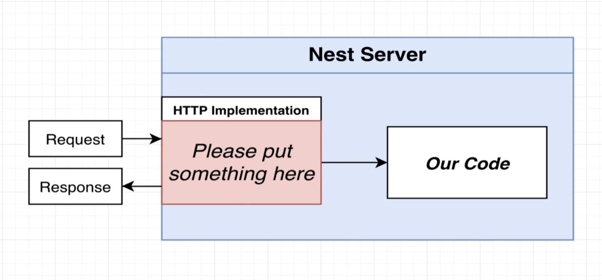

# Nest.js

## Node Server-Side framework

### 基础

1. 定义：能做什么 ❓❓❓
2. 原理：
   1. NestJS 本身并不处理 incoming requests. 它依赖一些 outside server implementation 外部实现来处理 http requests. 
   2. 结构图：
   3. 默认的 outside HTTP Server Implementation: 用的是 Express.js library.
   4. Server 端处理请求的通用流程：这个流程与开发语言、框架 等都关系不大。----> Nest 提供了一些 tools 来帮助我们实现这些步骤
      1. The request comes. 
      2. Validate data contained in the request. -----> Pipe
      3. Make sure the user is ahthenticated. ( Optional )  -----> Guard
      4. Route the request to a particular function. -----> Controller
      5. Run some business logic. -----> Service
      6. Access a database and take some actions. -----> Repository
      7. Formulate a response and send back.
3. 安装：

     ```bash
     npm i -g @nestjs/cli
     nest new project-name
     cd project-name
     npm install
     npm run start
     // http://localhost:3000/ 启动项目
     ```

4. 目录结构:
   1. /src/main.ts：
      1. 项目启动入口，
      2. 在这里开启 HTTP 的监听，定义 port 3000. 
      3. 在任何项目中，这个文件都将是 the first file to get executed. 第一个被执行
      4. 包含一个 bootstrap 方法，通过 const app = NestFactory.create(AppModule) 来创建一个 app 的实例
      5. 当 Nest 读完 AppModule, 就会立刻调用 bootstrap 方法
   2. /src/app.module.ts: The root module of the application. 会自动创建传入的各种类的实例
   3. /src/app.controller.ts： A basic controller with a single route
   4. /src/app.service.ts: A basic service.
   5. tsconfig.json: tell the Typescript how to compile the code. ❓❓❓

      ```json
      {
         "compilerOptions": {
            "module": "commonjs",
            "declaration": true,
            "removeComments": true,
            "emitDecoratorMetadata": true,
            "experimentalDecorators": true,
            "allowSyntheticDefaultImports": true,
            "target": "ES2021",
            "sourceMap": true,
            "outDir": "./dist",
            "baseUrl": "./",
            "incremental": true,
            "skipLibCheck": true,
            "strictNullChecks": false,
            "noImplicitAny": false,
            "strictBindCallApply": false,
            "forceConsistentCasingInFileNames": false,
            "noFallthroughCasesInSwitch": false
         }
      }
      ```

   6. tsconfig.build.json
5. Dependencies:
   1. @nestjs/common: 主要用到的构建一个 nest app 的主要 functions, classes 等都在这里
   2. @nestjs/core: 包含例如 NestFactory 等少数核心方法。 
      1. 如果不知道应该从 common 还是 core 里引用，记住，大部分都是从 common 里导出的
   3. @nestjs//platform-express: 安装一个能让 nestjs 和 express 协同工作的 adapter. 因为默认使用的 HTTP server implementation library 是 Express.js
   4. @nestjs/metadata：用来帮助 decorator 工作的
6. CLI:
   1. nest generate module: 将在 /src 文件夹下创建一个 /src/messages/messages.module.ts 文件 注意在命令行里不用写 module, 不然就会产生一个名字叫 MessagesModuleModule。
   2. nest generate controller messages/messages --flat：
      1. messages1/messages2 表示创建 controller 放在一个叫 messages1 的 folder 下,这个 controller 叫 messages2.如果 messages1 folder 不存在则创建一个 folder; 如果已经存在，就直接存放进去。
      2. --flat 表示不要再额外地创建一个名叫 controllers 的 folder 来存放创建出来的 controllers.
      3. 在 src 下执行，才会把 messages.controller.ts 文件创建在 messages folder 下面. 
      4. 此时的 controller 带一个 config： @Controller('messages')
      5. 并且此时，messageModule 里的 controllers 数组已经自动将这个 messagesController 加入进去了。

         ``` javascript
         // controller
         import { Controller } from '@nestjs/common';
         @Controller('messages')
         export class MessagesController {}

         // module
         import { Module } from '@nestjs/common';
         import { MessagesController } from './messages.controller';
         @Module({
            controllers: [MessagesController]
         })
         export class MessagesModule {}
         ```

### Pipe

1. 用途：Pipe and nest help us validate data on incoming request.
2. Set up Automatic validation 的步骤
   1. Tell Nest t use global validation
   2. Create a class that describes the different properties that the request body should have. 其中用到一个对象 DTO 是 Data transfer object.
   3. Add validation rules to the class.
   4. Apply that class to the request handler.
3. 分类：
   1. Global pipe will apply to validate every single incoming request that comes into the application.

      ```javascript
      import { NestFactory } from '@nestjs/core';
      // import { AppModule } from './app.module';
      import { MessagesModule } from './messages/messages.module';
      import { ValidationPipe } from '@nestjs/common';

      async function bootstrap() {
         const app = await NestFactory.create(MessagesModule);
         app.useGlobalPipes(
            new ValidationPipe()
         ); 
         await app.listen(3000);
      }
      bootstrap();

      // controller
      import { Body, Controller, Get, Param, Post } from '@nestjs/common';
      import { CreateMessageDto } from './dtos/create-message.dto';
      @Controller('messages')
      export class MessagesController {
         @Post()
         // createMessage(@Body() body: any) {
         createMessage(@Body() body: CreateMessageDto) { // use dto as replacement for any
            console.log(body); // Appear in terminal log.
         }
      }
      ```

   2. Particular pipe will apply to validate one single route handler.
4. Validation Rules:
   1. By default: 如果没有明确设置在哪个 particular handler 上加 rule, 那 validation pipe 是不会在那个上不会运行的。

### Guard

1. 用途：Guards make sure that incoming requests are coming from users who are authenticated or authorized to our application.

### Controller

1. 用途：Handling incoming requests.
2. 职责：控制器负责处理传入请求并向客户端返回响应。Controllers are responsible for handling incoming requests and returning responses to the client.
3. Routing: 路由控制哪个控制器接收哪些请求。
   1. 一个 controller 会接收 specific requests 特定的请求。路由来控制哪个controller 用来接收哪个 request. 通常，每个控制器都有多个路由，并且不同的路由可以执行不同的操作。
   2. 原文：A controller's purpose is to receive specific requests for the application. The routing mechanism controls which controller receives which requests. Frequently, each controller has more than one route, and different routes can perform different actions.
4. 创建:
   1. 创建一个基本的 controller, 需要用到 class 和 decorator. 类和装饰器。Decorator 把 class 和 required meta data 联系起来，使 NestJS 能够依此创建一个 route map 路由映射，映射的对象就是把 requests 对应上相应的 controllers. 其中 @Controller devorator is required.
   2. 用 CLI 创建：`nest g controller controller-name` 例如 dogs. 会自动创建出 dogs folder, 操作上会新增 dogs.controller.ts + dogs.controller.spec.ts文件，并把 DogController 对象引用放进 app.module.ts 中的 controllers array.

### Decorator

1. 定义：修饰符，用来告诉 Nestjs 把 class 当成哪些角色来工作。
2. Nest makes use of decorators quite heavily.

#### @Controller Decorator

1. 定义：用来标识一个 class 是一个 Controller. @Controller Decorator is required to define a basic controller. it tells the Nestjs that we are trying to create a class that is going to serve as a controller inside of our application.
2. 用途：定义一个 controller 来 handle & route incoming requests.
3. Config parameter:
   1. 作用：可以容易地将一组相关得路由分组。Any route that we put inside the controller decorator is going to apply to all the route handlers that we define inside the controller.
   2. 例如： optional route path prefix: 'cats'
4. code:

   ```javascript
   import { Controller, Get } from '@nestjs/common';

   @Controller()
   export class AppController {
      constructor(private readonly appService: AppService) {}

      @Get('/abcd') // `http://localhost:3000/path` 可以访问
      getRootRoute(){
         return 'Hi,there!';
      }
   }

   @Controller('/app') // 添加一个 group path prefix
   export class AppController {
      constructor(private readonly appService: AppService) {}

      @Get('/abcd') // `http://localhost:3000/path` 不能访问
      getRootRoute(){
         return 'Hi,there!';
      }

      @Get('/abcd') // `http://localhost:3000/path` 不能访问
      getRootRoute(){
         return 'Hi,there!';
      }
   }
   ```

#### @Get Decorator

1. 定义：@Get 是 HTTP request method decorator. 当有人对 app 发出了一个 request, 我们需要把这个请求 route to a handler method.
2. 用途：用来标识一个 route handler: 用来 handle the incoming requests 的。
3. Config parameter：
   1. By default: 当打开页面，发起了一个对 localhost 3000 的请求，此时没有 route, 那么就会默认调用这个 @Get 标识了的方法。
   2. 传进一个 string path: 响应 `http://localhost:3000/path`
   3. 传进一个没有匹配 route handler 的 route path, 将会抛出一个 404 的错误`{"message": "Cannot GET /abcde","error": "Not Found","statusCode": 404}`
4. code:

   ```javascript
   import { Controller, Get } from '@nestjs/common';

   @Controller()
   export class AppController {
      constructor(private readonly appService: AppService) {}

      @Get() // `http://localhost:3000`
      getHello(): string {
         return this.appService.getHello();
      }

      @Get('/abcd') // `http://localhost:3000/path`
      getRootRoute(){
         return 'Hi,there!';
      }

      @Get('/abcd/:id') // `http://localhost:3000/path/id`
      getRootById(){
         return 'Hi,ID!';
      }

   }
   ```

#### @Post Decorator

#### @Param Decorator

1. 作用: 用来接收请求中的 parameters
2. code:

   ```javascript
   // send a request
   GET /messages/5?validate=true
   // 其中这个参数 /:id 传进来的5 就能被 @Param('id') 接收, 对应的 controller 里的 @Get('/:id')

   import { Body, Controller, Get, Param, Post } from '@nestjs/common';

   @Controller('messages')
   export class MessagesController {
      @Get()
      listMessages(){}

      @Post()
      createMessage(@Body() body: any) {
         console.log(body)
      }

      @Get('/:id')
      getMessage(@Param('id') id: string) {
         console.log(id)
      }
   }
   ```

#### @Query Decorator

1. 作用：用来接收 GET 请求中的 query 部分
2. code:

   ```javascript
   // send a request
   GET /messages/5?validate=true
   // 其中 validate=true 就是 @Query() 要接收的部分
   ```

#### @Header Decorator

#### Body Decorator

1. 作用：用来接收 POST 请求中的 body
2. code:

   ```javascript
   @Controller('messages')
   export class MessagesController {
      @Get()
      listMessages(){}

      @Post()
      createMessage(@Body() body: any) {
         console.log(body)
      }

      @Get('/:id')
      getMessage(@Param('id') id: string) {
         console.log(id)
      }
   }
   ```

### Service

### Repository

1. 用途：Handle data stored in a Database.

### Module

1. 用途：Groups together code
2. work flow: 当 app 启动，Nest 就会先看 /src/app.module.ts 这个文件 中的 AppModule 这个模块。将会找到所有 @Module config 中的 controllers 列表，然后自动为所有的 controller classes 创建 instances 实例对象。并且 set up route for each of different decorators like @Get getHello function.
3. code:

   ```javascript
   import { Module } from '@nestjs/common';
   import { AppController } from './app.controller';
   import { AppService } from './app.service';

   @Module({
      imports: [],
      controllers: [AppController],
      providers: [AppService],
   })
   export class AppModule {}

   // app.controller.ts
   @Controller()
   export class AppController {
   constructor(private readonly appService: AppService) {}
      @Get()
      getHello(): string {
         return this.appService.getHello();
      }
   }
   ```

### Provider

### Filter

1. 用途：Handles errors tha occur duing request handling.

### Interceptor

1. 用途：Adds extra logic to incoming requests or outgoing responses

### Q&A

1. code 更新后，UI 没有自动更新: 需要用上 --watch 的命令行或者 npm run start:dev
2. controller 里的 getHello 方法是在哪被显示调用的？是自动调用的，没有地方显式调用
3. 

## Dependency Injection

