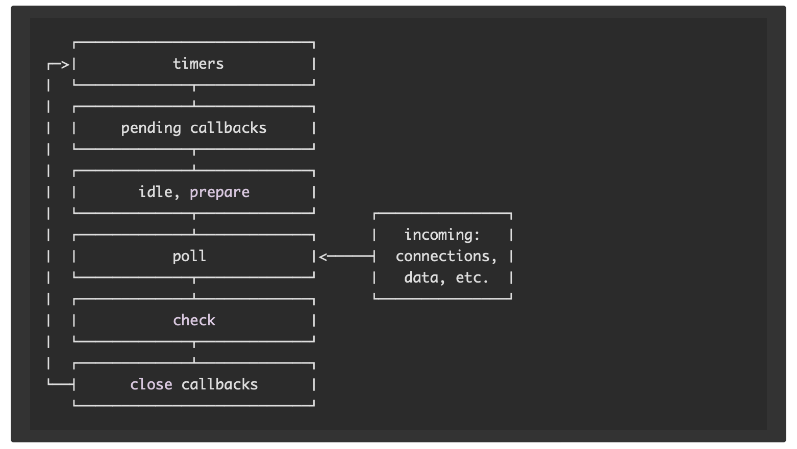

## Node.js

### 基本操作
1. 怎么用node执行代码
   1. 直接在命令行 node index.js 显示地告诉shell用 node 运行脚本
   2. 通知系统用哪个解释器运行脚本：在脚本文件的第一行显示地写入node解释器的绝对路径
    ```
    // 需要文件具有执行权限： chmod u+x index.js
    // 并非所有操作系统的 bin 文件夹中都有 node，但都应该有 env。 您可以告诉操作系统使用 node 为参数运行 env
    #!/usr/bin/node
    #!/usr/bin/env node
    ```  
2. 读取环境变量
   1. process核心模块提供了env属性，该属性承载了在启动进程时设置的所有环境变量 例如 process.env.NODE_ENV; // 默认 development
   2. 注意process是可以直接用的，不需要require。
3. 怎么退出Node程序
   1. 命令行： ctrl+C
   2. 强制终止进程：process.exit(); 调用核心模块process的exit方法，node进程立刻被强制终止。所有正在执行的操作都立即被非正常地终止。 
   3. 从别的进程通知进程结束：
      1. 发送信号： 信号是一个 POSIX 互通系统：发送给进程的通知，以便通知它发生的事件
         1. SIGKILL 是告诉进程立即终止的信号，理想情况下会像 process.exit() 一样
         2. SIGTERM 是告诉进程正常终止的信号。 这是从 upstart 或 supervisord 等进程管理器
            ```
            process.on('SIGTERM', () => {
                server.close(() => {
                    console.log('Process terminated')
                })
            })
            ```
      2. 在程序、系统任何地方终止某个进程： process.kill(process.pid, 'SIGTERM') 只要知道目标进程的PID
4. REPL模式：
   1. 定义：是一种编程语言环境(主要是在控制台窗口),可以在控制台等待用户输入进行交互。
   2. 使用：在命令行 直接执行 node 就会进入 REPL模式
5. 命令行传参：
   1. 示例：node index.js name=Joey
   2. 原理：name=Joey这样赋值，本质上是公开了process.argv 数组类型的属性，使新参数可以添加进来。可以迭代查看所有属性 process.argv.forEach(...)。 第一个参数是 node 命令的完整路径。 第二个参数是正被执行的文件的完整路径。 自定义的参数是从第三个开始的
6. 从命令行接收输入：使用readline内置模块. 更多功能可以用 inquirer： npm install inquirer 
    ```
    const readline = require('readline').createInterface({
        input: process.stdin,
        output: process.stdout
    })
    // question() 方法会显示第一个参数（即问题），并等待用户的输入。 当按下回车键时，则它会调用回调函数。
    readline.question(`你叫什么名字?`, name => {
        console.log(`你好 ${name}!`)
        readline.close()
    })
    ```
7. 使用npx：无需安装就可以运行npm仓库发布的代码。并且npx packName 可以自动去到node_modules文件夹中找到命令的正确引用。可以直接从URL运行任意代码片段

### Buffer 
1. 定义：buffer是内存区域。它表示在 V8 JavaScript 引擎外部分配的固定大小的内存块（无法调整大小）。可以将 buffer 视为整数数组，每个整数代表一个数据字节。
2. 作用：用以帮助开发者处理二进制数据，在此生态系统中传统上只处理字符串而不是二进制数据。Buffer 与流紧密相连。 当流处理器接收数据的速度快于其消化的速度时，则会将数据放入 buffer 中。
3. 创建：它由 Node.js Buffer 类实现。
   1. Buffer.from(array)
   2. Buffer.from(arrayBuffer[, byteOffset[, length]])
   3. Buffer.from(buffer)
   4. Buffer.from(string[, encoding])
   5. Buffer.alloc(1024)； 创建指定字节数大小的缓冲区。 alloc 创建的 Buffer 会被使用0进行初始化
   6. Buffer.allocUnsafe(1024) 创建指定字节数大小的内存区。allocUnsafe 创建的 Buffer 不会被初始化，所以速度比alloc快得多，但分配的内存中可能包含旧数据。 所以当buffer内存被读取时，如果有旧数据，就可能被访问或者泄漏。这就是真正使 allocUnsafe 不安全的原因，在使用它时必须格外小心。
4. 使用 buffer: 
   1. 可以像数组一样访问 buffer字节数组
    ```
        const buf = Buffer.from('Hey!')
        // 得到的数字是 Unicode 码，用于标识buffer位置中的字符
        console.log(buf[0]) //72
        console.log(buf[1]) //101
        console.log(buf[2]) //121
    ```
   2. 属性length可以获取长度 buf.length
   3. for of 可以迭代 buffer 内容
5. 写入：buf.write() 或者 直接操作数组中的某一项 `buf[1] = 111 `
6. 复制：buf.copy(bufcopy，start, end, length) 默认会复制整个buf到bufCopy, 也可以设置参数定义开始位置、结束位置、以及新的 buffer 长度.
7. 局部切片引用：buf.slice() 注意切片不是复制，只是引用，原始buffer更改，切片也会更改
   ```
    const buf = Buffer.from('Hey!')
    buf.slice(0).toString() //Hey!
    const slice = buf.slice(0, 2)
    console.log(slice.toString()) //He
    buf[1] = 111 //o
    console.log(slice.toString()) //Ho
   ```


### npm 
1. 定义：是Node.js标准的软件包管理器。 yarn是npm的一个替代选择。
2. 安装软件包
   1. 地址
      1. 本地安装：安装到当前文件树的node_modules子文件夹下
      2. 全局安装：安装到全局环境下，具体可以用 npm root -g 命令查询. 注意如果用nvm管理node版本的话，安装位置会不同
      3. 如果软件包是可执行文件：可以把文件放到 node_modules/.bin/ 文件夹下， 然后 node .../.bin/* 执行
   2. 版本：name@version
   3. package-lock.json的作用： 记录当前项目已安装的都是哪些版本
3. 常用命令：
   1. npm list: 查看已安装的包+包的依赖+版本
      1. npm list -g --depth 0 查看当前系统全局环境安装的包
   2. npm view packageName versions 查看某包的全部版本号
   3. npm outdated 发现包的版本有没有更新
   4. npm update 更新包 注意，如果包的主版本变了，代表着引入了重大的更改，npm update并不会更新到新的主版本那一版，避免引起太多问题
   5. npm install 下载包并且更新package-lock.json
   6. npm uninstall
4. 常用包
   1. nodemon: 是一种工具，可以自动检测到目录中的文件更改时通过重新启动应用程序来调试基于node.js的应用程序。

### 流
1. 定义：是一种以高效的方式处理读/写文件、网络通信、或任何类型的端到端的信息交换。在传统的方式中，当告诉程序读取文件时，这会将文件从头到尾读入内存，然后进行处理。使用流，则可以逐个片段地读取并处理（而无需全部保存在内存中）。
2. 内置模块：steam 模块提供了构建所有流 API 的基础 
3. 本质：所有的流都是 EventEmitter 的实例。
4. 优点：
   1. 内存效率: 无需加载大量的数据到内存中即可进行处理。
   2. 时间效率: 当获得数据之后即可立即开始处理数据，这样所需的时间更少，而不必等到整个数据有效负载可用才开始。
5. 相关方法
   1. pipe管道：
      1. aimStream = originStream.pipe(content) 在来源流上调用，获取来源流，并将其通过管道传输到目标流，pipe()的返回值就是目标流
         ```
            const http = require('http')
            const fs = require('fs')
            const server = http.createServer((req, res) => {
                // fs.createReadStream 读取文件流; 
                const stream = fs.createReadStream(__dirname + '/data.txt')
                stream.pipe(res)
            })
            server.listen(3000)
         ```
      2. pipe()可以链式调用
         ```
            src.pipe(dest1).pipe(dest2)
            // 相当于 
            src.pipe(dest1)
            dest1.pipe(dest2)
         ```
   2. process.stdin 返回连接到 stdin 的流。
   3. process.stdout 返回连接到 stdout 的流。
   4. process.stderr 返回连接到 stderr 的流。
   5. fs.createReadStream() 创建文件的可读流。
   6. fs.createWriteStream() 创建到文件的可写流。
   7. net.connect() 启动基于流的连接。
   8. http.request() 返回 http.ClientRequest 类的实例，该实例是可写流。
   9. zlib.createGzip() 使用 gzip（压缩算法）将数据压缩到流中。
   10. zlib.createGunzip() 解压缩 gzip 流。
   11. zlib.createDeflate() 使用 deflate（压缩算法）将数据压缩到流中。
   12. zlib.createInflate() 解压缩 deflate 流。
6. 流的分类
   1. Readable: 可以通过管道读取、但不能通过管道写入的流（可以接收数据，但不能向其发送数据）。 当推送数据到可读流中时，会对其进行缓冲，直到使用者开始读取数据为止。
      1. 创建可读流：若要从 stream 模块获取可读流，对其进行初始化并实现 readable._read() 方法。
         ```
            const Stream = require('stream')
            const readableStream = new Stream.Readable();
            readableStream._read = () => {}
            // 现在流已初始化,可以发送数据测试了
            readableStream.push('hi!')
         ```
      2. 从可读流中获取数据:    
         1. 直接消费可读流
            ```
            readableStream.on('readable', () => {
                console.log(readableStream.read())
            })
            ```
         2. 利用可写流，将内容管道写入可写流
            ```
            const Stream = require('stream')
            const readableStream = new Stream.Readable({
                read() {}
            })
            const writableStream = new Stream.Writable()
            writableStream._write = (chunk, encoding, next) => {
                console.log(chunk.toString())
                next()
            }
            readableStream.pipe(writableStream)
            readableStream.push('hi!')
            ```
   2. Writable: 可以通过管道写入、但不能通过管道读取的流（可以发送数据，但不能从中接收数据）。
      1. 创建可写流: 若要创建可写流，需要继承基本的 Writable 对象，并实现其 _write() 方法。
         ```
            const Stream = require('stream')
            const writableStream = new Stream.Writable()
            // 然后实现 _write 
            writableStream._write = (chunk, encoding, next) => {
                console.log(chunk.toString())
                next()
            }
            //现在，可以通过以下方式传输可读流
            process.stdin.pipe(writableStream);
         ```
      2. 发送数据到可写流：
         1. 使用流的 write() 方法：writableStream.write('hey!\n')
         2. 使用信号通知已结束写入的可写流，使用 end() 方法
            ```
                const Stream = require('stream')
                const readableStream = new Stream.Readable({
                    read() {}
                })
                const writableStream = new Stream.Writable()
                writableStream._write = (chunk, encoding, next) => {
                    console.log(chunk.toString())
                    next()
                }
                readableStream.pipe(writableStream)
                readableStream.push('hi!')
                readableStream.push('ho!')
                writableStream.end()
            ```
   3. Duplex: 可以通过管道写入和读取的流，基本上相对于是可读流和可写流的组合。
   4. Transform: 类似于双工流、但其输出是其输入的转换的转换流。


### HTTP(S)服务器
1. 内置模块：http||https发送请求
2. 属性：
   1. http.METHODS 此属性列出了所有支持的 HTTP 方法：
   2. http.STATUS_CODES 此属性列出了所有的 HTTP 状态代码及其描述
   3. http.globalAgent 指向 Agent 对象的全局实例，该实例是 http.Agent 类的实例。用于管理 HTTP 客户端连接的持久性和复用，它是 Node.js HTTP 网络的关键组件.
1. 方法：
   1. http.createServer() 返回 http.Server 类的新实例。
   2. http.request 发送 HTTP 请求到服务器，并创建 http.ClientRequest 类的实例。
   3. http.get() 类似于 http.request()，但会自动地设置 HTTP 方法为 GET，并自动地调用 req.end()。
2. 5个类：
   1. http.Agent() Node.js 会创建 http.Agent 类的全局实例，以管理 HTTP 客户端连接的持久性和复用，这是 Node.js HTTP 网络的关键组成部分.该对象会确保对服务器的每个请求进行排队并且单个 socket 被复用。它还维护一个 socket 池。 出于性能原因，这是关键。
   2. http.ClientRequest. 当 http.request() 或 http.get() 被调用时，会创建 http.ClientRequest 对象。当响应被接收时，则会使用响应（http.IncomingMessage 实例作为参数）来调用 response 事件。返回的响应数据可以通过以下两种方式读取：1可以调用 response.read() 方法。2在 response 事件处理函数中，可以为 data 事件设置事件监听器，以便可以监听流入的数据。
   3. http.Server 当使用 http.createServer() 创建新的服务器时，通常会实例化并返回此类。拥有服务器对象后，就可以访问其方法：close() 停止服务器不再接受新的连接。listen() 启动 HTTP 服务器并监听连接。
   4. http.ServerResponse 由 http.Server 创建，并作为第二个参数传给它触发的 request 事件,通常在代码中用作 res, res 是一个 http.ServerResponse 对象。
   5. http.IncomingMessage 
      1. 请求中的 request 和 response 对象，都是这个类的实例。实例msg可以理解为另一段socket发送过来的数据，不限制是请求的还是响应的。
      2. 创建方式：
         1. http.Server，当监听 request 事件时。
         2. http.ClientRequest，当监听 response 事件时。
      3. 访问响应：
         1. 使用 statusCode 和 statusMessage 方法来访问状态。
         2. 使用 headers 方法或 rawHeaders 来访问消息头。
         3. 使用 method 方法来访问 HTTP 方法。
         4. 使用 httpVersion 方法来访问 HTTP 版本。
         5. 使用 url 方法来访问 URL。
         6. 使用 socket 方法来访问底层的 socket。
      4. http.IncomingMessage 实现了可读流接口，因此数据可以使用流访问
3. 发出一个请求：
   1. 用https内置模块
    ```
        const https = require('https')
        const options = {
            hostname: 'nodejs.cn',
            port: 443,
            path: '/todos',
            method: 'POST' //或者GET
        }
        const req = https.request(options, res => {
            console.log(`状态码: ${res.statusCode}`)

            res.on('data', d => {
                process.stdout.write(d)
            })
        })
        req.on('error', error => {
            console.error(error)
        })
        const data = JSON.stringify({
            todo: '做点事情'
        })
        req.write(data); // GET请求没有

        req.end()
    ```
   2. 使用第三方库 Axios
    ```
    axios
        .post('http://127.0.0.1:3000/', {
            todo: '做点事情'
        })
        .then(res => {
            console.log(`状态码: ${res.statusCode}`)
            console.log(res)
        })
        .catch(error => {
            console.error(error)
        })
    ```


### fs 模块、 path 模块
1. 内置模块： fs模块所有`方法默认都是异步的`，带有*-Sync的是同步的
2. 文件描述符：
   1. 定义：在与位于文件系统中的文件进行交互之前，需要先获取文件的描述符。一旦获得文件描述符，就可以以任何方式执行所有需要它的操作，例如调用 fs.open() 以及许多与文件系统交互的其他操作。
   2. 常用标志：
      1. r+ 打开文件用于读写。
      2. w+ 打开文件用于读写，将流定位到文件的开头。如果文件不存在则创建文件。
      3. a 打开文件用于写入，将流定位到文件的末尾。如果文件不存在则创建文件。
      4. a+ 打开文件用于读写，将流定位到文件的末尾。如果文件不存在则创建文件。
   3. 获得文件描述符
      1. 使用fs.open从回调中取得
        ```
            const fs = require('fs');
            // 第二个参数 是一个标志
            fs.open('/test.txt', 'r', (err, fd) => {
                //fd 是文件描述符。
            })
        ```
      2. 使用 fs.openSync 打开文件，直接返回
        ```
        const fs = require('fs')
        try {
            const fd = fs.openSync('/Users/joe/test.txt', 'r')
        } catch (err) {
            console.error(err)
        }
        ```
3. 文件属性
   1. 定义：每个文件都带有一组详细信息，可以使用 Node.js 进行检查。
   2. 属性用来获取：
      1. 使用 stats.isFile() 和 stats.isDirectory() 判断文件是否目录或文件。
         ```
         fs.lstatSync(filePath).isFile()
         ```
      2. 使用 stats.isSymbolicLink() 判断文件是不是符号链接。
      3. 使用 stats.size 获取文件的大小（以字节为单位）
      4. ...等等，很多
   3. 访问属性
      1. 方式1:具体地说，使用 fs 模块提供的 stat() 方法。
         ```
            const fs = require('fs')
            fs.stat('/Users/joe/test.txt', (err, stats) => {
            if (err) {
                console.error(err)
                return
            }
            //可以访问 `stats` 中的文件属性
            })
         ```
      2. 方式2:Node.js 也提供了同步的方法，该方法会阻塞线程，直到文件属性准备就绪为止：
         ```
            const fs = require('fs')
            try {
            const stats = fs.statSync('/Users/joe/test.txt')
            } catch (err) {
            console.error(err)
            }
         ```
4. 读取文件：
   1. fs.readFile() 方法，会在返回数据之前将文件的全部内容读取到内存中,大文件会对内存的消耗和程序执行的速度产生重大的影响
      ```
      const fs = require('fs')
        fs.readFile('/Users/joe/test.txt', 'utf8' , (err, data) => {
        if (err) {
            console.error(err)
            return
        }
        console.log(data)
        })
      ```
   2. 同步版本～读 fs.readFileSync(), 会在返回数据之前将文件的全部内容读取到内存中,大文件会对内存的消耗和程序执行的速度产生重大的影响
      ```
        const fs = require('fs')
        try {
            const data = fs.readFileSync('/Users/joe/test.txt', 'utf8')
            console.log(data)
        } catch (err) {
            console.error(err)
        }
      ```
   3. 读入流 fs.createReadStream() 创建文件的可读流。
5. 写入文件：如果没有找到对应文件会创建
   1. fs.writeFile() 替换文件原来内容。 在将全部内容写入文件之后才会将控制权返回给程序
      ```
        const fs = require('fs')
        const content = '一些内容'
        fs.writeFile('/Users/joe/test.txt', content, err => {
            if (err) {
                console.error(err)
                return
            }
            //文件写入成功。
        })
      ```
   2. 同步版本～写 fs.writeFileSync() 替换文件原来内容。在将全部内容写入文件之后才会将控制权返回给程序
      ```
        const fs = require('fs')
        const content = '一些内容'
        try {
            const data = fs.writeFileSync('/Users/joe/test.txt', content)
            //文件写入成功。
        } catch (err) {
            console.error(err)
        }
      ```
   3. 在文件内容的末尾追加内容： fs.appendFile() + 同步版本的 fs.appendFileSync()。在将全部内容写入文件之后才会将控制权返回给程序
        ```
        const content = '一些内容'
        fs.appendFile('file.log', content, err => {
            if (err) {
                console.error(err)
                return
            }
            //完成！
        })
        ```
   4. 写入流 fs.createWriteStream() 创建到文件的可写流。
6. 文件夹：
   1. fs.existsSync() 检查是否有文件夹
   2. fs.mkdir() 或 fs.mkdirSync() 可以创建新的文件夹。
   3. fs.readdir() 或 fs.readdirSync() 可以读取目录的内容。
      ```
        const fs = require("fs");
        const path = require('path')
        const folderName = "/Users/xxt/Documents/Work-FrontEnd/my-projects/Node/lib"
        // 获取完整的文件夹路径
        console.log(fs.readdirSync(folderName).map(fileName => {
            return path.join(folderName, fileName)
        }))
        // 过滤：只返回文件，排除文件夹
        const isFile = fileName => {
            return fs.lstatSync(fileName).isFile()
        }

        fs.readdirSync(folderPath).map(fileName => {
            return path.join(folderPath, fileName)
        })
        .filter(isFile)
      ```
   4.  fs.rename() 或 fs.renameSync() 可以重命名文件夹。 第一个参数是当前的路径，第二个参数是新的路径
       ```
       const fs = require('fs')
        fs.rename('/Users/joe', '/Users/roger', err => {
            if (err) {
                console.error(err)
                return
            }
            //完成
        })
        try {
            fs.renameSync('/Users/joe', '/Users/roger')
        } catch (err) {
            console.error(err)
        }
       ```
   5.  fs.rmdir() 或 fs.rmdirSync() 可以删除文件夹.删除包含内容的文件夹可能会更复杂。在这种情况下，最好安装 fs-extra 模块，该模块非常受欢迎且维护良好。 它是 fs 模块的直接替代品，在其之上提供了更多的功能。
        ```
        const fs = require('fs-extra')
        const folder = '/Users/joe'
        fs.remove(folder, err => {
            console.error(err)
        })
        // 也可以与 promise 一起使用：
        fs.remove(folder)
        .then(() => {
            //完成
        })
        .catch(err => {
            console.error(err)
        })
        // 或使用 async/await：
        async function removeFolder(folder) {
            try {
                await fs.remove(folder)
                //完成
            } catch (err) {
                console.error(err)
            }
        }
        const folder = '/Users/joe'
        removeFolder(folder)
        ```

### path 模块
1. 内置模块：path 模块
2. 从路径获取信息
   1. path.dirname: 获取文件的父文件夹。
   2. path.basename: 获取文件名部分。
   3. path.extname: 获取文件的扩展名。
      ```
         const notes = '/users/joe/notes.txt'
         path.dirname(notes) // /users/joe
         path.basename(notes) // notes.txt
         path.extname(notes) // .txt
         // 可以通过为 basename 指定第二个参数来获取不带扩展名的文件名：
         path.basename(notes, path.extname(notes)) //notes
      ```
3. path.isAbsolute() 判断是否为绝对路径
4. path.join() 连接路径的两个或多个片段
    ```
        const name = 'joe'
        path.join('/', 'users', name, 'notes.txt') // '/users/joe/notes.txt'
    ```
5. path.resolve() 获得相对路径的绝对路径计算.
    ```
    path.resolve('joe.txt') //'/Users/joe/joe.txt' 如果从主文件夹运行。
    // 如果指定第二个文件夹参数，则 resolve 会使用第一个作为第二个的基础：
    path.resolve('tmp', 'joe.txt') //'/Users/joe/tmp/joe.txt' 如果从主文件夹运行
    // 如果第一个参数以斜杠开头，则表示它是绝对路径：
    path.resolve('/etc', 'joe.txt') //'/etc/joe.txt'
    ```
6. path.normalize() 是另一个有用的函数，当包含诸如 .、.. 或双斜杠之类的相对说明符时，其会尝试计算实际的路径.解析和规范化都不会检查路径是否存在。 其只是根据获得的信息来计算路径。
    ```
    path.normalize('/users/joe/..//test.txt');  //'/users/test.txt'
    ```
7. path.parse() 解析对象的路径为组成其的片段
    ```
    require('path').parse('/users/test.txt')
    // 得到
    {
        root: '/',
        dir: '/users',
        base: 'test.txt',
        ext: '.txt',
        name: 'test'
    }
    ```
8. path.relative() 接受 2 个路径作为参数。 基于当前工作目录，返回从第一个路径到第二个路径的相对路径。
   ```
   require('path').relative('/Users/joe', '/Users/joe/test.txt') //'test.txt'
   ```

### os 模块 操作系统模块
1. 内置模块：os模块 提供了许多函数，可用于从底层的操作系统和程序运行所在的计算机上检索信息并与之进行交互。
2. os.EOL 可给出行定界符序列。 在 Linux 和 macOS 上为 \n，在 Windows 上为 \r\n。
3. os.constants.signals 可告知所有与处理过程信号相关的常量，例如 SIGHUP、SIGKILL 等
4. os.constants.errno 可设置用于错误报告的常量，例如 EADDRINUSE、EOVERFLOW 等
5. os.arch() 返回标识底层架构的字符串，例如 arm、x64、arm64
6. os.cpus() 返回关于系统上可用的 CPU 的信息
7. os.freemem() 返回代表系统中可用内存的字节数。
8. os.homedir() 返回到当前用户的主目录的路径
9. os.hostname() 返回主机名
10. os.networkInterfaces() 返回系统上可用的网络接口的详细信息。
11. ... 好多

### events 事件模块
1. 内置模块：events 模块提供了 EventEmitter 类，这是在 Node.js 中处理事件的关键
2. 创建事件监听器：
   ```
   const EventEmitter = require('events');
   const emitter = new EventEmitter()
   ```
3. emitter.addListener() 或者 emitter.on() 添加监听器
   ```
    // 注册回调函数
    door.on('open', () => {
        console.log('打开')
    })
   ```
4. emitter.emit() 触发事件。 按照事件被注册的顺序同步地调用每个事件监听器
5. emitter.eventNames() 返回当前注册的事件名的数组
6. emitter.getMaxListeners() 获取可以添加到 EventEmitter 对象的监听器的最大数量（默认为 10，但可以使用 setMaxListeners() 进行增加或减少）
7. emitter.listenerCount(name); 获取传入的name事件监听器的计数
8. emitter.listeners(name) 获取传入的name事件监听器的数组
9. emitter.removeListener() 或者 emitter.off() 解除监听
10. emitter.once() 添加当事件在注册之后首次被触发时调用的回调函数。 该回调只会被调用一次，不会再被调用
11. emitter.prependListener() 当使用 on 或 addListener 添加监听器时，监听器会被添加到监听器队列中的最后一个，并且最后一个被调用。 使用 prependListener 则可以在其他监听器之前添加并调用
12. emitter.prependOnceListener() 当使用 once 添加监听器时，监听器会被添加到监听器队列中的最后一个，并且最后一个被调用。 使用 prependOnceListener 则可以在其他监听器之前添加并调用
13. emitter.removeAllListeners() 移除 EventEmitter 对象的所有监听特定事件的监听器
14. emitter.removeListener(name) 移除特定的监听器。 可以通过将回调函数保存到变量中（当添加时），以便以后可以引用它：
    ```
    const doSomething = () => {}
    door.on('open', doSomething)
    door.removeListener('open', doSomething)
    ```
15. emitter.setMaxListeners(number) 设置可以添加到 EventEmitter 对象的监听器的最大数量（默认为 10，但可以增加或减少）


### 错误处理
1. 错误对象 Error 类： throw new Error('错误');
2. 创建异常： throw value。
   1. 注意，在Node中，只抛出Error对象，而不像客户端中可以是任何js类型值
   2. 一旦 JavaScript 执行到此行，则常规的程序流会被停止，且控制会被交给最近的异常处理程序。
3. 处理异常：try/catch 语句。
4. 未捕获事件：监听 process 对象上的 uncaughtException 事件，可以处理在执行过程中未被捕获的异常，防止程序崩溃
   ```
    process.on('uncaughtException', err => {
        console.error('有一个未捕获的错误', err)
        process.exit(1) //强制性的（根据 Node.js 文档）
    })
   ```
5. promise中的错误处理：
   1. catch
   2. 在各个逻辑块中自己try catch
   3. 在then的回调函数返回一个有捕获能力的新promise: return new Promise(fn).catch 
6. async/await中的错误处理：给 await 语句包裹 try catch


### 事件循环
1. 作用：使Node具有异步且非阻塞的I/O
2. 背景：
   1. 单线程：js代码运行在单线程上，每次只处理一件事。
   2. I/O：即Input/Output,一个系统的输入和输出
   3. 非阻塞I/O VS 阻塞I/O 区别：在系统接收输入～输出的期间，能不能接收其他输入
   4. JavaScript 中几乎所有的 I/O 基元都是非阻塞的。 网络请求、文件系统操作等。 被阻塞是个异常，这就是 JavaScript 如此之多基于回调（最近越来越多基于 promise 和 async/await）的原因。
   5. 调用堆栈：事件循环不断地检查调用堆栈，以查看是否需要运行任何函数。当执行时，它会将找到的所有函数调用添加到调用堆栈中，并按顺序执行每个函数。
3. Node 事件循环: 
   1. 背景：
      1. 在Node应用启动之后，并不会立即进入事件循环，而是先执行输入代码，从上到下执行，同步API立即执行，`异步API交给C++维护的线程`执行，异步API的回调函数被注册到对应的的事件循环阶段中的队列。当所有输入代码执行完成后，开始进入事件循环。
      2. tick：每当事件循环进行一次完整的行程时，我们都将其称为一个Tick。每一个循环，也就是每一个tick之中，事件循环有6个阶段。
      3. 循环之后：在每次运行的事件循环之间，Node.js 检查它是否在等待任何异步 I/O 或计时器，如果没有的话，则完全关闭。
   2. 事件循环的六个阶段： 
      1. times 定时器阶段: 本阶段执行已经被定时器 setTimeout和setInterval的调度回调函数。poll阶段控制何时定时器执行。 
         1. 注意：setTimout(cb) 第二个参数默认值是0，表示多久之后函数可以被执行。虽然可以设置成0毫秒，但实际上Node做不到0毫秒，最快也要1毫秒。简言之：setTimeout(f, 0)等同于setTimeout(f, 1) 
         2. 在进入事件循环后实际执行时，如果到达times阶段的时刻没到1毫秒，那么就有可能会跳过times的执行，现象就是check阶段的回调反而先执行了。
         3. 示例：
            ```
            // 代码输出顺序不确定 1 2 或者 2 1
            setTimeout(() => console.log(1));
            setImmediate(() => console.log(2));
            // 代码输出顺序一定是 2 1 理由：代码会先进入I/O callbacks 阶段，然后是 check 阶段，最后才是 timers 阶段。因此，setImmediate才会早于setTimeout执行。
            const fs = require('fs');
            fs.readFile('test.js', () => {
                setTimeout(() => console.log(1));
                setImmediate(() => console.log(2));
            });
            ```
      2. I/O callbacks 待定阶段：执行延迟到下一个 Tick 的 I/O 回调，执行与操作系统相关的回调函数，除了其他那些阶段的回调，别的基本上都在这个阶段。
      3. idle,prepare 仅系统内部使用，可以忽略
      4. poll 轮询阶段：
         1. 主要工作
            1. 判断是回去timer阶段还是往下去check阶段
            2. 处理轮询队列里的事件，执行与I/O相关的回调
         2. poll轮询队列：
            1. 调度了times事件时，进入poll阶段时：如果轮询队列里有任务，就同步循环执行直到清空或者达到系统限制。然后判断timer阶段的任务有没有超时的，有的话直接回到times阶段执行回调。
            2. 没有计时器事件时，进入轮询阶段时：
               1. 轮询队列不为空：事件循环将循环访问回调队列并同步执行它们，直到队列已用尽，或者达到了与系统相关的硬性限制。
               2. 轮询队列为空：
                  1. 如果当前有setImmediate的回调任务，且poll队列已空，则poll阶段停止，进入check检查阶段 执行回调
                  2. 如果没有setImmediate的回调任务，则事件循环将一直`等待回调到来并立即执行`。这里会设置一个超时时间。
      5. check 检测阶段：
         1. 在这里执行 setImmediate() 的回调函数。setImmediate() 实际上是一个在事件循环的单独阶段运行的特殊计时器。它使用一个 libuv API 来安排回调在 轮询 阶段完成后执行。
         2. 此阶段允许人员在轮询阶段完成后立即执行回调。
         3. 
      6. close callbacks 执行各种关闭事件的回调函数： 一些关闭的回调函数 例如 socket.on('close', ...);
   3. 宏任务：
      1. setImmediate：会在check阶段中执行。在这个阶段执行不会阻塞主线程，也不会阻塞事件循环，可以用来做大量计算。
      2. setTimeout 
      3. setInterval 
      4. I/O 操作
   4. 微任务： 会在事件循环之前被调用。事件循环的每一阶段执行完，都会停下来看看微任务队列里有没有任务，有就先执行微任务再接着执行事件循环下一阶段任务
      1. process.nextTick(cb): 维护一个nextTick队列，新添加一个微任务。优先级最高。
      2. promise .then .catch .finally
   5. 对比：
      1. 优先级： nextTick微任务 > 普通微任务 > 宏任务
         1. 微任务 > 宏任务：当微任务队列中存在可以执行的回调函数时，事件循环在执行完当前阶段的回调函数后，会暂停进入下一阶段，而是立即去执行微任务队列中的事件。当微任务队列被清空之后，事件循环再进入下一阶段继续执行回调函数。
         2. 微任务中 nextTick > 普通微任务：在执行任务时，只有nextTick中的所有回调函数执行完之后才会开始执行微任务。
         3. 宏任务没有优先级之分：不同阶段的宏任务被放在不同的任务队列中，执行顺序就是按照事件循环的阶段顺序进行的，没有优先级的概念。
         4. 求输出
            ```
            // 刚进入循环时，由于50ms的延时，times阶段事件来不及执行
            setTimeout(() => console.log(1), 50);
            process.nextTick(() => console.log(2));
            setImmediate(() => console.log(3));
            process.nextTick(() => console.log(4));
            // 2431
            ```
      2. node适合 I/O 密集型操作，不适合CPU密集型任务
      3. setTimeout VS setImmediate 区别：
         1. 阶段不同：setTimeout在Times阶段，setImmediate在Check阶段
         2. 当在I/O callback阶段内调用时，总是先执行 setImmediate，再执行 setTimeout


### node多进程之间是如何通信的

### RPC通信
1. 定义：Remote Procedure Call 远程过程调用
2. 
3. RPC VS Ajax
   1. 相同点：都是两个计算机之间的网络通信，都需要约定一个数据格式
   2. 不同点：
      1. RPC 不一定使用 DNS 做寻址服务，因为可能是内网直接请求服务器；而Ajax是需要DNS的
      2. RPC 调用一般使用二进制协议，而不是 HTTP协议; 而 Ajax基于 HTTP。使用二进制协议，拥有更小的数据包体积和更快的编解码速率。
      3. Ajax一定是基于 TCP, 但 RPC 不一定基于TCP还是UDP

### 应用：
1. 使用Node.js搭建 BFF 层 Backend For Frontend
2. 使用Node.js + Next.js 实现 SSR


