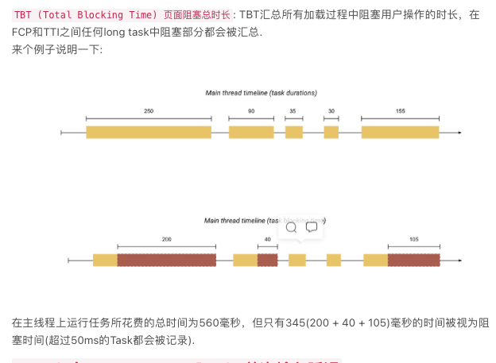

### 微前端了解么

### 聊聊每个项目的亮点：
有亮点的项目最好多准备几个，最好是不同类型的，比如业务的、偏中后端的、组件库的、工程化的和新兴技术的，根据自己擅长的内容最起码准备两三个

### 对Serverless的理解

### 如何实现一个换肤功能

### 离线包/离线下载的原理是什么

### git CI/CD 了解

### 代码规范如何做的

### eslint 和 prettier 的冲突是如何解决的


### 如何做前端预渲染

### 埋点+监控方案


### 前端优化
#### 参考：
   1. https://segmentfault.com/a/1190000018392559
   https://segmentfault.com/a/1190000018828048
   https://blog.csdn.net/weixin_44368963/article/details/108264278
   2. https://www.jianshu.com/p/a32b890c29b1
1. http
   1. URL后面加反斜杠/ 减少服务器查询文件的过程，直接去查询目录
   2. dns预解析：最关键的连接使用 preconnect，而其他的则可以用 dns-prefetch
      1. dns-prefetch预解析：针对跨域域名的DNS查找有效 `<link rel="dns-prefetch" href="https://fonts.googleapis.com/"> ` 注意，多页面重复的DNS预解析会增加DNS查询次数，dsn-prefetch需慎用
      2. preconnect预连接: 针对HTTPS协议的跨域域名有效。因为如果站点是通过HTTPS服务的，则此过程包括DNS解析，建立TCP连接以及执行TLS握手。注意，提前链接所有请求并不合理，
      3. 联合上述两个：最关键的连接使用 preconnect，而其他的则可以用 dns-prefetch； dns-prefetch 可以作为不支持预连接的浏览器的后备选择，同时配置它们两即可
         ```
         <link rel="preconnect" href="https://fonts.gstatic.com/" crossorigin>
         <link rel="dns-prefetch" href="https://fonts.gstatic.com/">
         ```
   3. 链接预解析：prefetch  preload  prerender
         1. `<link ref="preload" as="style" crossorigin href="">` preload类似一个声明式的fetch，会在不阻塞onload事件的前提下，要求浏览器下载资源，浏览器会将该资源缓存在内存中。中途跳转页面preload中断。使用了preload获取的资源最好能在页面利用上，否则浏览器会提醒做了无用功 for nothing。
            1. 监测preload是否被支持
               ```
               const preloadSupported = () => { 
                  const link = document.createElement('link'); 
                  const relList = link.relList; 
                  if (!relList || !relList.supports) return false; 
                  return relList.supports('preload'); 
               };
               ```
            2. 将加载到的资源设置立即生效，比如css:
               ```
               <link rel="preload" href="style.css" onload="this.rel=stylesheet">
               ```
         2. `<link ref="prefetch" as="style" crossorigin href="">` prefetch告诉浏览器我未来或者下个页面可能要使用的资源，把主动权交给浏览器，由浏览器自己控制在空闲时下载，并且缓存在内存中5分钟。中途跳转页面prefetch可同步进行不中断，在新页面中继续用下载到的资源。
         3. 还有个ref的值为prerender 表示预渲染，但是兼容性特别差，firefox safari 都不支持
         4. 上述的as可以控制资源加载的优先级，跟随设置as设置的资源类型的优先级，例如as="style"的优先级就高于as="script"的优先级。如果不设置，就是个普通的异步，建议设置。as的值可以有 style image font script 等
         5. 建议始终设置crossorigin,否则可能引起两次请求
   4. CDN静态资源服务器：
   5. 减少请求：资源合并、promise.all并发
   6. 资源体积：webpack打包压缩 gzip压缩
   7. 利用缓存：cdn、http缓存(长缓存/协商缓存)、本地缓存、nginx缓存.不经常变动的文件，通过加后缀的方式，可以在每次发布的时候才修改后缀实现更新、使用离线包
   8. 请求顺序：控制请求优先级不重要的可以异步请求、判断哪些是关键请求、关键请求并发执行，可以用lighthouse排查链式请求的问题，注意关键请求的数量
   9.  优先使用 https2 协议
   10. 资源按需引入：路由懒加载、组件按需加载
2. html:
   1. 移除阻塞代码：变成异步加载或者写在最后，比如一些首屏用不到的第三方脚本
   2. css代码写在head里，js代码写在body后
   3. 少用table，用div+css替代，因为table里的东西都加载完才会展示整个table
   4. 减少无用dom数
   5. 减少dom操作：缓存dom、innerHtml代替操作多个dom
   6. 事件：可以事件委托、防抖/节流等
   7. 减少重排、重绘
   8. 长列表优化
3. js:
   1. js放在body后，防止阻塞首屏渲染
   2. 避免代码长期占用一个主线程 超过一帧时长，视觉卡顿
   3. 使用 defer 异步加载js
   4. webWorker 多线程编程
4. 图片：
   1. img标签提前定义好图片的宽高
   2. 压缩图片：npm install imagemin
      1. 压缩jpg: npm install imagemin-mozjpeg
      2. 压缩png: npm install imagemin-pngquant
      3. 压缩webP: npm install imagemin-webp
   3. 优先使用webP/AVIF图片、其次才是jpg/png图片 但webP兼容还不全面，两种方案
      1. 用css backgroud
         ```
         background-img: url('*.webp'),url('*.jpg'); //两张图片会叠加，会优先加载webP图片，之后再加载jpg图片也变清晰
         ```
      2. 用html picture标签
         ```
         <picture>
            <source src="*.webp" /> //浏览器会根据兼容性判断使用哪个source的src，如果都不兼容就使用最下面img标签的src
            <source src="*.avif" />
              //真正在页面占位的只有img标签
         </picture>
         ```
   4. 图片预加载：提前prefetch后面要展示的图片
   5. 图片懒加载：`` 只有展示到视窗时才会加载图片
   6. 隐藏iframe提前加载图片
   7. 内联 SVG 展示 Logo 和图标
5. css：
   1. css放在head前，尽快下载和解析
   2. 优先使用flex布局
   3. 对动画、操作dom等容易引起重排重绘的操作可以先脱离文档流
   4. 尽量使用css动画
   5. 减少重排和重绘
   6. 尽量使用class\id，少用行内样式style
   7. css中@import的内容可能有嵌套，所以浏览器会按序加载，如果用link标签就可以并行解析，更快
6. 动画：
   1. 因为复合动画可以使用GPU加速，所以应避免非复合动画
   2. 尽量使用css动画，可以GPU硬件加速，例如使用 transform、opacity、filter、will-change
   3. 动画脱离文档流
7. 字体：
   1. preload字体
   2. font-display:swap. 设置字体没加载出来之前，先用系统默认字体展示(默认font-display:auto表示字体没加载出来之前内容content也不显示)
   3. 缓存字体、压缩字体
   4. 采用svg图片或者字体图标：因为字体图标或者SVG是矢量图，代码编写出来的，放大不会失真，而且渲染速度快。字体图标使用时就跟字体一样，可以设置属性，例如 font-size、color 等等，非常方便，还有一个优点是生成的文件特别小
8. 渲染优化
   1. 首屏SSR服务器端渲染
   2. 页面预渲染 ？？？
9. 精简代码: 
   1. 提取公共代码： webpack的splitChunk插件
   2. 剥离冗余代码：缩小loader的应用范围，避免不必要的转译；TreeShaking摇树优化
10. Webview 优化
    1. 打开webview的同时并行加载页面数据 ？？？


### 项目性能监控指标 都有哪些
1. 分析工具：Chrome-devTools 中 lighthouse web-vitals performance 新加入了一个recorder功能
2. 分析方向：网络层面 + 渲染层面，细分下来就是 时间层面 + 体积层面
3. 渲染耗时：
   1. 白屏时间：指的是从输入网址， 到页面开始显示内容的时间
      ```
      // 代码放在<head></head>里
      <script>
         let t = + new Date() - performance.timing.navigationStart
      </script>
      ```
   2. 首屏时间：指从输入网址， 到首屏页面内容渲染完毕的时间。放在 load 事件里监听
      ```
      <script>
         window.addEventListener('load',() =>{
            let t = + new Date() - performance.timing.navigationStart;
         })
      </script>
      ```
   3. `FP (First Paint) 首次绘制 `: 标记浏览器渲染任何在视觉上不同于导航前屏幕内容之内容的时间点.
   4. `FCP (First Contentful Paint) 首次内容绘制 ` 标记浏览器渲染来自 DOM 第一位内容的时间点，该内容可能是文本、图像、SVG 甚至 元素.
   5. `LCP (Largest Contentful Paint)` 最大内容渲染 代表在viewport中最大的页面元素加载的时间. LCP的数据会通过PerformanceEntry对象记录, 每次出现更大的内容渲染, 则会产生一个新的PerformanceEntry对象
   6. `DCL (DomContentloaded) `: 当 HTML 文档被完全加载和解析完成之后，DOMContentLoaded 事件被触发，无需等待样式表、图像和子框架的完成加载.
   7. `L (onLoad)`：当依赖的资源, 全部加载完毕之后才会触发
   8. `FMP(First Meaningful Paint) 首次有效绘制`：主要元素的首次绘制时间
   9.  `TTI (Time to Interactive) 可交互时间` : Time to interactive is the amount of time it takes for the page to become fully interactive.
   10. `TBT (Total Blocking Time) 页面阻塞总时长`: js线程超50ms之后的task都会被记录视作阻塞时间，某进程主线程运行时间的总和中，阻塞task的时间总长就是TBT
       1.  
   11. `FID (First Input Delay) 首次输入延迟`: 指标衡量的是从用户首次与您的网站进行交互（即当他们单击链接，点击按钮等）到浏览器实际能够访问之间的时间
       1. `: 页面可见速度 Speed Index shows how quickly the contents of a page are visibly populated.
   13. `CLS (Cumulative Layout Shift)` Cumulative Layout Shift measures the movement of visible elements within the viewport.


### debug 的方式
1. 先判断是前端问题还是后端问题。可以查看接口是否正确、根据报错信息提示 在network面板搜索关键字 
2. 如果是前端问题，也可以在source面板下全局搜索关键字
3. 由于 线上js 大多是混淆过的，可以手动添加 .soucemap文件。 参考链接：https://mp.weixin.qq.com/s/YLdHyX0lh123dqHxijlM2w
   1. 先通过配置webpack打包，得到对应的.sourcemap文件
   2. 安装一个http-server
   3. 通过开启一个http-server本地服务，将.sourcemap文件放在这个本地服务下，使能在浏览器中访问到这个本地 .sourcemap
   4. 在浏览器有错误的混淆js页面中，右键单击，会有一个"Add source map..."的选项，填入本地服务中sourcemap文件的地址
   5. 关联后，浏览器Sources面板下将会多出几个文件夹，跟本地代码的文件结构目录一致，可以看到源代码，就可以查找问题了
4. 如果有些代码修改后，想知道在浏览器是否能正常运行，可以使用 本地重写 Overrides 功能：
   1. 在Sources面板下，左侧跟Page等并列的一个功能叫Overrides。可以添加一个要重写的文件路径，
   2. 选择之后，浏览器会询问是否同意授权更改文件，同意即可
   3. 然后就修改对应的代码即可，修改好后文件名会带一个星，表示修改过，此时要保存后，星星会消失，刷新浏览器才会更新。更新的效果就是重新后的代码。
   4. 如果想取消，右键后会有remove的指令选项
5. 打断点 breakpoints
   1. 直接在文件行数上可以打
   2. 在代码中也可以通过 单击右键-add if breakpoints -写条件判断语句 来设置条件断点


### EsBuild 打包方式
1. 使用go语言开发
2. 天然支持多线程
3. 功能节制：
   1. 支持 
      ```
      js、ts、jsx、css、json、文本、图片等资源
      增量更新
      Sourcemap
      开发服务器支持
      代码压缩
      Code split
      Tree shaking
      插件支持
      ```
   2. 不支持
      ```
      Elm, Svelte, Vue, Angular 等代码文件格式
      Ts 类型检查
      AST 相关操作 API
      Hot Module Replace
      ```
4. 非定制：Esbuild 起了个头，选择完全重写整套编译流程所需要用到的所有工具。而不是像webpack利用了babel Tapable等各种第三方库来完成打包
5. 数据结构一致性：在打包的全程都是同一种数据类型。不像webpack一样，从code转化成ast，再翻译成更低版本的ast，再转回code...
6. 性能第一，但不适合直接用于生产环境，只适合于作为其他功能的一个基础依赖
   

### 怎么部署项目
1. 方案：
   1. 针对 html 文件：不开启缓存，把 html 放到自己的服务器上，关闭服务器的缓存，自己的服务器只提供 html 文件和数据接口
   2. 针对静态的 js，css，图片等文件在名字后面加 hash 值。开启 cdn 和缓存，将静态资源上传到 cdn 服务商，对资源开启长期缓存，因为名字不同不会被覆盖，老用户还能用。
   3. 每次发布更新的时候，先将静态资源(js, css, img) 传到 cdn 服务上，然后再上传 html 文件，这样既保证了老用户能否正常访问，又能让新用户看到新的页面。
2. 缓存：可以在 http 响应头加上 Cache-control 或 Expires 字段来设置缓存
