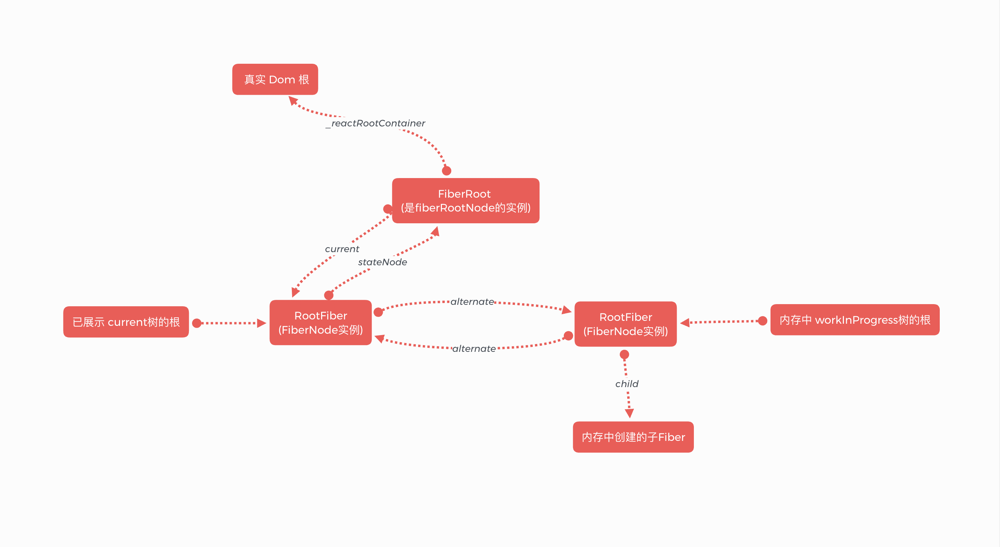
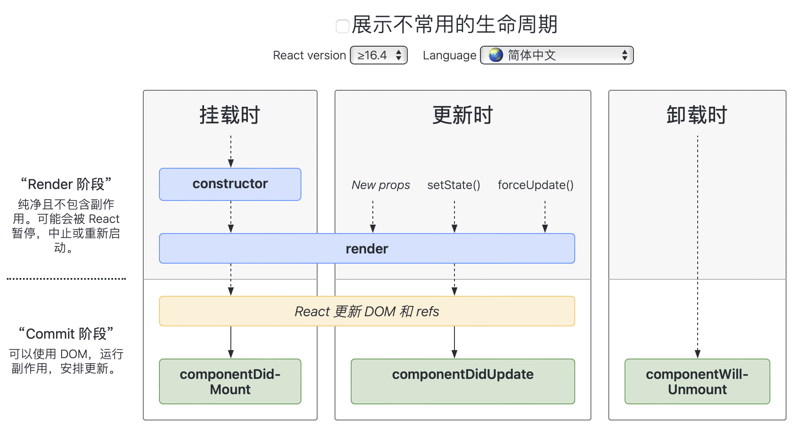
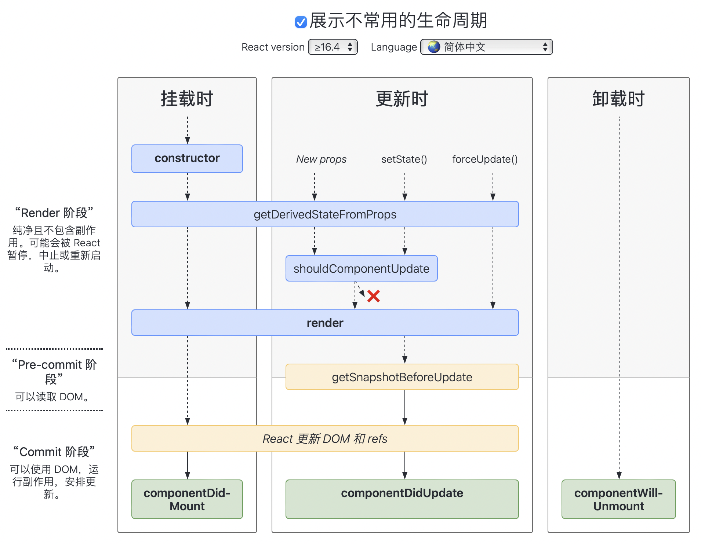

## react

### 资料：
1. tiny-react一个从V17精简而来的小react仓库，只实现了react的核心功能，用来学源码 `https://github.com/PiNengShaoNian/tiny-react`
2. 卡颂的react技术揭秘`https://react.iamkasong.com/diff/prepare.html#diff的瓶颈以及react如何应对`
3. 重点读一下react官方文档里的Hook FAQ `https://zh-hans.reactjs.org/docs/hooks-faq.html`

### React是什么模式的框架 MVC MVVM 

### JSX是什么
JSX 仅仅只是 React.createElement(component, props, ...children) 函数的语法糖

### 什么是高阶组件，能用来干嘛
高阶组件是一个函数接收一个组件再返回一个组件

### React16 主要是改变了什么问题？
#### 改良了渲染的模式
1. 简述：使react渲染的时候可以中断，然后将控制权交还给浏览器，可以让位给优先级更高的任务，浏览器空闲后再继续恢复渲染。 对于计算量比较大的JS计算，或者DOM计算，不会显得特别卡顿，而是一帧一帧的有规律地执行任务。
2. v15 Stack reconciler: diff算法回深度优先遍历两颗dom树，遍历过程是同步的，不可中断，当组件结构复杂，会长期占用主线程，导致渲染进程阻塞，页面卡顿
3. v16 Fiber reconciler：对比更新过程被分解为多个小任务，可中断、可恢复、具有优先级。 源码分为Scheduler、Reconciler、Renderer三个部分
   1. Scheduler 调度更新的优先级： 每个更新任务都有一个优先级，当更高优先级的任务进入调度中，调度器就把当前正在Reconciler中正在执行的低优先级任务中断，然后将高优先级任务推入Reconciler先执行，执行完成后再将中断的低优先级任务重新推出Reconciler继续执行。
   2. Reconciler 找不同 ？？？
   3. Renderer 渲染不同 ？？？
4. 相关问题：
   1. React如何判断当前有没有优先级更高的任务？ 
   当前Js 没有能力，判断是否有更高级任务，只能约定一个合理的执行时间，当超过这个执行时间，如果任务仍然没有执行完成就中断，当前任务将控制权交还给浏览器。
   2. 约定时间是多少？
   人眼能识别大概60帧/1000ms => 16ms/帧;这个16ms就是合适的约定时间。当一段时间内，没有页面交互也没有更新，一帧的时长会延长至50ms，因为人眼可接受的不卡顿的一帧时长是100ms,设置空闲一帧为50ms是因为：如果空闲50ms后有了用户交互，此时还在100ms时间内，用户也觉得是不卡顿的。
   3. 浏览器怎么行使控制权？
   通过使用 messageChannel+requestAnimationFrame 模拟 window.requestIdleCallback(callback,[,options])方法，可以插入一个回调函数，会在浏览器有空的时候调用该回调函数，这个回调接收一个参数IdleDeadline表示浏览器有多少时间可供回调函数执行任务+回调是否已经在超时时间前执行完了
   4. 什么叫浏览器有空？
   浏览器在一帧的16ms里要做五件事：处理用户输入、执行JS包含EventLoop回调、调用requestAnimationFrame执行动画、布局layout加样式css、绘制渲染paint。当这些事都做完了还没到16ms,就会执行window.requestIdleCallback方法
   5. 如果浏览器始终没空怎么办？
   window.requestIdleCallback函数的第二个参数是个可选参数，可以指定一个最晚执行超时时间，如果到了时间，回调函数还没有被执行，就将该任务放到事件循环队列中等待执行，也就是在下一帧中等待执行.
   6. 放到事件循环中了，就一定会在下一帧中执行么？
   不一定。React将任务分为5个等级，从高到低：
      1. Immediate 立即执行
      2. UserBlocking 用户操作相关的，一般是交互的结果反馈, 尽快执行
      3. Normal 不需要立刻得到反馈的事件，有延迟时间地执行
      4. Low 可以延后的事件，但必须执行
      5. Idle 可以被无限期推迟的，最终没执行也没事儿

### Fiber是什么
1. 定义：
   1. 是一个执行单元：每次执行玩一个单元，react就会检查现在还剩多少时间，没有剩余时间就将控制权让出去。
   2. 是一种数据结构，每个fiber就是一个虚拟dom
2. Fiber 双缓存树： 
3. 参考链接：https://www.bilibili.com/video/av839163464
 
### react版本从16升级到17，改变了什么
#### 开启渐进式升级的篇章
1. React v17 中，React 不会再将事件处理添加到 document 上，而是将事件处理添加到渲染 React 树的根 DOM 容器中。在 React 16 及之前版本中，React 会对大多数事件进行 document.addEventListener() 操作。React v17 开始会通过调用 rootNode.addEventListener() 来代替

### react的设计理念

### react的模式有几种，区别是什么


### HTML-DOM VS virtualDOM
1. 命名：HTML中的属性小写 React中都是小驼峰
2. `<input>`选择框checkbox或radio里，defaultChecked是非受控组件的属性、checked是受控组件的属性
3. `<select>`中默认选中的方式不同，H5中使用selected,react是将valued的值设置为默认项的value
4. className: HTML用class,React用className
5. style: 在React中是传入一个对象，但不建议在React中作样式主要方式，最好用className，而是在一些渲染过程中添加样式；另外React中会自动补充'px‘单位
6. 事件处理：
   1. 定义函数：在React的类组件中，需要手动给函数绑定this,否则就是undefined
   2. 函数传入：html中传入一个事件名的字符串；React中传入一个函数
      ```
      <button onclick="activateLasers()" />
      <button onClick={activateLasers} />
      ```
   3. 阻止默认行为：html可以使用return false;React必需使用e.preventDefault(); 这里的e是一个合成事件，不是HTML中的event


### 聊一聊React中的时间机制、合成事件、冒泡机制
1. 合成事件：React中所有的事件都是合成事件，共享合成对象
2. 合成对象SyntheticEvent：是React模拟原生DOM事件所有能力的一个事件对象。能兼容所有浏览器的事件。(e)=>{e.nativeEvent} e就是合成对象，通过e.nativeEvent属性获取原生DOM事件
3. 顶层注册：在React的commit阶段把一个包装后事件监听器以事件委托的方式绑定在最上层root处。 
4. 事件委托：把一个元素的响应事件绑定到另一个元素上，例如把子元素的事件绑定到顶层父元素了，通过冒泡机制，就可以在该父元素监听处理子元素中事件
5. 收集事件：当在顶层的监听器监听到事件，生成合成对象，合成对象会按照捕获或冒泡的路径去收集所有组件上的合成函数对应的真正的事件处理函数, 这些合成函数共享这个合成对象
6. 统一触发：对所有收集来的事件逐一执行，React事件名与原生事件名的映射关系都存在一个叫registrationNameDependencies的对象里
```
// 注册 registrationNameDependencies 是一个对象，存储了所有React事件对应/依赖的原生DOM事件的集合
// 源码 react/packages/react-dom/src/events/EventRegistry.js
const registrationNameDependencies = {};
function registerDirectEvent(registrationName: string,dependencies: Array<DOMEventName>){
   registrationNameDependencies[registrationName] = dependencies;
}
```
5. 原理综述：React的每个节点都会对应一个Fiber节点，那React中的事件，其实就是Fiber上的一个prop。例如`<div onMouseEnter={}>`, onMouseEnter就是一个属性，onMouseEnter函数也没有绑定到真正的DOM.而是React在渲染阶段的最后，判断该属性onMouseEnter是不是一个React提前枚举好的事件名，是的话就由合成对象SyntheticEvent收集该事件，然后根据事件名是否包含Capture来决定是在捕获期触发还是冒泡期触发。最终将事件监听器createEventListenerWrapperWithPriority绑定到root上去，注意这里是绑定到组件的根结点对应的root DOM, 而不是像原生H5里那样事件都被绑定在document上；也要注意这个事件监听器不是普通的addEventListener
6. 区分事件属于捕获/冒泡哪个阶段：捕获阶段的React事件名称后面都有'Capture',冒泡阶段的事件没有
7. 事件监听器createEventListenerWrapperWithPriority： 不是原生的那个addEventListener，而是经过React封装的，是根据事件优先级创建的事件监听包装器。事件优先级是根据事件的交互程度划分的，优先级和事件名的映射关系存在于一个Map结构。React会根据事件名也就是不同的优先级，返回不同的事件监听器，这些事件监听器才是真正绑到root上的listener。事件优先级`https://segmentfault.com/a/1190000038947307` ❓❓❓❓❓❓❓
8. 好处：
   1. 方便事务管理：可以给事件设置优先级，控制执行顺序；
   2. 提供对所有浏览器Dom事件处理的包装，消除兼容问题
   3. 事件监听的创建/取消可能会导致事件对象被频繁地创建/回收，所以React引入事件池，在事件池中获取/释放事件对象。即React事件对象不会被释放掉，而是存进一个数组中，当事件触发，就从这个数组弹出，避免了频繁地垃圾回收


###  Virtual DOM 虚拟DOM
1. 调和: 是一种编程概念。UI以一种理想化、虚拟化的形式保存在内存中， 通过ReactDom等库 使之与真实DOM保持同步。 同步的过程就是调和，就是源码里的Reconciler部分
2. diff： diff是调和过程中最具代表性的一个环节。 diff的作用是找不同。 调和的过程是使一致。
3. diff的三个原则：分层对比、类型相同的才会继续比较、key属性帮助dom重用
4. 为什么虚拟dom能提升性能,优缺点各是什么

### react生命周期
1. 安装-更新-卸载
   1. 安装:当创建组件实例并将其插入DOM时，按以下顺序调用
      1. constructor()
         1. 作用：进行初始化state +  绑定事件。 如果这两件事都不需要做，那constructor也不需要调用
         2. 如果要在constructor里面用到this.props,就要给constructor(props)加参数，super(props)也要加参数。如果不是constructor里而是普通代码里，也是不需要写constrctor(props)的。React在初始化Class后，会自动将props设置到this中，所以可以在例如render里直接用this.props.*
         3. 注意：如果调用constructor，其方法体中要先super(props)。
         4. super(props)的作用:调用父组件constructor()创建父组件的this对象，将当前组件挂载到父组件的this上下文，相当于将父组件的this对象继承给当前子组件，那么就可以在constrctor中使用this.props了
      2. static getDerivedStateFromProps()
      3. render() 
      4. componentDidMount()：
         1. 执行时机：在组件挂载到DOM树中后立即调用
         2. 使用：这个方法内适合做一些有副作用的操作，比如请求数据、添加订阅 等
         3. 注意：在这里setState的话会触发额外的一次render，发生在下一次屏幕更新前，用户不可见
   2. 更新:当props或者state更改引起更新，按以下顺序调用
      1. static getDerivedStateFromProps() 不常用
         1. 调用时机：会在每一次render执行之前调用(挂载+更新),返回一个对象来更新state
         2. 使用：此方法适用于罕见的用例，即 state 的值在任何时候都取决于 props。 注意`static ...`写法
      2. shouldComponentUpdate()
         1. 用法：返回true就触发render();返回false就不会更新，不会触发render和componentDidUpdate
         2. 拓展：被建议不要用的forceUpdate方法：React监听props/state自动update之外，可以手动调用forceUpdate强制刷新,会跳过shouldComponentUpdate()直接触发render()方法，同时会触发子组件的正常生命周期相关方法(会触发子组件的shouldComponentUpdate),子组件的更新完全正常，与普通的更新没有区别
      3. render()
      4. getSnapshotBeforeUpdate() 不常用
      5. componentDidUpdate(prevProps, prevState, snapshot):
         1. 执行时机：会在更新后并且shouldComponentUpdate不为false时，立即调用，首次渲染不会调用
         2. 使用：可以调用setState但必需放在一个条件语句中，不然会陷入死循环。也会导致额外的render，用户不可见，但会影响性能
         3. 拓展：snapshot是生命周期方法getSnapshotBeforeUpdate的返回值，不常用
   3. 卸载：当组件被移除DOM
      1. componentWillUnmount()
         1. 执行时机：组件卸载及销毁之前，即直接调用，然后组件被移除DOM
         2. 使用：移除订阅、取消请求等副作用事件
         3. 注意：这个方法中调用setState()将没有任何效果，不应该调用
2. 错误处理：当渲染、生命周期方法或任何子组件的构造函数中出现错误时，都会调用这些
      1. static getDerivedStateFromError()
         1. 执行时机：在后代组件抛出错误时调用。此方法返回一个对象去更新state
         2. 用法：注意使用 `static ...`关键字
         ```
         class ErrorBoundary extends React.Component {
            constructor(props) {
               super(props);
               this.state = { hasError: false };
            }
            static getDerivedStateFromError(error) {
               // 更新 state 使下一次渲染可以显降级 UI
               return { hasError: true };
            }
            render() {
               if (this.state.hasError) {
                  // 你可以渲染任何自定义的降级  UI
                  return <h1>Something went wrong.</h1>;
               }
               return this.props.children;
            }
         }
         ```
         1. 注意：在“渲染阶段”被调用此方法，所以不许在这里出现副作用代码(渲染阶段是整个React两个阶段(渲染、提交)中的渲染，不是render方法，注意区分)
      2. componentDidCatch(error, info)
         1. 执行时机：此生命周期在后代组件抛出错误后被调用
         2. 用法：接收两个参数：error —— 抛出的错误。info —— 带有 componentStack key 的对象，其中包含有关组件引发错误的栈信息。
         ```
         class ErrorBoundary extends React.Component {
            constructor(props) {
               super(props);
               this.state = { hasError: false };
            }
            static getDerivedStateFromError(error) {
               // 更新 state 使下一次渲染可以显示降级 UI
               return { hasError: true };
            }
            componentDidCatch(error, info) {
               // "组件堆栈" 例子:
               //   in ComponentThatThrows (created by App)
               //   in ErrorBoundary (created by App)
               //   in div (created by App)
               //   in App
               console.error(info.componentStack);
            }
            render() {
               if (this.state.hasError) {
                  // 你可以渲染任何自定义的降级 UI
                  return <h1>Something went wrong.</h1>;
               }
               return this.props.children;
            }
         }
         ```
         1. 注意：在“提交阶段”被调用此方法，允许执行副作用代码
         2. 模式差别：在生产/开发模式下，此方法有细微差别：在开发模式下，错误会冒泡至 window，这意味着任何 window.onerror 或 window。addEventListener('error', callback) 会中断这些已经被 componentDidCatch() 捕获的错误。相反，在生产模式下，错误不会冒泡，这意味着任何根错误处理器只会接受那些没有显式地被 componentDidCatch() 捕获的错误
3. 流程图：    


### react如何实现局部更新的

### react各生命周期是怎么串联起来工作的 ？？？


#### 
1. 类组件
   1. 当组件Comp被传给ReactDOM.render()时候，react会调用该组件的构造函数Constructor,初始化该类组件的state
   2. 之后组件Comp会调用自己的render()方法，将virtualDom组织成realDom
   3. 然后React更新DOM
   4. 当第一次将dom片段插入到DOM中后，react就会触发ComponentDidMount()生命周期方法
   5. 在ComponentDidMount函数中可以执行一些副作用方法，可以想要改变state,触发setState()调用
   6. react通过setState被调用得知state的状态更改，从而触发render方法，更新DOM
   7. 当组件从DOM中移除，会先触发componentWillUnmount方法
2. 函数组件

### 简述React的事务机制

### setState是同步还是异步？当调用setState，发生了什么,是怎么控制同步还是异步的
1. setState的更新可能是异步的，出于性能考虑，可能会把多个setState()调用合并成一个调用
2. 发生了什么：
3. 怎么控制的：

### setState异步更新，那怎么才能拿到最新的state值呢
this.setState((state, props)=>{...})

### state VS Props

### 元素的key是什么，为什么很重要
1. 定义：key帮助React识别哪些元素改变了，比如被添加或者删除, 开发者设置Key值是React实现Diff算法的前提
2. 使用：
   1. 所以应该给每一个数组中的元素赋予一个确定的标识，
   2. 最好是在列表中独一无二的字符串，万不得已才用index
   3. 如果列表中的元素之间顺序可能会变化，那么不建议使用Index
   4. key在兄弟节点中必须唯一
   5. key这个属性名已经被React内置使用，请使用其他属性名传递同样的值
   6. 关于key的文档 `https://zh-hans.reactjs.org/docs/reconciliation.html#recursing-on-children`

### 说一说协调算法即diffing算法
1. 背景：在某一时间节点调用 React 的 render() 方法，会创建一棵由 React 元素组成的树。在下一次 state 或 props 更新时，相同的 render() 方法会返回一棵不同的树。React 需要基于这两棵树之间的差别来判断如何高效的更新 UI，以保证当前 UI 与最新的树保持同步。此算法有一些通用的解决方案，即生成将一棵树转换成另一棵树的最小操作次数。然而，即使使用最优的算法，该算法的复杂程度仍为 O(n^3)，其中 n 是树中元素的数量
2. diff: React 在以下两个假设的基础之上提出了一套 O(n) 的启发式算法：
   1. 对比元素类型：
      1. 对比类型不同的react元素时：会产生出不同的树。当根节点为不同类型的元素时，React 会拆卸原有的整棵树并且建立起新的树，触发一个完整的重建流程。当卸载一棵树时，组件实例将执行 componentWillUnmount() 方法，对应的 DOM 节点被销毁，。当建立一棵新的树时，对应的 DOM 节点会被创建以及插入到 DOM 中，之后组件实例将执行 UNSAFE_componentWillMount() 方法，紧接着 componentDidMount() 方法。所有与之前的树相关联的 state 也会被销毁。
      2. 对比类型相同的react元素时，React 会保留 DOM 节点，仅比对及更新有改变的属性。当一个组件更新时，组件实例会保持不变，因此可以在不同的渲染时保持 state 一致。React 将更新该组件实例的 props 以保证与最新的元素保持一致，并且调用该实例的 UNSAFE_componentWillReceiveProps()、UNSAFE_componentWillUpdate() 以及 componentDidUpdate() 方法。
   2. 对比元素Key

### cloneElement() 干嘛的
#### 克隆一个元素
```
React.cloneElement(
  element, //以 element 元素为样板克隆并返回新的 React 元素
  [config], //config 中应包含新的 props，key 或 ref.如果在 config 中未出现 key 或 ref，那么原始元素的 key 和 ref 将被保留,通过ref获取节点时结果跟期待的一样
  [...children] //新的子元素将取代现有的子元素
)
```

### isValidElement() 干嘛的
#### 判断是否是一个React元素
`React.isValidElement(obj); //true or false`

### React.Children 咋用
#### React.Children有一些列方法可以对props.children/this.props.children进行处理
// 注意：如果子组件是用Fragment对象包裹的，那只算一个结点
1. React.Children.map(children, function(child,index){}) //遍历children组件列表，注意返回的不一定是节点数组
2. React.Children.only(children); //判断是不是children是否为一个React元素，是的话就返回该子节点，否则就抛出错误；注意这个方法不能用React.Children.map的返回值做参数，因为.only接收的是一个React元素，而.map返回的是一个数组. 另外防止跑出异常，可以先用.count查询一下子节点数量
3. React.Children.count(children) //返回children中组件的个数
4. React.Children.forEach(children, function(child,index){}) //遍历 无返回值
5. React.Children.toArray(children) //将子元素以数组的方式扁平展开并返回，并为每个子节点分配一个key。应用：比如要将子元素排序，如果直接children.sort()就会报错，但如果 myChildren = React.Children.toArray(children); myChildren.sort();就可以。所以在想要操作子节点集合时 .toArray方法非常实用


### 受控组件 VS 非受控组件
#### 在 HTML 中，表单元素 如`<input> <textarea> 和 <select>`通常自己维护 state，并根据用户输入进行更新
1. 受控组件：表单元素的值由React控制，这个表单元素就称为一个受控组件
   1. 被React以控制“唯一数据源”、控制“用户输入时表单发生的操作”来控制取值的表单输入元素，就是受控组件。
   2. 例如`<input> <textarea> <select>`在React中可以通过属性value来控制值，变成受控组件
   3. 受控组件上指定value，会阻止用户修改输入 
2. 非受控组件:运行在React体系之外的表单元素
   1. 非受控组件将真实数据存储在DOM节点中
   2. 可以使用ref来从DOM节点中获取表单数据

### react实现中涉及到的数据结构和算法
#### 
1. 位运算
2. 优先队列
3. 循环链表
4. dfs

### Hooks是什么 相比Class Hooks的写法有什么优势
#### Hooks是钩子函数，是一种特殊的函数，可以“钩入”React的特性，不必在Class类组件中，在函数组件中就能使用state等
1. Class的缺点：
   1. this的指向问题比如事件的绑定也容易出错
   2. 组件间的状态逻辑难以服用，通讯大多使用高阶组件完成，需要将组件外再包一层，代码冗余；
   3. 复杂业务的状态组合也会很乱；
   4. 业务逻辑可能被分散到不同的生命周期中重复写；
2. Hooks的优点：
   1. 没有this的困扰
   2. 解决业务逻辑难以拆分的问题。类组件通过高阶组件组装。类组件生命周期函数内的逻辑可能需要多处编程
   3. 状态逻辑复用变得简单，在函数组件中也可以使用state了
   4. 从设计思想上更符合react理念
3. Hooks的缺点：
   1. 有些生命周期函数还强依赖于类组件

### 都有哪些Hooks
#### React内置的Hook共10种，基础Hook有3种 额外Hook有7种，还可以自定义Hook
1. 基础：
   1. useState
   2. useEffect：每次渲染之后(Dom更新完毕)都会执行useEffect，第二个参数决定是否执行内部effect
   3. useContext
2. 额外：
   1. useReducer
   2. useCallback
   3. useMemo
   4. useRef
   5. useImperativeHandle
   6. useLayoutEffect：在页面布局之后(浏览器layout阶段 DOM插入后)执行useLayoutEffect，然后浏览器paint,之后用户才看得见页面变化 
   7. useDebugValue
3. 自定义Hook 注意：某两个组件内都使用了某自定义Hook，他们共享自定义Hook的state吗：并不共享。自定义Hook是一种重用状态逻辑的机制，相当于把公共的部分提取出来，每次使用自定义Hook中的state和副作用都是完全隔离的。

### Hooks使用有什么规则，为什么要这样约定
####
1. 规则：
   1. 只能在React函数组件中使用，不能在普通js函数中
   2. 只能在函数组件的最顶层调用Hook,不能在循环、条件判断或者子函数中用
2. 原因：为了保证hook的执行顺序不变，因为state和effect的存储，在React里是一个单向链表结果,必须保障在每一轮调用useState和useEffect的顺序都是一样的
3. 官方检测插件安装：`npm install eslint-plugin-react-hooks --save-dev`

### Hook 与 js闭包的关系


### 自己实现一个useState简化版
```
//在index.js中
import {render} from './hooks/UseStateDemo';
render();
// ReactDOM.render(
//   <React.StrictMode>
//     <App />
//   </React.StrictMode>,
//   document.getElementById('root')
// );

// 在UseStateDemo.js中
/**
 * 简易版useState实现
 * 源代码中使用单向链表来实现状态的记录，这里使用Array进行模拟
 */
import ReactDOM from "react-dom";
import React from "react";
const stateArray = []; //存储State
let curIndex = 0; //**记录操作state的序号**
const useState = (initialState) => {
   const _curIndex = curIndex;
   stateArray[_curIndex] = stateArray[_curIndex] || initialState;
   const setState = (newState) => {
      stateArray[_curIndex] = newState;
      render();
   };
   curIndex++;
   return [stateArray[_curIndex], setState];
};
function UseStateDemo() {
   const [count, setCount] = useState(0);
   const [name, setName] = useState('xxt');
   const clickHandler = () => {
      setCount(count + 1);
   };
   const changeNameHandler = (newName) =>{
      setName(newName)
   }
   return (
      <>
         <div>{count}</div>
         <button onClick={clickHandler}>点击</button>
         <div>{name}</div>
         <button onClick={()=>changeNameHandler('XXT')}>点击</button>

      </>
   );
}
const render = () => {
   ReactDOM.render(
      <React.StrictMode>
         <UseStateDemo />
      </React.StrictMode>,
      document.getElementById("root")
   );
   curIndex = 0; //每一次渲染后都应从新开始计
};
export { render };
export default UseStateDemo;
```

### 自己实现一个useEffect简易版
#### 每次渲染时都会执行useEffect
```
// 在index.js中
import {render} from './hooks/UseEffectDemo';
render();

// 在UseEffectDemo.js中
/**
 * 简易版useEffect实现,
 */
import ReactDOM from "react-dom";
import React, { useState } from "react"; //useState用了React原生的
const depsArray = []; //二维数组，存储useEffect的依赖项
let depIndex = 0; //记录执行useEffect的序号

function UseEffectDemo() {
  depIndex = 0;  //执行useEffect可能不会重新渲染，所以在组件内头部模拟清空数据了
  const [count, setCount] = useState(0);
  const [name, setName] = useState("xxt");
  const clickHandler = () => {
    setCount(count + 1);
  };
  const changeNameHandler = (newName) => {
    setName(newName);
  };
  /******* useEffect start ***********/
  // 有依赖项的话，就跟之前存的依赖项比较 判断是否相等
  const areHookInputsEqual = (prevDeps, nextDeps) => {
    if (!prevDeps && nextDeps) {
      return false;
    }
    for (let i = 0; i < prevDeps.length && i < nextDeps.length; i++) {
      if (Object.is(nextDeps[i], prevDeps[i])) {
        continue;
      }
      return false;
    }
    return true;
  };
  const useEffect = (callback, newDeps) => {
    const _depIndex = depIndex;
    //没有传入依赖项的话，就每次都调用
    if (!newDeps) {
      callback();
      depsArray[_depIndex] = newDeps;
      depIndex++;
      return;
    }
    // 如果依赖项newDeps为[], prevDeps从undefined变为[]，就不会再变了，再比较时认为依赖项没有变化，所以只会执行一次callback
    // 如果依赖项newDeps不为空数组[...]
    let prevDeps = depsArray[_depIndex];
    let hasChanged = !!!areHookInputsEqual(prevDeps, newDeps);
    if (hasChanged) {
      //有变化
      callback();
      depsArray[_depIndex] = newDeps;
    }
    depIndex++;
  };
  useEffect(() => {
    console.log("count发生了变化");
  }, [count]);
  useEffect(() => {
    console.log("name发生了变化");
  }, [name]);
  /******* useEffect end ***********/
  return (
    <>
      <div>{count}</div>
      <button onClick={clickHandler}>点击</button>
      <div>{name}</div>
      <button onClick={() => changeNameHandler("XXT")}>点击</button>
    </>
  );
}
const render = () => {
  ReactDOM.render(
    <React.StrictMode>
      <UseEffectDemo />
    </React.StrictMode>,
    document.getElementById("root")
  );
};

export { render };
export default UseEffectDemo;
```
### 实现一个自定义Hook
```
// 命名必需用 use-开头
function useCustomHook(initial){
   const [state, setState] = useState();
   // 可复用的逻辑代码
   return state;
}
```

### React.createRef VS React.forwardRef VS useRef

### React.Context VS useContext

### useEffect VS useLayoutEffect
1. 相同：都会根据第二个参数的改变执行一些事件
2. 执行流程：
   1. render方法  diff 后，会进入到 commit 阶段，准备把虚拟 DOM 发生的变化映射到真实 DOM 上
   2. 在commit阶段，在类组件中会触发getSnapshotBeforeUpdate生命周期方法；在函数组件中，会把useEffect的create和destroy函数放在调度队列中，等待时机执行
   3. 开始把虚拟 DOM 设置到真实 DOM 上，这个阶段主要调用的函数是 commitWork。commitWork 函数会针对不同的 fiber 节点调用不同的 DOM 的修改方法，比如文本节点和元素节点的修改方法是不一样的。
   4. 一个fiber经过commitWork后，就已经映射到真实DOM上了.如果fiber被卸载了，此时会同步调用上一次useLayoutEffect返回的destroy函数
   5. 当所有的fiber都经过commitWork后，commit阶段进行收尾工作，同步执行componentDidMount，componentDidUpdate 以及 useLayoutEffect(create, deps) 的 create 函数
   6. 注意：对于 react 来说，commit 阶段是不可打断的，会一次性把所有需要 commit 的节点全部 commit 完。由于JS线程 和 渲染线程 互斥，所以现在虽然真实DOM已经变化，但浏览器还没有绘制到屏幕上
   7. 绘制：浏览器把DOM绘制到屏幕上
   8. 绘制后，浏览器通知react自己处于空闲阶段，react开始执行调度队列中的任务，执行useEffect中产生的destroy函数或者create函数
3. 总结：
   1. 执行时机不同  
      1. useLayoutEffect： DOM渲染后 浏览器未绘制前 同步执行
      2. useEffect：浏览器绘制后 异步执行
   2. 在effect中修改页面，生效的时机不同：
      1. useLayoutEffect：同步触发重渲染，之后浏览器绘制，
      2. useEffect：会在下一次绘制后执行
   3. 对应的生命周期不同：
      1. useLayoutEffect的 create 执行：与componentDidMount，componentDidUpdate 一致，都是在commit阶段的收尾阶段同步执行
      2. useEffect的create执行： 绘制后 none
      3. useLayoutEffect的 destroy 执行: 与componentWillUnmount一致，都是同步执行
      4. useEffect 的 destroy函数： 绘制后 none
   4. 阻塞浏览器绘制
      1. useLayoutEffect: 会
      2. useEffect: 不会


### React.memo VS useMemo VS useCallback
#### 都是优化代码的手段
1. React.memo
   1. 作用：记忆渲染结果组件。是一个高阶组件，接收一个函数组件，返回一个组件
   2. 用法：如果一个组件在props相同的时候渲染结果就相同，那就可以将该组件包裹在React.memo中，以通过记忆组件渲染结果的方式来提高组件的性能表现。就是说，当props相同，React将跳过渲染组件的操作，直接复用最近一次渲染的结果
   ```
   // 接收两个参数 memo(函数组件, 比较函数) 
   const MyComponent = React.memo(
      function requiredComponent(props) { //必须
         /* 使用 props 渲染 */
      }, 
      function notRequiredAreEqual(prevProps, nextProps){ // 可选
         // 如果把 nextProps 传入 render 方法的返回结果与将 prevProps 传入render 方法的返回结果一致则返回 true，否则返回 false
      }
   );
   ```
   3. 注意：虽然React.memo只检查props的变更，
      1. 当如果函数组件中有useState\useReducer\useContext的Hook时，当state或者context发生变化，仍能重新渲染
      2. 默认，对props复杂对象只做浅层比较，如果想控制过程，还是要靠自定义的比较函数靠谱(上面的notRequiredAreEqual)
   4. 稳定性：把它当成优化代码的手段，不能当作稳定的基础语言，容易出bug
2. useMemo
   1. 作用：记忆一个值。接收一个函数，返回一个 memoized value
   2. 用法: 如果一个函数，在传入相同的依赖参数时，结果总是相同，就可以把该函数包裹在useMemo中，会记忆返回值memoized，只有在依赖的参数项改变时才重新计算memoized。这样有助于避免每次渲染都进行高开销计算。应该先编写不用useMemo就能正常运行的计算函数，之后再放进useMemo中，以达到优化目的
   ```
   // 接收两个参数，useMemo(计算函数, [deps])
   const memoizedValue = useMemo(
      // 虽然计算函数的执行时机与依赖数组有关，但依赖数组的值并不会以参数的形式传入计算函数
      () => computeExpensiveValue(a, b), 
      [a, b] // 如果没有提供，就会在每次渲染都执行computeExpensiveValue计算新的值
   );
   ```
   3. 注意：传入useMemo的函数会在渲染期间执行，所以在该函数内要保证只执行与渲染相关的操作，不相关的副作用操作应考虑在useEffect中执行
   4. 稳定性：优化手段，不能当成语义上的保障，它可能会遗忘之前的memoized值
3. useCallback
   1. 作用：记录一个函数。接收一个函数，返回memoized函数
   2. 用法：如果一个函数只有在依赖项变化时才会变化，就可以把函数包裹进useCallback,会记忆该依赖项对应的回调函数版本，可以避免非必要渲染一些子组件
   ```
   // 接收两个参数，useCallback(函数, [deps])
   const memoizedCallback = useCallback(
      // 虽然计算函数的执行时机与依赖数组有关，但依赖数组的值并不会以参数的形式传入计算函数
      () => { doSomething(a, b); },
      [a, b],
   );
   ```

### react的常见优化方式

### 自己实现一个react简化版

### React-Redux 
1. 三大原则
   1. 单一数据源：整个应用的 state 被储存在一棵 object tree 中，并且这个 object tree 只存在于唯一一个 store 中。
   2. state是只读的：唯一改变 state 的方法就是触发 action，action 是一个用于描述已发生事件的普通对象。
   3. 使用纯函数来执行修改：为了描述 action 如何改变 state tree ，你需要编写 reducers。Reducer 只是一些纯函数，它接收先前的 state 和 action，并返回新的 state
2. 流程
   1. reducer是纯函数，决定怎么修改state。 newState = reducer(prevState,action);
   2. 多个reducer = combineRedecers(reducers) 合并多个得到一个reducer
   3. store = createStore(reducer,initial_state, middlewares) 形成一棵完成的state树。
      1. 提供 store.getState() 方法获取 state；
      2. 提供 store.dispatch(action) 方法更新 state；
      3. 通过 store.subscribe(listener) 注册监听器，订阅state更新, 观察者模式
      4. 通过 store.subscribe(listener) 返回的函数注销监听器
   4. 使用Provider 包裹根组件 传入store `<Provider store={store}><App></Provider>`
   5. 用connect()方法可以获取react redux,适用于根组件之下的所有子组件，  `connect([mapStateToProps], [mapDispatchToProps], [mergeProps], [options])`,连接操作不会改变原来的组件类。返回一个新的已与 Redux store 连接的组件类.
      1. [mapStateToProps(state, [ownProps]): stateProps] (Function): 如果定义该参数，组件将会监听 Redux store 的变化。任何时候，只要 Redux store 发生改变，mapStateToProps 函数就会被调用。该回调函数必须返回一个纯对象，这个对象会与组件的 props 合并。如果你省略了这个参数，你的组件将不会监听 Redux store
      2. [mapDispatchToProps(dispatch, [ownProps]): dispatchProps] (Object or Function): 如果传递的是一个对象，那么每个定义在该对象的函数都将被当作 Redux action creator，对象所定义的方法名将作为属性名；每个方法将返回一个新的函数，函数中dispatch方法会将action creator的返回值作为参数执行。这些属性会被合并到组件的 props 中。
   6. action 是一个对象，里面必须有一个type属性，字符串值，用来决定会触发的reducer
   7. store.dispatch(action) 在任何地方都可以调用 根据action触发对应reducer改变state。 dispatch是同步操作
   8. dispatch 函数的源码：
      ```
      function dispatch(action) {
         if (!isPlainObject(action)) {
            throw new Error( false ? 0 :  "...some error information" );
         }
         if (typeof action.type === 'undefined') {
            throw new Error( false ? 0 : 'Actions may not have an undefined "type" property. You may have misspelled an action type string constant.');
         }
         if (isDispatching) {
            throw new Error( false ? 0 : 'Reducers may not dispatch actions.');
         }
         try {
            isDispatching = true;
            currentState = currentReducer(currentState, action);
         } finally {
            isDispatching = false;
         }
         var listeners = currentListeners = nextListeners;
         for (var i = 0; i < listeners.length; i++) {
            var listener = listeners[i];
            listener();
         }
         return action; //默认返回action
      }
      ```
   9. applyMiddlewares 源码
      ```
      function applyMiddleware(...middlewares) {
         return (createStore) => (...args) => {
            const store = createStore(...args)
            let dispatch = () => {
               throw new Error(
               'Dispatching while constructing your middleware is not allowed. ' +
                  'Other middleware would not be applied to this dispatch.'
               )
            }
            const middlewareAPI = {
               getState: store.getState,
               dispatch: (...args) => dispatch(...args),
            }
            const chain = middlewares.map((middleware) => middleware(middlewareAPI))
            dispatch = compose(...chain)(store.dispatch)
            return {
               ...store,
               dispatch,
            }
         }
      }
      ```
   10. 
3. reudx 异步： 参考链接http://www.ruanyifeng.com/blog/2016/09/redux_tutorial_part_two_async_operations.html
   1. middlewares: 
      1. 数组里面每个middleware都是对store.dispatch的重写，是对dispatch方法的拓展，middleware函数返回新dispatch方法，供链式调用，redux本身提供了一个applyMiddlewares方法，applyMiddleware(...middlewares) 用来合并中间件
      2. 注意：当 middleware 链中的最后一个 middleware 开始 dispatch action 时，这个 action 必须是一个普通对象。这是 同步式的 Redux 数据流 开始的地方（译注：这里应该是指，你可以使用任意多异步的 middleware 去做你想做的事情，但是需要使用普通对象作为最后一个被 dispatch 的 action ，来将处理流程带回同步方式）
   2. 异步操作的思路：
      1. 同步reducer需要发起一个Action, 异步reducer需要发起三个Actions,分别表示 发起请求动作、请求成功、请求失败
         ```
         // 写法一：名称相同，参数不同
         { type: 'FETCH_POSTS' }
         { type: 'FETCH_POSTS', status: 'error', error: 'Oops' }
         { type: 'FETCH_POSTS', status: 'success', response: { ... } }

         // 写法二：名称不同
         { type: 'FETCH_POSTS_REQUEST' }
         { type: 'FETCH_POSTS_FAILURE', error: 'Oops' }
         { type: 'FETCH_POSTS_SUCCESS', response: { ... } }
         ```
   3. 异步第三方中间件
      1. 使用redux-thunk：写出一个返回函数的 Action Creator，然后使用redux-thunk中间件改造store.dispatch使其可以接受一个函数作为参数
      2. 使用redux-promise 可以让 Action Creator 返回一个 Promise 对象

### React-Router相关
1. 参考链接：https://www.jianshu.com/p/53dc287a8020 https://www.kmbox.cn/html/help/362.html
2. 前提：服务端接收任何url访问都返回首页index.html。说明：什么叫全部路径都指向首页呢？我们想一下正常的多页网页是怎么样的：如果访问了一个不存在的路径，如 localhost:8080/fuck.html，那么后端会返回一个 error.html，里面内容显示 “找不到网页”，这种情况就是后端处理网页的路由了。因为正是后端根据不同 url 返回不同的 xxx.html 呀。如果前端使用路由，那么后端将全部路径都指向 index.html。当我们访问到一个不存在路径时，如 localhost:8080/fuck，后端不管三七二十一返回 index.html。但是这个 index.html 里有我们写的 JS 代码（React 打包后的）呀，这 JS 代码其中就包含了我们做的路由。所以我们的路由发现不存在这个路径时，就切换到 Error 组件来充当 “找不到网页” 的 HTML 文件。这就叫前端控制路由。
3. 通过window.history.pushState window.history.replaceState window.history.popState 实现的，更改浏览器地址但是不刷新页面
4. react项目中有两个包 react-router 和 react-router-dom 两种，关系是：react-router: 实现了路由的核心功能。react-router-dom: 基于react-router，加入了在浏览器运行环境下的一些功能。还有一个库叫 react-router-native，这个库也是基于 react-router 的，它类似 react-router-dom，加入了 React Native 运行环境下的一些功能。所以在浏览器环境下，一般引用react-router-dom就可以

### 怎么检测页面性能 react性能工具profiler怎么用的

### React怎么实现懒加载
#### 大项目打包到一个bundle文件体积过大，请求资源的时间过长，影响首屏渲染速度，通过代码分割+懒加载可以解决这一问题
1. 动态import
   1. 导入时机： `import('模块').then(module=>{}).catch(err=>{})` 这样就不需要在文件头导入全部依赖，而是真正加载到该组件时才会导入。
   2. 代码分割：用create-react-app搭建的项目中，动态import会自动代码分割；集成React的普通项目可以借助Babel的插件@babel/plugin-syntax-dynamic-import翻译动态导入语句 + Webpack分割
   3. 源码原理：动态import的本质是返回一个Promise
   ```
   // 供参考
   function import(url) {
      return new Promise((resolve, reject) => {
         const script = document.createElement("script");
         const tempGlobal = "__tempModuleLoadingVariable" + Math.random().toString(32).substring(2);
         script.type = "module";
         script.textContent = `import * as m from "${url}"; window.${tempGlobal} = m;`;
         script.onload = () => {
            resolve(window[tempGlobal]);
            delete window[tempGlobal];
            script.remove();
         };
         script.onerror = () => {
            reject(new Error("Failed to load module script with URL " + url));
            delete window[tempGlobal];
            script.remove();
         };
         document.documentElement.appendChild(script);
      });
   }
   ```
2. React.Suspense + React.Lazy  
   1. 用处：Suspense使组件可以"等待"某些操作结束后再进行渲染；而React.lazy就是一中一个使用场景，动态加载组件。
   2. 导入时机：React.lazy 函数能像渲染常规组件一样处理动态引入的组件。不会在一开始就导入组件，而是在组件首次渲染时，才自动导入包含组件的包;
   3. 写法：应在 Suspense 组件中渲染 lazy 组件,fallback 属性接受任何在组件加载过程中你想展示的 React 元素,可以将 Suspense 组件置于懒加载组件之上的任何位置。你甚至可以用一个 Suspense 组件包裹多个懒加载组件。React.lazy 接受一个函数，这个函数需要动态调用 import(),所以也会自动分割。lazy的入参函数必须返回一个 Promise，该 Promise 需要 resolve 一个 default export 的 React 组件
   ```
   import React, { Suspense } from 'react';
   const OtherComponent = React.lazy(() => import('./OtherComponent')); //注意：返回的是模块的默认导出模块 export default OtherComponent
   return (
      <Suspense fallback={<div>Loading...</div>}> 
         <OtherComponent />
      </Suspense>
   )
   ```
   1. 代码分割：也使用了动态import，所以也会自动代码分割
   2. Suspense 与 React.lazy 的原理：React.lazy函数返回一个叫LazyComponent的对象，LazyComponent的本质是调用了一个叫readLazyComponentType的函数，首次渲染时进入readLazyComponentType的default逻辑，在这里真正执行import()操作，返回Promise，然后直接检查resolved的状态，如果有结果就直接把动态加载的模块的默认部分moduleObject.default导出；如果没有resolved，就将该Promise的'是否可then'对象thenable抛出给上层:throw thenable。此时React捕获到error,就判断是不是thenable,如果是的话就交给Suspense即SuspenseComponent对象处理。如果thenable处于pending状态则会将其children都渲染成fallback的值，一旦thenable被resolve则SuspenseComponent的子组件会重新渲染一次,渲染moduleObject.default
   3. 注意： React.lazy 目前只支持默认导出 default exports, 如果想用命名导出，需要使用一个中间模块做转换
   ```
   // ManyComponents.js
   export const MyComponent = /* ... */;
   export const MyUnusedComponent = /* ... */;
   // MyComponent.js
   export { MyComponent as default } from "./ManyComponents.js"; // ES6的写法 
   // MyApp.js
   import React, { lazy } from 'react';
   const MyComponent = lazy(() => import("./MyComponent.js"));
   ```


### React如何处理组件内发生的错误
#### 在V16版本中引入了错误边界的概念，用于捕获错误，任何未被错误边界捕获的错误将导致整棵React组件树被卸载
1. 定义：ErrorBoundary也是一个React组件，这种组件可以捕获发生在其子组件树任何位置的 JavaScript 错误，并打印这些错误，同时展示降级 UI，而并不会渲染那些发生崩溃的子组件树。；无法捕获的错误：。
   1. 能捕获：错误边界在渲染期间、生命周期方法和整个组件树的构造函数中捕获错误
   2. 不能捕获：
   ```
   事件处理 //事件内部的错误还是用try-catch捕获
   异步代码（例如setTimeout或requestAnimationFrame回调函数）
   服务端渲染
   它自身(非子组件)抛出来的错误。 // 自身抛出的问题会冒泡到更上层的错误边界，类似于catch的机制。
   ```
2. 用法：如果一个class组件(只有 class 组件才可以成为错误边界组件)中定义了static getDerivedStateFromError() 或 componentDidCatch() 这两个生命周期方法中的任意一个（或两个）时，那么它就变成一个错误边界。
```
// 定义
class ErrorBoundary extends React.Component {
  constructor(props) {
    super(props);
    this.state = { hasError: false };
  }
  // 当抛出错误后，使用 static getDerivedStateFromError() 渲染备用UI
  static getDerivedStateFromError(error) {
    // 更新 state 使下一次渲染能够显示降级后的 UI
    return { hasError: true };
  }
  // 当抛出错误后，使用componentDidCatch() 处理错误信息。
  componentDidCatch(error, errorInfo) {
    // 同样可以将错误日志上报给服务器
    logErrorToMyService(error, errorInfo);
  }
  render() {
    if (this.state.hasError) {
      // 你可以自定义降级后的 UI 并渲染
      return <h1>Something went wrong.</h1>;
    }
    return this.props.children; 
  }
}
// 使用，跟常规组件一样，定义一个就可以在全局使用，可以放在零件组件中，也可以放在最顶层的路由组件中
<ErrorBoundary>
  <MyWidget />
</ErrorBoundary>
```

### 疑问 为什么在类组件的constructor中需要将普通函数手动.bind(this)，而箭头函数不需要?
#### 解释：
ES6中的Class只是一个函数的语法糖，如果没有用new调用，并不会给普通函数自动创建this，而是使用当前上下文中的this，所以在类组件中，为了使普通函数的this指向当前类组件的this，必须手动绑定，不然可能函数就绑定到window或者其他上下文中了；而箭头函数本身就是在类组件中声明的，函数组件的特点就是会捕获声明时上下文的this并且不会再变化，所以并不需要给箭头函数绑定this

### 为什么不能在render函数里，onclick的函数里将fn.bind(this)？
因为.bind函数每次都会返回一个新函数，相当于onClick={newFn} 会造成当前组件的ChildComponent重复刷新

### React Portals是什么，什么场景下用到它
1. 通常来讲，从组件的 render 方法返回一个元素时，该元素将被挂载到 DOM 节点中离其最近的父节点;Portal 提供了一种将子节点渲染到存在于父组件以外的 DOM 节点的方案
2. 写法：ReactDOM.createPortal(child, container) 其余用法包括冒泡、context等特性与常规子结点别无二致
2. 应用：适合脱离文档流的布局，例如弹出框、通知等父组件有 overflow: hidden 或 z-index等特殊样式的情况
3. 注意点：如果有表单元素，要管理好键盘焦点

### 怎么实现一个定时器/倒计时
1. 写一个 React Hooks，用来倒计时，传入时间，返回 start、pause、restart、isRunning
2. 可能有哪些坑
3. 求输出:以下两种写法有什么区别，会出现什么效果，如果不一样的话如何能得到同样的效果
```
export default class App extends React.Component {
  state = {
    cnt: 0
  };
  render() {
    return (
      <>
        <button
          onClick={() => {
            this.setState({ cnt: this.state.cnt + 1 });
            setTimeout(() => {
              this.setState({ cnt: this.state.cnt + 1 });
            }, 1000);
          }}
        >
          add cnt
        </button>
        <div>cnt: {this.state.cnt}</div>
      </>
    );
  }
}

export default function App() {
  const [cnt, setCnt] = useState(0);
  return (
    <>
      <button
        onClick={() => {
          setCnt(cnt + 1);
          setTimeout(() => {
            setCnt(cnt + 1);
          }, 1000);
        }}
      >
        add cnt
      </button>
      <div>cnt: {cnt}</div>
    </>
  );
}
```

### React-Dom做了什么
1. render(element, container[, callback]) 
   1. 作用：在提供的 container 里渲染一个 React 元素，如果第一次渲染，就直接替换container的所有子节点，并返回对该组件的引用(但不建议使用这个引用，因为有可能未来是异步渲染，如果需要对组件引用可以使用ref)；如果React元素之前已经在 container 里渲染过，这将会对其执行 Diffing差分算法，之后再update 操作，始终操作的都是container的子节点，不会对container本身修改
   2. 可选回调：如果提供了可选的回调函数，该回调将在组件被渲染或更新之后被执行。
2. hydrate() //在ReactDOMServer端渲染调用的方法
3. unmountComponentAtNode() // 从 DOM 中卸载组件，会将其事件处理器（event handlers）和 state 一并清除。如果指定容器上没有对应已挂载的组件，这个函数什么也不会做。如果组件被移除将会返回 true，如果没有组件可被移除将会返回 false
4. findDOMNode() //严格模式下已启用
5. createPortal(child, container) 将子节点渲染到指定DOM中


### 从页面上修改一个数据后，React做了一系列什么事情


### React项目中的错误处理

### lane 模型

### effectList

### 合成事件

### unbatchedUpdate
batch 批处理 ？？？

### 源码：
1. v15之前：core Renderer Reconciler
2. V16之后：Scheduler  Reconciler  Renderer
3. V16各个模块的作用
   1. Scheduler  
   2. Reconciler 
   3. Renderer


### react的任务调度 为什么没用setTimeout 而是用 messageChannel , 为啥没用 requestIdleCallback
1. 为什么使用宏任务：对一个事件循环机制来说，在页面更新前，会将所有的微任务全部执行完，故无法达成将主线程让出给浏览器的目的
2. 时间差：虽然 postMessage 和 setTimeout 都生产宏事件，但是 setTimeout(()=>{},0)有一个最短的响应时间一般是4ms，就是在4ms后将回调函数放入洪事件队列。而messageChannel会立刻将回调放进宏任务队列。对于一个60hz的浏览器，一帧的时长约为16ms,那么浪费掉的这4ms，占比较大，所以用setTimeout性价比太低
3. 其实用了：在Scheduler.js的requestAnimationFrameWithTimeout方法中，requestAnimationFrame和setTimeout是竞争关系，哪个先执行就把另一个取消掉。这样就是防止requestAnimationFrame没有被及时调用
4. 不用requestIdleCallback: 
   1. 第一，没办法保证requestIdleCallback每一帧都会执行 
   2. 第二，虽然可以设置一个过期时间强制执行，但当浏览器很忙时再强制执行，一定会拉长一帧的时长导致也看卡顿。
   3. 第三、当执行到requestIdleCallback时，说明前面动画、布局、渲染都结束了，此时调度的任务里如果要操作dom修改，那么之前的计算就都是白做了。如果下一帧还有获取布局等操作，浏览器不得不强制重排，性能不友好，时间也不可控。 dom操作建议放到 requestAnimationFrame 里去
   4. 第四，可能有一些副作用操作，例如promise产生微任务，回调函数会在 requestIdleCallback 执行完之后立即执行，相当于拉长了这一帧的时长
   5. 兼容性不够好

### 拓展 redux 是 imuutable 的 相关的

###  组件之间通讯
1. 父子： props
2. 子父： propsCallback
3. 兄弟：通过父亲做桥梁，变成 子父+父子 两端的通信
4. 多层：不方便用props
   1. 发布-订阅 模式
   2. context 自顶向下
   3. 第三方 redux

### React中的四种优先级
参考链接：https://segmentfault.com/a/1190000038947307
1. 事件优先级：属于React的优先级机制，按照用户事件的交互紧急程度，划分的优先级
   1. 事件优先级是在注册阶段被确定的，在向root上注册事件时，会根据事件的类别，创建不同优先级的事件监听（listener），最终将它绑定到root上去。参见函数createEventListenerWrapperWithPriority
   2. 分成三个等级
   ```
   连续事件（ContinuousEvent）：canplay、error、audio标签的timeupdate和canplay，优先级最高，为2。
   用户阻塞事件（UserBlockingEvent）：drag、scroll、mouseover等，特点是连续触发，阻塞渲染，优先级为1。
   离散事件（DiscreteEvent）：click、keydown、focusin等，这些事件的触发不是连续的，优先级为0。
   ```
2. 更新优先级：属于React的优先级机制，事件导致React产生的更新对象（update）的优先级（update.lane）
3. 任务优先级：属于React的优先级机制，产生更新对象之后，React去执行一个更新任务，这个任务所持有的优先级
4. 调度优先级：属于Scheduler的优先级机制，Scheduler依据React更新任务生成一个调度任务，这个调度任务所持有的优先级
5. 关系：事件导致react产生更新对象，有了更新对象react创建这个更新的任务，Schedule根据任务生成一个调度任务

### react 源码解析
参考链接：https://www.jianshu.com/p/87533d64626a https://www.jianshu.com/p/87533d64626a 
1. 会触发更新的三种操作： ReactDOM.render  setState  forceUpdate
2. 
3. 