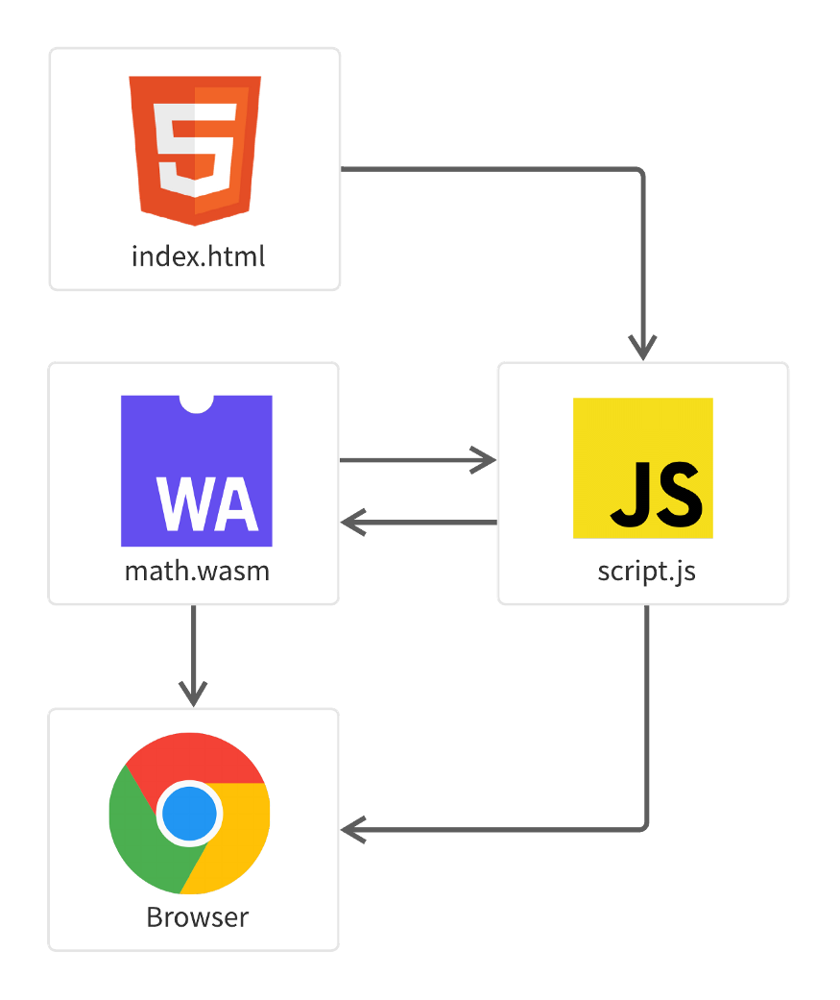
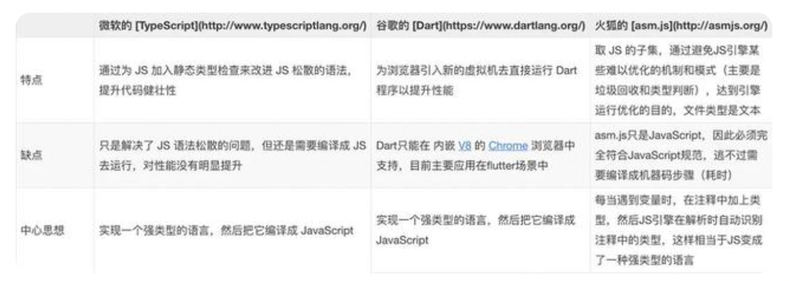

## WebAssembly

### WebAssembly 基本信息
1. 定义：WASM(WebAssembly的缩写)不是一种编程语言。它是一门将用某种编程语言编写的代码转换为浏览器可理解的机器代码的技术， WebAssembly是一个具有'.WASM'扩展名的文件，可以把它看作一个可以导入JavaScript程序的模块。
2. 注意：WASM不能直接与DOM交互，因此我们需要同时使用JavaScript和WASM。 
3. js的不足：js是解释型语言，是动态类型语言。每次执行时，引擎都必须检查它的数据类型，所以js的每条指令都要经过几次类型检查和转换，影响它的执行速度。举个例子，console.log（sum(1, 2, 3)），答案是6。console.log（sum('1', 2, 3)），答案是“123”。虽然及时编译JIT技术优化了js运行速度，但在此例中，JIT在遇到第一个sum时会编译成整数相加的机器码；但是在碰到第二个sum调用时，发现是字符串的机器码，不得不重新编译一遍。这样一来，JIT带来的效率提升便被抵消了。所以说js不是为CPU密集型和高性能应用程序开发的。
4. Assembly的诞生：随着JS达到了性能天花板，在当前复杂运算及游戏面前已完全力不从心。无法满足一些大型web项目开发，于是三大浏览器巨头分别提出了自己的解决方案： 四大主流浏览器厂商Google Chrome、Apple Safari、Microsoft Edge和Mozilla FireFox，觉得Mozilla FireFox所推出的asm.js很有前景，为了让大家都能使用，于是他们就共同参与开发，基于asm.js制定一个标准，也就是WebAssembly的前身。