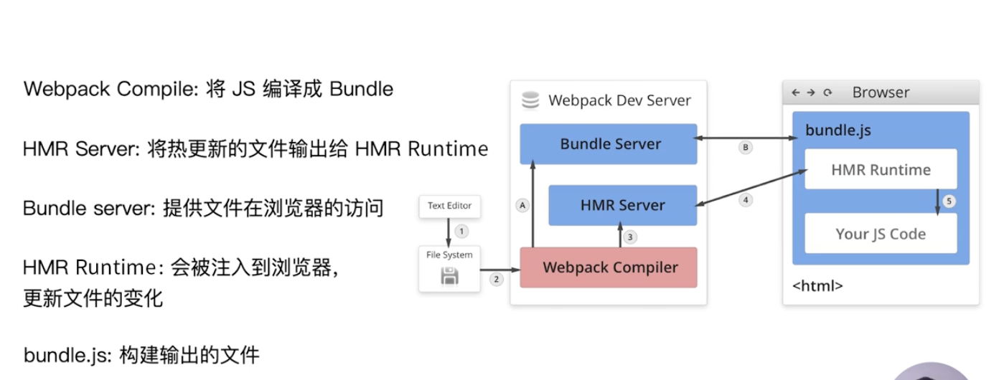

## Webpack

### webpack是什么
####  webpack是一个js应用程序静态模块打包工具。会从应用内部一个或多个入口点构建一个依赖图(dependency grarph),然后将项目中夺得每个模块合成一个或多个bundles.
Es6中的 import 和 export 已经被webpack^4.0天然支持, 其余语法特性需要类似于Bable这种转译器先转译成es5

### webpack打包流程是什么
#### 大方向分为：初始化、编译、输出文件
1. 初始化
   1. 初始化参数： 从配置配件+Shell语句中读取并合并参数，得到最终的参数
   ```
   // 通过npm脚本语句执行打包，先查找webpack工具 进入node_module\.bin中找webpack.sh或webpack.cmd文件，如果存在就执行，不存在就抛出错误
   npm run dev //开发环境
   npm run build //生产环境
   //直接运行webpack 从入口文件entry开始打包到bundle.js输出；webpack打包的实际位置是node_modules\webpack\bin\webpack.js
   webpack entry.js bundle.js 
   //读取系统文件文件
   //读取Entrys 为每个Entry实例化一个EntryPlugin，为后续该Entry的递归工作做准备
   //读取Resolver
   // ...等
   ```
   2. 初始化编译实例：通过初始化得到的参数，初始化一个Compiler。
   ```
   // Compiler负责文件监听和启动编译。Compiler 实例中包含了完整的 Webpack 配置，全局只有一个Compiler实例
   let globalSingleCompiler = new Compiler(configs);
   ```
   3. 初始化系统文件读取：应用文件系统到compiler对象，方便后续文件查找和读取
   4. 初始化所有Plugin:plugin本质是类，有一个apply方法。
   ```
   // 依次调用插件的apply方法，让插件可以监听后续的所有事件节点。
   // 给插件传入compiler的实例引用，方便插件通过compiler调用webpack提供的api
   Plugins.each(Plugin=>{
       let plugin = new Plugin();
       plugin.apply(globalSingleCompiler);
   })
   ```
   5. 初始化Resolver，负责在文件系统中寻找指定路径的文件。
2. 编译：
   1. 启动编译：
   ```
   globalSingleCompiler.run(); //启动一次新的编译 globalSingleCompiler.watchRun(); //在监听模式下启动的编译，在这个事件中可以获取是那些文件发生了变化导致了重新启动了
   compile(); //告诉插件一次新的编译要启动了，同时给插件带上compiler对象
   let compilation = new Compilation(); // 创建一个编译阶段对象，一个compilation包含了下面2、3、4的步骤。开发模式下，每当检测到文件变化，就会创建一个新的compilation。包含了当前的模块资源、编译生成资源、变化的文件等信息
   ```
   2. entry:当一个compilation创建完，就开始从Entry开始找到所有入口文件module
   3. 调动loader翻译：对每个module串行调用配置的所有loader翻译文件内容。在loader翻译完一个module后，将翻译后的内容进行解析(Babel中用的是@babel/parser)，输出对应的抽象语法书AST, 以便webpack后面对代码进行分析。
   4. 递归: 从配置的入口模块开始，分析其AST，当遇到导入语句导入了新的module，就将其加入依赖列表，同时对新找到的module翻译并递归(即重复3.4.步骤)，最终所有module都用loader翻译完成，并找到所有模块的依赖关系。
3. 输出文件
   1. 合成chunk:根据入口文件和文件之间的依赖关系，相关模块会组装成chunk, 最终输出多个chunk
   2. 一个chunk就是一个文件：把每个chunk转换成一个单独的文件加入到输出列表。这步是可以修改输出内容的最后一个机会。
   3. 输出完成:根据配置文件output设置，输出到文件系统对应路径下
4. 整个过程中：Webpack会在特定的时间点广播出特定的事件，插件在监听到感兴趣的事件后会执行特定的逻辑，插件可以调用Webpack提供的API

### 模块打包原理
#### 官网例子:实时创建一个简单打包工具`https://www.youtube.com/watch?v=Gc9-7PBqOC8` 简单工具的详细说明`https://github.com/ronami/minipack`


### webpack打包后都会产生什么
#### 打包后的结果代码，是一个自执行函数
```
// 基础版打包-大概逻辑：
// 前提：入口文件为模块1, 在模块1中import了模块2 忽略了检查模块缓存优化的部分
function chunkA(){
   var _webpack_modules_ = {
      "模块ID1": function(__unused_webpack_module, __webpack_exports__, __webpack_require__){
         var code1 = "
            ```
            var code2 = __webpack_require__("模块ID2"); //对应源代码中的import
            "执行模块1的代码块";
            "调用模块2的代码code";
            ```
         ";
         eval(code1);
      },
      "模块ID2": function(__unused_webpack_module, __webpack_exports__, __webpack_require__){
         var code2 = "代码块";
         eval(code2);
      }
   }
   function __webpack_require__("模块ID"){
      function o = (obj, prop) => Object.prototype.hasOwnProperty.call(obj, prop);
      function r = (exports) => {
         if (typeof Symbol !== "undefined" && Symbol.toStringTag) {
            Object.defineProperty(exports, Symbol.toStringTag, { value: "Module" });
         }
         Object.defineProperty(exports, "__esModule", { value: true });
      }
      function d = (exports, definition) => {
         for (var key in definition) {
            if (
               o(definition, key) && !o(exports, key)
            ) {
               Object.defineProperty(exports, key, {
                  enumerable: true,
                  get: definition[key],
               });
            }
         }
      }
   }
   __webpack_require__("模块ID1"); //模块1为入口文件
}();
```

### Loader是什么
1. 前提：webpack默认只支持.js和.json两种文件类型，其他类型的都无法处理
2. loader是翻译器，将不支持的其他文件类型，转化为webpack可以处理的模块，在weboack读取后，添加到依赖关系图中
3. 本质：loader是一个函数，入参是源文件，返回转换后的结果
4. 常用Loader有什么：
   1. babel-loader 转换ES6及更高版本或React等js特殊语法 使用babel的时候，需要搭配babel一起使用配置文件.babelrc或者babel.config.js文件
   2. css-loader 加载和解析css文件(less-loader)
   3. postcss-loader 跟autoprefixer结合使用补充css前缀
      ```
      rules:[{
         test: /.css$/,
         use:[
            'css-loader',
            {
               loader:'postcss-loader',
               options:{
                  plugins:()=>{
                     require('autoprefixer')({
                        browsers: [
                           'last 2 version', //兼容最新的两个版本
                           ‘iOS 7’
                           ]
                     })
                  }
               }
            }
         ]
      }]
      ```
   4. px2rem-loader 自动将px单位转化为rem 与lib-flexible开源库可以搭配使用(lib-flexible可以动态计算根元素的大小,通过HtmlWebpackExternalsPlugin插件引入第三方库)
      ```
      rules:[{
         test: /.css$/,
         use:[
            'css-loader',
            {
               loader:'px2rem-loader',
               options:{
                  remUnit: 75, // 配置1rem对应多少px
                  remPrecision: 2 //控制px转为rem后小数点后的精度
               }
            }
         ]
      }]
      ```
   5. file-loader 对图片、字体等的打包
   6. raw-loader 文件内联：把文件转化为字符串的形式插入到html中，可以减少http请求，减少页面闪动等   
   7. thread-loader 多进程打包


### 资源内联
1. 定义：将资源文件插入到html中，随着请求html时一起返回，不需要额外发起http请求
2. 小资源内联： url-loader
3. js内联：raw-loader
4. css内联：
   1. 方案1:借助style-loader
      ```
      module:{
         rules:[{
            test:/.css$/,
            use:[
               {
               'style-loader', //style-loader会将css代码插入到<style>标签并放进Html的头部，此时没有css独立文件
               options:{
                  insertAt:'top', // 样式插入到<head>
                  singleton: true, //将所有的style标签合并成一个
               }
               }
               'css-loader',
            ]
         }]
      }
      ```
   2. 方案2:html-inline-css-webpack-plugin 将打包好的css chunk代码插入到html中
   3. raw-loader
   

### 自己编写loader 

### Plugin是什么
1. 功能：plugin用来拓展webpack打包构建的能力
2. 常用的plugin
   1. SplitChunksPlugin 将公共的代码抽取成单独的chunkhook.memoizedState
   2. CleanWebpackPlugin 清理构建目录 默认删除output配置对应的文件目录
   3. ExtractTextWebpackPlugin 将css代码从js文件里抽取成单独的.css文件
   4. autoprefixer插件 跟postcss-loader结合使用自动补齐css前缀
   5. CopyWebpackPlugin 将文件或者文件夹拷贝到构建的输出目录
   6. HtmlWebpackPlugin 创建html模版文件用来承载输出bundle
   7. UglifyjsWebpackPlugin 压缩js
   8. ZipWebpackPlugin 将打包的资源生成一个.zip包

### Plugin的实现原理
#### 钩子机制，webpack工作过程中有很多环节，都预留了钩子，通过在钩子上挂载不同的插件以拓展打包能力

### 我们在webpack中配置了那么多plugins，webpack是怎么知道该在何时调用这些plugins的呢?

### 编写Plugin

### Loader VS Plugin
1. 功能上的区别
2. 调用顺序
3. 

### Source map是什么
#### 
1. 作用：是一个.map后缀的信息文件，里面存储着代码的位置信息。转换后的代码的每个位置所对应的转换前的位置
2. 配置：在配置文件中的devtool
```
module.export = {  
   devtool:"..."
}
```
3. 配置关键词
```
eval: 使用eval包裹代码块
source map: 产生.map文件
cheap: 不包含列信息
inline: 将.map作为DataURI嵌入，不单独生成.map文件
module: 生成的是未经loader转译的源码的map文件
```

### 怎么代码压缩
#### 三个方向：
1. HTML压缩：使用html-webpack-plugin
```
module.export = {
   plugins:[
      // 一个页面对应一个HtmlWebpackPlugin
      new HtmlWebpackPlugin({
         template: path.join(__dirname, 'src/index.html'), //打包用的html模版
         filename: 'index.html', //指定打包后的文件名称
         chunks: ['index'], //指定生成的html文件使用哪个chunk的js
         inject: true, //指定打包生成的chunk(js/css)是否自动注入到html
         minify: { //压缩的自定义配置项
            html5: true,
            collapseWhitespace: true,
            preserveLineBreaks: false,
            minifyCSS: true,
            minifyJS: true, 
            removeComments: false
         }
      }),
      // 两个入口文件，两个Html，就要写两个Plugin
      new HtmlWebpackPlugin({
         template: path.join(__dirname, 'src/search.html'),
         filename: 'search.html',
         chunks: ['search'],
         inject: true,
         minify: {
            html5: true,
            collapseWhitespace: true,
            preserveLineBreaks: false,
            minifyCSS: true,
            minifyJS: true, 
            removeComments: false
         }
      }),
   ]
}
```
2. CSS压缩：使用optimize-css-assets-webpack-plugin插件 + cssnano处理器
```
module.export = {
   plugins:[
      new OptinizeCSSAssetsPlugin({
         assetNameRegExp: /\.css$/g,
         cssProcessor: require('cssnano')
      })
   ]
}
```
3. JS压缩：在webpack4里内置了uglifyjs-webpack-plugin，自动压缩了js代码量压缩

### 多页面怎么打包
1. 方案1: 手动配置文件，每个entry对应一个html-webpack-plugin,缺点是每增/删一个entry就要多增/删一个plugin
2. 方案2: 是方案1的进阶，通过glob库动态计算有多少个entry，动态生成多个html-webpack-plugin的数组，添加在配置文件中

### 文件监听是什么
#### 文件监听是在发现源码发生变化时，自动重新构建出新的输出文件
1. 开启监听模式，有两种方法
   1. 启动webpack命令时，带上`--watch`参数
   2. 配置文件文件中设置`watch：true`
2. 缺陷：不会自动刷新浏览器，需要额外手动刷新
3. 文件监听构建出的代码存储位置：本地磁盘文件

### 文件监听的原理是什么
#### webpack轮询判断文件的最后编辑时间是否变化
webpack记录文件的编辑时间，轮询判断文件再次变化时，不会立刻告诉监听者，而是先缓存起来，等到aggregateTimeout集合等待时间结束，在此期间内，如果有别的文件也变化了，所有变化的文件列表再一起重新构建
```
module.export = {
   watch: true,
   watchOptions:{
      ignored: /node_modules/, //默认为空，不监听包的变化可以使构建性能提升
      aggregateTimeout: 300, //默认的集合等待时间是300ms 即监听到文件变化后会等待300ms后再去构建
      poll: 1000, //默认的轮询时间是1000次/秒，即每毫秒询问一次判断文件是否发生变化
   }
}
```

### WDS(webpack-dev-server)是什么 HMR(HotModuleReplacement)是什么
#### WDS是热更新，HMR是热模块替换 用WDS启动HMR功能
1. 做了什么：相比于文件watch监听模式不能刷新浏览器，热更新在检测到文件变化后，会自动构建并更新浏览器
2. 输出位置：WDS放在内存中,不用写入磁盘，所以有速度优势
3. 如何使用：有两种方式都可以
   1. 使用HotModuleReplacementPlugin插件，这样开启热更新有2个必要条件：使用HotModuleReplacementPlugin插件 + 设置devServer.hot为 true。注意在v4之后内置了HotModuleReplacementPlugin，看起来好像没使用，但其实是必须的。这种方式的热更新开启后，在浏览器页面就能够查看所有打包后的文件
   ```
   // package.json
   script: { 
      "dev": "webpack-dev-serve --open" // --open命令：每次构建完成后自动开启一个浏览器页面
   }
   // 通过命令行`npx webpack serve --hot`或者通过webpack.config.js
   module.export = {
      plugins:[
         // new webpack.HotModuleReplacementPlugin(), //设置了hot为true后，就不需要手动添加该插件了，在V4之后默认使用了
      ],
      devServer:{
         hot: true, //启用热更新
      }
   }
   ``` 
   2. 使用webpack-dev-middleware搭配使用将输出文件传输给服务器。使用这种方式，还需要额外使用Express或者Koa等Node服务器来提供一个本地服务。
   

### HMR热更新的原理/流程是什么
#### 
1. WDS中的参与角色
   1. Webpack Compiler: 在Webpack端运行，将源代码js编译成bundle.js输出文件,分别给到HMR Server和Bundle Server
   2. Bundle Server: 在Webpack端运行的服务器，提供浏览器对bundle.js输出文件的服务器方式的访问能力
   3. HMR Server:当有文件更新，就将`热更新的输出文件`传输给HMR Runtime。HMR Server是在WebpackDevServer服务器中运行的
   4. HMR Runtime: 在最初Webpack Compiler打包过程中就把HMR Runtime注入到bundle.js里，在浏览器端的bundle.js里负责与服务器建立连接并更新文件的变化, 当监听到HMR Server传来了消息(一般是json数据)就更新浏览器。HMR Runtime是在browser浏览器终端中运行的。
   5. bundle.js: 即在浏览器中被访问的构建后输出的文件，包含HMR Runtime + js code
2. 流程图：
3. 参考：文档`https://webpack.docschina.org/concepts/hot-module-replacement/`
4. 流程描述： 
   1. 在热更新的过程中，有两个阵营，一边是webpack,一边是browser
   2. webpack中，通过HotModuleReplacementPlugin或者webpack-dev-middleware的方式，开启一个devServer. 里面有两个Server服务，分别是Bundle-Server和HMR-Server
   3. webpack中，通过Compiler将 源码 + HMR-Runtime 打包进bundle.js(HMR是可选功能，不是所有的文件都有HMR-Runtime，需要热替换的文件才注入，同样，有了HMR-Runtime才能支持热替换)
   4. browser中,访问bundle.js文件。在未开启热更新时，浏览器是直接访问文件 例如 ./user/document/bundle.js，有了热更新后，其实是开启了webpack端的Bundle-Server之后，就可以用访问服务器的方式访问文件了，例如localhost:8080/bundle.js;
   5. 在webpack中，当发生一次更新，compiler发出一个update给到HMR-Server，update包含两部分：更新后的manifest(新的打包hash和所有的updated chunk更新模块清单) + updated chunk 更新模块文件。compiler 会确保在这些构建之间的模块 ID 和 chunk ID 保持一致。通常将这些 ID 存储在内存中（例如，使用 webpack-dev-server 时），但是也可能会将它们存储在一个 JSON 文件中
   6. 在browser中，应用程序要求 HMR-Runtime 检查更新： HMR-Runtime中，会先check 即发送一个HTTP请求到HMR-Server请求更新manifest,如果请求失败说明没有可更新的；如果请求成功，会将 updated chunk 列表与当前的 loaded chunk 列表进行比较。
   7. 在browser中， HMR-Runtime异步下载更新：比较后将每个有更新的 loaded chunk 下载相应的 updated chunk。当所有更新 chunk 完成下载，HMR-Runtime 就会切换到 ready 状态，然后通知应用程序。
   8. 在browser中，应用程序要求HMR-Runtime更新内容。HMR-Runtime 运行新的updated module, 将所有 updated module 标记为无效并不断冒泡把父module都标记为无效。之后所有无效 module 都会被处理和解除加载。然后更新当前 hash， HMR-Runtime 切换回 idle 状态，HMR-Runtime同步更新完成。

### 热更新遇到跨域问题怎么解决：
```
module.exports = {
  //本地服务器默认域名是http://localhost:8000
  devServer: {
   //代理
    proxy: {
      '/api': {
        target: 'http://localhost:3000',
        pathRewrite: {'^/api' : ''},
        changeOrigin: true,     // target是域名的话，需要这个参数，
        secure: false,          // 设置支持https协议的代理
      },
      
    }
  }
};
```

### 文件指纹是什么，有什么用处
#### 文件资源名的后缀，用来版本管理，被浏览器用来判断继续使用缓存中的文件还是需要请求新资源
1. 分类：有三种：
   1. Hash: 分两种
      1. 项目Hash: 关联整个项目的指纹，只要项目内文件变化，hash就更新，配置的位置在配置文件的output
      2. 独立文件Hash是指文件内容的hash:例如图片/字体等，使用file-loader打包时，会设置一个hash
   2. ChunkHash: 关联webpack打包生成的chunk,例如js文件, 默认情况下(不考虑代码分割优化)每个entry入口输出一个chunk,会有一个chunkHash，不同chunk之间的chunkHash互相独立互不影响
   3. ContentHash: 根据文件内容生成内容指纹，例如css文件，文件内容变化才会更新contentHash
2. 在webpack中设置：
```
module.export = {
   output:{
      // :8表示取该指纹字符串的前8位
      // filename:'[name]_[hash:8].js', 整个项目都变会浪费资源
      filename:'[name]_[chunkhash:8].js'
   },
   module:{
      rules:[{
         test: /\.(png|jpg|gif|jpeg|woff|woff2|eot|ttf|otf)$/,
         use:[{
               loader:'file-loader',
               // 图片/字体的文件指纹用hash,此hash也表示文件内容，而不是项目的hash，默认时md5算法生成，ext表示资源后缀名 'static/'表示资源要放进这个叫static的文件夹
               options:{
                  name:'static/[name]_[hash:8].[ext]'
               }
         }]
      },{
         test:/.css$/,
         use:[
            //style-loader和MiniCssExtractPlugin作用互斥，不能同时配置
            // 'style-loader', //style-loader会将css代码插入到<style>标签并放进Html的头部，此时没有css独立文件
            MiniCssExtractPlugin.loader, // MiniCssExtractPlugin这个插件将css独立成文件，自带一个laoder
            'css-loader',
         ]
      }]
   },
   plugins:[
      // MiniCssExtractPlugin这个插件将css独立成文件输出
      new MiniCssExtractPlugin({
         filename:'[name]_[contenthash:8].css'
      })
   ]
}
```

### 如何提取页面公共资源
#### 有几种情况
1. 第三方库：例如react/react-dom等基础库
   1. 方案：使用html-webpack-externals-plugin插件，配置直接通过cdn引入，不打入bundle中。
   ```
   module.export = {
      plugins:[
         new HtmlWebpackExternalsPlugin({
            {
               module:'react',
               entry: '..第三方库地址', 
               global: 'React',
            },
            {
               module:'react-dom',
               entry: '..第三方库地址',
               global: 'ReactDOM',
            },
         })
      ]
   }
   ```
2. 代码中含有公共脚本，需要提取分离成单独文件 这种方式也能将第三方库单独提取
   1. 方案：利用SplitChunksPlugin插件，配置webpack在打包时做代码分割(V4之前用CommonsChunksPlugin,官方建议不再用)
   ```
   module.export = {
      optimization:{
         splitChunks:{
            //通用规则---start---
            chunks:'async', // 选项：[async(默认), initial, all(推荐)] async 只对异步引入的库分离；initial只对同步引入的库分离；all引入的库都进行分离
            minSize:30000, //生成的公共chunk大小必须>=30000 单位Byte
            maxSize:0, //抽离的公共chunk体积如果大于maxSize就分成较小的chunks
            minChunks:1, //至少被引用的1次才会抽离
            maxAsyncRequests: 5, //浏览器按需加载文件时的最大并行请求数
            maxIntialRequests:3, //浏览器加载入口文件时的最大并行请求数
            automaticNameDelimiter: '~', // 表示拆分出的chunk的名称连接符。默认为~。如chunk~vendors.js
            name: true,// 设置chunk的文件名。默认为true。当为true时，splitChunks基于chunk和cacheGroups的key自动命名。
            // 通用规则---end---\
            cacheGroups:{ //单独配置的分割规则，缓存组里的配置可以继承和覆盖上面splitChunks.*的任何配置,但test、priority、reuseExistingChunk只能在缓存组级别上配置
               commons:{
                  test:/(react | react-dom)/,  //将react和react-dom分成一个单独的chunk
                  name:'vendors', //打出来的包名称是vendors开头的 例如vendors.34nf45if.js
                  chunks: 'all', //跟splitChunks.chunks通用规则一样，配置对什么样的库进行分离
                  priority: -9， //一个模块可能属于多个缓存组，打包时优先考虑优先级更高的缓存组。默认为负数，自定义的缓存组默认优先级是0
               },
               vendors: {
                  test: /[\\/]node_modules[\\/]/,
                  priority: -10，
               },
               default: {
                  name:'common',
                  priority: 20，
               },
            }
         }
      }
   }
   ```


### 代码分割是什么，原理是什么
#### 代码分割是将代码库分割成多个chunks，在代码运行需要它们的时候再进行下载、加载
1. 有两种情况需要代码分割：
   1. 抽离相同代码到一个共享块
   2. 脚本懒加载，使初始化代码下载量更小
2. 懒加载的方式
   1. CommonJS语法：require.ensure
   2. ES6: 动态import (目前原生还没有支持，需要Babal翻译，使用插件@babel/plugin-syntax-dynamic-import)
   3. 配置
      ```
      module.export = {
         plugins:[
            "@babel/plugin-syntax-dynamic-import"
         ]
      }
      ```

### 使用动态import时，webpack是怎么工作的 || 动态import的实现原理

### Tree-Shaking 是什么，原理是什么
#### 摇树优化，
1. 背景：一个模块中可能有多个方法，如果引用了其中一个方法，也需要将整个模块导入，并全部都打入到bundle中。
2. 作用：Tree-Shaking 就是只把用到的方法打入到bundle中，剩余没有用到的死代码就算是被import了，但是没有执行，例如`import a...if(false){ a() }` 也会在webpack的Uglify阶段就删除掉。
3. 使用：`optimization:{usedExports: true}`webpack的production模式默认支持了TreeShaking; dev环境下默认没有开启
4. 原理：本质是先对代码静态分析，然后将没有用的删除掉，在使用 tree shaking 时必须有 ModuleConcatenationPlugin 的支持，production模式 默认启动了它，其他模式需要手动添加
5. 注意：只支持ES6语法，不支持CommonJS.在一些项目中用到了babel，例如babel-loader或者@babel/preset-env中可能会讲代码翻译成CommonJs语法的，就会导致Tree-Shaking失败

### Scope-Hoisting是什么，原理是什么
#### 区域提升
1. 背景：webpack生产环境下默认打包出来的的格式是一个自执行函数,多个模块之间采用迭代的方式依次调用。如果模块很多，会产生多个作用域，占用内存较大。
2. 作用：Scope-Hoisting 使多个模块之间的调用变成串联执行，都包裹在同一个作用域内
3. 使用：production模式下默认支持,其他模式需要手动配置。
4. 原理：分析模块之间的依赖关系后，直接放在同一个函数内。在使用Scope-Hoisting时必须有 ModuleConcatenationPlugin 的支持，production模式 默认启动了它，其他模式需要手动添加
```
module.exports={
   mode:'development',
   plugins:[
      new webpack.optimize.ModuleConcatenationPlugin()
   ]
}
// a依赖b，b依赖c 打包成的 bundle.js
(()=>{
   {//c代码块}
   {//b代码块}
   {//a代码块}
})();
```
5. 注意：只支持ES6语法，不支持CommonJS.在一些项目中用到了babel，例如babel-loader或者@babel/preset-env中可能会讲代码翻译成CommonJs语法的，就会导致Scope-Hoisting失败

### 如何处理webpack打包构建过程中出现的异常和中断

### 提升CSS生产力的工具用过哪些

### Webpack离线缓存静态资源是怎么实现的

### 如何持久化缓存

### Webpack做前端性能优化的方向
1. 图片优化
2. 动态懒加载
3. 减少代码量：提取公共代码、TreeShaking
4. 多进程并行压缩代码
5. 缓存
6. 清楚console.log
   
### 如何分析webpack的构建成果
#### 
1. 关于模块的统计数据的stats文件内会有各种编译信息
   1. 用法执行script语句`"build:stats": "webpack --json > stats.json"`就会生成一个stats.json文件，包含各种信息
   2. 信息
   ```
   { //外层基础信息
      "asset":{
         // 每一个asset对象表示一个编译出的output文件
      },
      "chunks":{// chunk 对象},
      "modules":{// module 对象},
      "errors":{// error 对象},
      "warnings":{// warning 对象},
   }
   ```
2. 速度分析：
   1. 使用 speed-measure-webpack-plugin 分析Loader和Plugin花费的时间，在控制台的打印信息中，用红黄绿三种颜色标识，红色要优化，黄色可优化，绿色ok.
   2. 用法：
   ```
   // 在配置文件 webpack.config.js 中 用该插件的实例将整个配置对象.wrap()起来
   const SpeedMeasureWebpackPlugin = require("speed-measure-webpack-plugin");
   const smp = new SpeedMeasureWebpackPlugin();
   module.exports = smp.wrap({
      //正常配置项
   })
   ```
3. 体积分析：
   1. 使用 webpack-bundle-analyzer 分析体积, 构建完成之后会在端口8888中，http://127.0.0.1:8888，看到各个组件或者依赖的第三方模块的文件大小
   2. 用法：
   ```
   // 在配置文件 webpack.config.js 中
   const webpackBundleAnalyzer = require('webpack-bundle-analyzer');
   module.exports = {
      plugins:[
         new webpackBundleAnalyzer.BundleAnalyzerPlugin(),
      ],
   }
   ```

### 如何提高webpack构建速度
1. 开启多进程/多实例构建
   1. tread-loader:
      1. 原理：每次webpack解析一个模块，thread-loader会将它及它的依赖分配给worker线程中
      2. 用法：
      ```
      module: {
         rules: [
            {
               loader: "tread-loader",
               options: {
                  workers: 3,
               },
            },
            // 其他loader
         ],
      },
      ```
   2. parallel-webpack
2. 其他 ❓❓❓❓❓❓

### 如何减小webpack构建体积
1. 多进程并行压缩代码

### splitChunks 怎么用的

### webpack 打 polyfill有几种方式

### 自己开发一个npm包，在此过程中需要注意哪些事情

### 如何配置一个文件夹下所有的js各为一个入口

### webpack如何做长缓存优化

### webpack+CDN实现加速(笔记上有记录)

### 源码

### 常用配置

### 复杂情况下的配置方案

### 编译的具体阶段 得看源码

### tapable 相关

### split chunks 用了哪些函数实现 得看源码

### runtime.js是什么

### 其他打包工具 比如vite


